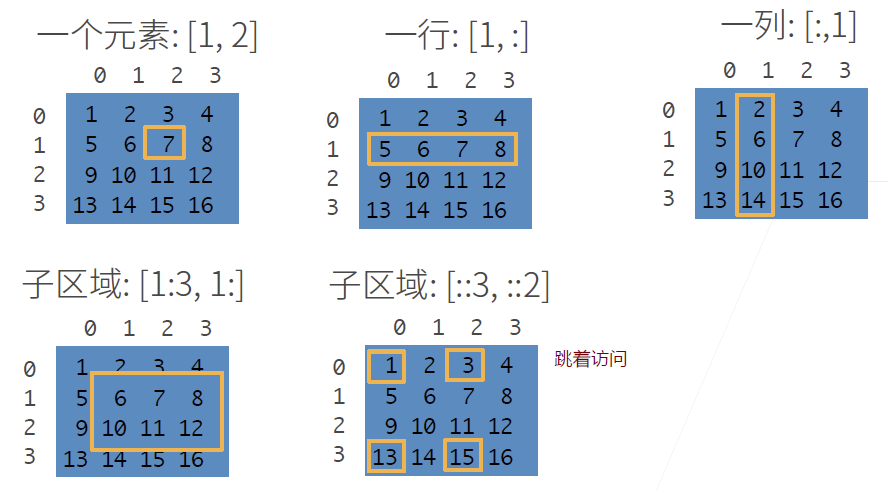
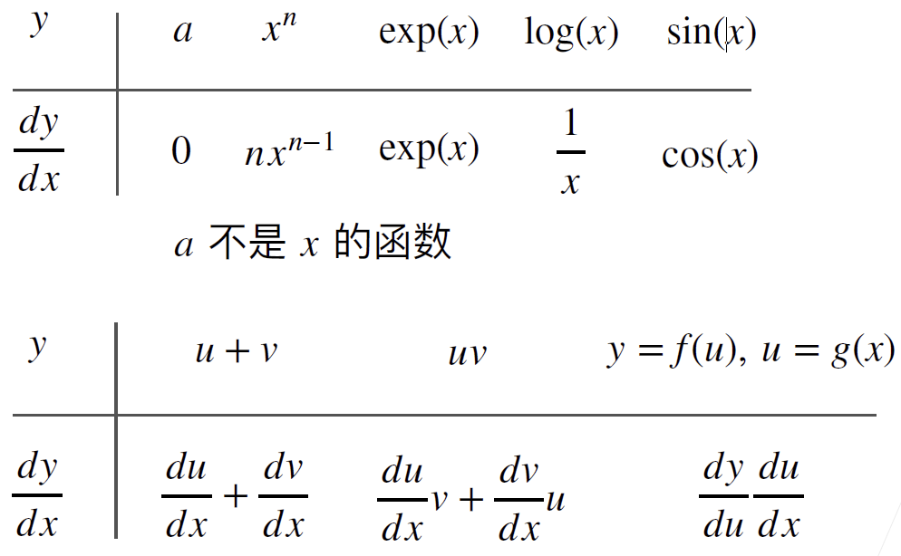
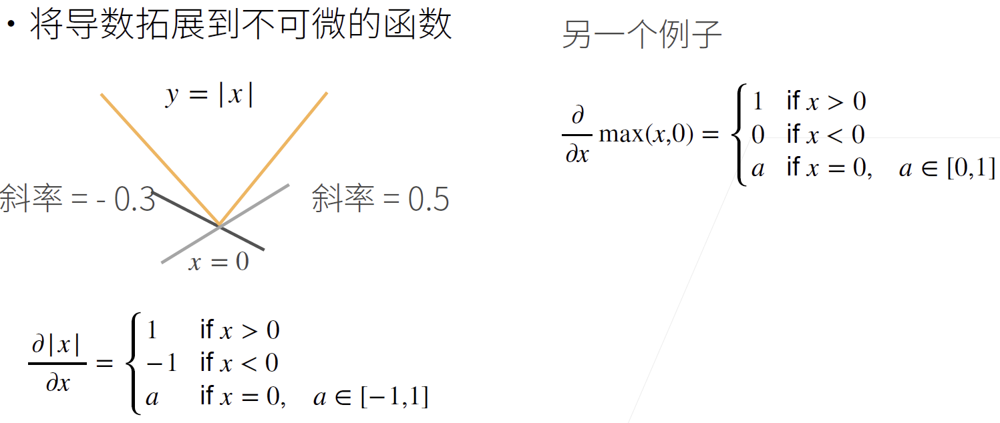
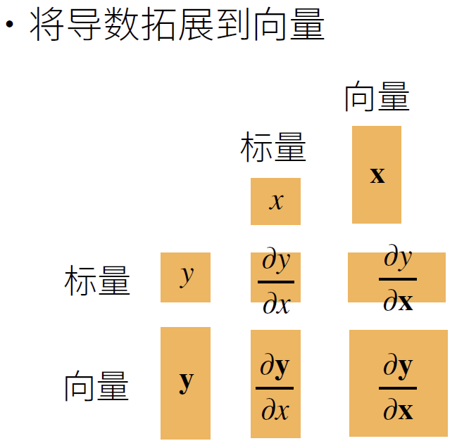

# 预备知识

***

## 数据操作

### 数据操作入门

**创建数组**

创建数组需要：

- 形状：例如 3x4 矩阵
- 每个元素的数据类型：例如 32 位浮点数
- 每个元素的值，例如全是 0，或者随机数

**访问元素**



**PyTorch 实现**

- 使用 `arange` 创建行向量 `x`，包含以 0 开始的 12 个整数

```python
x = torch.arange(12)
x
```

```txt
tensor([ 0,  1,  2,  3,  4,  5,  6,  7,  8,  9, 10, 11])
```

- 通过张量的 `shape` 属性访问张量的形状（沿每个轴的长度）

```python
x.shape
```

```txt
torch.Size([12])
```

- 使用 `numel()` 方法获得张量中元素的总数

```python
x.numel()
```

```txt
12
```

- `reshape` 改变张量形状，但不改变元素数量和元素值

把 x 从形状 (12,) 的行向量转换为 (3,4) 的矩阵。

```python
X = x.reshape(3, 4)
X
```

```txt
tensor([[ 0,  1,  2,  3],
        [ 4,  5,  6,  7],
        [ 8,  9, 10, 11]])
```

- 使用全 0、全 1、其它常量或者特定分布中随机采样的数字来初始化矩阵

创建形状为 (2,3,4) 的张量，所有元素设置为 0：

```python
torch.zeros((2, 3, 4))
```

```txt
tensor([[[0., 0., 0., 0.],
         [0., 0., 0., 0.],
         [0., 0., 0., 0.]],

        [[0., 0., 0., 0.],
         [0., 0., 0., 0.],
         [0., 0., 0., 0.]]])
```

创建形状为 (2,3,4) 的张量，所有元素设置为 1：

```python
torch.ones((2, 3, 4))
```

```txt
tensor([[[1., 1., 1., 1.],
         [1., 1., 1., 1.],
         [1., 1., 1., 1.]],

        [[1., 1., 1., 1.],
         [1., 1., 1., 1.],
         [1., 1., 1., 1.]]])
```

- 创建形状为 (3,4) 的张量，元素从均值为0、标准差为 1 的标准高斯分布中随机采样

```python
torch.randn(3, 4)
```

```txt
tensor([[ 0.2602, -1.1463,  0.2369, -0.5475],
        [ 0.7723, -0.5699,  0.4023, -0.7272],
        [ 0.1569,  0.4193,  1.3748,  1.0034]])
```

- 使用包含数值的 Python 列表（或嵌套列表），为张量的每个元素赋值

```python
torch.tensor([[2, 1, 4, 3], [1, 2, 3, 4], [4, 3, 2, 1]])
```

```txt
tensor([[2, 1, 4, 3],
        [1, 2, 3, 4],
        [4, 3, 2, 1]])
```

### 运算符

常见的标准算数运算符（+、-、*、/ 和 **）都可以升级为按元素运算。同一形状的任意两个张量都可以调用按元素操作。

```python
x = torch.tensor([1.0, 2, 4, 8])
y = torch.tensor([2, 2, 2, 2])
# 分别按元素加、减、乘、除和幂
x + y, x - y, x * y, x / y, x**y
```

```txt
(tensor([ 3.,  4.,  6., 10.]),
 tensor([-1.,  0.,  2.,  6.]),
 tensor([ 2.,  4.,  8., 16.]),
 tensor([0.5000, 1.0000, 2.0000, 4.0000]),
 tensor([ 1.,  4., 16., 64.]))
```

- 按元素计算指数

```python
torch.exp(x)
```

```txt
tensor([2.7183e+00, 7.3891e+00, 5.4598e+01, 2.9810e+03])
```

- 连接张量

按行（轴-0）和按列（轴-1）连结两个矩阵

```python
# 生成 2 个 3x4 矩阵
X = torch.arange(12, dtype=torch.float32).reshape((3, 4))
Y = torch.tensor([[2.0, 1, 4, 3], [1, 2, 3, 4], [4, 3, 2, 1]])
# 以两种方式连结起来
torch.cat((X, Y), dim=0), torch.cat((X, Y), dim=1)
```

```txt
(tensor([[ 0.,  1.,  2.,  3.],
         [ 4.,  5.,  6.,  7.],
         [ 8.,  9., 10., 11.],
         [ 2.,  1.,  4.,  3.],
         [ 1.,  2.,  3.,  4.],
         [ 4.,  3.,  2.,  1.]]),
 tensor([[ 0.,  1.,  2.,  3.,  2.,  1.,  4.,  3.],
         [ 4.,  5.,  6.,  7.,  1.,  2.,  3.,  4.],
         [ 8.,  9., 10., 11.,  4.,  3.,  2.,  1.]]))
```

- 通过逻辑运算符构建二维张量

```python
X == Y
```

```txt
tensor([[False,  True, False,  True],
        [False, False, False, False],
        [False, False, False, False]])
```

- 对张量的所有元素求和，产生一个只有一个元素的张量

```python
X.sum()
```

```txt
tensor(66.)
```

### 广播机制

即使形状不同，也可以通过广播机制执行按元素操作。其机制为：通过适当复制来扩展一个或两个数组，使两个张量具有相同形状，然后对生成的数组执行按元素操作。

通过沿着数组中长度为 1 的轴进行广播。例如：

```python
a = torch.arange(3).reshape((3, 1))
b = torch.arange(2).reshape((1, 2))
a, b
```

```txt
(tensor([[0],
         [1],
         [2]]),
 tensor([[0, 1]]))
```

由于 a 和 b 分别是 $3\times 1$ 和 $1\times 2$ 矩阵，如果相加，它们的形状不匹配。如果将两个矩阵广播为一个更大的 $3\times 2$矩阵，就可以相加：

```python
a + b
```

```txt
tensor([[0, 1],
        [1, 2],
        [2, 3]])
```

### 索引和切片

与 Python 数组一样，第一个元素的索引是 0，最后一个元素索引是 -1。

- 例如，用 -1 选择最后一个元素，用 [1:3] 选择第二个和第三个元素

```python
X[-1], X[1:3]
```

```txt
(tensor([ 8.,  9., 10., 11.]),
 tensor([[ 4.,  5.,  6.,  7.],
         [ 8.,  9., 10., 11.]]))
```

- 通过指定索引将元素写入矩阵

```python
X[1, 2] = 9
X
```

```txt
tensor([[ 0.,  1.,  2.,  3.],
        [ 4.,  5.,  9.,  7.],
        [ 8.,  9., 10., 11.]])
```

- 为多个元素赋值

```python
X[0:2, :] = 12
X
```

```txt
tensor([[12., 12., 12., 12.],
        [12., 12., 12., 12.],
        [ 8.,  9., 10., 11.]])
```

### 节省内存

**运行一些操作可能会导致为新结果分配内存**。
例如，如果我们用`Y = X + Y`，我们将取消引用`Y`指向的张量，而是指向新分配的内存处的张量。

在下面的例子中，我们用Python的`id()`函数演示了这一点，它给我们提供了内存中引用对象的确切地址。运行`Y = Y + X`后，我们会发现`id(Y)`指向另一个位置。这是因为Python首先计算`Y + X`，为结果分配新的内存，然后使`Y`指向内存中的这个新位置。

```python
before = id(Y)
Y = Y + X
id(Y) == before
```

```txt
False
```

**原地操作**：使用切片表示法将操作的结果分配给先前分配的数组，例如 `Y[:] = <expression>`。

```python
Z = torch.zeros_like(Y)
print("id(Z):", id(Z))
Z[:] = X + Y
print("id(Z):", id(Z))
```

```txt
id(Z): 2403471355712
id(Z): 2403471355712
```

- 如果在后续计算中没有重复使用`X`，也可以使用`X[:] = X + Y`或`X += Y`来减少操作的内存开销。

```python
before = id(X)
X += Y
id(X) == before
```

```txt
True
```

### 转换为其它对象

- 转换为 ndarray

torch张量和numpy数组将共享它们的底层内存，就地操作更改一个张量也会同时更改另一个张量。

```python
A = X.numpy()
B = torch.tensor(A)
type(A), type(B)
```

```txt
(numpy.ndarray, torch.Tensor)
```

- 将大小为1的张量转换为Python标量，可以调用`item`函数或Python的内置函数。

```python
a = torch.tensor([3.5])
a, a.item(), float(a), int(a)
```

```txt
(tensor([3.5000]), 3.5, 3.5, 3)
```

## 数据预处理

介绍使用 pandas 预处理原始数据，并将原始数据转换为张量格式的步骤。

### 读取数据集

创建一个人工数据集，并存储在CSV（逗号分隔值）文件：

```python
import os

os.makedirs(os.path.join("..", "data"), exist_ok=True)
data_file = os.path.join("..", "data", "house_tiny.csv")
with open(data_file, "w") as f:
    f.write("NumRooms,Alley,Price\n")  # 列名
    f.write("NA,Pave,127500\n")  # 每行表示一个数据样本
    f.write("2,NA,106000\n")
    f.write("4,NA,178100\n")
    f.write("NA,NA,140000\n")
```

- 从创建的CSV文件中加载原始数据集

```python
import pandas as pd

data = pd.read_csv(data_file)
print(data)
```

```txt
   NumRooms Alley   Price
0       NaN  Pave  127500
1       2.0   NaN  106000
2       4.0   NaN  178100
3       NaN   NaN  140000
```

### 处理缺失值

处理缺失的数据，典型的方法包括**插值法**和**删除法**， 其中插值法用一个替代值弥补缺失值，而删除法则直接忽略缺失值。

通过位置索引`iloc`，将 `data` 分成`inputs`和`outputs`，其中前者为`data`的前两列，而后者为`data`的最后一列。对于`inputs`中缺少的数值，用同一列的均值替换“NaN”项。

```python
inputs, outputs = data.iloc[:, 0:2], data.iloc[:, 2]
inputs = inputs.fillna(inputs.mean())
print(inputs)
```

```txt
   NumRooms Alley
0       3.0  Pave
1       2.0   NaN
2       4.0   NaN
3       3.0   NaN
```

- 对于`inputs`中的类别值或离散值，我们将“NaN”视为一个类别

由于 "Alley" col 只有两种类型的值 "Pave" 和 "NaN"，pandas 可以自动将此列转换为两列 "Alley_Pave" 和 "Alley_nan"。巷⼦类型为 “Pave” 的⾏会将 “Alley_Pave” 的值设置为1，“Alley_nan”的值设置为0。缺少巷⼦类型的⾏会将“Alley_Pave”和“Alley_nan”分别设置为0和1。

```python
inputs = pd.get_dummies(inputs, dummy_na=True)
print(inputs)
```

```txt
   NumRooms  Alley_Pave  Alley_nan
0       3.0           1          0
1       2.0           0          1
2       4.0           0          1
3       3.0           0          1
```

### 转换为张量

现在inputs和outputs中的所有条目都是数值类型，它们可以转换为张量格式。

```python
import torch

X, y = torch.tensor(inputs.values), torch.tensor(outputs.values)
X, y
```

```txt
(tensor([[3., 1., 0.],
         [2., 0., 1.],
         [4., 0., 1.],
         [3., 0., 1.]], dtype=torch.float64),
 tensor([127500, 106000, 178100, 140000]))
```

## 线性代数

### 标量

标量由只有一个元素的张量表示。下面实例化两个标量，并执行一些熟悉的算术运算，即加法、乘法、除法和指数。

```python
import torch

x = torch.tensor(3.0)
y = torch.tensor(2.0)

x + y, x * y, x / y, x**y
```

```txt
(tensor(5.), tensor(6.), tensor(1.5000), tensor(9.))
```

### 向量

向量是标量值组成的列表。在数学表示法中，通常将向量记为小写粗体，例如 $\mathbf{x}$、$\mathbf{y}$ 等。

向量用一维张量表示。

```python
x = torch.arange(4)
x
```

```txt
tensor([0, 1, 2, 3])
```

- 通过索引访问张量元素

```python
x[3]
```

```txt
tensor(3)
```

- 向量长度

```python
len(x)
```

```txt
4
```

- 用张量表示向量时，可以通过 `shape` 属性访问向量长度。只有一个轴的张量，形状只有一个元素

```python
x.shape
```

```txt
torch.Size([4])
```

### 矩阵

- 通过指定两个分量 $m$ 和 $n$ 来创建 $m\times n$ 矩阵

```python
A = torch.arange(20).reshape(5, 4)
A
```

```txt
tensor([[ 0,  1,  2,  3],
        [ 4,  5,  6,  7],
        [ 8,  9, 10, 11],
        [12, 13, 14, 15],
        [16, 17, 18, 19]])
```

- 交换矩阵的行和列，称为矩阵的**转置**（transpose）。

```python
A.T
```

```txt
tensor([[ 0,  4,  8, 12, 16],
        [ 1,  5,  9, 13, 17],
        [ 2,  6, 10, 14, 18],
        [ 3,  7, 11, 15, 19]]
```

- *对称*矩阵（symmetric matrix）与其转置相等，是一种特殊的方阵：$\mathbf{A}=\mathbf{A}^\top$

定义对称矩阵 $\mathbf{B}$:

```python
B = torch.tensor([[1, 2, 3], [2, 0, 4], [3, 4, 5]])
B
```

```txt
tensor([[1, 2, 3],
        [2, 0, 4],
        [3, 4, 5]])
```

`B` 与它的转置进行比较：

```python
B == B.T
```

```txt
tensor([[True, True, True],
        [True, True, True],
        [True, True, True]])
```

### 张量

就像向量是标量的推广，矩阵是向量的推广一样，我们可以构建具有更多轴的数据结构。张量用于描述具有任意数量轴的 $n$ 维数组。

```python
X = torch.arange(24).reshape(2, 3, 4)
X
```

```txt
tensor([[[ 0,  1,  2,  3],
         [ 4,  5,  6,  7],
         [ 8,  9, 10, 11]],

        [[12, 13, 14, 15],
         [16, 17, 18, 19],
         [20, 21, 22, 23]]])
```

- 给定具有相同形状的任意两个张量，任何按元素二元运算的结果都将是相同形状的张量

例如，将两个相同形状的矩阵相加，会在这两个矩阵上执行元素加法。

```python
A = torch.arange(20, dtype=torch.float32).reshape(5, 4)
B = A.clone()  # 通过分配新内存，将A的一个副本分配给B
A, A + B
```

```txt
(tensor([[ 0.,  1.,  2.,  3.],
         [ 4.,  5.,  6.,  7.],
         [ 8.,  9., 10., 11.],
         [12., 13., 14., 15.],
         [16., 17., 18., 19.]]),
 tensor([[ 0.,  2.,  4.,  6.],
         [ 8., 10., 12., 14.],
         [16., 18., 20., 22.],
         [24., 26., 28., 30.],
         [32., 34., 36., 38.]]))
```

- 两个矩阵的按元素乘法称为*Hadamard积*（Hadamard product）（数学符号$\odot$）

$$
\mathbf{A} \odot \mathbf{B} =
\begin{bmatrix}
    a_{11}  b_{11} & a_{12}  b_{12} & \dots  & a_{1n}  b_{1n} \\
    a_{21}  b_{21} & a_{22}  b_{22} & \dots  & a_{2n}  b_{2n} \\
    \vdots & \vdots & \ddots & \vdots \\
    a_{m1}  b_{m1} & a_{m2}  b_{m2} & \dots  & a_{mn}  b_{mn}
\end{bmatrix}.
$$

```python
A * B
```

```txt
tensor([[  0.,   1.,   4.,   9.],
        [ 16.,  25.,  36.,  49.],
        [ 64.,  81., 100., 121.],
        [144., 169., 196., 225.],
        [256., 289., 324., 361.]])
```

- 张量乘以或加上一个标量不改变形状，张量的每个元素都将与标量相加或相乘。

```python
a = 2
X = torch.arange(24).reshape(2, 3, 4)
a + X, (a * X).shape
```

```txt
(tensor([[[ 2,  3,  4,  5],
          [ 6,  7,  8,  9],
          [10, 11, 12, 13]],
 
         [[14, 15, 16, 17],
          [18, 19, 20, 21],
          [22, 23, 24, 25]]]),
 torch.Size([2, 3, 4]))
```

### 降维

- 计算张量元素和

```python
x = torch.arange(4, dtype=torch.float32)
x, x.sum()
```

```txt
(tensor([0., 1., 2., 3.]), tensor(6.))
```

- 可以计算任意形状张量的元素和

例如，矩阵$\mathbf{A}$中元素的和可以记为$\sum_{i=1}^{m} \sum_{j=1}^{n} a_{ij}$。

```python
A.shape, A.sum()
```

```txt
(torch.Size([5, 4]), tensor(190.))
```

- 指定求和维度

求和操作 `sum()` 默认计算所有元素的和。

例如，对矩阵求和所有的行 `axis=0`。

```python
A_sum_axis0 = A.sum(axis=0)
A_sum_axis0, A_sum_axis0.shape
```

```txt
(tensor([40., 45., 50., 55.]), torch.Size([4]))
```

> 指定哪个维度求和，就把那个维度去掉了。

指定 `axis=1` 对矩阵所有的列求和：

```python
A_sum_axis1 = A.sum(axis=1)
A_sum_axis1, A_sum_axis1.shape
```

```txt
(tensor([ 6., 22., 38., 54., 70.]), torch.Size([5]))
```

- 沿着行和列对矩阵求和，等价于对矩阵的所有元素进行求和。

```python
A.sum(axis=[0, 1])
```

```txt
tensor(190.)
```

- 计算均值

```python
A.mean(), A.sum() / A.numel()
```

```txt
(tensor(9.5000), tensor(9.5000))
```

- 指定计算均值的维度

```python
A.mean(axis=0), A.sum(axis=0) / A.shape[0]
```

```txt
(tensor([ 8.,  9., 10., 11.]), tensor([ 8.,  9., 10., 11.]))
```

- 计算加和或均值时保持维度不变

> 计算加和或者均值的维度变为 1.

```python
sum_A = A.sum(axis=1, keepdims=True)
sum_A
```

```txt
tensor([[ 6.],
        [22.],
        [38.],
        [54.],
        [70.]])
```

由于`sum_A`在对每行进行求和后仍保持两个轴，所以可以通过广播将`A`除以`sum_A`。

```python
A / sum_A
```

```txt
tensor([[0.0000, 0.1667, 0.3333, 0.5000],
        [0.1818, 0.2273, 0.2727, 0.3182],
        [0.2105, 0.2368, 0.2632, 0.2895],
        [0.2222, 0.2407, 0.2593, 0.2778],
        [0.2286, 0.2429, 0.2571, 0.2714]])
```

- 沿某个轴计算`A`元素的累积总和，比如`axis=0`（按行计算），可以调用`cumsum`函数。

此函数不会沿任何轴降低输入张量的维度。

```python
A.cumsum(axis=0)
```

```txt
tensor([[ 0.,  1.,  2.,  3.],
        [ 4.,  6.,  8., 10.],
        [12., 15., 18., 21.],
        [24., 28., 32., 36.],
        [40., 45., 50., 55.]])
```

### 点积

给定两个向量$\mathbf{x},\mathbf{y}\in\mathbb{R}^d$，它们的*点积*（dot product）$\mathbf{x}^\top\mathbf{y}$（或$\langle\mathbf{x},\mathbf{y}\rangle$）是相同位置的按元素乘积的和：
$$
\mathbf{x}^\top \mathbf{y} = \sum_{i=1}^{d} x_i y_i
$$

```python
y = torch.ones(4, dtype=torch.float32)
x, y, torch.dot(x, y)
```

```txt
(tensor([0., 1., 2., 3.]), tensor([1., 1., 1., 1.]), tensor(6.))
```

也可以通过按元素乘法，然后求和来计算两个向量的点积：

```python
torch.sum(x * y)
```

```txt
tensor(6.)
```

### 矩阵向量积

调用`torch.mv(A, x)` 执行矩阵`A`和向量 `x` 的矩阵-向量积。注意，`A`的列维数（沿轴1的长度）必须与`x`的维数（其长度）相同。

```python
A.shape, x.shape, torch.mv(A, x)
```

```txt
(torch.Size([5, 4]), torch.Size([4]), tensor([ 14.,  38.,  62.,  86., 110.]))
```

### 矩阵矩阵乘法

可以将矩阵-矩阵乘法$\mathbf{AB}$看作是简单地执行$m$次矩阵-向量积，并将结果拼接在一起，形成一个$n \times m$矩阵。用 `mm` 计算：

```python
B = torch.ones(4, 3)
torch.mm(A, B)
```

```txt
tensor([[ 6.,  6.,  6.],
        [22., 22., 22.],
        [38., 38., 38.],
        [54., 54., 54.],
        [70., 70., 70.]])
```

### 范数

在线性代数中，向量范数是将向量映射到标量的函数 $f$。

欧几里得距离是 L2 范数，$L_2$ *范数*是向量元素平方和的平方根：

```python
u = torch.tensor([3.0, -4.0])
torch.norm(u)
```

```txt
tensor(5.)
```

$L_1$范数，它表示为向量元素的绝对值之和：

```python
torch.abs(u).sum()
```

```txt
tensor(7.)
```

## 微积分

### 倒数和微分


### 标量导数



### 亚倒数



### 梯度



> 注意形状变化


标量对向量求导，其实就是对向量的各个分量求偏微分。

例如：


### 链式法则


对向量，关键是形状要对。

## 自动求导

### 自动求导的两种模式


### 实现

假设我们想对函数$y=2\mathbf{x}^{\top}\mathbf{x}$关于列向量$\mathbf{x}$求导：

```python
import torch

x = torch.arange(4.0)
x
```

```txt
tensor([0., 1., 2., 3.])
```

在我们计算$y$关于$\mathbf{x}$的梯度之前，需要一个地方来存储梯度。

```python
x.requires_grad_(True)  # 等价于x=torch.arange(4.0,requires_grad=True)
x.grad  # 默认值是 None
```

计算 $y$：

```python
y = 2 * torch.dot(x, x)
y
```

```txt
tensor(28., grad_fn=<MulBackward0>)
```

`x`是一个长度为 4 的向量，计算`x`和`x`的点积，得到了我们赋值给`y`的标量输出。下面通过调用反向传播函数来自动计算`y`关于`x`每个分量的梯度，并打印这些梯度。

```python
y.backward()
x.grad
```

```txt
tensor([ 0.,  4.,  8., 12.])
```

- 计算`x`的另一个函数

```python
# 在默认情况下，PyTorch会累积梯度，我们需要清除之前的值
x.grad.zero_()
y = x.sum()
y.backward()
x.grad
```

```txt
tensor([1., 1., 1., 1.])
```

## 参考

- https://zh.d2l.ai/chapter_preliminaries/ndarray.html
