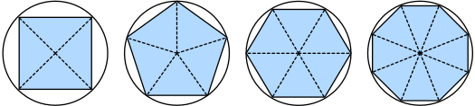
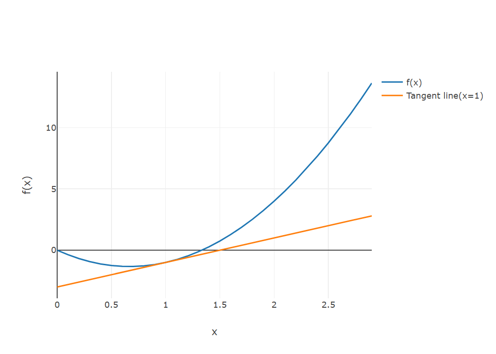

# 预备知识

@author Jiawei Mao
***

## 数据操作

2025-11-26⭐

djl 使用 n 维数组 ndarray 存储和转换数据，以 `NDArray` 类表示。

### 创建 NDArray

一般称：

- 一维数组为向量
- 二维数量为矩阵
- 高维数组为张量

下面统称为 `NDArray`。

#### arange

`arange(12)` 创建从 0 包含 12  个整数的行向量：其类型为 `int32`

```java
NDManager manager = NDManager.newBaseManager();
NDArray x = manager.arange(12);
System.out.println(x);
```

```
ND: (12) gpu(0) int32
[ 0,  1,  2,  3,  4,  5,  6,  7,  8,  9, 10, 11]
```

这里使用 `NDManager` 创建 ndarray `x`。`NDManager` 实现了 `AutoClosable` 接口，它负责管理由它创建的 ndarray 的生命周期。这是为了管理 Java GC 无法控制的 native 内存消耗。通常用 try blocks 包裹 `NDManager`，这样所有 ndarray 都会及时关闭。

```java
try (NDManager manager = NDManager.newBaseManager()) {
    NDArray x = manager.arange(12);
}
```

#### shape

查看 ndarray 的 shape 信息：

```java
x.getShape()
```

```
(12)
```

#### size

获取 ndarray 的元素总数，即 shape 所有元素的乘积。

```java
x.size()
```

```
12
```

#### reshape

使用 `reshape` 不改变元素数量和值，只改变 shape。将上面 shape 为 `(12,)` 的行向量变为 shape 为 `(3,4)` 的矩阵。

```java
x = x.reshape(3, 4);
System.out.println(x);
```

```
ND: (3, 4) gpu(0) int32
[[ 0,  1,  2,  3],
 [ 4,  5,  6,  7],
 [ 8,  9, 10, 11],
]
```

在 reshape 时不需要手动指定每个维度。如果目标 shape 是一个矩阵，那么在知道 width 后，根据元素量就可以计算出 height。ndarray 支持该功能，将需要 ndarray 自动推断的维度设置为 -1 即可。因此，`reshape(3,4)` 等价于 `reshape(-1,4)` 或 `reshape(3,-1)`。

#### create

使用 `manager.create(new Shape(3,4))` 创建未初始化的 ndarray，默认类型为 `float32`。

```java
try (NDManager manager = NDManager.newBaseManager()) {
    NDArray array = manager.create(new Shape(3, 4));
    System.out.println(array);
}
```

```
ND: (3, 4) gpu(0) float32
[[0., 0., 0., 0.],
 [0., 0., 0., 0.],
 [0., 0., 0., 0.],
]
```

通常，我们希望矩阵初始化为 0、1、其它常量，或从特定分布随机抽样。

#### zeros

创建一个所有元素为 0 的张量。

```java
manager.zeros(new Shape(2, 3, 4))
```

```
ND: (2, 3, 4) gpu(0) float32
[[[0., 0., 0., 0.],
  [0., 0., 0., 0.],
  [0., 0., 0., 0.],
 ],
 [[0., 0., 0., 0.],
  [0., 0., 0., 0.],
  [0., 0., 0., 0.],
 ],
]
```

#### ones

创建一个所有元素为 1 的张量。

```java
manager.ones(new Shape(2, 3, 4))
```

```
ND: (2, 3, 4) gpu(0) float32
[[[1., 1., 1., 1.],
  [1., 1., 1., 1.],
  [1., 1., 1., 1.],
 ],
 [[1., 1., 1., 1.],
  [1., 1., 1., 1.],
  [1., 1., 1., 1.],
 ],
]
```

#### randomNormal

在构造神经网络参数时，通常会采用随机初始化。下面创建一个 shape 为 `(3,4)` 的 ndarray，其元素值从均值为 0、方差为 1 的标准高斯分布随机采样得到：

```java
manager.randomNormal(0f, 1f, new Shape(3, 4), DataType.FLOAT32)
```

```
ND: (3, 4) gpu(0) float32
[[ 0.9423,  0.1963, -0.292 ,  1.7739],
 [ 0.0696,  1.7184,  0.1135,  1.574 ],
 [ 1.6411,  1.1624, -1.9151, -0.729 ],
]
```

也可以只传入 shape，高斯分布默认均值为 0、方差为 1，类型为 float32.

```java
manager.randomNormal(new Shape(3, 4))
```

```
ND: (3, 4) gpu(0) float32
[[ 0.1171,  0.7113,  0.288 ,  0.4813],
 [-0.7449,  0.1307, -1.3045,  0.5962],
 [-0.588 , -0.4861, -0.8194, -1.3137],
]
```

#### create_value

也可以提供每个元素值和 shape 来创建张量。

```java
manager.create(new float[]{2, 1, 4, 3, 1, 2, 3, 4, 4, 3, 2, 1}, new Shape(3, 4))
```

```
ND: (3, 4) gpu(0) float32
[[2., 1., 4., 3.],
 [1., 2., 3., 4.],
 [4., 3., 2., 1.],
]
```

### 数组操作

ndarray 最简单也最有用的运算是 element-wise 运算，即对数组元素逐个执行标量操作。对输入为两个数组的函数，element-wise 运算对两个数组每对元素应用二元运算符。在数学中：

- 一元标量运算（unary scalar operator）表示为 $f:\Reals\rightarrow\Reals$，表示从一个实数映射到另一个实数
- 二元标量运算（binary scalar operator）表示为 $f:\Reals,\Reals\rightarrow\Reals$，表示从两个实数映射到另一个实数

给定两个 shape 相同的向量 $\vec{u}$ 和 $\vec{v}$，以及一个二元运算符 $f$，可以得到向量 $\vec{c}=F(\vec{u},\vec{v})$，其中 $c_i\leftarrow f(u_i,v_i)$，$c_i$, $u_i$, $v_i$ 为向量 $\vec{c}$, $\vec{u}$ 和 $\vec{v}$ 的第 i 个元素。

在 DJL 中，常见的算数运算（+, -, *, /, `**`）都被实现为任意相同 shape 张量的逐元素运算。对任意两个 shape 相同的张量都可以调用 elementwise 运算。

**示例**：创建两个长度为 5 的一维向量，然后执行算术运算

```java
NDArray x = manager.create(new float[]{1f, 2f, 4f, 8f});
NDArray y = manager.create(new float[]{2f, 2f, 2f, 2f});
System.out.println(x.add(y));
```

```
ND: (4) gpu(0) float32
[ 3.,  4.,  6., 10.]
```

```java
System.out.println(x.sub(y)); // 减法
System.out.println(x.mul(y)); // 乘法
System.out.println(x.div(y)); // 除法
System.out.println(x.pow(y)); // 指数
```

```
ND: (4) gpu(0) float32
[-1.,  0.,  2.,  6.]

ND: (4) gpu(0) float32
[ 2.,  4.,  8., 16.]

ND: (4) gpu(0) float32
[0.5, 1. , 2. , 4. ]

ND: (4) gpu(0) float32
[ 1.,  4., 16., 64.]
```

还有很多 elementwise 操作，包括指数等一元运算符。

```java
System.out.println(x.exp());
```

```
ND: (4) gpu(0) float32
[ 2.71828175e+00,  7.38905621e+00,  5.45981483e+01,  2.98095801e+03]
```

除了 elementwise 操作，还可以执行线性代数运算，如向量点积、矩阵乘法等，后面单独讨论。

**concatenate**

可以将多个 ndarray 拼接在一起，堆叠成一个更大的 ndarray。

- 默认沿 axis=0 拼接

```java
NDArray x = manager.arange(12f).reshape(3, 4);
NDArray y = manager.create(new float[]{2, 1, 4, 3, 1, 2, 3, 4, 4, 3, 2, 1},
        new Shape(3, 4));
```

```
ND: (6, 4) gpu(0) float32
[[ 0.,  1.,  2.,  3.],
 [ 4.,  5.,  6.,  7.],
 [ 8.,  9., 10., 11.],
 [ 2.,  1.,  4.,  3.],
 [ 1.,  2.,  3.,  4.],
 [ 4.,  3.,  2.,  1.],
]
```

`(3,4)` + `(3,4)` = `(6,4)`

- 指定 axis 拼接

```java
System.out.println(x.concat(y, 1));
```

```
ND: (3, 8) gpu(0) float32
[[ 0.,  1.,  2.,  3.,  2.,  1.,  4.,  3.],
 [ 4.,  5.,  6.,  7.,  1.,  2.,  3.,  4.],
 [ 8.,  9., 10., 11.,  4.,  3.,  2.,  1.],
]
```

`(3,4)` + `(3,4)` = `(3,8)`。

**boolean 运算**

例如，当 elementwise 相等运算：

```java
System.out.println(x.eq(y));
```

```
ND: (3, 4) gpu(0) boolean
[[false,  true, false,  true],
 [false, false, false, false],
 [false, false, false, false],
]
```

**sum**

将 ndarray 中元素元素相加，得到一个只包含一个元素的 ndarray：

```java
System.out.println(x.sum());
```

```
ND: () gpu(0) float32
66.
```

### 广播机制

前面已经展示如何对两个 shape 相同的 ndarray 进行 elementwise 操作。在特定条件下，即使 shape 不同，也可以通过广播机制进行 elementwise 操作。原理：通过复制一个或两个数组的元素，使得它们 shape 相同，然后执行 elementwise 操作。

例如：

```java
NDArray a = manager.arange(3f).reshape(3, 1);
NDArray b = manager.arange(2f).reshape(1, 2);
System.out.println(a);
System.out.println(b);
```

```
ND: (3, 1) gpu(0) float32
[[0.],
 [1.],
 [2.],
]

ND: (1, 2) gpu(0) float32
[[0., 1.],
]

```

`a` 的 shape 为 `(3,1)`，`b` 的 shape 为 `(1,2)`，将两个 ndarray 广播称一个更大的 `(3,2)` 矩阵，`a` 通过复制 columns 实现，`b` 通过复制 rows 实现。然后就可以相加：

```java
System.out.println(a.add(b));
```

```
ND: (3, 2) gpu(0) float32
[[0., 1.],
 [1., 2.],
 [2., 3.],
]
```

这里自动对 `a` 和 `b` 进行了广播。

### 索引和切片

DJL 的索引和切片语法与 Numpy 相同。与其他 Python 数组一样：

- ndarray 支持通过索引访问元素
- 第一个元素的索引为 0
- 切片包含从开始索引到结束索引之前的所有元素
- 通过负数索引可以从末尾开始选择

**示例**：`x` 的 shape 为 `(3,4)`，切片默认从第一个维度开始，从 ":-1" 切片得到 `(2,4)`

```java
NDArray x = manager.arange(12f).reshape(3, 4);
System.out.println(x.get(":-1"));
```

```
ND: (2, 4) gpu(0) float32
[[0., 1., 2., 3.],
 [4., 5., 6., 7.],
]
```

```java
x.get("1:3")
```

```
ND: (2, 4) gpu(0) float32
[[ 4.,  5.,  6.,  7.],
 [ 8.,  9., 10., 11.],
]
```

**写入**

除了读取数据，还可以通过索引写入元素。

```java
NDArray x = manager.arange(12f).reshape(3, 4);
x.set(new NDIndex("1,2"), 9);
System.out.println(x);
```

```
ND: (3, 4) gpu(0) float32
[[ 0.,  1.,  2.,  3.],
 [ 4.,  5.,  9.,  7.],
 [ 8.,  9., 10., 11.],
]
```

如果想给多个元素赋予相同的值，只需索引这些元素，赋予相同的值。例如，`[0:2, :]` 访问第一行和第二行，其中 `:` 取 axis-1 (column) 的所有元素。虽然这里讨论的是矩阵索引，但也适用于向量和张量。

```java
NDArray x = manager.arange(12f).reshape(3, 4);
x.set(new NDIndex("0:2, :"), 2);
```

```
ND: (3, 4) gpu(0) float32
[[ 2.,  2.,  2.,  2.],
 [ 2.,  2.,  2.,  2.],
 [ 8.,  9., 10., 11.],
]
```

### 内存开销

运行操作可能需要主机分配内存保存结果。例如，`y=x.add(y)`，会取消 `y` 对原 ndarray 的 引用，而将 `y` 指向新分配的内存。

这不是我们所期望的，因为：1. 我们不想分配不必要的内存。机器学习中可能有上百兆字节的参数，并且每秒多次更新这些参数。一般我们希望原地更新。2. 多个变量可能指向相同参数，如果没有原地更新参数，其它引用仍指向旧内存地址，使得部分代码引用过时参数。

在 DJL 中执行就地操作很容易。使用对应的原地运算符即可，如 `addi`, `subi`, `muli` 和 `divi`。

```java
NDArray x = manager.arange(12f).reshape(3, 4);
NDArray y = manager.create(new float[]{2, 1, 4, 3, 1, 2, 3, 4, 4, 3, 2, 1}, new Shape(3, 4));

var original = manager.zeros(y.getShape());
var actual = original.addi(x);
System.out.println(actual == original);
```

```
true
```

### 总结

- DJL 的 ndarray 是对 NumPy ndarray 的扩展，性能更好，更适合深度学习
- DJL 的 ndarray 提供许多功能，包括基本数学运算、广播、索引、切片、in-place 操作等

## 数据预处理

2025-11-26⭐

在 ndarray 中已经介绍多种处理 `NDArra` 数据的技术。为了将深度学习应用于现实问题，我们通常需要从预处理原始数据开始，而不是整理好的 `NDArray` 数据。在流行的 Java 数据分析工具中，tablesaw 被广泛使用，它与 Python 的 pandas 类似。下面简要介绍使用 tablesaw 预处理原始数据并将其转换为 `NDArray` 格式的步骤。在后面会介绍更多数据预处理技术。

### 添加依赖项

```xml
<dependency>
    <groupId>tech.tablesaw</groupId>
    <artifactId>tablesaw-jsplot</artifactId>
    <version>0.44.4</version>
</dependency>
```

### 读取数据集

下面首先创建一个数据集，保存到 `../data/house_tiny.csv` 文件。其它格式的数据处理方法类似。

```java
File file = new File("../data/");
file.mkdir();

String dataFile = "../data/house_tiny.csv";
File f = new File(dataFile);
f.createNewFile();

try (FileWriter fw = new FileWriter(dataFile)) {
    fw.write("NumRooms,Alley,Price\n"); // Column names
    fw.write("NA,Pave,127500\n");  // Each row represents a data example
    fw.write("2,NA,106000\n");
    fw.write("4,NA,178100\n");
    fw.write("NA,NA,140000\n");
}
```

使用 tablesaw 读取 csv 文件。该数据集包含 4 行 3 列。

```java
Table data = Table.read().file("../data/house_tiny.csv");
System.out.println(data);
```

```
 NumRooms  |  Alley  |  Price   |
---------------------------------
           |   Pave  |  127500  |
        2  |         |  106000  |
        4  |         |  178100  |
           |         |  140000  |
```

### 处理缺失值

上面数据有一些缺失值，处理缺失值的典型方法包括插入（imputation）和删除（deletion）。插入将指定值替换缺失值，而删除则忽略缺失值。这里使用插入策略。

下面通过创建新 tables 将 `data` 拆分为 `inputs` 和 `outputs`，前者包含前两列，后者包含最后 一列。对缺失的数值类型，用同一列的平均值替换缺失值。

```java
Table inputs = data.create(data.columns());
inputs.removeColumns("Price");
Table outputs = data.selectColumns("Price");

Column col = inputs.column("NumRooms");
col.set(col.isMissing(), (int) inputs.nCol("NumRooms").mean());

System.out.println(inputs);
```

```
 NumRooms  |  Alley  |
----------------------
        3  |   Pave  |
        2  |         |
        4  |         |
        3  |         |
```

对分类值或离散值，我们将缺失值或 null 视为一个类别。由于 "Alley" 列只有两种分类值 "Pave" 和 null，tablesaw 可以自动将其转换为两列，我们将这两列分别命名为 "Alley_Pave" 和 "Alley_nan"。之后，将这两列添加到原始数据中，并转换为 double 类型，并去掉原来的 "Alley" 列。

```java
StringColumn alleyCol = (StringColumn) inputs.column("Alley");
List<BooleanColumn> dummies = alleyCol.getDummies();
inputs.removeColumns(alleyCol);
inputs.addColumns(
        DoubleColumn.create("Alley_Pave", dummies.get(0).asDoubleArray()),
        DoubleColumn.create("Alley_nan", dummies.get(1).asDoubleArray())
);
System.out.println(inputs);
```

```
 NumRooms  |  Alley_Pave  |  Alley_nan  |
-----------------------------------------
        3  |           1  |          0  |
        2  |           0  |          1  |
        4  |           0  |          1  |
        3  |           0  |          1  |
```

### 转换为 NDArray 格式

现在 `inputs` 和 `outputs` 的数据都是数字，可以转换为 `NDArray` 格式。

```java
try (NDManager nd = NDManager.newBaseManager()) {
    NDArray x = nd.create(inputs.as().doubleMatrix());
    NDArray y = nd.create(outputs.as().doubleMatrix());
    System.out.println(x);
    System.out.println(y);
}
```

```
ND: (4, 3) gpu(0) float64
[[3., 1., 0.],
 [2., 0., 1.],
 [4., 0., 1.],
 [3., 0., 1.],
]

ND: (4, 1) gpu(0) float64
[[127500.],
 [106000.],
 [178100.],
 [140000.],
]
```

### 总结

- 与  Java 生态的许多扩展包一样，tablesaw 可以与 `NDArray` 一起使用
- 插入和删除可用于处理缺失数据

## 线性代数
2025-11-28⭐
下面介绍深度学习常用的线性代数知识。

###  标量

只有一个数字的值称为**标量**（scalar）。

在本书，变量变量用普通小写字母表示，如 $x$, $y$, $z$。用 $\Reals$ 表示所有实数空间，$x\in\Reals$ 表示 $x$ 是一个实数标量。$x,y\in\{0,1\}$ 表示 $x$ 和 $y$ 为数字，值只能为 0 或 1.

标量由仅有一个元素的 `NDArray` 表示。下面创建两个标量，并对它们执行简单的数学运算。

```java
try (NDManager manager = NDManager.newBaseManager()) {
    NDArray x = manager.create(3f);
    NDArray y = manager.create(2f);

    System.out.println(x.add(y));
    System.out.println(x.mul(y));
    System.out.println(x.div(y));
    System.out.println(x.pow(y));
}
```

```
ND: () gpu(0) float32
5.

ND: () gpu(0) float32
6.

ND: () gpu(0) float32
1.5

ND: () gpu(0) float32
9.
```

### 向量

向量可以看作标量列表，这些标量值称为向量的元素（element）。在数学中，通常用加粗的小写字母表示向量，如 $\mathbf{x}$, $\mathbf{y}$, $\mathbf{z}$.

用一维 `NDArray` 表示向量:

```java
NDArray x = manager.arange(4f);
System.out.println(x);
```

```
ND: (4) gpu(0) float32
[0., 1., 2., 3.]
```

可以通过下标来指定向量中的元素。例如，将 $\mathbf{x}$ 的第 $i$ 个元素记为 $x_i$。这里 $x_i$ 为标量，所以不加粗。大量文献将列向量作为向量的默认方向，本书也是如此。在数学中，向量 $\mathbf{x}$ 可以写为：
$$
\mathbf{x}=\begin{bmatrix}
    x_1\\
    x_2\\
    \vdots\\
    x_n
\end{bmatrix}\tag{3.1}
$$

在代码中通过索引访问 `NDArray` 的元素：

```java
x.get(3)
```

```
ND: () gpu(0) float32
3.
```

**长度、维度和 Shape**

向量和数组一样，都有长度、维度和 shape。在数学中，如果说向量 $\mathbf{x}$ 包含 $n$ 个实数标量，则可以表示为 $\mathbf{x}\in\Reals^n$。向量的长度通常称为向量**维度**（dimension）。

对 `NDArray`，可以使用 `size(0)` 获得向量长度：

```java
x.size(0)
```

```
4
```

当 `NDArray` 表示只有一个 axis 的向量，也可以通过 `getShape()` 访问其长度。shape 列出`NDArray` 每个维度的长度。对只有一个 axis 的 `NDArray`，其 shape 只有一个元素：

```java
x.getShape()
```

```
(4)
```

> [!NOTE]
>
> 这里向量或 axis 的维度表示其长度，即向量或 axis 的元素数量。
>
> `NDArray` 的维度表示它包含的 axix 数。

### 矩阵

正如向量将标量从 0 阶推广到 1 阶，矩阵将向量从 1 阶推广到 2 阶。通常用大写加粗字母表示矩阵，如 $\mathbf{X}$, $\mathbf{Y}$, $\mathbf{Z}$，在代码中用带两个 axis 的 `NDArray` 表示。

数学中用 $\mathbf{A}\in\Reals^{m\times n}$ 表示矩阵 $\mathbf{A}$ 包含 $m$ 行 $n$ 列。可以将矩阵看作表格，第 $i$ 行第 $j$ 列的 元素记为 $a_{ij}$：
$$
\mathbf{A}=\begin{bmatrix}
    a_{11} & a_{12} & \dots & a_{1n}\\
    a_{21} & a_{22} & \dots & a_{2n}\\
    \vdots & \vdots & \ddots & \vdots\\
    a_{m1} & a_{m2} & \dots & a_{mn}
\end{bmatrix} \tag{3.2}
$$

对矩阵 $\mathbf{A}\in\Reals^{m\times n}$，$\mathbf{A}$ 的 shape 为 $(m,n)$ 或 $m\times n$。

创建矩阵：

```java
NDArray A = manager.arange(20f).reshape(5, 4);
System.out.println(A);
```

```
ND: (5, 4) gpu(0) float32
[[ 0.,  1.,  2.,  3.],
 [ 4.,  5.,  6.,  7.],
 [ 8.,  9., 10., 11.],
 [12., 13., 14., 15.],
 [16., 17., 18., 19.],
]
```

通过指定 row-index 和 column-index 可以访问矩阵 $\mathbf{A}$ 的标量元素 $a_{ij}$。

矩阵转置（transpose）
$$
\mathbf{A}^T=\begin{bmatrix}
    a_{11} & a_{21} & \dots & a_{m1}\\
    a_{12} & a_{22} & \dots & a_{m2}\\
    \vdots & \vdots & \ddots & \vdots\\
    a_{1n} & a_{2n} & \dots & a_{mn}    
\end{bmatrix} \tag{3.3}
$$

代码操作：

```java
A.transpose()
```

```
ND: (4, 5) gpu(0) float32
[[ 0.,  4.,  8., 12., 16.],
 [ 1.,  5.,  9., 13., 17.],
 [ 2.,  6., 10., 14., 18.],
 [ 3.,  7., 11., 15., 19.],
]
```

当矩阵 $\mathbf{A}$ 与其转置相等 $\mathbf{A}=\mathbf{A}^T$，就称为 $\mathbf{A}$ 为对称矩阵。下面定义一个对称矩阵 $\mathbf{B}$：

```java
NDArray B = manager.create(new float[][]{{1, 2, 3}, {2, 0, 4}, {3, 4, 5}});
System.out.println(B);
```

```
ND: (3, 3) gpu(0) float32
[[1., 2., 3.],
 [2., 0., 4.],
 [3., 4., 5.],
]
```

然后将 B 与其转置对比：

```java
B.eq(B.transpose())
```

```
ND: (3, 3) gpu(0) boolean
[[ true,  true,  true],
 [ true,  true,  true],
 [ true,  true,  true],
]
```

### NDArray

NDArray 是对矩阵的推广，用于表示 $n$ 维数组。向量为一阶 NDArray，矩阵为二阶 NDArray。

在处理图像时，NDArray 变得更加重要，一般用三维 NDArray 表示彩色图像，对应 height, width 和 color-channels 维度。这里跳过高阶 NDArray，专注于基础知识。

```java
NDArray X = manager.arange(24f).reshape(2, 3, 4);
System.out.println(X);
```

```
ND: (2, 3, 4) gpu(0) float32
[[[ 0.,  1.,  2.,  3.],
  [ 4.,  5.,  6.,  7.],
  [ 8.,  9., 10., 11.],
 ],
 [[12., 13., 14., 15.],
  [16., 17., 18., 19.],
  [20., 21., 22., 23.],
 ],
]
```

### NDArray 的基本性质

基本性质：

- element-wise 运算不改变 shape
- 任意两个相同 shape 的 `NDArray` 的二元运算，得到相同 shape 的 ndarray

**示例**：两个相同 shape 的矩阵相加，得到相同 shape 的矩阵

```java
NDArray A = manager.arange(20f).reshape(5, 4);
NDArray B = A.duplicate(); // 分配新内存复制 A
System.out.println(A);
```

```
ND: (5, 4) gpu(0) float32
[[ 0.,  1.,  2.,  3.],
 [ 4.,  5.,  6.,  7.],
 [ 8.,  9., 10., 11.],
 [12., 13., 14., 15.],
 [16., 17., 18., 19.],
]
```

```java
A.add(B)
```

```
ND: (5, 4) gpu(0) float32
[[ 0.,  2.,  4.,  6.],
 [ 8., 10., 12., 14.],
 [16., 18., 20., 22.],
 [24., 26., 28., 30.],
 [32., 34., 36., 38.],
]
```

两个**矩阵的元素乘法**称为 Hadamard product，数学符号为 ⊙。矩阵 $\mathbf{A}$ 与矩阵 $\mathbf{B}$ 的 Hadamard product 为：
$$
\mathbf{A}\odot\mathbf{B}=\begin{bmatrix}
    a_{11}b_{11} & a_{12}b_{12} & \dots & a_{1n}b_{1n}\\
    a_{21}b_{21} & a_{22}b_{22} & \dots & a_{2n}b_{2n}\\
    \vdots & \vdots & \ddots & \vdots\\
    a_{m1}b_{m1} & a_{m2}b_{m2} & \dots & a_{mn}b_{mn}
\end{bmatrix} \tag{3.4}
$$

```java
A.mul(B)
```

```
ND: (5, 4) gpu(0) float32
[[  0.,   1.,   4.,   9.],
 [ 16.,  25.,  36.,  49.],
 [ 64.,  81., 100., 121.],
 [144., 169., 196., 225.],
 [256., 289., 324., 361.],
]
```

NDArray 与标量相乘也不改变 NDArray 的 shape。

```java
int a = 2;
NDArray X = manager.arange(24f).reshape(2, 3, 4);
System.out.println(X.add(a));
```

```
ND: (2, 3, 4) gpu(0) float32
[[[ 2.,  3.,  4.,  5.],
  [ 6.,  7.,  8.,  9.],
  [10., 11., 12., 13.],
 ],
 [[14., 15., 16., 17.],
  [18., 19., 20., 21.],
  [22., 23., 24., 25.],
 ],
]
```

```java
X.mul(a).getShape()
```

```
(2, 3, 4)
```

### 降维操作

#### 加和

我们可以计算 NDArray 所有元素的加和。在数学中用 $\sum$ 表示加和。可以用 $\sum_{i=1}^dx_i$ 表示长度为 $d$ 的向量 $\mathbf{x}$ 的所有元素加和。在代码中，则直接调用对应方法：

```java
NDArray x = manager.arange(4f);
System.out.println(x);
```

```
ND: (4) gpu(0) float32
[0., 1., 2., 3.]
```

```java
x.sum()
```

```
ND: () gpu(0) float32
6.
```

对任意 shape 的 NDArray 都可以对元素求和。对矩阵求和：

```java
NDArray A = manager.arange(20f).reshape(5, 4);
System.out.println(A.sum());
```

```
ND: () gpu(0) float32
190.
```

调用 `sum` 默认将 NDArray 降维到一个标量。也可以对指定 axis 求和。以矩阵为例，将所有 rows 的值相加，对 row 维度（axis 0）降维，这里通过 `new int[]{0}` 指定维度。

```java
NDArray A = manager.arange(20f).reshape(5, 4);
NDArray aSumAxis0 = A.sum(new int[]{0});
System.out.println(aSumAxis0);
```

```
ND: (4) gpu(0) float32
[40., 45., 50., 55.]
```

指定 `new int[]{1}` 则对 column 维度相加。因此在输出 shape 中输出 shape 的 axis 1 维度丢失：

```java
NDArray aSumAxis1 = A.sum(new int[]{1});
System.out.println(aSumAxis1);
```

```
ND: (5) gpu(0) float32
[ 6., 22., 38., 54., 70.]
```

同时对 row 和 column 两个维度执行约减，等价于将矩阵所有元素求和。

```java
A.sum(new int[]{0, 1})
```

```
ND: () gpu(0) float32
190.
```

#### 均值

均值（mean），又称为平均值（average），是另一个相关量。将元素加和除以元素总数得到。

```java
NDArray A = manager.arange(20f).reshape(5, 4);
System.out.println(A.mean());
```


```
ND: () gpu(0) float32
9.5
```

```java
A.sum().div(A.size())
```

```
ND: () gpu(0) float32
9.5
```

同样的，计算均值也可以沿指定 axis 进行。

```java
A.mean(new int[]{0})
```

```
ND: (4) gpu(0) float32
[ 8.,  9., 10., 11.]
```

```java
A.sum(new int[]{0}).div(A.getShape().get(0))
```

```
ND: (4) gpu(0) float32
[ 8.,  9., 10., 11.]
```

#### 非降维 sum

在计算加和或均值时保留 axis 数目不变有时很有用。

```java
NDArray sumA = A.sum(new int[]{1}, true);
System.out.println(sumA);
```


```
ND: (5, 1) gpu(0) float32
[[ 6.],
 [22.],
 [38.],
 [54.],
 [70.],
]

```

`sumA` 在对每行求和后仍然保留两个 axis。通过广播可以将 A 除以 sumA。

```java
A.div(sumA)
```

```
ND: (5, 4) gpu(0) float32
[[0.    , 0.1667, 0.3333, 0.5   ],
 [0.1818, 0.2273, 0.2727, 0.3182],
 [0.2105, 0.2368, 0.2632, 0.2895],
 [0.2222, 0.2407, 0.2593, 0.2778],
 [0.2286, 0.2429, 0.2571, 0.2714],
]

```

可以使用 `cumsum` 沿指定 axis 计算累计加和，该操作不会减少任何 axis 的维度。

```java
A.cumSum(0)
```

```
[[ 0.,  1.,  2.,  3.],
 [ 4.,  6.,  8., 10.],
 [12., 15., 18., 21.],
 [24., 28., 32., 36.],
 [40., 45., 50., 55.],
]
```

> [!TIP]
>
> 在理解这类操作时，把握 ndarray 的 shape 很重要。例如，这里 A 的 shape 为 (5,4)，沿着 axis-0 相加，那么就是 5 个数相加。

### 点积

前面只介绍了 elementwise 操作。下面介绍线性代数基本运算之一，**点积**（dot product）。给定两个向量 $\mathbf{x,y}\in \Reals^d$，它们的点积为 $\mathbf{x^T y}$ 或 $<\mathbf{x,y}>$，为相同位置元素乘积的加和：$\mathbf{x^T y}=\sum_{i=1}^d x_iy_i$。

```java
NDArray x = manager.arange(4f);
NDArray y = manager.ones(new Shape(4));

System.out.println(x.dot(y));
```

```
ND: () gpu(0) float32
6.
```

对两个向量进行 elementwise 乘法，然后相加，可以得到相同结果：

```java
x.mul(y).sum()
```

```
ND: () gpu(0) float32
6.
```

点积在深度学习中很有用。例如，给定向量 $\mathbf{x}\in\Reals^d$，以及一组权重 $\mathbf{w}\in\Reals^d$，$\mathbf{x}$ 中元素对权重 $\mathbf{w}$ 的加权和可以直接表示为点积 $\mathbf{x^T w}$。

当权重非非负数，且加和为 1，即 $\sum_{i=1}^d w_i=1$，此时点积称为**加权平均值**（weighted average）。

将两个向量归一化为单位长度后，点积为它们之间夹角的余弦。

### 矩阵向量乘积

下面介绍矩阵-向量乘法。令矩阵 $\mathbf{A}\in\Reals^{m\times n}$，向量 $\mathbf{x}\in\Reals^n$。以行向量的形式表示矩阵 $\mathbf{A}$：
$$
\mathbf{A}=\begin{bmatrix}
    \mathbf{a}_1^T\\
    \mathbf{a}_2^T\\
    \vdots\\
    \mathbf{a}_m^T
\end{bmatrix}\tag{3.5}
$$

其中，$\mathbf{a}_i^T\in\Reals^n$ 表示矩阵 $\mathbf{A}$ 第 $i$ 行的行向量。矩阵-向量乘积 $\mathbf{Ax}$ 是一个长度为 $m$ 的列向量，其第 $i$ 个元素为**点积** $\mathbf{a}_i^T\mathbf{x}$：
$$
\mathbf{Ax}=\begin{bmatrix}
    \mathbf{a}_1^T\\
    \mathbf{a}_2^T\\
    \vdots\\
    \mathbf{a}_m^T\\
\end{bmatrix}\mathbf{x}=\begin{bmatrix}
    \mathbf{a}_1^T\mathbf{x}\\
    \mathbf{a}_2^T\mathbf{x}\\
    \vdots\\
    \mathbf{a}_m^T\mathbf{x}\\
\end{bmatrix}\tag{3.6}
$$

我们可以将矩阵  $\mathbf{A}\in\Reals^{m\times n}$ 理解为一种变换，将向量从 $\Reals^n$ 映射到 $\Reals^m$。这种变换非常有用，例如，我们可以用一个方阵表示旋转操作。在后续章节可以看到，神经网络中每一层的计算都涉及矩阵-向量乘积。

`NDArray` 使用 `matMul` 函数计算矩阵-向量乘积，与前面的点积一样。当我们调用 `A.matMul(x)`，其中 A 为矩阵，x 为向量，则执行矩阵-向量乘积。其中 A 的 column 维度与向量 x 的维度必须相等。

```java
NDArray A = manager.arange(20f).reshape(5, 4);
NDArray x = manager.arange(4f);
System.out.println(A.matMul(x));
```

```
ND: (5) gpu(0) float32
[ 14.,  38.,  62.,  86., 110.]
```

### 矩阵-矩阵乘积

两个矩阵，$\mathbf{A}\in\Reals^{n\times k}$, $\mathbf{B}\in\Reals^{k\times m}$：
$$
\mathbf{A}=\begin{bmatrix}
    a_{11} & a_{12} & \dots & a_{1k}\\
    a_{21} & a_{22} & \dots & a_{2k}\\
    \vdots & \vdots & \ddots & \vdots\\
    a_{n1} & a_{n2} & \dots & a_{nk}\\
\end{bmatrix},\quad \mathbf{B}=\begin{bmatrix}
    b_{11} & b_{12} & \dots & b_{1m}\\
    b_{21} & b_{22} & \dots & b_{2m}\\
    \vdots & \vdots & \ddots & \vdots\\
    b_{k1} & b_{k2} & \dots & b_{km}\\
\end{bmatrix}\tag{3.7}
$$

将矩阵 $\mathbf{A}$ 的第 $i$ 行表示为行向量 $\mathbf{a}_i^T\in\Reals^k$，将矩阵 $\mathbf{B}$ 的第 $j$  列表示为列向量 $\mathbf{b_j}\in\Reals^k$。要理解矩阵乘积 $\mathbf{C=AB}$，将 $\mathbf{A}$ 按行向量考虑，将 $\mathbf{B}$ 按列向量考虑更容易理解：
$$
\mathbf{A}=\begin{bmatrix}
    \mathbf{a_1}^T\\
    \mathbf{a_2}^T\\
    \vdots\\
    \mathbf{a_n}^T\\
\end{bmatrix},\quad \mathbf{B}=\begin{bmatrix}
    \mathbf{b}_1 & \mathbf{b}_2 & \dots & \mathbf{b}_m
\end{bmatrix}\tag{3.8}
$$

那么，矩阵乘积 $\mathbf{C}\in\Reals^{n\times m}$ 的每个元素 $c_{ij}$ 为点积 $\mathbf{a_i^T b_j}$：
$$
\mathbf{C=AB=}\begin{bmatrix}
    \mathbf{a}_1^T\\
    \mathbf{a}_2^T\\
    \vdots\\
    \mathbf{a}_n^T\\
\end{bmatrix}\begin{bmatrix}
    \mathbf{b}_1 & \mathbf{b}_2 & \dots & \mathbf{b}_m
\end{bmatrix}=\begin{bmatrix}
    \mathbf{a_1^T b_1} & \mathbf{a_1^T b_2} & \dots & \mathbf{a_1^T b_m}\\
    \mathbf{a_2^T b_1} & \mathbf{a_2^T b_2} & \dots & \mathbf{a_2^T b_m}\\
    \vdots & \vdots & \ddots & \vdots\\
    \mathbf{a_n^T b_1} & \mathbf{a_n^T b_2} & \dots & \mathbf{a_n^T b_m}\\
\end{bmatrix} \tag{3.9}
$$

代码示例：

```java
NDArray A = manager.arange(20f).reshape(5, 4);
NDArray B = manager.ones(new Shape(4, 3));
A.dot(B)
```


```
ND: (5, 3) gpu(0) float32
[[ 6.,  6.,  6.],
 [22., 22., 22.],
 [38., 38., 38.],
 [54., 54., 54.],
 [70., 70., 70.],
]
```

### 范数

**范数**（norm）某种程度上表示向量的大小。这里的大小不是维数，而是分量的尺度。

在线性代数中，向量的范数是一个将向量映射为标量的函数 $f$，该函数具有如下性质：

1. 给定任意向量 $\mathbf{x}$，如果将向量的所有元素乘以一个常量 $\alpha$，那么其范数也同比例缩放

$$
f(\alpha \mathbf{x})=|\alpha|f(\mathbf{x}) \tag{3.10}
$$

2. 三角不等式

$$
f(\mathbf{x}+\mathbf{y})\le f(\mathbf{x})+f(\mathbf(y)) \tag{3.11}
$$

3. 范数总是非负数

$$
f(\mathbf{x})\ge 0 \tag{3.12}
$$

这很合理，因为任何事物的大小最小就是 0。只有在向量所有元素为 0 时，范数才为 0：
$$
\forall i,[x]_i=0⇔f(\mathbf{x})=0 \tag{3.13}
$$
范数看起来和距离类似。实数上，欧几里得距离就是一个范数，称为 $L_2$ 范数。假设 $n$ 为向量 $\mathbf{x}$ 的元素为 $x_1,...,x_n$，那么 $\mathbf{x}$ 的 $L_2$ 范数就是所有元素平方和的平方根：
$$
\lVert\mathbf{x}\rVert =\sqrt{\sum_{i=1}^nx_i^2} \tag{3.14}
$$

$L_2$ 范数中的下标通常忽略，即默认 $\lVert \mathbf{x}\rVert$ 等价于 $\lVert\mathbf{x}\rVert_2$。

代码计算向量的 $L_2$ 范数：

```java
NDArray l2Norm(NDArray w) {
    return w.pow(2).sum().sqrt();
}
```

```java
NDArray u = manager.create(new float[]{3, -4});
System.out.println(l2Norm(u));
```

```
ND: () gpu(0) float32
5.
```

在深度学习中，通常直接使用 $L_2$ 范数的平方。还会经常遇到 $L_1$ 范数，表示向量元素绝对值加和：
$$
\lVert\mathbf{x}\rVert=\sum_{i=1}^n\lvert x_i\rvert \tag{3.15}
$$

与 $L_2$ 范数相比，$L_1$ 范数不容易受 outlier 影响。计算 $L_1$ 范数：

```java
u.abs().sum()
```

```
ND: () gpu(0) float32
7.
```

$L_2$ 范数和 $L_1$ 范数为广义范数 $L_p$ 的特殊形式：
$$
\lVert\mathbf{x}\rVert_p=(\sum_{i=1}^n\lvert x_i\rvert^p)^{1/p} \tag{3.16}
$$

与向量的 $L_2$ 范数类似，矩阵 $\mathbf{X}\in\Reals^{m\times n}$ 的 Frobenius 范数为矩阵元素平方和的平方根：
$$
\lVert\mathbf{X}\rVert_F=\sqrt{\sum_{i=1}^m\sum_{j=1}^nx_{ij}^2}\tag{3.17}
$$

Frobenius 范数满足向量范数的所有性质。计算矩阵的 Frobenius 范数：

```java
l2Norm(manager.ones(new Shape(4, 9)))
```

```
ND: () gpu(0) float32
6.
```

> [!TIP]
>
> 深度学习经常需要解决优化问题：最大化观察数据的概率；最小化预测值与真实值之间的距离。用向量表示业务对象（如词语、文章、谱图等），使相似对象之间距离最小化，不同对象之间的距离最大化。因此，深度学习算法，范数是最重要组成之一。

### 总结

这里介绍了理解大部分深度学习所需的线性代数知识。线性代数还有很多其它知识，其中有许多对机器学习非常有用。例如，矩阵可以分解为因子，这些分解可以揭示现实世界中的低维结构。机器学习中还有一个专门的领域专注于利用矩阵分解发现数据集中的结构，并解决预测问题。但对深度学习，以上知识足够了。

本章介绍了：

- 标量、向量、矩阵和 NDArray
- 标量、向量和矩阵的 axis 数分别为 0， 1， 2
- 对标量、向量、矩阵和 NDArray 的各种操作
- 范数

## 微分
2025-11-28⭐

在 2500 年前，古希腊人把一个多边形分成许多三角形，把三角形的面积相加，才找到计算多边形面积的方法。为了计算曲线形状（如圆）的面积，古希腊人在这些形状上刻上多边形。内接多边形的等长边越多，就越接近圆，该方法称为**逼近法**（method of exhaustion）。



逼近法就是**积分**（integral calculus）的起源。2000 多年前，微积分的另一分支 **微分**（differential calculus）被发明。微分学的最重要的应用之一就是优化问题，即如何把事情做到最好，这类问题在深度学习的核心。

深度学习训练模型时，逐步更新模型，随着数据的增加，模型越来越好。通常，更好意味着最小化一个**损失函数**（loss function），损失函数衡量模型的好坏。在更新模型过程中，损失函数相对参数的微分很关键。

### 导数和微分

首先介绍导数的计算。在深度学习中通常选择相对模型参数可微的损失函数，对每个参数，我们可以判断如果将参数增加或减小，损失函数增加或减少的速度。

假设有一个函数 $f:\Reals \rightarrow \Reals$，其输入和输出都是标量，那么 $f$ 的导数定义为：
$$
f'(x)=\lim_{h\rightarrow 0}\frac{f(x+h)-f(x)}{h} \tag{4.1}
$$

如果 $f'(a)$ 极限存在，就称 $f$ 在 $a$ 处**可微**。如果 $f$ 对一个区间上所有数都可微，就称函数在该区间可微。我们可以将 $f'(x)$ 理解为 $f(x)$ 相对 $x$ 的瞬时变化率。

以函数 $u=f(x)=2x^2-4x$ 为例。

> [!NOTE]
>
> 下面使用 double 类型，其精度很高。平时默认使用 float，因为深度学习框架默认都使用 float。

```java
NDManager manager = NDManager.newBaseManager()
Function<Double, Double> f = x -> 3 * Math.pow(x, 2) - 4 * x;
```

设置 $x=1$，并让 $h$ 逼近 0，$\frac{f(x+h)-f(x)}{h}$ 将逼近 2：

```java
Double limit(Function<Double, Double> f, double x, double h) {
	return (f.apply(x + h) - f.apply(x)) / h;
}
```

```java
double h = 0.1;
for (int i = 0; i < 5; i++) {
    System.out.println("h=" + String.format("%.5f", h) + ", limit=" + String.format("%.5f", limit(f, 1, h)));
    h *= 0.1;
}
```

```
h=0.10000, limit=2.30000
h=0.01000, limit=2.03000
h=0.00100, limit=2.00300
h=0.00010, limit=2.00030
h=0.00001, limit=2.00003
```

下面介绍导数的表示方法，给定函数 $y=f(x)$，$x$ 为自变量（independent），$y$ 为因变量（dependent）。以下表达式等价：
$$
f'(x)=y'=\frac{dy}{dx}=\frac{df}{dx}=\frac{d}{dx}f(x)=Df(x)=D_xf(x)\tag{4.2}
$$
其中符号 $\frac{d}{dx}$ 和 $D$ 是表示微分运算的微分算子（differentiation operator）。可以使用如下规则来计算常见函数的微分：

- $DC=0$：$C$ 为常量，即常量的微分为 0
- $Dx^n=nx^{n-1}$：幂规则，$n$ 为任意实数
- $De^x=e^x$
- $D\ln(x)=1/x$

对由多个简单函数组成的复杂函数，可以使用以下法则计算微分。假设函数 $f$ 和 $g$ 都是可微的，$C$ 为常数。

**常数乘法法则**
$$
\frac{d}{dx}[Cf(x)]=C\frac{d}{dx}f(x)\tag{4.3}
$$
**加法法则**
$$
\frac{d}{dx}[f(x)+g(x)]=\frac{d}{dx}f(x)+\frac{d}{dx}g(x)\tag{4.4}
$$
**乘法法则**
$$
\frac{d}{dx}[f(x)g(x)]=f(x)\frac{d}{dx}[g(x)]+g(x)\frac{d}{dx}[f(x)] \tag{4.5}
$$

**除法法则**

$$
\frac{d}{dx}[\frac{f(x)}{g(x)}]=\frac{g(x)\frac{d}{dx}[f(x)]-f(x)\frac{d}{dx}[g(x)]}{[g(x)]^2} \tag{4.6}
$$

下面使用上述法则计算 $u'=f'(x)=3\frac{d}{dx}x^2-4\frac{d}{dx}x=6x-4$，当 $x=1$，$u'=2$，与上面的实验结果一致。该微分值也是曲线 $u=f(x)$ 在 $x=1$ 处切线的斜率。

我们可以使用 plotly 可视化，查看曲线的切线。plotly 是一个流行的 javascript 可视化库，Tablesaw 对 plotly 进行了包装，可以在 java 中使用。首先定义如下函数辅助绘图：

```java
public Figure plotLineAndSegment(
    	double[] x, double[] y, double[] segment,
        String trace1Name, String trace2Name,
        String xLabel, String yLabel,
        int width, int height) {
    ScatterTrace trace = ScatterTrace.builder(x, y)
            .mode(ScatterTrace.Mode.LINE)
            .name(trace1Name)
            .build();

    ScatterTrace trace2 = ScatterTrace.builder(x, segment)
            .mode(ScatterTrace.Mode.LINE)
            .name(trace2Name)
            .build();

    Layout layout = Layout.builder()
            .height(height)
            .width(width)
            .showLegend(true)
            .xAxis(Axis.builder().title(xLabel).build())
            .yAxis(Axis.builder().title(yLabel).build())
            .build();

    return new Figure(layout, trace, trace2);
}
```

该函数的输入包含三个数组：第一个为 x 轴数据，后面两个为要绘制的两个函数的值。接下来参数分别为两条曲线的名称，坐标轴标签、figure 的尺寸。

接下来绘制函数 $u=f(x)$ 及其在 $x=1$ 处的切线 $y=2x-3$，其中系数 2 是切线的斜率：

```java
Function<Double, Double> f = x -> 3 * Math.pow(x, 2) - 4 * x;

try (NDManager manager = NDManager.newBaseManager()) {
    NDArray X = manager.arange(0f, 3f, 0.1f, DataType.FLOAT64);
    double[] x = X.toDoubleArray();

    double[] fx = new double[x.length];
    for (int i = 0; i < x.length; i++) {
        fx[i] = f.apply(x[i]);
    }

    double[] fg = new double[x.length];
    for (int i = 0; i < x.length; i++) {
        fg[i] = 2 * x[i] - 2;
    }

    Figure figure = plotLineAndSegment(x, fx, fg,
            "f(x)", "Tangent line(x=1)",
            "x", "f(x)", 700, 500);
    Plot.show(figure);
}
```



### 偏导数

前面处理了单变量函数的微分。在深度学习中，损失函数通常依赖于许多变量。因此，需要将微分扩展到多元函数。

函数 $y=f(x_1,x_2,...,x_n)$  包含 $n$ 个变量。$y$ 相对第 $i$ 个参数的偏导数（partial derivative）为：
$$
\frac{\partial y}{\partial x_i}=\lim_{h\rightarrow 0}\frac{f(x_1,\dots,x_{i-1},x_i+h,x_{i+1},\dots,x_n)-f(x_1,\dots,x_i,\dots,x_n)}{h} \tag{4.7}
$$

为了计算 $\frac{\partial y}{\partial x_i}$，只需将 $x_1,\dots,x_{i-1},x_{i+1},\dots,x_n$ 视为常数，然后计算 $y$ 关于 $x_i$ 的导数。

以下对偏导数的表示等价：
$$
\frac{\partial y}{\partial x_i}=\frac{\partial f}{\partial x_i}=f_{x_i}=f_i=D_if=D_{x_i}f \tag{4.8}
$$

### 梯度

计算多元函数对所有变量的偏导数，就得到**梯度**（gradient）向量。假设函数 $f:\Reals^n\rightarrow \Reals$ 的输入为 $n$ 维向量 $\mathbf{x}=[x_1,x_2,\dots,x_n]^T$，输出为标量。那么函数 $f(\mathbf{x})$ 相对 $\mathbf{x}$ 的梯度是一个包含 $n$ 个偏导数的向量：
$$
\triangledown_{\mathbf{x}}f(\mathbf{x})=[\frac{\partial f(\mathbf{x})}{\partial x_1},\frac{\partial f(\mathbf{x})}{\partial x_2},\cdots,\frac{\partial f(\mathbf{x})}{\partial x_n}] \tag{4.9}
$$

在没有歧义时，通常用 $\triangledown f(\mathbf{x})$ 代替 $\triangledown_{\mathbf{x}}f(\mathbf{x})$。

假设 $\mathbf{x}$ 为 $n$ 维向量，在计算多元函数微分时通常会使用以下规则：

- 对所有 $\mathbf{A}\in\Reals^{m\times n}$, $\triangledown_{\mathbf{x}}\mathbf{Ax}=\mathbf{A}^T$
- 对所有 $\mathbf{A}\in\Reals^{n\times m}$, $\triangledown_{\mathbf{x}}\mathbf{x^TA}=\mathbf{A}$
- 对所有 $\mathbf{A}\in\Reals^{n\times n}$, $\triangledown_{\mathbf{x}}\mathbf{x^TAx}=\mathbf{(A+A^T)x}$
- $\triangledown_{\mathbf{x}}\lVert\mathbf{x}\rVert^2=\triangledown_{\mathbf{x}}\mathbf{x}^T\mathbf{x}=2\mathbf{x}$

同样，对矩阵 $\mathbf{X}$，$\triangle_{\mathbf{X}}\lVert \mathbf{X}\rVert_F^2=2\mathbf{X}$。梯度在深度学习优化算法中期间关键作用。

### 链式法则

深度学习中的多变量函数通常是复合函数，采用上述方法很难计算梯度。在实际应用中，一般采用链式法则计算梯度。

以单变量函数为例，假设函数 $y=f(u)$, $u=g(x)$ 都是可微的，根据链式法则：
$$
\frac{dy}{dx}=\frac{dy}{du}\frac{du}{dx}\tag{4.10}
$$
对多元函数，假设函数 $y$ 包含变量 $u_1,u_2,\dots,u_m$，其中每个可微函数 $u_i$ 都有变量 $x_1,x_2,\dots,x_n$。因此 $y$ 是关于 $x_1,x_2,\dots,x_n$ 的函数。根据链式法则：
$$
\frac{dy}{dx_i}=\frac{dy}{du_1}\frac{du_1}{dx_i}+\frac{dy}{du_2}\frac{du_2}{dx_i}+\dots+\frac{dy}{du_m}\frac{du_m}{dx_i}\tag{4.11}
$$
其中，$i=1,2,...,n$。

## 自动求导
2025-11-28⭐

求导是深度学习优化算法的关键步骤。虽然求导计算很简单，但对包含大量参数的复杂模型，手动求导既繁琐又容易出错。

深度学习框架都提供了**自动求导**（automatic differentiation）功能。深度学习框架根据模型构建计算图（computational graph），跟踪记录计算的每一步，随后通过反向传播计算梯度，填充每个参数的偏导数。

### 一个简单示例

假设我们想计算函数 $y=2\mathbf{x}^T\mathbf{x}$ 相对列向量 $\mathbf{x}$ 的导数。首先，创建变量 $x$ 并初始化：

```java
try (NDManager manager = NDManager.newBaseManager()) {
    NDArray x = manager.arange(4f);
    System.out.println(x);
}
```

```
ND: (4) gpu(0) float32
[0., 1., 2., 3.]
```

在计算 $y$ 关于 $\mathbf{x}$ 的梯度之前，需要一个地方存储梯度。

我们不会每次对一个参数求导都分配新内存。因为在训练时往往会对一个参数更新很多次，每次分配新内存会导致内存耗尽。另外，标量函数相对向量 $\mathbf{x}$ 的梯度为向量，shape 与 $\mathbf{x}$ 相同：

```java
try (NDManager manager = NDManager.newBaseManager()) {
    NDArray x = manager.arange(4f);
    // 表示要计算 x 的梯度，为其分配内存
    x.setRequiresGradient(true);
    // 计算梯度后，通过 getGradient 获取梯度值，梯度初始化为 0
    System.out.println(x.getGradient());
}
```

```
ND: (4) gpu(0) float32
[0., 0., 0., 0.]
```

我们将代码放在 try-with block 中，声明 `GradientCollector` 对象，它负责构建计算图。

由于 x 向量长度为 4，$\mathbf{x}$ 与自身的内积为标量，得到 `y`。计算完成后，调用 `backward` 计算梯度：

```java
try (NDManager manager = NDManager.newBaseManager()) {
    NDArray x = manager.arange(4f);
    // 表示要计算 x 的梯度，为其分配内存
    x.setRequiresGradient(true);
    // 计算梯度后，通过 getGradient 获取梯度值，梯度初始化为 0
    System.out.println(x.getGradient());

    try (GradientCollector gc = Engine.getInstance().newGradientCollector()) {
        NDArray y = x.dot(x).mul(2);
        System.out.println(y);
        gc.backward(y);
    }
    System.out.println(x.getGradient());
}
```

```
ND: (4) gpu(0) float32
[0., 0., 0., 0.]

ND: () gpu(0) float32
28.

ND: (4) gpu(0) float32
[ 0.,  4.,  8., 12.]
```

显然，函数 $y=2\mathbf{x}^T\mathbf{x}$ 相对 $\mathbf{x}$ 的梯度为 $4\mathbf{x}$。验证结果：

```java
x.getGradient().eq(x.mul(4))
```

```
ND: (4) gpu(0) boolean
[ true,  true,  true,  true]
```

下面看另一个函数：

```java
try (GradientCollector gc = Engine.getInstance().newGradientCollector()) {
    NDArray y = x.sum();
    gc.backward(y);
}
System.out.println(x.getGradient());
```

```
ND: (4) gpu(0) float32
[1., 1., 1., 1.]
```

### 非标量的反向传播

从技术上讲，当目标 $y$ 不是标量而是向量时，向量 $y$ 相对向量 $x$ 的导数是一个矩阵。当 $x$ 和 $y$ 的维度越高，求导结果为高阶张量。

这种情况在机器学习以及深度学习中存在，但当我们对向量调用 `backward` 时，目的是计算损失函数相对训练样本每个组分的导数。这里不是为了计算微分矩阵，而是对 batch 中的每个样本计算导数加和。

```java
// 对向量 `y` 调用 `backward`，会将 `y` 中的元素求和得到一个新的标量，
// 然后计算该标量对 `x` 的梯度
try (GradientCollector gc = Engine.getInstance().newGradientCollector()) {
    NDArray y = x.mul(x); // y is a vector
    gc.backward(y);
}
x.getGradient()
```

### 分离计算

有时我们希望将某些计算移到记录的计算图外。例如，假设 $y$ 是关于 $x$ 的函数，随后 $z$ 为关于 $y$ 和 $x$ 的函数。现在想计算 $z$ 相对 $x$ 的梯度，但出于某些原因想把 $y$ 作为常数，只考虑 $x$ 在计算 $y$ 之后的作用。

可以用 `steopGradient` 将 $y$ 分离出来，返回一个与 $y$ 值相同的变量 `u`，但从计算图中删除 `y` 如何计算出来的部分。换言之，梯度不会从 `u` 流向 `x`。因此，下方的反向传播函数计算 $z=u*x$ 对 $x$ 的偏导，其中 `u` 视为常数，而不是计算 $z=x*x*x$ 相对 $x$ 的偏导：

```java
try (NDManager manager = NDManager.newBaseManager()) {
    NDArray x = manager.arange(4f);
    // 表示要计算 x 的梯度，为其分配内存
    x.setRequiresGradient(true);

    try (GradientCollector gc = Engine.getInstance().newGradientCollector()) {
        NDArray y = x.mul(x);
        NDArray u = y.stopGradient();
        NDArray z = u.mul(x);
        gc.backward(z);
        System.out.println(x.getGradient().eq(u));
    }
}
```

```
ND: (4) gpu(0) boolean
[ true,  true,  true,  true]
```

后面可以单独计算 `y` 相对 `x` 的梯度，为 $2*x$：

```java
try (GradientCollector gc = Engine.getInstance().newGradientCollector()) {
    NDArray y = x.mul(x);
    y = x.mul(x);
    gc.backward(y);
    System.out.println(x.getGradient().eq(x.mul(2)));
}
```

```
ND: (4) gpu(0) boolean
[ true,  true,  true,  true]
```

### 计算 Java 控制流梯度

自动微分对复杂的 Java 控制流构建的计算图，也可以计算梯度。下例中，while 循环迭代次数和 if 语句的求值都依赖于输入 a 的值：

```java
public NDArray f(NDArray a) {
    NDArray b = a.mul(2);
    while (b.norm().getFloat() < 1000) {
        b = b.mul(2);
    }
    NDArray c;
    if (b.sum().getFloat() > 0) {
        c = b;
    } else {
        c = b.mul(100);
    }
    return c;
}
```

下面计算梯度。

我们可以分析 `f()` 函数。其输入 `a` 是分段线性函数：

```java
try (NDManager manager = NDManager.newBaseManager()) {
    NDArray a = manager.randomNormal(new Shape(1));
    a.setRequiresGradient(true);
    try (GradientCollector gc = Engine.getInstance().newGradientCollector()) {
        NDArray d = f(a);
        gc.backward(d);
        System.out.println(a.getGradient().eq(d.div(a)));
    }
}
```

```
ND: (1) gpu(0) boolean
[ true]
```

## 概率

从形式上机器学习就是做出预测。如根据患者的临床病史预测患者在未来一年内发生心脏病的概率；在异常检测中，评估飞机喷气发动机正常运行时生成某一组度数的概率；在强化学习中，希望 agent 在环境中能够做出智能选择。这意味着我们需要考虑每种行为获得高奖励的概率。在构建推荐系统时也是如此。

下面根据照片区分猫和狗为例。首先这取决于图片的分辨率，$160\times 160$  分辨率我们一眼就能分辨，$40\times 40$ 就有点苦难了，$10\times 10$ 几乎无法分辨。换句话说，我们无法远距离区分猫和狗。概率为我们提供了明确的确定性水平。如果我们完全确定是猫，那么 $P(y=\text{cat})=1$；如果我们无法区别是猫还是狗，那么可以说这两种可能性相等，即 $P(y=\text{cat})=P(y=\text{dog})=0.5$；如果觉得是猫的可能性更大，但不完全确信，那么 $0.5<P(y=\text{cat})<1$。

### 概率论基础

假设我们投🎲，想知道得到 1 的概率。如果骰子是均匀的，则所有 6 个结果 $\{1,...,6\}$ 发生的可能性相等，那么得到 1 的概率为 $\frac{1}{6}$。

对一个真实的骰子，我们可以使用该方法检测它是否有瑕疵。多次投掷骰子并记录结果，每次观察到$\{1,...,6\}$ 中的一个数，足够多次数后，统计每个结果的概率。

根据大数定律，随着投掷次数的增加，得到的概率与真实概率会越来越接近。下面通过代码进行试验。


### 多个随机变量

### 期望和差异


## 参考

- https://d2l.djl.ai/chapter_preliminaries/index.html#

