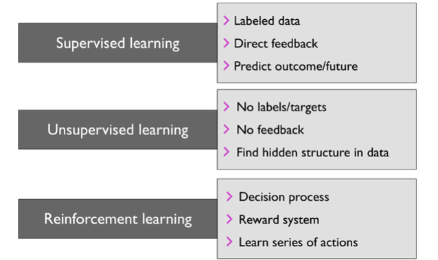
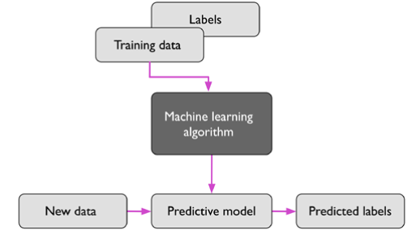
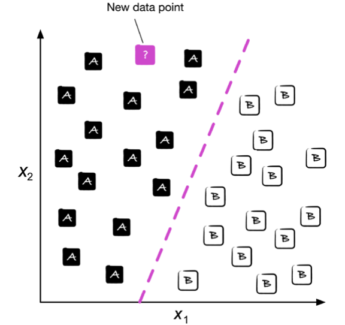
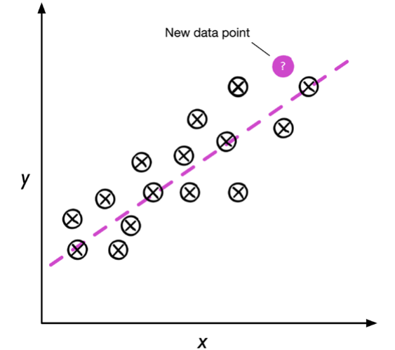
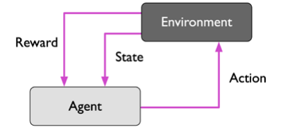
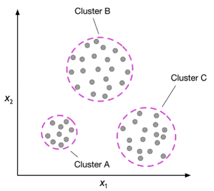
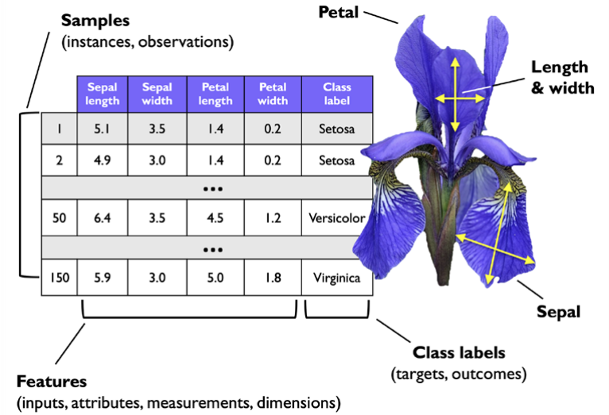
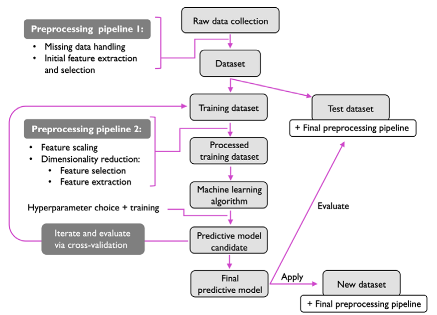

# 从数据中学习

2024-10-17 ⭐
@author Jiawei Mao
***

主要内容：

- 机器学习的基本概念
- 三种学习类型和基本术语
- 机器学习系统的组成
- 安装和配置 Python 进行数据分析和机器学习

## 三类机器学习

- 监督学习（supervised learning）
- 无监督学习（un-supervised learning）
- 强化学习（reinforcement learning）

这三类机器学习算法的特点:

### 监督学习

监督学习的目标是从标记的训练数据中学习一个模型，并能够使用该模型对未来的数据进行预测。这里，**监督**指训练集中样本的期望输出（label）已知。监督学习就是建模输入与 label 之间关系的过程。

下图是典型的监督学习流程：

labels 为离散类别的监督学习，也称为**分类**（classification）；而输出连续值的监督学习，称为**回归**（regression）。

#### 分类

分类是一种监督学习，目的是基于过去的观察结果来预测新样本的 class-label。

下图是一个二分类示例：给定 30 个训练样本，其中 15 个 的 label 为 class-A，15 个的 label 为 class-B。该数据集是二维的，即每个样本都有两个值：$x_1$ 和 $x_2$。现在使用监督学习算法学习图中将 class-A 和 class-B 分开的决策边界（虚线）。然后给定新样本的 $x_1$ 和 $x_2$，判断它属于 class-A 还是 class-B：

在分类问题中，class-label 不限于两个。包含多个 class-labels 的任务称为多分类任务（**multiclass classification**），如手写数字识别。

#### 回归

回归分析（regression analysis）是一种预测连续值的监督学习。

- 预测变量（predictor variable），通常称为 features
- 目标变量（target variable）

下图说明了线性回归的概念，即给定特征变量 $x$，和一个目标变量 $y$，拟合一条直线，使得数据点到直线的距离最小（MSE）：

根据从数据学到的直线的斜率和截距，就可以预测新数据的 target-variable。

### 强化学习

强化学习（reinforcement learning）通过与环境的交互来改善系统性能。有关环境当前状态通常包含一个所谓的 reward-signal，因此可以将强化学习视为一种监督学习。但是，强化学习中这种反馈值不是正确的 label，而是根据 reward 函数评价动作（action）的好坏。通过与环境的互动，agent 可以利用强化学习通过试错来学习到最大化 reward 的一系列 action。

强化学习的一个典型示例是国际象棋。agent 根据棋盘状态（环境）决定一系列动作，而 reward 则可以根据游戏结束时的输赢来定义。

强化学习有许多不同的亚型，不过总的来说，都是 agent 通过与环境的一系列互动来最大化 reward。每个 state 可以与 positive 或 negative reward 关联。强化学习通过选择一系列动作以最大化总的 reward。

### 无监督学习

在监督学习中，我们在训练模型前已经知道正确答案（label 或 target-variable），在强化学习中，我们为 agent 执行的特定 actions 定义了 reward。但是，无监督学习处理的是 unlabeled 数据。无监督学习用于探索数据的结构，以提取有意义的信息。

#### 聚类

聚类（clustering）是一种探索性的数据分析技术，或者说是模式发现技术，用来将一大堆信息组织成有意义的 gorups（clusters）。每个 cluster 包含一组具有一定相似性丹玉其它 cluster 对象不同的对象，所以聚类又称为无监督分类（unsupervised classification）。

下图根据特征 $x_1$ 和 $x_2$ 将 unlabeled 数据分为三个 cluster:

#### 降维

降维（dimensionality reduction）是另一种无监督学习。高维数据（每个样本都包含大量测量值）许多更多存储空间，且影响机器学习算法的计算性能。无监督降维通常用于特征预处理，如消除数据噪音。降维将数据压缩到一个更小的子控件，同时保留大多数相关信息。

降维也可用于数据可视化。例如，将高位特征集投影到 1,2 或 3 维特征空间，从而可以用 2D 或 3D 散点图或直方图可视化。

## 基本术语

下图包含一部分 Iris 数据集，是机器学习中一个经典示例。Iris 数据集包含来自三个不同物种（Setosa, Versicolor, Virginica）的 150 个 Iris 花的测量值。

这里，每个 iris 花对应数据集的一行，每个花的测量值对应一列，称为数据集的特征（feature）：

Iris 数据集包含 150 个样本，4 个 features，可以写为 $150\times 4$ 矩阵，即 $X\in \Reals^{150\times 4}$。

- 上标 $i$ 表示第 i 个样本
- 下标 $j$ 表示训练集的第 j 维

- 训练样本（training example）：数据集中的一行，即一个样本，又称为 observation, record, instance, sample (sample 大多时候表示样本集合)
- 训练（training）：拟合模型的过程
- 特征（feature），数据集中的一个 column。又称 predictor, variable, input,  attribute, covariate 等
- target: 又称为 outcome, output, response variable, dependent variable, (class-)label, ground-truth 等
- loss function: 等价于 cost function。有时也称为 error function。在有些文献中， loss 指单个数据点的 loss 值，cost 是整个数据集的 loss 值（平均或加和）。

## 构建机器学习模型的基本流程

下图是机器学习的典型工作流程：

### 预处理

将数据转换为想要的 shape。

原始数据的形式和 shape 很少能直接用来构建高性能学习算法。因此，数据预处理是机器学习应用中的关键步骤之一。

1. **特征缩放**

许多机器学习算法要求所选 feature 在相同 scale，才能达到最佳性能，通常将 feature 转换到 [0,1] 之间，或者使均值 0、标准差 1 以标准正态分布转换。

2. **降维**

选择的有些 features 可能高度相关，因此在一定程度上有些冗余。此时采用降维技术可以将 features 压缩到较低维度的子空间，而且学习算法运行更快。当数据集包含大量无关特征或噪声（即信噪比低），降维还可能提高模型的预测性能。

3. **训练集和测试集**

为了确定算法不仅在训练集上表现良好，对新数据的泛化性能也好，可以将数据集随机分为单独的训练集和测试集。使用训练集来训练和优化机器学习模型，最后用测试集评估模型性能。

### 模型的训练和选择

目前已有大量机器学习算法用来解决不同的问题。每个算法都有其 bias，没有哪个算法对所有问题都性能最好。在实践中，往往需要比较多种学习算法，以选择最佳性能模型。不过，在比较不同的模型之前，我们首先要决定判断性能的指标（metric）。例如，**分类准确性**，即正确分类 instance 的比例，常用来评价分类模型的性能。

另外，在 cross-validation 技术中，继续将数据集分为 training 和 validation 数据集，以估计模型的泛化性能。

最后，我们不能期望机器学习包提供的不同学习算法的默认参数是最优的，因此，我们还经常需要优化**超参数优化**。

### 评估模型

在训练集上拟合获得模型后，可以使用测试集估计模型在新数据上的性能，即所谓的泛化（generalization error）。

> [!WARNING]
>
> 前面步骤使用的参数，如特征缩放、降维等的参数都是从训练集获得，从而使用相同参数应用于测试集和其它新的样本。

## Python 环境配置

- 使用 scikit-learn 库执行经典机器学习任务：3-11 章
- 使用 PyTorch 库执行深度学习相关任务：从 12 章开始

这本书的前半部分主要使用 NumPy 的多维数组来存储和操作数据，偶尔使用 pandas 读取表格以及执行高级数据操作，并使用 matplotlib 库可视化。

本书使用包的版本：

- NumPy 1.21.2
- SciPy 1.7.0
- Scikit-learn 1.0
- Matplotlib 3.4.3
- pandas 1.3.2

在运行示例代码时如果报错，建议先检查这些包的版本是否一致。