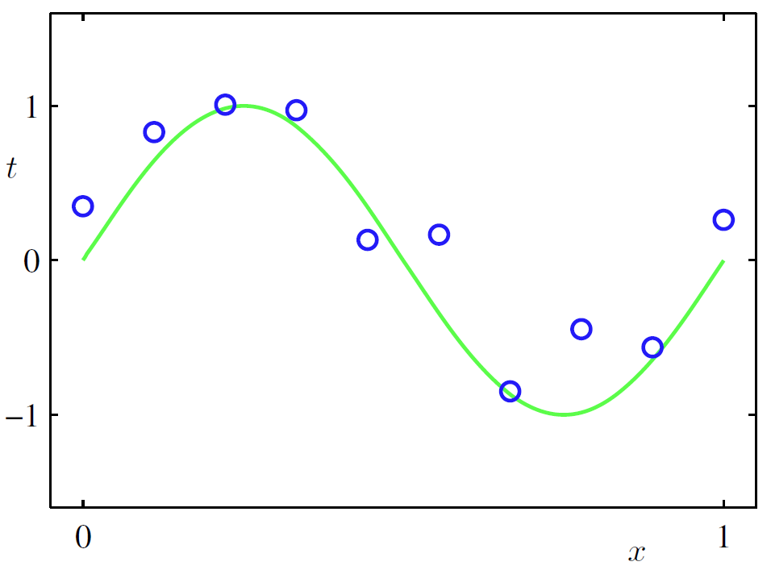
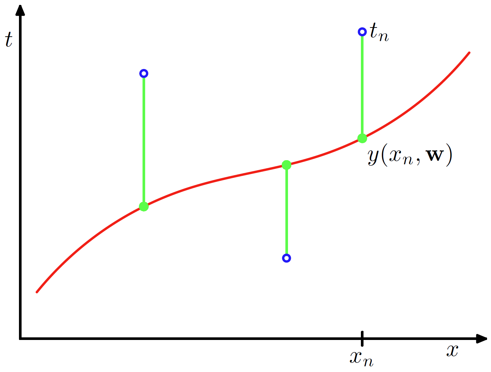
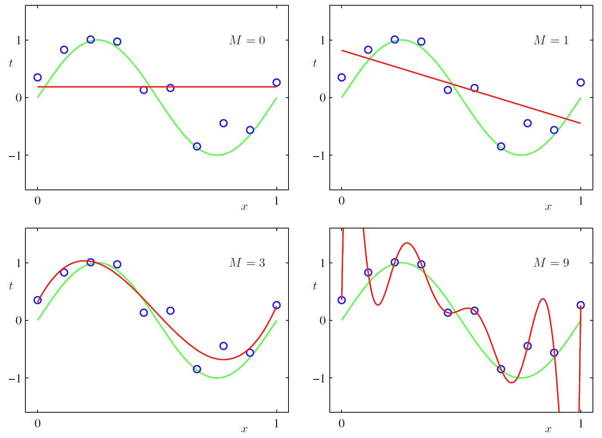
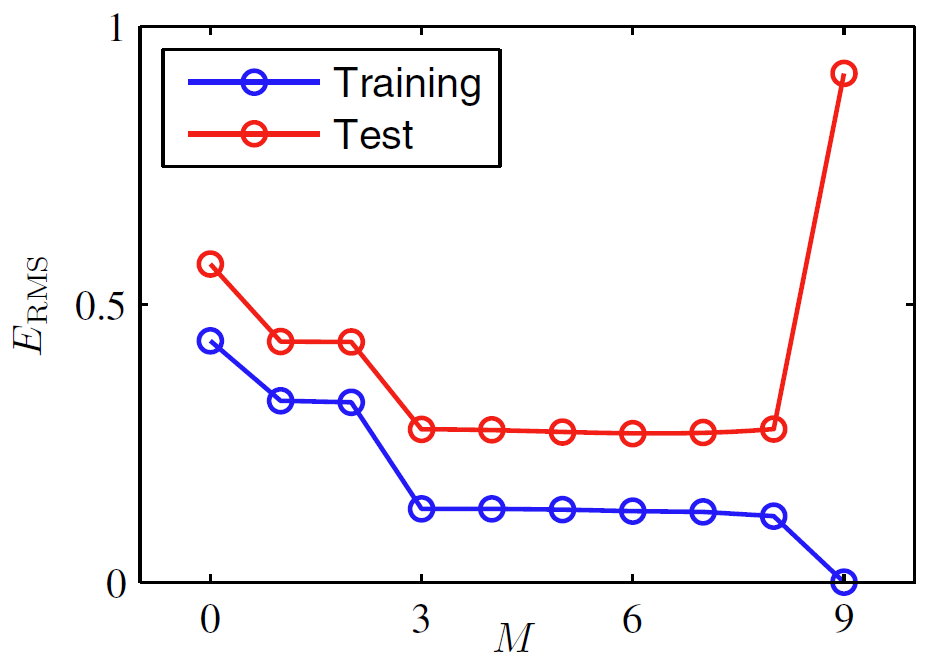
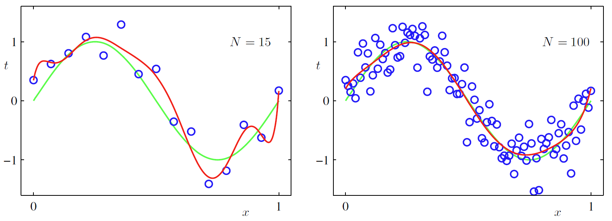
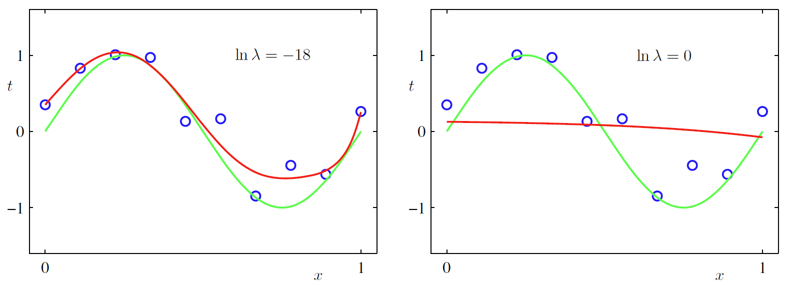
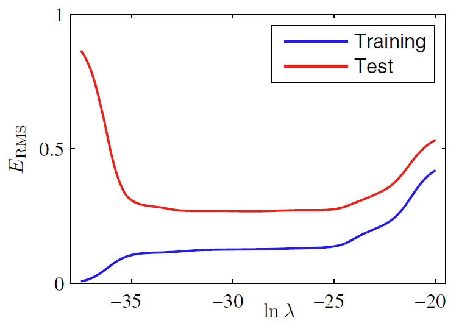

# 1.1 示例：多项式拟合

2023-12-19, 16:48
****

## 简介

下面通过一个简单的回归问题来引入一些关键概念。

假设，现在需要根据实值输入变量 $x$，预测实值目标变量 $t$。这里采用人工合成数据，这样可以知道生成数据的精确过程，以便与学到的模型进行比较。本例的数据由函数 $\sin(2\pi x)$ 生成，并加入随机噪声，具体过程参考[附录 A](../附录A/_数据集.md#合成数据)。

假设生成了一个包含 $N$ 个观测值的训练集 $x$，记为 $\mathbf{x}\equiv (x_1,...,x_N)^T$，以及对应的观测值 $t$，记为 $t\equiv (t_1,...,t_N)^T$。如图 1.2 所示，训练集包含 $N=10$ 个数据：

- 输入数据集 $\mathbf{x}$：$x_n$ 在 [0,1] 之间均匀分布，$n=1,...,N$
- 目标数据集 $\mathbf{t}$：先计算 $\sin(2\pi x)$，然后加上一个小的高斯分布随机噪声

通过这种方式生成的数据，捕获了真实数据集的一个属性：它们既包含我们希望学习的潜在规律性，个别样本也会受随机噪声干扰。这种噪声可能来自本质上随机的过程，如放射性衰变；但更可能来自未被发现的变异因素。

> **图 1.2**：训练集包含 $N=10$ 个点，用蓝色圈表示，每个点包含输入变量 $x$ 和对应的目标变量 $t$。绿色曲线表示用于生成数据的函数 $\sin(2\pi x)$，目标是在不知道绿色曲线的情况下，预测出新 $x$ 对应的 $t$ 值。

我们的目标是利用这个训练集，对新输入 $\hat{x}$，预测其目标值 $\hat{t}$。该问题隐含找出底层函数 $\sin(2\pi x)$ 的需求，从有限数据集推导出该函数很难。此外，观测数据会受噪音干扰，因此，对给定 $\hat{x}$，其对应的 $\hat{t}$ 有一定的不确定性。1.2 节介绍的概率论为精确和定量表达这种不确定性提供了一个框架；1.5 节介绍的决策理论让我们能够利用这种概率表示，以便根据特定标准做出最优预测。

现在，我们使用一种基于曲线拟合的简单方法，使用如下多项式函数拟合数据：

$$
y(x,w)=w_0+w_1x+w_2x^2+...+w_Mx^M=\sum_{j=0}^M w_jx^j \tag{1.1}
$$

其中，$M$ 是多项式的阶数，$x^j$ 表示 $x$ 的 $j$ 次幂。多项式系数 $w_0,...,w_M$ 统称为向量 $\mathbf{w}$。请注意，虽然多项式函数 $y(x,\mathbf{w})$ 是 $x$ 的非线性函数，但它是系数 $\mathbf{w}$ 的线性函数。我们将未知参数是线性的函数称为**线性模型**，在第 3 章和第 4 章会重点讨论。

## 误差函数

多项式系数的值需要通过将多项式拟合到训练数据来确定。该过程可以通过最小化误差函数（*error function*）来实现。对给定系数 $\mathbf{w}$，**误差函数**评估函数 $y(x,\mathbf{w})$ 和训练集之间的差异。数据点 $x_n$ 的预测值 $y(x_n,\mathbf{w})$ 和目标值 $t_n$ 之间误差的平方和，是一个简单而有效的误差函数：

$$
E(\mathbf{w})=\frac{1}{2}\sum_{n=1}^N \{y(x_n,\mathbf{w})-t_n\}^2 \tag{1.2}
$$

系数 $1/2$ 是为了方便微分。本章后面会讨论选择这种误差函数的动机。显然，误差函数是一个非负数，当且仅当函数 $y(x,\mathbf{w})$ 精确地穿过每个训练数据点，它才为 0。平方和误差函数的几何解释如图 1.3 所示。

> **图 1.3**：误差函数（1.2）对应于函数 $y(x,\mathbf{w})$ 中每个数据点位移（绿色垂直线）的平方和的一半。

选择使 $E(\mathbf{w})$ 尽可能小的 $\mathbf{w}$ 值可以解决曲线拟合问题。因为误差函数是系数 $\mathbf{w}$ 的二次函数，它对系数的倒数对 $\mathbf{w}$ 是线性的，所以误差函数的最小化有唯一解，用 $\mathbf{w}^*$ 表示，得到的多项式记为 $y(x,\mathbf{w}^*)$。

## 阶数选择

多项式的阶数 $M$ 的选择是个问题，后面在**模型选择**（model selection）中会详细介绍。图 1.4 展示阶数 $M=0,1,3,9$ 对应多项式拟合图 1.2 数据集的示例。

> **图 1.4**：红线为不同阶数 $M$ 的多项式图，拟合图 1.2 中的数据。

可以看到，常数（$M=0$）和一阶（$M=1$）多项式对数据拟合很差，所以对函数 $\sin(2\pi x)$ 的表示较差。三阶（$M=3$）对图 1.4 中的 $\sin(2\pi x)$ 函数拟合最好。当使用更高阶的多项式（$M=9$），对训练数据拟合极好，事实上，此时多项式正好穿过每个数据点，$E(\mathbf{w}^*)=0$。然而，拟合曲线波动较大，对函数 $\sin(2\pi x)$ 的表示很差，这种行为称为**过拟合**（over-fitting）。

如前所属，我们的目标是实现良好泛化的模型，从而能准确预测新数据。我们可以使用与生成训练集相同的过程来生成一个测试集，稍微修改一下目标值包含的随机噪音，然后使用该数据集来定量评估泛化性能对 $M$ 的依赖性。对每个 $M$ 值，根据式（1.2）同时计算训练集和测试集的 $E(\mathbf{w}^*)$。有时使用均方根误差（root-mean-square, RMS）更方便：

$$
E_{RMS}=\sqrt{2E(\mathbf{w}^*)/N} \tag{1.3}
$$

其中，除以 $N$ 是为了方便比较不同大小的数据集，平方根可以确保 $E_{RMS}$ 与目标变量 $t$ 的尺度和单位相同。不同 $M$ 值下训练集和测试集的均方根误差如图 1.5 所示。测试集误差衡量模型预测新数据 $x$ 的 $t$ 值的准确性。从图 1.5 可以看出，$M$ 值较小时测试集的误差较大，这可以归因于此时多项式不灵活，无法捕获函数 $\sin(2\pi x)$ 中的振荡。$M$ 在 $3\le M \le 8$ 时测试集的误差较小，是对 $\sin(2\pi x)$ 函数的合理表示，如图 1.4 中 $M=3$ 的情况。

> **图 1.5**：不同 $M$ 值训练集和测试集的均方根误差（式 1.3 定义）

当 $M=9$，训练集误差趋于 0，此时多项式自由度为 10，对应于 10 个系数 $w_0,...,w_9$，因此可以精确地调整到完全匹配训练集的 10 个数据。然而，此时测试集的误差变得很大，如图 1.4 所示，此时 $y(x, \mathbf{w}^*)$ 函数剧烈振荡。

这似乎有点矛盾，因为理论上高阶多项式包含低阶多项式的所有情况，因此，$M=9$ 多项式至少能产生与 $M=3$ 多项式一样好的结果；另外，我们可以合理假设新数据的最佳预测模型是生成数据的函数 $sin(2\pi x)$，而 $sin(2\pi x)$ 函数的幂级数展开式正好是包含所有阶的项，所以预期模型会随着 $M$ 的增加而单调提高也挺合理。

通过检查不同阶多项式的系数 $w^*$ 的值，可以对这个问题有所了解，如表 1.1 所示。可以看到，随着 $M$ 增加，系数也随之变大。特别是 $M=9$ 时，通过较大的正数和负数，精确调整系数使得多项式与数据完全匹配，但是在数据点之间，特别是末端，多项式函数振荡较大（图 1.4）。简单来说，$M$ 值越大多项式越灵活，在拟合时也更容易将目标值上的随机噪音拟合进去。

> **表 1.1**：不同阶多项式的系数表 $w*$。可以发现系数的幅度随着多项式阶数的增加而增加。

||$M=0$|$M=1$|$M=6$|$M=9$|
|---|---|---|---|---|
|$w_0^*$|0.19|0.82|0.31|0.35|
|$w_1^*$||-1.27|7.99|232.37|
|$w_2^*$|||-25.43|-5321.83|
|$w_3^*$|||17.37|48568.31|
|$w_4^*$||||-231639.30|
|$w_5^*$||||640042.26|
|$w_6^*$||||-1061800.52|
|$w_7^*$||||1042400.18|
|$w_8^*$||||-557682.99|
|$w_9^*$||||125201.43|

## 数据集大小

训练集大小不同，模型的行为也会不同，如图 1.6 所示。随着数据增加，给定复杂度模型的过拟合问题减弱。换言之，数据集越大，能够适应数据的模型就越复杂（或越灵活）。有一个粗略的估计方法：数据点的数量不应少于模型中自适应参数的某个倍数（如 5 倍或 10 倍）。然而，第 3 章我们会看到，参数数量不一定是衡量模型复杂性的最合适度量。

> **图 1.6**：$N=15$ 个数据点（左图）和 $N=100$ 个数据点（右图），使用 $M=9$ 多项式最小化平方和误差得到的结果图示。可以看到，增加数据集大小可以减少过拟合问题。

根据可用训练集的大小来限制模型的参数量并不合适。根据要解决问题的复杂程度来选择模型的复杂程度更合理。我们将看到，寻找模型参数的最小二乘法是一种特殊的最大似然（1.2.5 节），而过拟合问题可以理解为最大似然（maximum likelihood）的一般性质，采用贝叶斯方法可以避免过拟合问题。从贝叶斯角度看，参数量大大超过数据量的模型完全可行。事实上，贝叶斯模型会根据数据集大小自动调整有效参数量。

## 正则化

在数据集有限时，可以采用**正则化**（regularization）控制过拟合。正则化指在误差函数（1.2）中添加惩罚项，以阻止系数过大，这种惩罚项最简单的形式是所有系数的平方和，得到如下形式的误差函数：

$$
\tilde{E}(w)=\frac{1}{2}\sum_{n=1}^N \{y(x_n,w)-t_n\}^2+\frac{\lambda}{2}\lVert w\rVert^2 \tag{1.4}
$$

其中 $\lVert w\rVert^2\equiv w^Tw=w_0^2+w_1^2+...+w_M^2$，系数 $\lambda$ 决定了正则化项相对误差平方和的权重。请注意，正则化一般省略 $w_0$ 系数，因为包含它会导致结果依赖于目标变量的原点选择（Hastie *et al.*,2001）；或者可以包含它，但是为它单独设置正则化系数（5.5.1 节会详细讨论）。式 1.4 中的误差函数可以精确地最小化。诸如此类的技术在统计中称为收缩方法（*shrinkage*），因为它们减小了系数的值。二次正则化称为**脊回归**（ridge regression, Hoerl and Kennard,1970）。在神经网络中，这种方法称为**权重衰减**（weight decay）。

图 1.7 显示以相同数据集拟合 $M=9$ 多项式的结果，但这次使用正则化误差函数 (1.4)。可以看到，$ln\lambda=-18$ 很好抑制了过拟合，得到一个更接近底层函数 $sin(2\pi x)$ 的表示。但是，如果使用过大的 $\lambda$ 值，将得到较差的拟合，见图 1.7，$ln\lambda =0$ 的情况。拟合多项式的系数如表 1.2 所示，表明正则化按预期减小参数值。

> **图 1.7**：使用 $M=9$ 多项式拟合 图 1.2 中的数据，采用式 1.4 误差函数，左图正则化系数 $\lambda$ 的值为 $ln\lambda=-18$，右图为 $ln\lambda=0$。无正则化，即 $\lambda=0$，对应 $ln\lambda=-\infty$，见图 1.4 右下角。

> **表 1.2**: 采用不同正则化参数 $\lambda$ 拟合 $M=9$ 多项式的 $w^*$ 值。其中 $ln\lambda=-\infty$ 表示无正则化，对应图 1.4 右下角。可以看到，随着 $\lambda$ 增加，系数值呈下降趋势。

||$ln\lambda=-\infty$|$ln\lambda=-18$|$ln\lambda=0$|
|---|---|---|---|
|$w_0^*$|0.35|0.35|0.13|
|$w_1^*$|232.37|4.74|-0.05|
|$w_2^*$|-5321.83|-0.77|-0.06|
|$w_3^*$|48568.31|-31.97|-0.05|
|$w_4^*$|-231639.30|-3.89|-0.03|
|$w_5^*$|640042.26|55.28|-0.02|
|$w_6^*$|-1061800.52|41.32|-0.01|
|$w_7^*$|1042400.18|-45.95|-0.00|
|$w_8^*$|-557682.99|-91.53|0.00|
|$w_9^*$|125201.43|72.68|0.01|

通过绘制训练集和测试集均方根误差（1.3）与 $ln\lambda$ 的关系，可以看出正则化项对泛化误差的影响，如图 1.8 所示。此时 $\lambda$ 控制模型的复杂度，因此决定了过拟合成都 。

> **图 1.8**: $M=9$ 多项式拟合均方根误差（1.3）随 $ln\lambda$ 的变化。

模型的复杂度是一个重要问题，在 1.3 节会详细讨论。这里我们只需注意，如果我们使用最小化误差函数的方法来解决实际问题 ，那么必须找到一种方法来选择合适的模型复杂度。上面已经展示了一种简单方法，即将数据划分为训练集和验证集（也称为 hold-out set），训练集用于确定系数 $w$，验证集用于优化模型复杂度 $M$ 或 $\lambda$。然后，在许多情况下，该方法被证明浪费了宝贵的训练数据，我们需要寻找更好的方法。

到目前为止，我们依靠直觉来讨论多项式曲线拟合问题。现在，我们转到概率论，寻找更合理的方法来解决模式识别问题。概率论除了为本书提供基础外，还可以加深对多项式曲线拟合中介绍的一些概念的理解，并将这些概念扩展到更复杂的情况。
