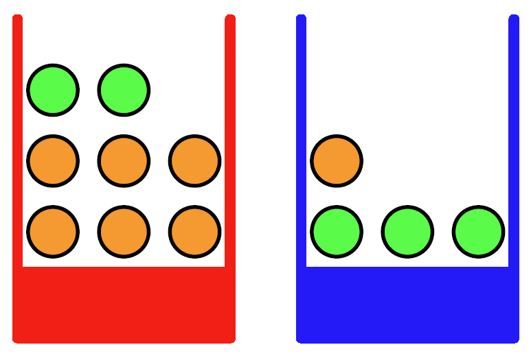
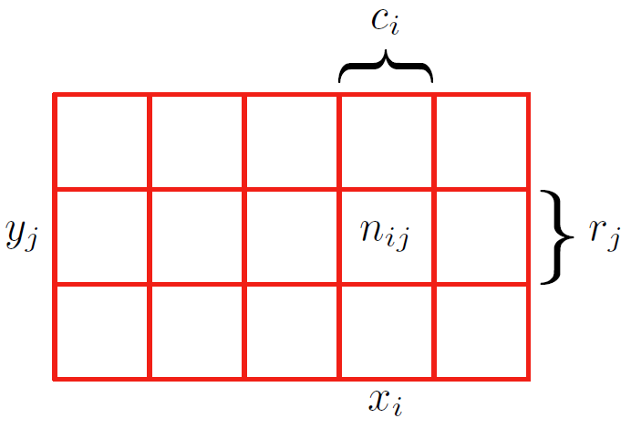
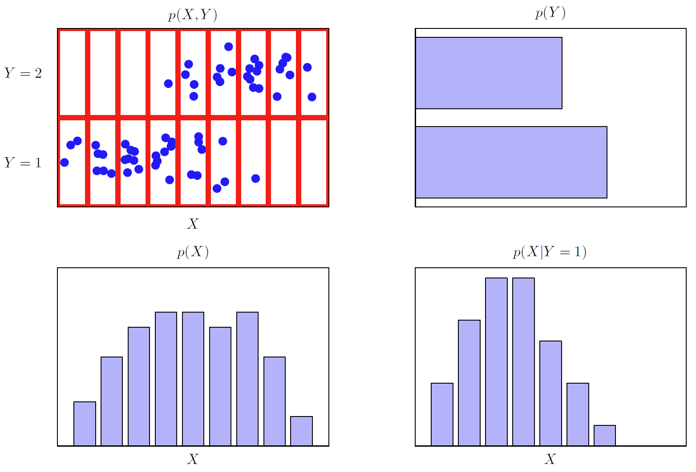
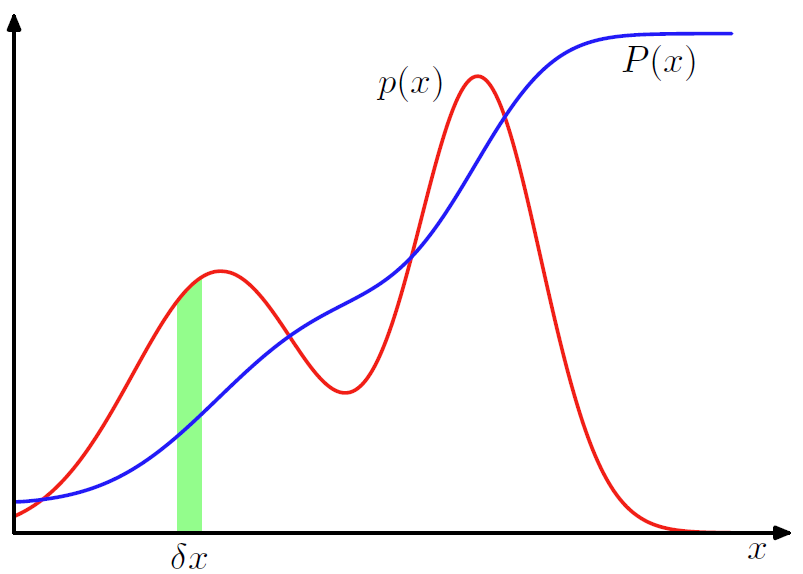

# 1.2 概率论

- [1.2 概率论](#12-概率论)
  - [简介](#简介)
  - [概率密度](#概率密度)
  - [期望和方差](#期望和方差)
  - [贝叶斯概率](#贝叶斯概率)
  - [高斯分布](#高斯分布)
  - [曲线拟合](#曲线拟合)
  - [贝叶斯曲线拟合](#贝叶斯曲线拟合)

2023-12-19, 17:36
***

## 简介

模式识别的一个核心概念是不确定性。不确定性的来源包括数据的测量噪音、数据集大小有限等。概率论为不确定性的量化和操作提供了同意框架，并形成了模式识别的核心基础。与 1.5 节讨论的决策论相结合，就能在给定情况下做出最佳预测，即使信息不完整或模糊。

下面通过一个简单的例子来介绍概率论的基本概念。假设有两个筐，一个红色，一个蓝色，红筐里有 2 个苹果，6 个橙子；蓝筐里有 3 个苹果和 1 个橙子，如图 1.9 所示。现在，随机选择一个筐，然后从筐里随机选择一个水果，记下水果种类后放回原筐，重复该过程。假设选择红筐的概率为 40%，选择蓝筐的概率为 60%；选择任何一种水果的概率相同。

> **图 1.9** 两个装有水果的筐，筐里绿色是苹果，橘色是橙子。

在该示例中，被选中的筐类型是一个随机变量，记为 $B$，可能取值包括 $r$ (红筐)和 $b$ (蓝筐)。类似的，被选中的水果也是一个随机变量，记为 $F$，可能取值包括 $a$ (苹果)和 $o$ (橙子)。

我们将一个**事件的概率**定义为在试验次数趋于无穷时，该事件发生的次数占总试验次数的比例。因此，选中红筐的概率为 $4/10$，选中蓝筐的概率为 $6/10$，记为 $p(B=r)=4/10$，$p(B=b)=6/10$。根据定义，概率必须在 [0,1] 区间内。对互斥事件，如果他们包含所有可能结果，那么它们的概率和为 1。

现在我们想知道，选中一个苹果的概率是多少？假设我们选中了一个橘子，那么选的是蓝筐的概率是多少？当我们掌握概率的**加和规则**和**乘积规则**，就可以回答诸如此类的问题，以及模式识别问题中更复杂的问题。

为了推导概率规则，如图 1.10 所示，设有两个随机变量 $X$ 和 $Y$（类比上面的筐和水果），$X$ 可以取值 $x_i$，其中 $i=1,...,M$；$Y$ 可以取值 $y_j$, $j=1,...L$。共试验 $N$ 次，同时对变量 $X$ 和 $Y$ 进行采样，并设得到 $X=x_i$, $Y=y_j$ 的实验次数为 $n_{ij}$，$X$ 取值 $x_i$ 的试验次数为 $c_i$，$Y$ 取值 $y_j$ 的试验次数为 $r_j$。

> **图 1.10** 随机变量 $X$ 取值 $\{x_i\}$，其中 $i=1,...,M$，随机变量 $Y$ 取值 $\{y_j\}$，其中 $j=1,...,L$，这里 $M=5$, $L=3$。下面使用这两个变量推导概率的加和与乘积规则。如果这些变量的实例总数为 $N$，用 $n_{ij}$ 表示 $X=x_i$, $Y=y_j$ 的实例数，$n_{ij}$ 是对应单位格中样本数。第 $i$ 列对应 $X=x_i$ 的点，数据点数用 $c_i$ 表示，第 j 行对应 $Y=y_j$，数据点数用 $r_j$ 表示。

$X$ 取值 $x_i$, 且 $Y$ 取值 $y_j$ 的概率记为 $p(X=x_i,Y=y_j)$，称为 $X=x_i$ 和 $Y=y_i$ 的联合概率。其值是落在单元格 $i,j$ 的点数相对总点数的比例：

$$
p(X=x_i,Y=y_i)=\frac{n_{ij}}{N} \tag{1.5}
$$

这里隐式考虑极限 $N\to \infty$。类似地，不考虑 $Y$ 值，$X$ 取 $x_i$ 的概率 $p(X=x_i)$ 为第 $i$ 列点数相对总点数的比例：
$$
p(X=x_i)=\frac{c_i}{N} \tag{1.6}
$$
因为图 1.10 中第 $i$ 列的点数是该列每个单元格中点数的加和，所以 $c_i=\sum_j n_{ij}$，从 (1.5) 和（1.6）得出：
$$
p(X=x_i)=\sum_{j=1}^L p(X=x_i,Y=y_j) \tag{1.7}
$$
这就是**概率加和**规则。$p(X=x_i)$ 有时也称为边际概率（marginal），因为它通过对其它变量求和（或边缘化）得到。

当 $X=x_i$ 时，$Y=y_j$ 的概率记为 $p(Y=y_j|X=x_i)$，称为给定 $X=x_i$ 时 $Y=y_j$ 的条件概率：

$$
p(Y=y_j|X=x_i)=\frac{n_{ij}}{c_j} \tag{1.8}
$$

从（1.5）（1.6）和（1.8），可以推导出如下关系：

$$
\begin{aligned}
p(X=x_i,Y=y_j)&=\frac{n_{ij}}{N}=\frac{n_{ij}}{c_i}\cdot\frac{c_i}{N}\\
&=p(Y=y_j|X=x_i)p(X=x_i)
\end{aligned} \tag{1.9}
$$

这就是概率的**乘法规则**。

到目前为止，我们非常小心地区分随机变量和随机变量可以取的值。虽然这有助于避免歧义，但标记起来很麻烦。后面，在不引起歧义的情况下，我们直接用 $p(B)$ 表示随机变量 $B$ 的分布，用 $p(r)$ 来表示随机变量取特定值 $r$ 时的分布。

有了这个更紧凑的表示方法，下面把概率论的两个基本规则写成如下形式。

**加法定理：**
$$
p(X)=\sum_Y p(X,Y) \tag{1.10}
$$

**乘法定理：**
$$
p(X,Y)=p(Y|X)p(X) \tag{1.11}
$$

这里，$p(X,Y)$ 是联合概率，表述为 $X$ 和 $Y$ 同时发生的概率；$p(Y|X)$ 为条件概率，表述为给定 $X$ 时 $Y$ 的概率；$p(X)$ 为边缘概率，直接表述为 $X$ 的概率。这两个简单的规则构成了本书所有概率机制的基础。

根据乘法定理，结合对称性 $p(X,Y)=p(Y,X)$，可以得到条件概率之间的关系式：

$$
p(Y|X)=\frac{p(X|Y)p(Y)}{p(X)} \tag{1.12}
$$

这就是**贝叶斯定理**，它是模式识别和机器学习的核心之一。根据加法定理，贝叶斯定理中的分母可以用分子中出现的量来表示：

$$
p(X)=\sum_Y p(X|Y)p(Y) \tag{1.13}
$$

我们可以将贝叶斯定理中的分母看作将式（1.12）左侧条件概率对所有 $Y$ 求和为 1 所需的归一化常数。

图 1.11 展示了两个变量的联合分布，以说明边缘分布和条件分布的概念。这里从联合分布中抽取了 $N=60$ 个样本。右上图是包含两个 $Y$ 值样本比例的直方图。从概率的定义来讲，这些比例在 $N\to \infty$ 时等于对应的概率 $p(Y)$。因此，在从分布抽样有限点的情况下，我们可以将直方图看作对概率分布进行建模的一种简单方法。根据数据建模分布是统计模式识别的核心，是本书要详细探讨的内容。图 1.11 中余下两个子图显示了 $p(X)$ 和 $p(X|Y=1)$ 的直方图。

> **图 1.11** 两个变量的分布示意图。变量 $X$ 有 9 个可选值，$Y$ 有 2 个可选值。左上角是从这两个变量的联合概率分布中抽取 60 个样本。其余图显示了边缘分布 $p(X)$ 和 $p(Y)$，以及与左上下面一行对应的条件概率分布 $p(X|Y=1)$。

回到筐装水果的例子。选择红筐和蓝筐的概率分别为：
$$
p(B=r)=4/10 \tag{1.14}
$$

$$
p(B=b)=6/10 \tag{1.15}
$$

它们满足 $p(B=r)+p(B=b)=1$。

现在随机选一个筐，结果是蓝筐。那么选中一个苹果的概率是蓝筐中苹果的比例 $3/4$，所以 $p(F=a|B=b)=3/4$。事实上，我们可以写出给定筐，抽到特定水果的 4 个条件概率：

$$
p(F=a|B=r)=1/4 \tag{1.16}
$$

$$
p(F=o|B=r)=3/4 \tag{1.17}
$$

$$
p(F=a|B=b)=3/4 \tag{1.18}
$$

$$
p(F=o|B=b)=1/4 \tag{1.19}
$$

可以发现，这些概率是归一化的，即：

$$
p(F=a|B=r)+p(F=o|B=r)=1 \tag{1.20}
$$

$$
p(F=a|B=b)+p(F=o|B=b)=1 \tag{1.21}
$$

现在，可以使用加法定理和乘法定理计算抽到苹果的总概率：

$$
\begin{aligned}
p(F=a)&=p(F=a|B=r)p(B=r)+p(F=a|B=b)p(B=b)\\
&=\frac{1}{4}\times\frac{4}{10}+\frac{3}{4}\times\frac{6}{10}=\frac{11}{20}
\end{aligned} \tag{1.22}
$$

根据加法定理，$p(F=o)=1-11/20=9/20$。

假设我们被告知有一个水果被选中了，是一个橙子，我们想知道它是从哪个筐里选出来的。这需要以水果为条件来评估不同框的概率，式（1.16）-（1.19）是给定筐选中水果的条件概率。我们可以利用贝叶斯定理解决条件反转问题：

$$
p(B=r|F=o)=\frac{p(F=o|B=r)p(B=r)}{p(F=o)}=\frac{3}{4}\times\frac{4}{10}\times\frac{90}{9}=\frac{2}{3} \tag{1.23}
$$

根据加法定理，$p(B=b|F=o)=1-2/3=1/3$。

我们对贝叶斯定理作如下解释。通过统计或经验获得的概率值称为**先验概率**（*prior probability*），如选择不同筐的概率 $p(B)$，在得到水果之前就知道该概率。在被告知抽到的是橙子，就可以用贝叶斯定理计算概率 $p(B|F)$，称之为**后验概率**（*posterior probability*），因为它们是我们观察到 $F$ 后得到的概率。注意，在这个例子中，选择红筐的先验概率是 $4/10$，所以我们更可能选择蓝筐而不是红筐。然而，一旦我们观察到抽到的水果是橙子，此时发现是红筐的后验概率是 $2/3$，所以现在我们选择红框的可能性更大。这个结果与直觉一致，因为红筐里橙子的比例比蓝筐里高，所以观察到水果是橙子这一事实提供了支持红筐的证据。该证据足够有力，压制先验概率，说明选中红筐比蓝筐的可能性大。

最后，我们注意到，如果两个变量的联合分布可以分解成边缘概率的成绩，即 $p(X,Y)=p(X)p(Y)$，那么就称 $X$ 和 $Y$ 独立。根据乘法定理，可以得到 $p(Y|x)=p(y)$，因此给定 X 的 Y 的条件分布独立于 X 的值。例如，在水果筐的例子中，如果每个筐包含相同比例的苹果和橙子，那么 $p(F|B)=p(F)$，即选择苹果的概率与选择哪个筐无关。

## 概率密度

除了在离散事件集合上定义概率外，我们还希望考虑连续变量的概率。对实值变量 $x$，如果当 $\delta x\to 0$，$x$ 在区间 $(x,x+\delta x)$ 的概率为 $p(x)\delta x$，就称 $p(x)$ 为 $x$ 的概率密度，如图 1.12 所示。$x$ 在区间 $(a,b)$ 的概率为：

$$
p(x\in (a,b))=\int_a^b p(x)dx \tag{1.24}
$$

> **图 1.12** 离散变量的概率可以推广到连续变量 $x$ 上的概率密度 $p(x)$，使得 $x$ 在区间 $(x,x+\delta x)$ 内的概率在 $\delta x \to 0$ 时为 $p(x)\delta x$。概率密度可以表示为累计分布函数 $P(X)$ 的导数。

因为概率是非负的，而且 $x$ 必然位于实轴某个位置，所以概率密度 $p(x)$ 必须满足两个条件：

$$
p(x)\ge 0 \tag{1.25}
$$

$$
\int_{-\infty}^{\infty}p(x)dx=1 \tag{1.26}
$$

在变量的非线性变化下，由于雅克比（Jacobian）因子的存在，概率密度的变换与简单函数不同。例如，考虑变量 $x=g(y)$ 的变化，那么函数 $f(x)$ 变成 $\tilde{f}(y)=f(g(y))$。现在考虑概率密度 $p_x(x)$ 对新变量 $y$ 的密度 $p_y(y)$，落在 $(x,x+\delta x))$ 的观测值可以转换为 $(y,y+\delta y)$，其中 $p_x(x)\delta x\simeq p_y(y)\delta y$，因此

$$
\begin{aligned}
p_y(y)&=p_x(x)\lvert\frac{dx}{dy}\rvert \\
&=p_x(g(y))\lvert g'(y)\rvert   
\end{aligned} \tag{1.27}
$$

该性质导致概率密度的最大值取决于变量的选择。

$x$ 在区间 $(-\infty,z)$ 的概率定义为累计分布函数：

$$
P(z)=\int_{-\infty}^z p(x)dx \tag{1.28}
$$

该函数满足 $P'(x)=p(x)$，如图 1.12 所示。

如果我们有多个连续变量 $x_1,...,x_D$，用向量 $\mathbf{x}$ 表示，那么我们可以定义一个联合概率密度 $p(\mathbf x)=p(x_1,...,x_D)$，使得 $\mathbf x$ 落在包含点 $\mathbf x$ 的无限小空间 $\delta\mathbf x$ 中的概率为 $p(\mathbf x)\delta \mathbf x$。这个多元概率密度必须满足

$$
p(\mathbf{x})\ge 0 \tag{1.29}
$$

$$
\int p(\mathbf{x})d\mathbf{x}=1 \tag{1.30}
$$

其中，积分在整个 $\mathbf x$ 空间上。这里也可以考虑离散变量和连续变量组合的联合概率分布。

注意，如果 x 是离散变量，$p(x)$ 也被称为概率质量函数（*probability mass function*）。

概率的加和与乘积规则，以及贝叶斯定理，同样适用于概率密度的情况，以及离散变量和连续变量组合的情况。例如，如果 x 和 y 是两个实数变量，则概率加和与乘积规则的形式为

$$
p(x)=\int p(x,y)dy \tag{1.31}
$$

$$
p(x,y)=p(y|x)p(x) \tag{1.32}
$$

连续变量的加和与乘积规则的正式证明（Feller,1966）需要度量理论（measure theory），超出本书范围。不过，通过将每个实变量划分为宽度为 $\Delta$ 区间，然后考虑这些区间上的离散概率分布，也可以非正式地看出其有效性。

## 期望和方差

## 贝叶斯概率

## 高斯分布

## 曲线拟合

## 贝叶斯曲线拟合
