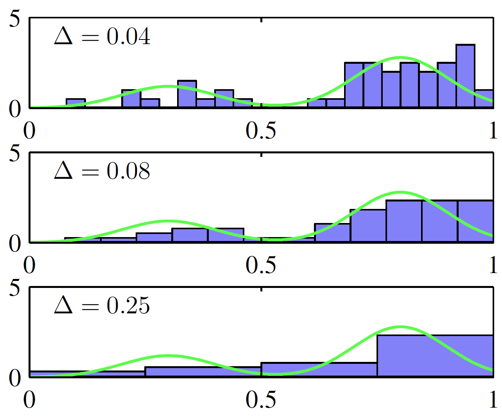

# 2.5 非参方法

- [2.5 非参方法](#25-非参方法)
  - [简介](#简介)
  - [直方图](#直方图)
  - [核密度估计](#核密度估计)
  - [近邻方法](#近邻方法)

2023-12-20, 15:05
@author Jiawei Mao

****

## 简介

本章我们集中讨论了如何使用概率分布：这些概率分布具有特定的函数形式，由少量参数控制，参数值可以根据数据集确定。这种方法称为**参数化**密度建模。参数化建模的一个主要限制是，如果所选密度函数与生成数据的分布不匹配，会得到很差的模型，预测性能自然也差。例如，如果生成数据的分布是多模态的，那么用高斯分布肯定无法拟合好。

在这最后一节，我们介绍一些非参数密度估计方法，这类方法对分布形式做了很少假设。

## 直方图

先从单变量 $x$ 的密度估计直方图开始讨论。标准直方图将 $x$ 划分为宽度为 $\Delta_i$ 的不同 bins，然后统计每个 bin $i$ 中 $x$ 的个数 $n_i$。将计数 $n_i$ 除以样本总数 $N$ 和 bin 宽度 $\Delta_i$ 得到归一化概率密度，：

$$
p_i=\frac{n_i}{N\Delta_i} \tag{2.241}
$$

显然 $\int p(x)dx=1$。密度模型 $p(x)$ 在每个 bin 宽度中保持不变，并且通常设置每个 bin 的宽度相同 $\Delta_i=\Delta$。

> **图 2.24** 直方图密度估计示意图：从绿色曲线所示分布生成 50 个数据点。基于公式（2.241），采用不同 bin 宽度 $\Delta$。

图 2.24 展示了一个直方图密度估计的示例。其中数据是从绿色曲线所示分布中抽样所得，该分布为两个高斯分布混合而成。显示了三个不同 bin 宽度对应的密度估计。可以看出：

- 当 $\Delta$ 很小（上图），所得密度模型很尖锐，很多结构与生成数据集的底层分布模型不匹配。
- 当 $\Delta$ 很大（下图），得到一个过于光滑的模型，无法捕获绿色曲线的双峰特性。
- $\Delta$ 取值合适（中图），得到最好的结果。

理论上，直方图密度模型也依赖于 bin 边缘位置的选择，不过该值远没有 $\Delta$ 重要。

!!! note
    计算完直方图后，数据集本身可以丢弃，如果数据集很大，这是有益的；此外，如果数据点是按顺序输入，就很容易计算直方图。

在实践中，直方图可用于在一个或两个维度中快速可视化数据，但不适合大多数密度估计应用：

- 一个明显的问题是，直方图在 bin 边缘不连续，这与生成数据的分布不一致。
- 直方图的另一个局限性是维度缩放性。如果将 $D$ 维空间中的每个变量都分为 M 个 bins，则 bins 总数为 $M^D$。与 $D$ 成指数关系，是典型的维度诅咒，在高维度空间中，提供有意义的局部概率密度估计所需数据量难以想象。

总的来说，对密度估计，从直方图可以学习到两点：

1. 为了估算特定位置的概率密度，需要考虑该点附近的点。

说到"附近"，就涉及距离的概念，大多时候我们采用欧几里得距离。而直方图由 bin 宽度定义距离。另外，局部空间的范围对应平滑参数，也由 bin 宽度定义。

2. 平滑参数的值不宜太大，也不应太小。

如前所述，bin 太大会丢失信息，bin 太小平滑性太差。

## 核密度估计

假设从未知 $D$ 维欧几里得空间的概率密度 $p(x)$ 进行抽样，现在希望根据抽取的样本估计 $p(x)$。先考虑包含 $\mathbf{x}$ 的局部区域 $R$。该区域的概率质量为：

$$
P=\int_R p(x)dx \tag{2.242}
$$

假设我们从 $p(x)$ 抽取了 $N$ 个样本。显然，每个样本落在 $R$ 内的概率为 $P$，因此 $R$ 内的样本个数 $K$ 服从二项分布：

$$
Bin(K|N,P)=\frac{N!}{K!(N-K)!}P^K(1-P)^{1-K} \tag{2.243}
$$

根据式（2.11），落在 $R$ 区域内的点平均比例为 $E[K/N]=P$，根据式（2.12），围绕该均值的方差为 $var(K/N)=P(1-P)/N$。当 N 很大，分布会在均值附近达到峰值，并且：
$$
K\simeq NP \tag{2.244}
$$
如果假设区域 $R$ 足够小，概率密度 $p(x)$ 在该区域大致恒定，那么
$$
P\simeq p(x)V \tag{2.245}
$$
其中 $V$ 是 $R$ 的体积。结合式（2.244）和（2.245），得到密度估计
$$
p(x)=\frac{K}{NV}\tag{2.246}
$$
注意，式（2.246）的有效性取决于两个互相矛盾的假设，即区域 $R$ 足够小，使得该区域上的概率密度近似为常数；但又足够大（相对密度值），使得落在该区域内的点的数量足以使二项分布迅速达到峰值。

我们可以用两种不同的方式利用式（2.246）：

- 方式一，固定 $K$ 然后从数据确定 $V$ 值，这就产生了稍后讨论的 **K 近邻**方法；
- 方式二，固定 $V$ 然后从数据确定 $K$，产生了**核方法**。

可以证明，如果 V 随着 N 适当收缩，K 随着 N 增加，K 近邻密度估计和核密度估计在 $N\to \infty$ 时收敛于真实概率密度（Duda and Hart,1973）。

我们首先讨论核方法。设 $\mathbf x$ 是我们想确定概率密度的点，区域 $R$ 是以 $\mathbf x$ 为中心的小超立方体。为了计算落在该区域的点的个数 $K$，定义如下函数

$$
k(\mathbf{u})=\begin{cases}
1, &\lvert u_i\rvert \le 1/2, \quad i=1,...,D\\
0, &\text{otherwise} 
\end{cases} \tag{2.247}
$$

表示以原点为中心的单位立方体。函数 $k(\mathbf u)$ 就是一种**核函数**，对这种情况也称为 *Parzen* 窗口。从式（2.247），如果数据点 $x_n$ 位于以 $x$ 为中心边为 $h$ 的立方体内，则 $k((\mathbf x-\mathbf{x}_n)/h)$ 为 1，否则为 0。因此，位于该立体方体内的数据点数为：

$$
K=\sum_{n=1}^N k(\frac{\mathbf{x}-\mathbf{x}_n}{h}) \tag{2.248}
$$

将该式代入式（2.246），得到 $\mathbf{x}$ 处估计密度

$$
p(\mathbf{x})=\frac{1}{N}\sum_{n=1}^N\frac{1}{h^D}k(\frac{\mathbf{x}-\mathbf{x}_n}{h}) \tag{2.249}
$$

这里用 $V=h^D$ 表示边为 $h$ 的超立方体在 D 维中的体积。利用函数 $k(\mathbf u)$ 的对称性，可以重新解释这个方程，不是以 $\mathbf x$ 为中心的单个立方体，而是以 $N$ 个数据点 $\mathbf{x}_n$ 为中心的 $N$ 个立方体的和。

就目前而言，核密度估计器（2.249）会遇到直方图方法同样的一个问题，即在立方体边界处存在人为的不连续。如果选择一个更平滑的核函数，可以得到一个更平滑的密度模型，一个常见选择是高斯函数，对应如下核密度模型：

$$
p(x)=\frac{1}{N}\sum_{n=1}^N\frac{1}{\sqrt{2\pi h^2}}exp\{-\frac{\lVert \mathbf{x}-\mathbf{x}_n\rVert^2}{2h^2}\} \tag{2.250}
$$

其中 $h$ 表示高斯分布的标准差。所以，我们在每个数据点上放置一个高斯分布，然后将整个数据集的贡献加起来，除以 $N$，就获得归一化密度。在图 2.25，我们将模型（2.250）应用于之前展示直方图的数据集。可以看到，参数 $h$ 起到平滑参数的作用，$h$ 小对噪音敏感，$h$ 大则过度平滑，需要在这两者之间权衡。类似于直方图密度估计中的 bin 宽度，多项式拟合中的自由度，$h$ 的优化是一个较复杂的问题。

> **图 2.25** 核密度模型（2.250）应用于直方图方法图 2.24 数据的示意图。平滑参数 $h$ 太小（上图） 得到一个非常嘈杂的密度模型，太大（下图）会丢失底层分布（绿色曲线所示）的双峰性质，取中间值（中图）得到最佳密度模型。

对式（2.249）中的核函数 $k(\mathbf{u})$，我们可以选择任何满足如下条件的函数

$$
k(\mathbf{u}) \ge 0 \tag{2.251}
$$

$$
\int k(\mathbf{u})d\mathbf{u}=1 \tag{2.252}
$$

 即保证得到的概率分布在任何位置都是非负，且积分为 1。式（2.249）给出的这类密度模型称为核密度估计（*kernel density estimator*）或 *Parzen* 估计。该方法有个优点，即在"训练"阶段不涉及计算，只需要存储训练集。不过，这是它的一大弱点，评估密度的计算成本与数据集的大小呈线性增长关系。

## 近邻方法

使用核方法进行密度估计的难点之一是控制核宽度的参数 $h$ 对所有核都是固定的。在数据密度高的区域，较大的 $h$ 可能会导致过度平滑，使得原本可以从数据提取出的结构丢失。然而，减少 $h$ 可能导致数据空间中密度较小的地方受噪音干扰。因此，$h$ 的最佳选择可能依赖数据空间中的位置。这个问题可以通过最近邻密度估计解决。

回到局部密度估计的一般式（2.246），不像核密度固定 $V$ 并根据数据确定 $K$，这里我们固定 $K$ 并根据数据确定 $V$。假设 $\mathbf x$ 是要估计概率密度 $p(x)$ 的点，考虑以 $\mathbf x$ 为中心的小球体，增大半径直到它包含 K 个数据点。密度 $p(\mathbf{x})$ 的估计值由（2.246）给出，$V$ 为所得球体的体积。这种技术称为 **K 最近邻**（*K nearest neighbors*, kNN），如图 2.26 所示，使用与图 2.24 与 2.25 相同的数据集，参数 $K$ 取不同值的效果。$K$ 值决定了平滑程度，存在一个不大不小的最优值。注意，由 kNN 生成的模型不是一个真正的密度模型，因为整个空间的积分是发散的。

> **图 2.26** 使用与图 2.24 和 2.25 相同数据集应用 k 近邻密度估计的示意图。可以看到，参数 $K$ 控制了平滑程度，$K$ 值太小会导致密度模型非常嘈杂（上图）；$K$ 值太大会丢失真是分布的双峰性质。

下面通过展示如何将用于密度估计的 kNN 技术扩展到分类问题来结束本章。为此，我们对每个类别分别应用 K 近邻密度估计技术，然后使用贝叶斯定理。假设我们有一个数据集，类别 $C_k$ 包含 $N_k$ 个点，共有 N 个点，因此 $\sum_kN_k=N$。如果希望对一个新点 $\mathbf{x}$ 进行分类，我们画一个以 $\mathbf{x}$ 为中心的球，使该球正好包含 $K$ 个点。假设这个球的体积为 $V$，包含 $K_k$ 个类别 $C_k$ 的点。式（2.246）提供了与每个类别相关的密度估计

$$
p(\mathbf{x}|C_k)=\frac{K_k}{N_kV}\tag{2.253}
$$
类似地，非条件密度为
$$
p(\mathbf{x})=\frac{K}{NV}\tag{2.254}
$$
而类的先验概率为：
$$
p(C_k)=\frac{N_k}{N}\tag{2.255}
$$
使用贝叶斯定理结合（2.253）（2.254）和（2.255）获得后验概率
$$
p(C_k|\mathbf{x})=\frac{p(\mathbf{x}|C_k)p(C_k)}{p(\mathbf{x})}=\frac{K_k}{K} \tag{2.256}
$$
如果我们希望最小化分类错误的概率，可以通过将测试点 $x$ 的类别分配为后验概率最大的类别 $K_k/K$。因此，为了对新点进行分类，我们从训练数据集中找出最近的 K 个点，然后将新点的类别分配为这 K 个点中个数最多的类别。$K=1$ 的特殊情况被称为最近邻规则（*nearest-neighbor*），因为测试点被简单地分配为与训练集中最近点相同的类别。如图 2.27 所示。

> **图 2.27** （a）在 K 近邻分类中，新点（黑色菱形）的类别为靠近新点最近 K 个训练数据中点数最多的类别，这里 $K=3$。（b）在最近邻（$K=1$） 分类中，决策边界由形成不同类别的训练数据的垂直平分线的超平面组成。

图 2.28 展示了 K 近邻算法用于第 1 章中介绍的 oil-flow 数据的分类结果。可以看到，K 值控制了平滑程度，K 值小会为每个类别产生许多小区域，K 值大对应少出大的区域。

> **图 2.28** 绘制 oil 数据集的 200 个数据点，y 轴为 $x_7$，x 轴为 $x_6$，其中红、绿、蓝对应 'laminar', 'annular' 和 'homogeneous' 类别。并显示不同 K 值 kNN 算法给出的输入空间类别。

最近邻（$K=1$）分类有一个有趣的性质：在 $N\to \infty$ 时，其错误率永远不会超过最优分类器可实现最小错误率的两倍，即使用真实分配的分类器（Cover and Hart, 1967）。

K 近邻和核密度都需要存储整个训练集，如果训练集很大，会导致计算量很大。这种影响可以通过构建基于树的搜索结构来抵消，而无需对数据集进行详尽的搜索。然而，这些非参数方法仍然有严重限制。另一方面，我们知道简单的参数模型所能表示的分布形式非常有限。因此，我们需要找到非常灵活的密度模型，并且模型的复杂性可以独立于训练集的大小进行控制。后面会讨论如何实现这一点。
