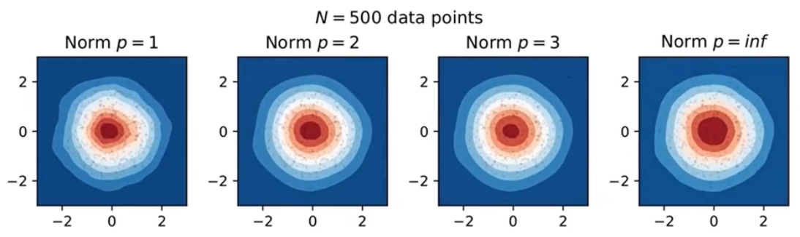

# 核密度估计

2025-03-03 ⭐
***
## 什么是核密度估计

在统计学中，核密度估计（Kernel Density Estimation, KDE）是一种非参数化方法，用于估计随机变量的概率密度函数。

在每个数据点 $x_i$，放一个核函数 $K$，将这些核函数加起来，就得到核密度估计：
$$
\hat{f}(x)=\frac{1}{N}\sum_{i=1}^N K(x-x_i)
$$


核密度估计从样本估计概率密度。

## 核的选择

核函数 $K$ 一般满足：

1. 非负性：$K(x)\ge 0$，概率总是非负数

2. 对称性：$K(x)=K(-x)$，在数据左边或右边，不影响概率值

3. 递减性：对 $x>0$，$K'(x)\le 0$，当远离数据点时，核函数值趋近于 0


不是必须要满足这三个条件，不过在大多数情况下，这样的核函数更能满足我们的需求。

核函数可以分为有界和无界，如:

- 上图中 Gaussian 核没有边界约束，随着 x 增大或减少，它会无限趋近于 0，但不会等于 0
- Box, Tri 和 Triweight 核都有边界约束，超过一定范围，它们的值都为 0

**三角核**（*triangular kernel*），也称为线性核：
$$
f(x)\propto max(1-|x|,0)
$$


可以发现，三角核远没有高斯核平滑，但是，**核的选择其实并没有那么重要**，不管选择什么核，最终应用的效果差不多，通常用**高斯核**就可以了。

## bandwidth

核的选择不是那么重要，但 bandwidth 的选择非常重要。我们用 $h$ 控制 $\hat{f}(x)$ 的 bandwidth：
$$
\hat{f}(x)=\frac{1}{Nh}\sum_{i=1}^N K(\frac{x-x_i}{h})
$$


bandwidth 控制平滑程度，上图灰色虚线从上到下，bandwidth 越来越大：

- bandwidth 越大越平滑，但会丢失细节信息；
- bandwidth 越小越精细，易受噪音影响。

以单个高斯核为例，bandwidth $h$ 越小，分布越窄。


### Silverman's rule of thumb

Silverman 经验规则通过假设数据为正态分布来**计算最佳** $h$。

这有点矛盾，因为如果我们知道数据服从正态分布，就不会使用核密度估计，而是用最大似然法估计均值和方差。但通常情况下，你的数据可能接近正态分布，Silverman 经验规则是一个很好的起点。

假设有一个标准正态分布，生成一些数据，然后使用 Silverman  经验规则，如下图所示：


可以看到，Silverman 估计结果还不错。

### Improved Sheather Jones (ISJ)

如果你有很多数据，或者模型是多模态的，此时 ISJ 算法更好：

- 黄线为使用 Silverman 的效果，结果比较差，主要是 bandwidth 太宽了
- 蓝色线使用 ISJ 算法，效果更好


ISJ 需要更多数据，这是一个缺点。但是如果你确定数据和正态分布差异很大，或者是多模态的，如双峰，那么 ISJ 是更好的选择。

## 数据权重

为数据增加权重：
$$
\hat{f}(x)=\frac{1}{h}\sum_{i=1}^N w_iK(\frac{x-x_i}{h}), \quad 其中 \sum_{i=1}^N w_i=1
$$
权重加和为 1，是为了保证概率积分和为 1。


可以发现，此时添加核高度不完全一样。

## 界域（Bounded domains）

对一维向量还有一种情况需要讨论。例如，如果数据是人的年龄，或者个人的净资产，那么当 x 小于 0 时，**核密度应该是 0**，数据都在 y 轴的右侧。如果直接计算这个数据的核密度估计，可能会得到下图：


在边界的左侧也分配了概率密度，这显然不对。有很多方法可以解决该问题，下面介绍一种简单方法，即**镜像数据**：

1. 对边界生成原数据的镜像数据
2. 对镜像数据计算核密度估计
3. 将镜像数据和原始数据的核密度估计相加
4. 沿着边界分开


如图所示，蓝色线是最终的核密度估计。这种方法可以保证在边界 $\hat{f}'(x)=0$。

## 扩展到多维

前面介绍的示例都是 1D 情况，下面介绍 2D 的情况。因为需要在更高维度计算距离，所以引入范数。范数有多种选择，对 p 范数，如下所示：
$$
\hat{f}(x)=\frac{1}{h^d}\sum_{i=1}^N w_iK(\frac{\lVert x-x_i\rVert_p}{h}), 其中 \sum_{i=1}^N w_i=1
$$
$w$ 依然是权重，$d$ 是维数，同时将 $h$ 替换为 $h^d$ 进行归一化。其它都一样。

下面是 4 个二维核：


### 范数

在高维空间，范数的选择很重要，p 范数：
$$
\lVert x\rVert\coloneqq (\sum_{i=1}|x_i|^p)^{1/p}
$$
哪个范数最合适不是那么明显，L2 范数大多情况很合适，因为它旋转不变。常见的范数选择如下：

- p=1，通常称为曼哈顿距离
- p=2，就是欧几里得范数
- $p=\infty$ 为无穷范数


高维空间中核函数的形状依赖于 p 值，下面展示 box, tri 和 gaussian 核对不同范数的形状。


## 示例

随着**数据量的增加**，核密度估计对核 $K$ 和范数 $p$ 的依赖性降低。不过 bandwidth 依然重要。





可以看到，随着数据增加，不同范数对应的核密度估计越来越接近，到 1000 个数据点，它们几乎都一样。

所以和一维情况一样，核和范数的选择并不是很重要，一般选择**高斯核与 2-norm** 就可以。关键还是bandwidth 的选择。

在高维空间，bandwidth 不再是一个数字，它可以是矩阵，在不同方向可以设置不同的 bandwidth。

### 高斯核示例

示例数据与带宽：

```python
# dataset
x = [1.33, 0.3, 0.97, 1.1, 0.1, 1.4, 0.4]

# bandwidth
h = 0.3
```

对第一个数据，直接使用：
$$
\frac{1}{h}K(\frac{x-x_1}{h})
$$


对第二个数据，执行相同操作：
$$
\frac{1}{h}K(\frac{x-x_2}{h})
$$
为了获得前两个点的概率密度函数（PDF），需要合并这两个 PDFs：
$$
\frac{1}{h}K(\frac{x-x_1}{h})+\frac{1}{h}K(\frac{x-x_2}{h})
$$
两个单位面积的 PDF 相加。所有曲线下的面积变为 2。将其除以 2 以归一化到 1：
$$
f(x)=\frac{1}{2h}[K(\frac{x-x_1}{h})+K(\frac{x-x_2}{h})]=\frac{1}{2h}\sum_{i=1}^2 K(\frac{x-x_i}{h})
$$
图示：


将所有 $n$ 个数据点，得到 KDE：
$$
f(x)=\frac{1}{nh}\sum_{i=1}^n K(\frac{x-x_i}{h})
$$

## 算法

### 一个快速算法：Linear binning

 在 1D 数据下的快速计算方法：使用 linear-binning，然后卷积。该算法简单且快速。

假设你有 $N$ 个数据，以及一个网格，这些网格等距。然后遍历每个数据，然后为靠近数据点的网格指定权重，如下图所示：


对第一个点，给前 2 个网格分配权重，因为数据更考虑第二个网格，所以给其分配的权重更大一点：


然后以相同方式处理第二个点：


第三个点：


一直到处理完所有点：


该算法要遍历所有点，并观察两侧的网格，所以算法复杂度为 $O(N2^d)$，其中 $N$ 是数据点数，$d$ 是维度数。

然后在网格处对核函数 $K$ 进行采样。在等距点上有两个样本向量，可以使用离散卷积计算核密度估计，该步骤可以用快速傅里叶变换实现，其复杂度为 $O(n\log n)$，$n$ 为网格点数。所以这个算法总的时间复杂度为 $O(N2^d+n\log n)$。

## 总结

KDE 能够从任何数据创建平滑的概率密度函数，无需对底层做任何假设。

KDE 的特点：

- 由单一的函数构建而成，成为核函数（kernel function）
- 这是一个非参估计方法，即它的函数形式由数据点决定；
- 生成的 PDF 形状受带宽 bandwidth 影响很大；
- 无需优化技术即可拟合数据集

## 参考

- https://en.wikipedia.org/wiki/Kernel_density_estimation
- https://www.youtube.com/watch?v=x5zLaWT5KPs
- https://kdepy.readthedocs.io/en/latest/
- https://towardsdatascience.com/kernel-density-estimation-explained-step-by-step-7cc5b5bc4517/

