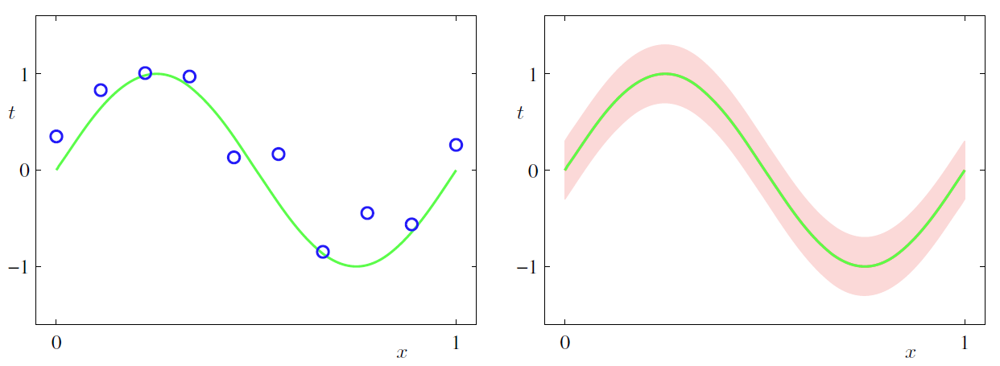
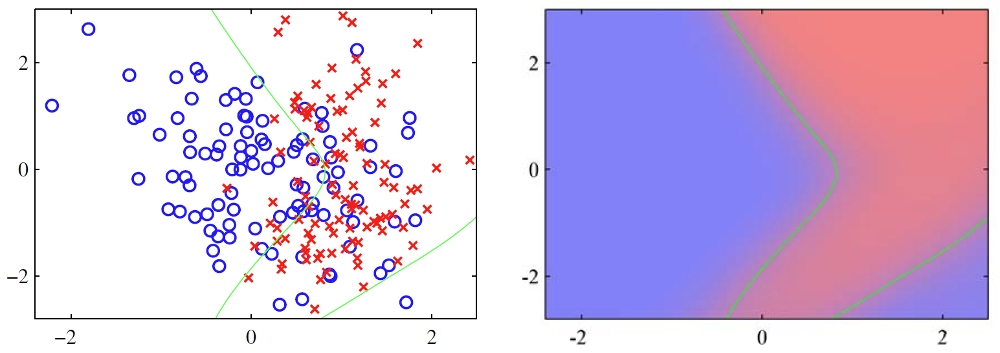

# 数据集

## 简介

下面简要介绍本书中使用的数据集。

## 合成数据

2025-07-03⭐

本书使用了两个简单的合成数据集来解释算法。

第一个是基于正弦函数的回归问题，如 Fig.6 所示：

- 输入值 $\{x_n\}$：在 $(0,1)$ 范围内均值生成
- 输出值 $\{t_n\}$：对输入值先计算函数 $\sin(2\pi x)$，然后添加标准差为 0.3 的高斯分布随机噪声 

> **Fig.6** ：左图显示合成的回归数据集以及生成数据点的真实正弦函数。右图显示生成的标签的真实条件分布 $p(t|x)$，其中绿色表示均值，阴影区域是在均值两侧跨越一个标准差。

第二个是分类问题数据集，包含两个先验概率相等的分类，如图 Fig.7 所示：

- 蓝色数据由单个高斯分布生成
- 红色数据由两个高斯分布混合生成

由于已知两个类的先验概率和条件密度，所以可以直接评估和绘制真实后验概率以及最小错误分类率的决策边界。

> **图（7）**：左图是合成的分类数据集，包含红色和蓝色两类。右图是真实后验概率图，概率值用颜色表示，纯红色表示红色概率为 1，纯蓝色表示红色概率为 0。由于这些概率是已知的，因此可以评估最小化错误分类的最佳决策边界（对应每个类的后验概率为 0.5 的轮廓），由绿线表示。