# 梯度下降可视化

## 简介

主要内容：

- 定义一个简单的线性回归模型
- 演练梯度下降的每一步：初始化参数、前向传播、计算 error 和 loss、计算梯度和更新参数
- 通过公式、代码和图示来理解梯度
- 理解 batch, mini-batch 和随机梯度下降（SGD）的区别
- 可视化不同学习率 (lr) 对 loss 的影响
- 理解标准化和特征缩放的重要性

本章没有 PyTorch 代码，都是通过 NumPy 实现。

首先，导入包：

```python
import numpy as np
from sklearn.linear_model import LinearRegression
from sklearn.preprocessing import StandardScaler
```

**梯度下降**（gradient descent）是机器学习和深度学习中一种**迭代优化算法**，寻找可微函数的局部最小值。从应用角度，就是从随机初始参数开始，找到给定模型、数据和损失函数的最佳参数组合。

理解梯度下降有助于理解数据特征和超参数对模型性能和训练速度的影响。

下面采用一个简单的模型，即单个特征的线性回归模型来辅助解释梯度下降：

$$
y=wx+b+\epsilon
$$

## 生成数据

假设真实参数 `b=1`, `w=2`。

用 `numpy.rand()` 在 0-1 之间随机生成 100 个点，作为 x。

然后，将 `x` 和参数 `b`, `w` 带入方程计算得到标签 `y`，并添加高斯噪声 $\epsilon$。使用 `numpy.randn()` 生成噪声，即从均值为 0，标准差为 1 的正态分布随机抽样，然后乘以一个 `factor` 调整噪声 level，这里采用 0.1。

```python
true_b = 1
true_w = 2
N = 100

np.random.seed(42) # 保证每次运行生成相同的随机数
x = np.random.rand(N, 1) # Nx1
epsilon = (.1 * np.random.randn(N, 1))
y = true_b + true_w * x + epsilon
```

然后，将数据拆分为 train-set 和 val-set：对索引数组洗牌，并使用前 80 个点作为 train-set。

> [!NOTE]
> 随机生成的数据，为什么还要洗牌？
> 随机生成的数据确实足够 random，这里洗牌操作略显多余。
> 但是在训练模型前对数据洗牌是最佳做法，以提高梯度下降性能。
> 时间序列除外。

### train-val-test split

数据集拆分往往是第一步：

1. 拆分前不做任何预处理操作。所以在生成数据集后，这是第一步
2. 本章仅使用 train-set，不过还是拆分处 val-set 演示如何拆分数据集

```python
# 索引洗牌
idx = np.arange(N)
np.random.shuffle(idx)

# 前 80 个作为 train-set
train_idx = idx[:int(N * 0.8)]
# 余下作为 val-set
val_idx = idx[int(N * 0.8):]

# 生成 train 和 val sets
x_train, y_train = x[train_idx], y[train_idx]
x_val, y_val = x[val_idx], y[val_idx]
```

> [!NOTE]
>  之所以不用 scikit-learn 的 `train_test_split()` 函数，是因为后面需要用到数据点的索引。

数据集可视化：

```python
from plots.chapter0 import *

figure1(x_train, y_train, x_val, y_val)
```

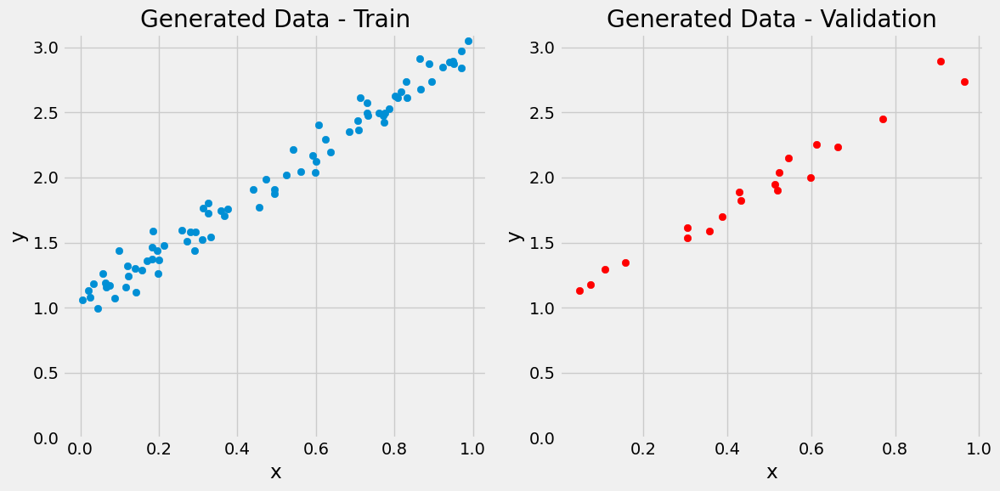

下面通过梯度下降和 trainset 的 80 个点，看看训练得到的值与真实值的接近程度。

## 0. 随机初始化

现实生活中，我们不知道模型参数的值真实值。在训练前需要给它们一个初始值，事实证明，随机值就挺好。

> [!TIP]
> 虽然是随机初始化，但是在训练复杂模型时，使用一些巧妙的初始化方案更利于训练模型，后面会讨论。

```python
np.random.seed(42)
b = np.random.randn(1)
w = np.random.randn(1)

print(b, w)
```

```
[0.49671415] [-0.1382643]
```

## 1. 计算模型预测值

这是前向传播，它使用当前参数计算模型的预测值。因为开始参数是随机的，所以预测结果通常很差：

```python
yhat = b + w * x_train
```

可视化：

```python
figure2(x_train, y_train, b, w)
```

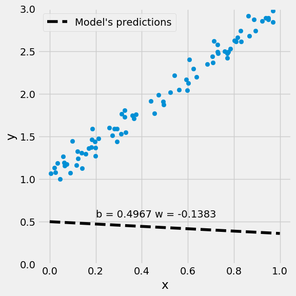

## 2. 计算 loss

error 和 loss 的差别：error 是单个数据点的真实值（label）和预测值的差异，即：

$$
\text{error}_i=\hat{y}_i-y_i
$$

数据集中第一个点 $i=0$ 的图示：

```python
figure3(x_train, y_train, b, w)
```

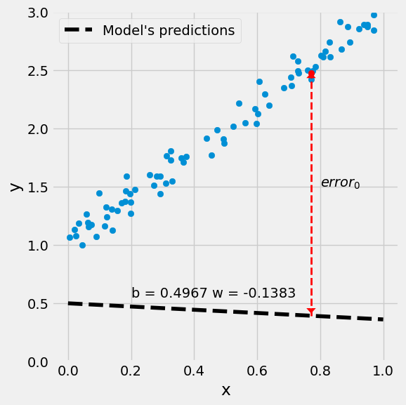

loss 则是一组点的 error 的聚合。计算所有点的 loss 很直观，它能够得到一条稳定的从初始随机参数到最小化 loss 的参数的路径，但会很慢。当数据集很大时，该问题很明显。

因此，可以牺牲一点稳定性来提高速度。每次从 N 个数据点钟随机选择 $n$ 个自己来计算 loss。

> [!TIP]
> batch, mini-batch 和 Stochastic Gradient Descent (SGD)
>
> - 如果使用训练集中所有数据点 $n=N$ 计算 loss，则成为 batch-gradient-descent
> - 如果每次只使用一个点 $n=1$，则成为 SGD
> - 使用 1 到 N 之间的其它值，就称为 mini-batch gradient descent

对回归问题，可以使用**均方误差** (mean squared error, MSE)，即所有 error 的平方差。

$$
\begin{aligned}
    \text{MSE}&=\frac{1}{n}\sum_{i=1}^n \text{error}_i^2\\
    &=\frac{1}{n}\sum_{i=1}^n(\hat{y}_i-y_i)^2\\
    &=\frac{1}{n}\sum_{i=1}^n(b+wx_i-y_i)^2
\end{aligned}
$$

下面使用所有训练集的数据点计算损失，即 batch-GD:

```python
error = (yhat - y_train)

loss = (error ** 2).mean()
print(loss)
```

```
2.7421577700550976
```

### loss surface

上面计算了随机初始化参数 `b=0.49`, `w=-0.13` 对应的 loss。如果对指定范围均匀分布的所有可能的 b,w 值计算 loss，就可以得到 loss surface:

```python
b_range = np.linspace(true_b - 3, true_b + 3, 101)
w_range = np.linspace(true_w - 3, true_w + 3, 101)
bs, ws = np.meshgrid(b_range, w_range)
bs.shape, ws.shape
```

```
((101, 101), (101, 101))
```

`meshgrid()` 返回两个 (101,101) 矩阵，代表网格上的每个参数值。

```python
bs
```

```
array([[-2.  , -1.94, -1.88, ...,  3.88,  3.94,  4.  ],
       [-2.  , -1.94, -1.88, ...,  3.88,  3.94,  4.  ],
       [-2.  , -1.94, -1.88, ...,  3.88,  3.94,  4.  ],
       ...,
       [-2.  , -1.94, -1.88, ...,  3.88,  3.94,  4.  ],
       [-2.  , -1.94, -1.88, ...,  3.88,  3.94,  4.  ],
       [-2.  , -1.94, -1.88, ...,  3.88,  3.94,  4.  ]])
```

实际上，`bs`  的每一行就是原来的 `b_range` 值，然后重复了 `len(w_range)` 次。

当然，这里有点作弊，因为我们知道真实的 `w`, `b` 值，所以参数选择的范围很完美。

接下来，使用这些参数组合计算相应的预测值、error 和 loss。我们先从训练集取一个点，然后计算 grid 中每个组合的预测值：

```python
dummy_x = x_train[0]
dummy_yhat = bs + ws * dummy_x
dummy_yhat.shape
```

```
(101, 101)
```

由于 NumPy 的广播功能，上面将相同 `x` 乘以 `ws` 矩阵的每个元素。现在对训练集的 80 个数据点执行同样操作，可以通过 `numpy.apply_along_axis()` 实现：

```python
all_predictions = np.apply_along_axis(
    func1d=lambda x: bs + ws * x,
    axis=1,
    arr=x_train
)
all_predictions.shape
```

```
(80, 101, 101)
```

这样就得到了 80 个 (101, 101) 矩阵，每个数据点对应一个矩阵。

errors 是预测值和标签纸之间的差异，在计算前需要保证 shape 一致：

```python
all_labels = y_train.reshape(-1, 1, 1)
all_labels.shape
```

```
(80, 1, 1)
```

这里将 labels 挑战为 (80, 1, 1)，这样广播就可以工作了。计算 errors:

```python
all_errors = (all_predictions - all_labels)
all_errors.shape
```

```
(80, 101, 101)
```

每个预测值都有对应的 error，因此得到 80 个 (101, 101) error 矩阵。

最后计算均方误差，先取所有 error 的平方。然后取平均值。由于数据点在 dim-0，所以 axis=0 来计算该平均值：

```python
all_losses = (all_errors ** 2).mean(axis=0)
all_losses.shape
```

```
(101, 101)
```

得到 loss grid，是一个 shape 为 (101, 101) 的矩阵，每个 loss 对应一个不同的 `b`, `w` 组合，就是 loss surface。可以进行 3D 可视化，其中 z 为 loss 值。如果连接生成相同 loss 值的 `b`, `w` 组合，就得到椭圆。然后在原始 bxw 平面绘制此椭圆（蓝色对应 loss=3）。简而言之，就是等高线图。

```python
figure4(x_train, y_train, b, w, bs, ws, all_losses)
```

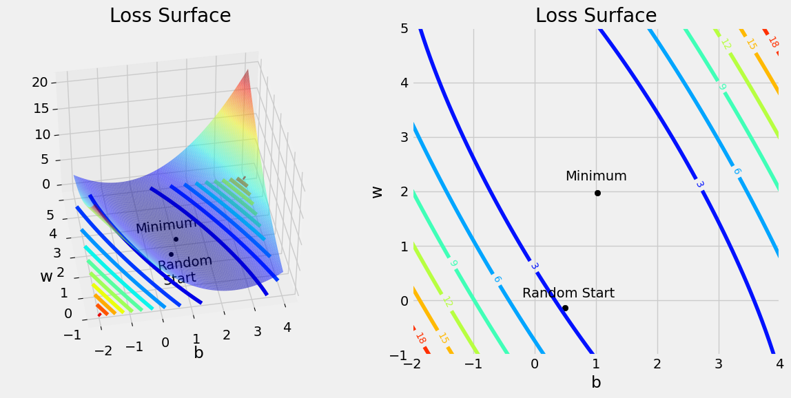

在图的中心，参数 (b, w) 逼近真实值 (1, 2)，此时 loss 值最小，这是梯度下降试图到达的点。底部靠左的位置，是随机初始化的参数值。

> [!WARNING]
>
> 对大多数问题，都无法计算 loss-surface。只能依靠梯度下降到达最低点的能力，即使起点随机。

### 横截面

通过 loss-surface 的横截面，可以查看固定一个参数时，loss 随另一个参数的变化。

例如，让 `b=0.52` (`b_range` 中最接近最初随机的 0.4967)，在 loss-surface 垂直切开一个截面（红色虚线），得到：

```python
figure5(x_train, y_train, b, w, bs, ws, all_losses)
```

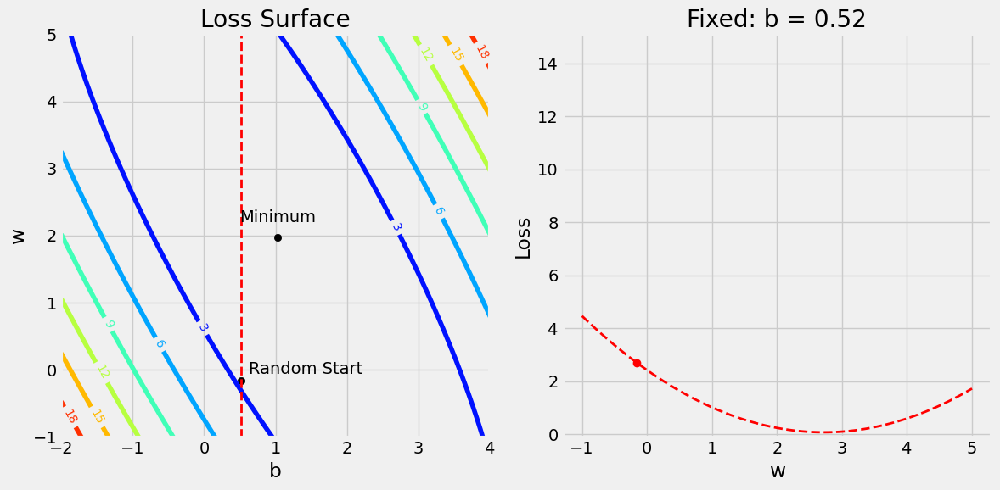

可以发现，如果保持 `b=0.52` 不变，增加 `w` 到 2 和 3 之间就可以减少 loss。

当然，不同 `b` 值可以得到不同的 `w` loss 横截面。这些曲线取决于 loss-surface 的形状。

如果水平切开，例如固定 `w=-0.16` (`w_range` 中最接近开始随机的 `w` -0.1382)，如下：

```python
figure6(x_train, y_train, b, w, bs, ws, all_losses)
```

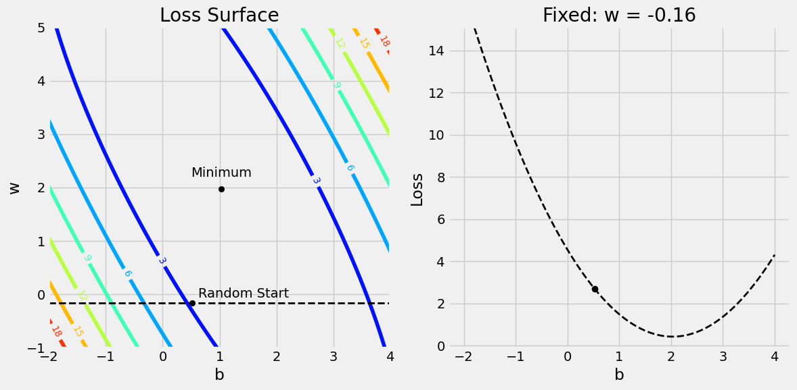

此时保持 `w=-0.16` 不变，可以发现，当 `b` 增加到 2 附近，loss 最小。

## 3. 计算梯度

梯度就是偏导数。with respect to (w.r.t) 关于

> [!TIP]
>
> 梯度：一个参数的变化会导致 loss 变化多少。

下面是简单线性回归对两个参数的倒数：

$$
\begin{aligned}
    \frac{\partial\text{MSE}}{\partial b}&=\frac{1}{n}\sum_{i=1}^n 2(b+wx_i-y_i)\\
    &=\frac{2}{n}\sum_{i=1}^n(\hat{y}_i-y_i)
\end{aligned}
$$

$$
\begin{aligned}
    \frac{\partial\text{MSE}}{\partial w}&=\frac{1}{n}\sum_{i=1}^n 2(b+wx_i-y_i)x_i\\
    &=\frac{2}{n}\sum_{i=1}^n x_i(\hat{y}_i-y_i)
\end{aligned}
$$

计算梯度：

```python
b_grad = 2 * error.mean()
w_grad = 2 * (x_train * error).mean()
print(b_grad, w_grad)
```

```
-3.044811379650508 -1.8337537171510832
```

### 可视化梯度

上面 `b` 梯度的绝对值大于 `w` 梯度的绝对值，索引 `b` 的变化对 loss 影响更大。如下图所示：

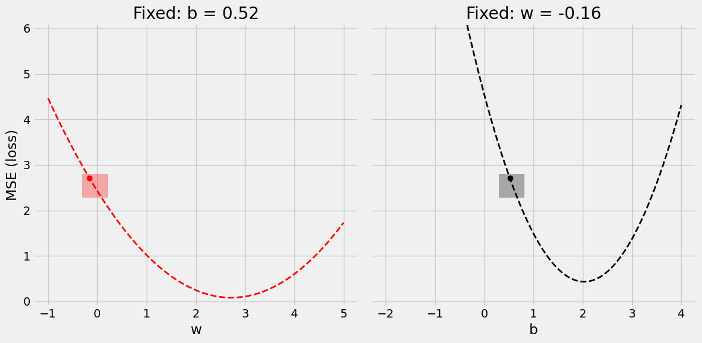

右边的曲线更陡峭，即斜率更大。

将两个参数都增加一点（+0.12），放大上图中的两个点：

```python
figure8(b, w, bs, ws, all_losses)
```

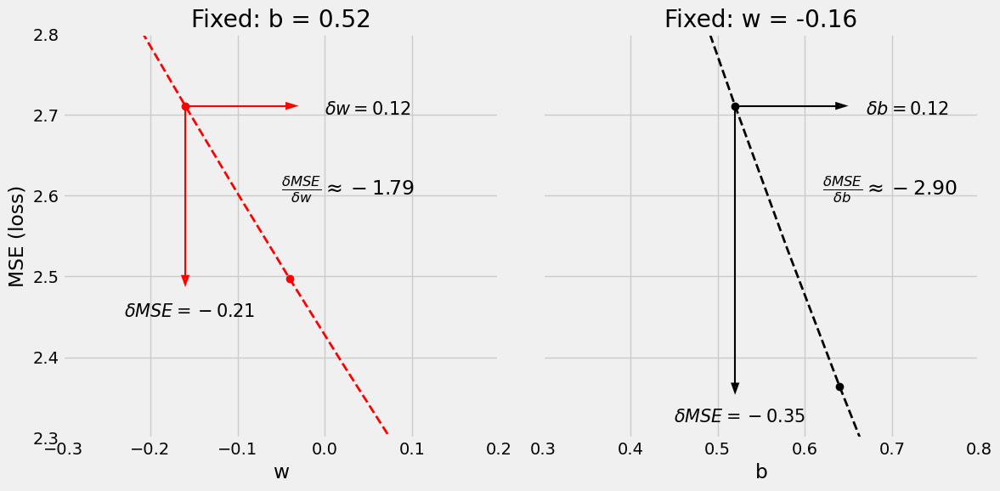

左图，`w` 增加 0.12 使 loss 减少 0.21，两个点之间的斜率大致近似梯度，为 -0.19。已经很接近真实斜率 -1.83。

同理，右图中，将 `b` 增加 0.12 使 loss 减少 0.35，loss 减少幅度更大，对应斜率更大，即梯度更大。

### 反向传播

反向传播通过链式法则计算损失函数对每个 weights 的梯度，从最后一层先前依次迭代，每次计算一层的梯度。

简而言之，反向传播就是链式梯度下降。

## 4. 更新参数

最后更具梯度来更新参数。由于我们要最小化 loss，所以反转梯度符号来更新。

此时有另一个超参数要考虑：学习率（learning rate），用 $\eta$ 表示。学习率是在更新参数时梯度的因子。

$$
b = b - \eta\frac{\partial\text{MSE}}{\partial b}
$$

$$
w=w-\eta\frac{\partial\text{MSE}}{\partial w}
$$

假设取 lr=0.1:

```python
lr = 0.1
print(b, w)

b = b - lr * b_grad
w = w - lr * w_grad

print(b, w)
```

```
[0.49671415] [-0.1382643]
[0.80119529] [0.04511107]
```

可视化效果：

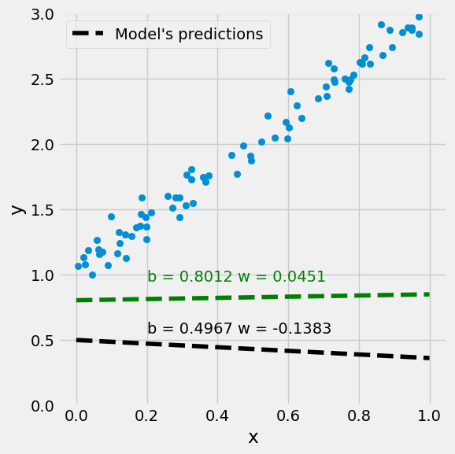

看起来是在往正确的方向偏移。

### 学习率


$$
\text{updated value}=\text{previous value}-\text{learning rate}*\text{gradient}
$$

**学习率低**

- 更可能到达最低点
- 需要更多时间

**学习率高**

- 训练速度快
- 可能振荡，无法到达最低点，甚至无法收敛

模型可以有很多参数，对应很多梯度，但只有一个学习率。这意味着学习率的选择受最陡峭曲线的限制。对相对平坦的曲线，学习率大一点更好。或者：所有曲线都同样陡峭！这样学习率对所有曲线都接近最优。

### 特征

将 `x` 乘以 10，使其处在 [0,10] 之间，并重命名为 bad_x。然后将原 `true_w` 除以 10，这样标签 y 依然不变。

`x` 值放大十倍，会导致 `w` 的微小变化在 loss 中被放大，对应梯度变大，为了维持稳定梯度下降，就要降低学习率。

解决该问题的的策略：

- Scaling
- Standardizing
- Normalizing

比如，`StandardScaler`，将特征以均值为 0，标准差为 1 进行标准化。它先计算特征的平均值和标准差：
$$
\overline{X}=\frac{1}{N}\sum_{i=1}^N x_i
$$

$$
\sigma(X)=\sqrt{\frac{1}{N}\sum_{i=1}^N(x_i-\overline{X})^2}
$$

然后执行转换：

$$
\text{scaled-x}_i=\frac{x_i-\overline{X}}{\sigma(X)}
$$

该预处理步骤通常称为 normalization 或 standardization。

> [!WARNING]
>
> 类似 `StandardScaler` 的预处理步骤必须在 train-validation-test 拆分之后执行。否则，等于将 val-set 和 test-set 的信息泄露给模型。
>
> 使用 train-set 拟合 `StandardScaler` 后，使用其 `transform()` 方法对 train, val, test 进行预处理。

完成预处理后，所有数值特性都缩放到相似尺度：

```python
scaler = StandardScaler(with_mean=True, with_std=True)
# 值使用 train-set 拟合 scaler
scaler.fit(x_train)

# 使用拟合好的 scaler 转换 train 和 val sets
scaled_x_train = scaler.transform(x_train)
scaled_x_val = scaler.transform(x_val)
```

对比：

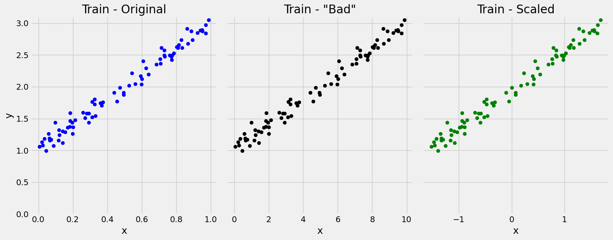

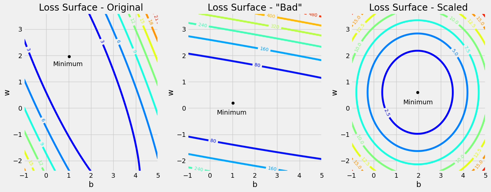

> [!TIP]
>
> 始终要记得标准化特征。

## 5. 循环

使用更新后的参数回到步骤-1.

- **epoch**

对 train-set 的所有数据都处理了一遍：前向传播、计算 loss、计算梯度、更新参数，就称为一个 epoch。

一个 epoch 至少更新一次参数，但不超过 `N` 次。

更新次数取决于使用的梯度下降类型：

- batch-GD (n=N)，一个 epoch 更新一次
- stochastic-GD (n=1)，一个 epoch 更新 N 次，即每个数据点都更新一次参数
- mini-batch-GD (n=n)，每个 epoch 更新 N/n 次
