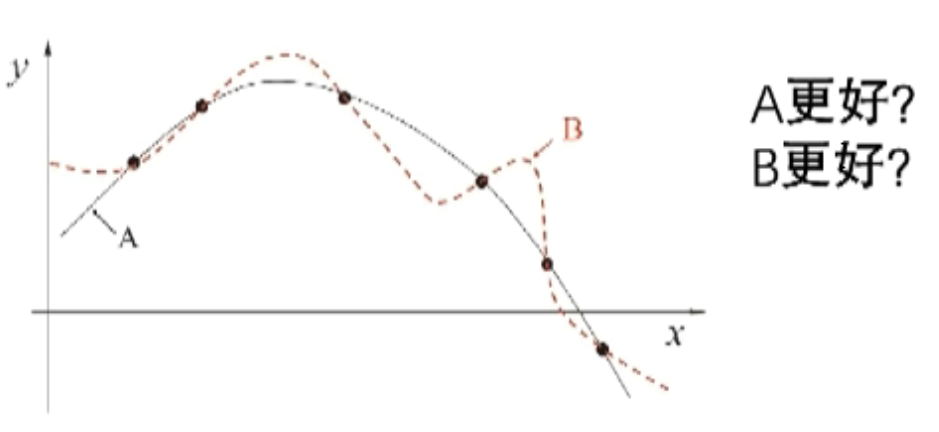
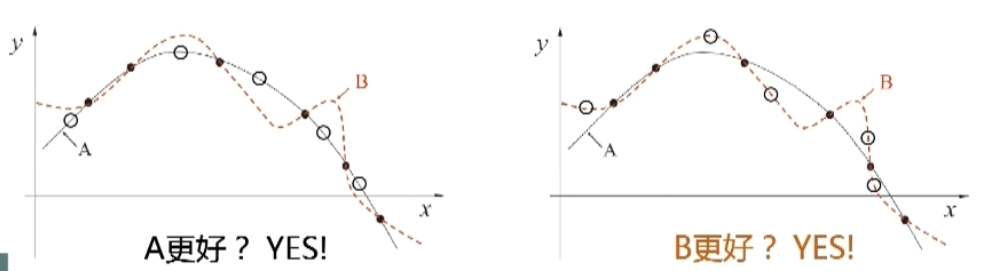

# 导论

- [导论](#导论)
  - [课程定位](#课程定位)
  - [机器学习定义](#机器学习定义)
  - [典型的机器学习过程](#典型的机器学习过程)
  - [机器学习理论](#机器学习理论)
  - [基本术语](#基本术语)
  - [归纳偏好](#归纳偏好)
  - [NFL 定理](#nfl-定理)

2024-07-16
@author Jiawei Mao
***

## 课程定位

科学：**是什么**和**为什么**
技术：**怎么做**
工程：做得多快好省
应用

这门课：科学+技术，少量工程
## 机器学习定义

经典定义：利用经验改善系统自身的性能 [T. Mitchell 教科书，1997]

随着该领域的发展，目前主要研究智能数据分析的理论和方法，并已成为智能数据分析技术的源泉之一。

大数据->价值
## 典型的机器学习过程

 西瓜数据集：

| 编号  | 色泽  | 根蒂  | 敲声  | 好瓜  |
| --- | --- | --- | --- | --- |
| 1   | 青绿  | 蜷缩  | 浊响  | 是   |
| 2   | 乌黑  | 蜷缩  | 浊响  | 是   |
| 3   | 青绿  | 硬挺  | 清脆  | 否   |
| 4   | 乌黑  | 稍蜷  | 沉闷  | 否   |
标签（label）：类别标记

适用于全局的，称为**模型**；适用于局部的，称为模式(Pattern)。不过大多地方不予区分，统一称为模型。

## 机器学习理论

Leslie Valiant 的计算学习理论，其中最重要的理论模型：

PAC（Probably Approximately Correct）概率近似正确，表达式：
$$
P(|f(x)-y|\le \epsilon) \ge 1-\delta
$$
函数 $f$ 就是我们想要的模型，$y$ 是真实值。

当专业知识不能给出准确结果，就需要用机器学习从数据学习模式。

问题：

- P 问题，多项式时间内可解决的问题
- NP 问题，非多项式时间内可解决的问题，但很容易验证答案对不对

**P 类问题**是可以在多项式时间内**解决并验证**的一类问题，**NP 类问题**是可以多项式时间但是不确定能否在多项式时间内解决的一类问题。

P 类问题是一种特殊的 NP 问题。

P=NP，指是否可以在多项式时间内解决 NP 问题，将其转换为 P 类问题。

超出 NP 问题，无法检验答案是否最佳的问题。

因为机器学习研究的问题很多无法验证是否最佳，即是超出 NP 的问题，所以 $\epsilon$ 无法为 0。

> 机器学习，以很高的概率得到一个很好的模型，即概率近似正确。

## 基本术语

关于数据集的术语：

- 数据集：所有数据构成的集合
  - 训练：用数据建立模型的过程
  - 测试：在新的数据上测试训练好的模型的性能
    - 新的数据答案已知
    - 新的数据在训练集中没有
- 示例（instance）：不包含最后的标记（没有结果）
- 样例（example）：示例+类别标记（有结果）
- 样本（sample）：定义比较模型，有时候指样例，有时候指整个数据集，根据上下文理解
- 属性（attribute），特征（feature）：属性和特征含义相同；
  - 属性值：特定属性的取值
- 属性空间，样本空间，输入空间：均指所有属性一起定义的空间
  - 特征向量（feature vector）：由属性定义的向量，一个特征向量对应一个示例
- 标记空间，输出空间

关于模型的术语：

- **模型**，包含总结出来的规律，就是通常所说的假设（hypothesis），即学习到的模型，构成一个假设。
  - 学习过程：在所有假设组成的空间中搜索的过程

- 真实的模型，称为**真相**（ground-truth），即正确的答案。

- $f(x)$ 就是学到的假设，$y$ 就是 ground-truth。

关于输出的概念：

- 分类，回归
- 二分类，多分类
- 正类，反类

关于学习任务的术语：

- 监督学习（supervised learning）
- 无监督学习（unsupervised learning）

未见样本（unseen instance）

未知”分布“

独立同分布（i.i.d.）：独立从同一个分布产生

> 突破独立同分布，是机器学习的前沿技术。

泛化（generalization）

特化（specialization）

## 归纳偏好

机器学习算法在学习过程中对某种类型假设的偏好。

归纳偏好（inductive bias）

任何一个有效的机器学习算法必有其偏好。

一般原则：**奥卡姆剃刀**（Occam's razor），若非必要，勿增实体。

所以上图采用 A 模型，它更简单，更平滑。

**学习算法的归纳偏好是否与问题本身匹配**，大多数时候直接决定了算法能够取得好的性能！

## NFL 定理

NFL 定理（**no free lunch**）：一个算法 $L_a$ 若在某些问题上比另一个算法 $L_b$ 好，必存在另一个问题 $L_b$ 比 $L_a$ 好。

NFL 定理的重要前提：所有问题出现的机会相同，或所有问题同等重要。

实际情形并非如此，我们通常只关注自己正在试图解决的问题。

**脱离具体问题**，空谈“什么学习算法更好”毫无意义。

> 具体问题，具体分析！

机器学习并非“十大套路”的简单堆积，现实任务千变万化，以有限的套路应对无限的问题，焉有不败？

最优方案：**按需设计**。

