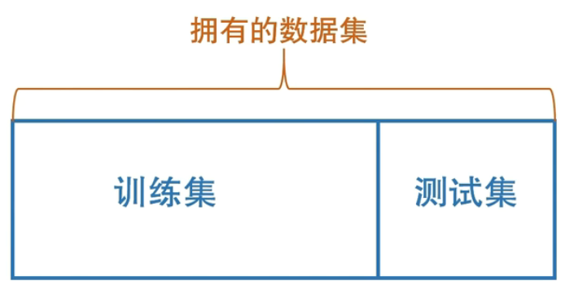
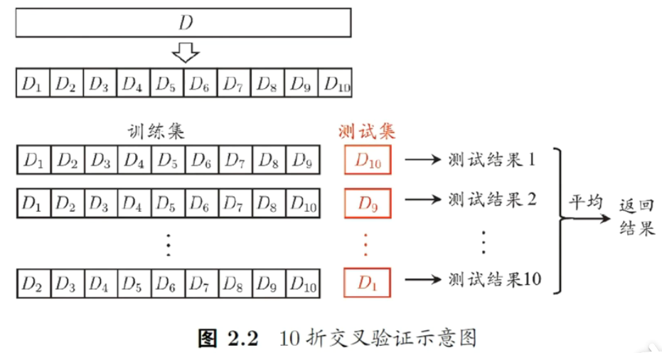
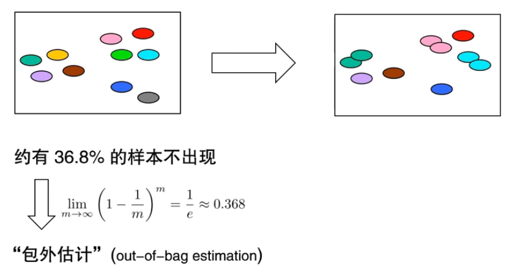
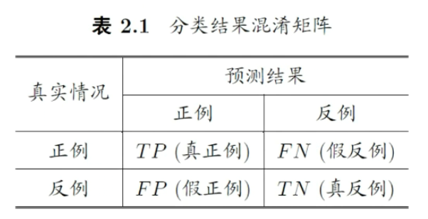

# 模型评估

- [模型评估](#模型评估)
  - [泛化能力](#泛化能力)
  - [过拟合和欠拟合](#过拟合和欠拟合)
  - [三个问题](#三个问题)
  - [评估方法](#评估方法)
    - [留出法](#留出法)
    - [k-折交叉验证](#k-折交叉验证)
    - [自助法](#自助法)
  - [调参与验证集](#调参与验证集)
  - [性能度量](#性能度量)
  - [比较检验](#比较检验)

2024-07-16
@author Jiawei Mao
***

## 泛化能力

泛化能力：适用于 unseen instance 的能力。

## 过拟合和欠拟合

**泛化误差**：在“未来”样本上的误差。

**经验误差**：在训练集上的误差，也称为“训练误差”。

- 泛化误差越小越好
- 经验误差是否越小越好？**NO**

过拟合（overfitting）和欠拟合（underfitting）

过拟合是机器学习的核心内容，所有技术都是在缓解过拟合。

## 三个问题

三个关键问题：

- 如何获得测试结果——评估方法
- 如何评估性能优劣——性能度量
- 如何判断实质差别——比较检验

## 评估方法

关键：怎么获得测试集（test set）？

**测试集应该与训练集“互斥”**。

常见方法：

- 留出法（hold-out）
- 交叉验证法（cross validation）
- 自助法（bootstrap）

### 留出法

注意：

- 保持数据分布一致性（例如：分层采样）
- 多次重复划分，例如，100 次随机划分，计算平均值
- 测试集不能太大，不能太小（1/5-1/3）

test set 只是用于选择模型，当模型选择好后，再用完整数据训练模型，作为最终模型。

### k-折交叉验证

hold out 方法的问题是，哪怕重复 100 次，依然有一部分数据从来没出现在训练集或测试集中。

k-折交叉验证法能解决该问题。

由于切分本身可能会对结果有扰动，所以可以将 10-折交叉验证，重复 10 次，称为 $10\times 10$ CV，也是做 100 次试验。

若 $k=m$，则得到“留一法”（leave-one-out, LOO）。

### 自助法

基于自助采样（**bootstrap sampling**），亦称“有放回抽样”、“可重复采样”。

原始数据有多少样本，就自助采样多少个样本作为训练集。有的样本多次出现，有的没采到。

训练集中没有出现的数据，可以作为 test set。

按照这种方法，大概 36.8% 的数据在训练集中没有出现。

优点：训练集与原样本集同规模。

缺点：改变了数据分布。

数据量不够，这种方法挺合适。

## 调参与验证集

算法的参数：一般由人工设定，亦称“**超参数**”。

模型的参数：一般由算法学习确定。

调参过程：先产生若干模型，然后基于某种评估方法进行选择。

模型选择：调参数和选不同的算法，都是在进行模型选择。模型选择，就是确定机器学习变量的过程。

**训练集 vs. 测试集 vs. 验证集（validation set）**

- 测试集用来看模型性能

- 验证集专门用来调参数（训练集中分出来调参数的部分）

算法参数选定后，要用 “训练集+验证集” 重新训练得到最终模型。将该模型放到测试集上，得到模型性能。

## 性能度量

性能度量（performance measure）是衡量模型泛化能力的评价标准，反映了任务需求。

使用不同的性能度量往往会导致不同的评判结果。

> 什么样的模型是好的，不仅取决于算法和数据，还取决于任务需求。

**回归**（regression）任务常用**均方误差**：
$$
E(f;D)=\frac{1}{D}\sum_{i=1}^m (f(x_i)-y_i)^2
$$
**分类**（classification）常用**错误率**（分类错误的比例）：
$$
E(f;D)=\frac{1}{D}\sum_{i=1}^m I(f(x_i)\ne y_i)
$$
**精度（accuracy）**：
$$
acc(f;D)=1-E(f;D)
$$
**混淆矩阵**：

**查准率（precision）**：
$$
P=\frac{TP}{TP+FP}
$$
预测为 positive 的结果里，真正 positive 的比例。

**查全率（recall）**:
$$
R=\frac{TP}{TP+FN}
$$
所有 positive 样本中，有多少被模型找出来了。

将 P 和 R 合并在一起，又得到一个指标 **F1 度量**：
$$
\begin{aligned}
F_1&=\frac{2\times P\times R}{P+R}\\
&=\frac{2\times TP}{样例总数+TP-TN}
\end{aligned}
$$
换个写法更好记：
$$
\frac{1}{F_1}=\frac{1}{2}\times(\frac{1}{P}+\frac{1}{R})
$$

这种方法成为调和平均。该平均不会忽视较小的值。

若对查准率/查全率有不同偏好：
$$
F_{\beta}=\frac{(1+\beta^2)\times P\times R}{(\beta^2\times P)+R}
$$

$$
\frac{1}{F_{\beta}}=\frac{1}{1+\beta^2}\cdot (\frac{1}{P}+\frac{\beta^2}{R})
$$

$\beta > 1$ 时查全率（R）有更大影响；$\beta < 1$ 时查准率（P）有更大影响。

## 比较检验

在某种度量下取得评估结果后，是否可以直接比较评判优劣？

通常不行，因为：

- 测试性能不等于泛化性能
- 测试性能随着测试集的变化而变化
- 很多机器学习算法本身有一定的随机性（比如神经网络的参数初始化）

机器学习——概率近似正确：以很大的概率，得到一个很可能很好的模型。

统计假设检验（hypothesis test）为模型性能比较提供了重要依据。

**两学习器比较**：

- 交叉验证 t 检验（基于成对 t 检验）
  - k 折交叉验证：5x2 交叉验证
- McNemar 检验（基于列联表，卡方检验）

