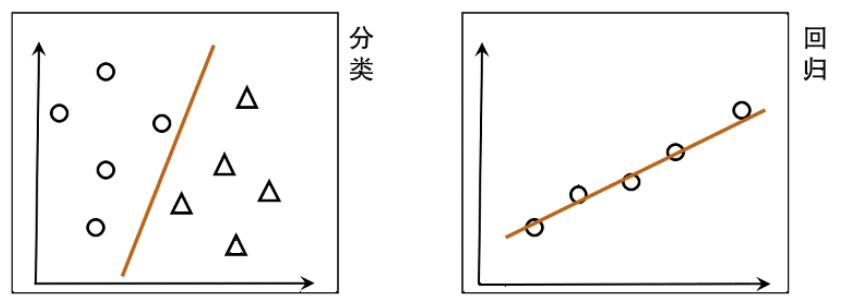
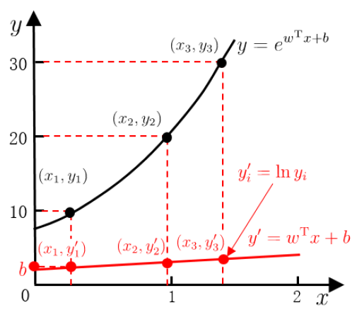
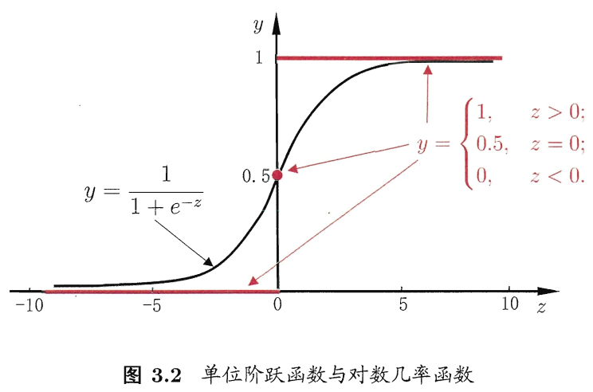
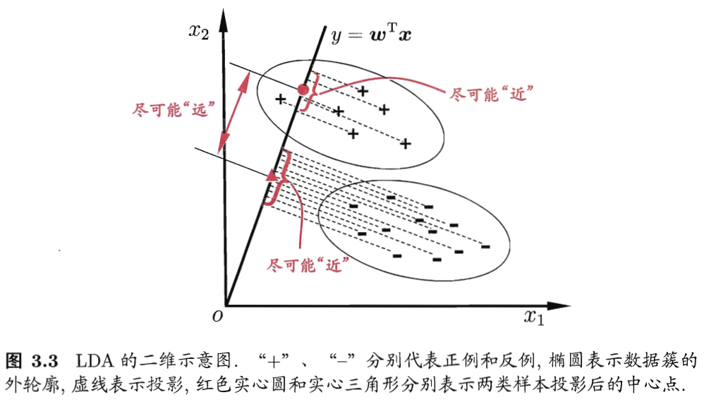
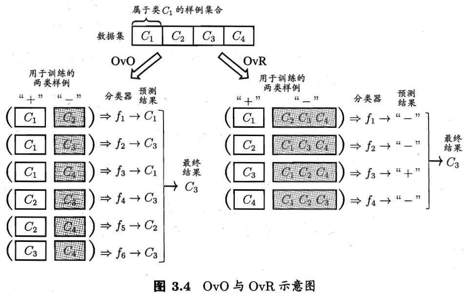
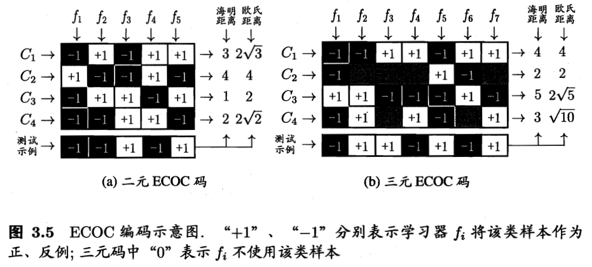

# 线性模型

2025-05-12
@author Jiawei Mao
***

## 简介

线性模型（linear model）试图学得一个通过属性的线性组合来进行预测的函数：
$$
f(x)=w_1x_1+w_2x_2+\cdots+w_dx_d+b
$$

向量形式：

$$
f(x)=w^Tx+b
$$

**线性模型**简单、基本、可理解性好。

**线性回归（linear regression）**

$$
f(x_i)=wx_i+b
$$

使得：

$$
f(x_i)\approx y_i
$$

由于过拟合的原因，所以上面用**约等于**。

线性回归擅长处理数值属性，对非数值属性，需要进行转换。数据预处理——**离散变量转换为数值**：

- **有序变量(order)**直接转换为数值
- **无序变量**转换为 one-hot：无序变量没有大小关系

线性回归处理方案——令**均方误差最小化**：

$$
\begin{aligned}
(w^*,b^*)&={\text{arg min}\atop (w,b)} \sum_{i=1}^m(f(x_i)-y_i)^2\\
&={\text{arg min} \atop (w,b)} \sum_{i=1}^m (y_i-wx_i-b)^2
\end{aligned}
$$

对 $E_{(w,b)}=\sum_{i=1}^m (y_i-wx_i-b)^2$ 进行最小二乘参数估计。`*` 表示最优值。

> [!TIP]
>
> `;` 对应列向量，`,` 对应行向量。

## 最小二乘解

最小二乘估计就是对 $E_{(w,b)}=\sum_{i=1}^m (y_i-wx_i-b)^2$  求偏导，让导数为 0.

分别对 $w$ 和 $b$ 求导：
$$
\frac{\partial E(w,b)}{\partial w}=2(w\sum_{i=1}^m x_i^2-\sum_{i=1}^m (y_i-b)x_i)
$$

$$
\frac{\partial E(w.b)}{\partial b}=2(mb-\sum_{i=1}^m (y_i-wx_i))
$$

令导数为 0，得到闭式（closed-form）解：

$$
w=\frac{\sum_{i=1}^m y_i(x_i-\overline{x})}{\sum_{i=1}^m x_i^2-\frac{1}{m}(\sum_{i=1}^m x_i)^2}
$$

$$
b=\frac{1}{m}\sum_{i=1}^m (y_i-wx_i)
$$

## 多元线性回归

多元（multi-variate）就是多变量。

$$
f(\bold{x}_i)=\bold{w}^T\bold{x}_i+b
$$

使得：

$$
f(x_i)\approx y_i
$$

其中，$\bold{x}_i=(x_{i1};x_{i2};\cdots;x_{id};)$ 是一个向量, $y_i\in \Reals$。

把 $w$ 和 $b$ 吸收入向量形式 $\hat{w}=(w;b)$，数据集表示为：

$$
X=
\begin{pmatrix}
    x_{11} & x_{12} & \cdots & x_{1d} & 1\\
    x_{11} & x_{12} & \cdots & x_{1d} & 1\\
    \vdots & \vdots & \ddots & \vdots & \vdots \\
    x_{m1} & x_{m2} & \dots & x_{md} & 1
\end{pmatrix}
=\begin{pmatrix}
    \bold{x}_1^T & 1\\
    \bold{x}_2^T & 1\\
    \vdots & \vdots \\
    \bold{x}_m^T & 1
\end{pmatrix}
$$

$$
\bold{y}=(y_1;y_2;\dots;y_m)
$$

同样采用最小二乘法求解，有：
$$
\hat{\bold{w}}^*={\text{arg min}\atop{\hat{\bold{w}}}}(\bold{y}-\bold{X}\hat{\bold{w}})^T(\bold{y}-\bold{X}\hat{\bold{w}})
$$

令 $E_{\hat{w}}=(y-X\hat{w})^T(y-X\hat{w})$，对 $\hat{w}$ 求导：

$$
\frac{\partial E_{\hat{w}}}{\partial\hat{w}}=2X^T(X\hat{w}-y)
$$

令其为零可到 $\hat{w}$。

- 若 $X^TX$ 满秩或正定，则 $\hat{w}^*=(X^TX)^{-1}X^Ty$
- 若 $X^TX$ 不满秩，则可解出多个 $\hat{w}$，此时需要求助于**归纳偏好**，或引入**正则化** (regularization)

正则化，就是引入你喜欢的类型的结果，就是对多个可能解加入一个限制，从而选择一个最合适的解。

## 广义线性模型

对于样例 $(x,y)$，$r\in \Reals$，希望线性模型的预测值逼近真实标记，则得到线性回归模型 $y=\mathbf{w}^T\mathbf{x}+b$。

若令预测值逼近 y 的**衍生物**，比如:
$$
\ln y=\mathbf{w}^T\mathbf{x}+b
$$

则得到**对数线性回归**（log-linear regression）。实际是在用 $e^{\mathbf{w}^T\mathbf{x}+b}$ 逼近 $y$。

> [!TIP]
>
> 该方法使用求解线性模型的方式，得到一个非线性的解决方案。

一般形式：
$$
y=g^{-1}(\mathbf{w}^T\mathbf{x}+b) \tag{3.15}
$$

其中 $g$ 为单调可微的**联系函数**（link function）。

令 $g(.)=\ln (.)$，则得到对数线性回归。

还可以加其它类型的函数，从而得到更多线性模型的广义变化。

## 对数几率回归

线性回归模型产生的实值输出：

$$
z=\mathbf{w}^T\mathbf{x}+b
$$

考虑二分类任务，其期望输出为 $y\in \{0,1\}$。现在，需要一个函数，将 $z$ 转换为 $y$。最理想的是单位阶跃函数（unit-step function）：
$$
y=
\begin{cases}
    0, &z<0;\\
    0.5, &z=0;\\
    1, &z>0
\end{cases}\tag{3.16}
$$

若预测值 $z$ 大于 0 就判为正例，小于 0 则判为反例，预测值为临界值 0 则可任意判别。如下图所示：

单位阶跃函数不连续，因此不能直接使用 $g^{-1}$，我们希望找到能在一定程度上近似单位阶跃函数的“替代函数”（surrogate function），并希望它单调可微。**对数几率函数**（logistic function）正是这样一个替代函数：
$$
y=\frac{1}{1+e^{-z}} \tag{3.17}
$$

> [!TIP]
>
> sigmoid 函数即形状近似 S 的函数，对数几率函数是 sigmoid 函数最重要的代表，在神经网络中起着重要作用。

从图 3.2 可看出，对数几率函数是一种 sigmoid 函数（S 形函数），它将 $z$ 值转化为一个接近 0 或 1 的 $y$ 值，并且其输出值在 $z=0$ 附近变化很陡。将对数几率函数作为 $g^{-1}$ 带入 (3.15)，得到：
$$
y=\frac{1}{1+e^{-(w^Tx+b)}} \tag{3.18}
$$

(3.18) 可变化为：
$$
\ln\frac{y}{1-y}=\mathbf{w}^T\mathbf{x}+b \tag{3.19}
$$

若将 $y$ 视为样本 $x$ 作为正例的可能性，则 $1-y$ 是其反例可能性，两者的比值：
$$
\frac{y}{1-y} \tag{3.20}
$$

称为**几率**（odds），反映了 $x$ 作为正例的相对可能性。对几率取对数则得到**对数几率**（log odd，又称为 logit）：
$$
\ln\frac{y}{1-y} \tag{3.21}
$$

由此可见，（3.18）实际上是用线性回归模型的预测结果去逼近真实标记的对数几率，因此，其对应的模型称为**对数几率回归**（logistic regression，又称 logit regression），简称**对率回归**。

**注意**：虽然它的名字是回归，但实际上确实一种分类学习方法。这种方法有很多优点，例如：

- 它直接对分类可能性进行建模，无需事先假设数据分布，这样避免了假设分布不准确所带来的问题；
  - 即对所有问题都能用，效果还可以，虽然不一定是最好的
- 它不是仅预测类别，而是可得到近似概率预测，这对许多需利用概率辅助决策的任务很有用；
- 对数几率函数是任意阶可导的凸函数，有很好的数学性质，现有的许多数值优化算法都可直接用于求取最优解。

> [!IMPORTANT]
>
> 对数几率回归是分类模型。

## 线性判别分析

线性判别分析（Linear Discriminant Analysis, LDA）是一种经典的线性学习方法，在二分类问题上因为最早由 Fisher 提出，亦称为 Fisher 判别分析。

LDA 的思想非常朴素：给定训练样例集合，设法将样例投影到一条直线上，使得同类样例的投影点尽可能接近、异类样例的投影点尽可能远离；在对新样本进行分类时，将其投影到同样的这条直线上，再根据投影点的位置来确定新样本的类别。图 3.3 给出了一个二维示意图：

给定数据集 $D=\{(x_i,y_i)\}$

## 多分类学习

考虑 N 个类别 $C_1,C_2,\cdots,C_N$，多分类学习的基本思路是“**拆解法**”，即将多分类任务拆为若干个二分类任务求解。具体来说，先对问题进行拆分，然后为拆出的每个二分类任务训练一个分类器；在测试时，对这些分类器的预测结果进行集成以获得最终的多分类结果。这里的关键是如何对多分类任务进行拆分，以及如何多分类器进行集成。

最经典的拆分策略有三种：

- 一对一（One vs. One, OvO）
- 一对其余（One vs. Rest, OvR）
- 多对多（Many vs. Many, MvM）

给定数据集 $D=\{(x_1,y_1),(x_2,y_2),\cdots,(x_m,y_m)\}$, $y_i\in \{C_1,C_2,\cdots,C_N\}$。

- OvO 将这 N 个类别两两配对，从而产生 $N(N-1)/2$ 个二分类任务，例如 OvO 将为区分类别 $C_i$ 和 $C_j$ 训练一个分类器，该分类器把 D 中的 $C_i$ 类样例作为正例，$C_j$ 类样例作为反例。在测试阶段，新样本将同时提交给所有分类器，越是我们将得到 $N(N-1)/2$ 个分类结果，最终结果可通过投票产生：即把被预测得最多的类别作为最终分类结果。如图 3.4 所示。
- OvR 每次将一个类的样例作为正例，所有其它类的样例作为反例来训练 N 个分类器。在测试时若仅有一个分类器预测为正例，则对应的类别标记为最终分类结果。如有多个分类器预测为正类，则通常考虑各个分类器的预测执行度，选择置信度最大的类别标记作为分类结果。

可以看出，OvR 只需训练 N 个分类器，而 OvO 需训练 $N(N-1)/2$ 个分类器，因此：

- OvO 的存储开销和测试时间开销通常比 OvR 更大。
- 但在训练时，OvR 的每个分类器均使用全部训练样例，而 OvO 的每个分类器仅用到两个类的样例，因此，在类别很多时，OvO 的训练开销通常比 OvR 更小。（训练时间与样本数正相关，OvO 虽然模型更多，但每个模型的样本数，且更容易并行化，虽然训练时间更少）

至于预测性能，则取决于具体的数据分布，在**多数情形下两者差不多**。

MvM 是每次将若干个类作为正类，若干个其它类作为反类。显然，OvO 和 OvR 是 MvM 的特例。MvM 的正、反类构造必须有特殊的设计，而不能随意选取。这里介绍一种常用的 MvM 计数：**纠错输出码**（error correcting output codes, 简称 ECOC）。

ECOC 是将编码的思想引入类别拆分，并尽可能在解码过程中具有容错性。ECOC 工作过程分为两步：

- 编码：对 N 个类别做 M 次划分，每次划分将一部分类别划为正类，一部分划为反类，从而线程一个二分类训练集；这样一共产生 M 个训练集，可训练出 M 个分类器
- 解码：M 个分类器分别对测试样本进行预测，这些预测标记组成一个编码。将这个预测编码与每个类别各自的编码进行比较，返回其中距离最小的类别作为最终预测结果。

类别划分通过“编码矩阵”（coding matrix）指定。编码矩阵有多种形式，常见的主要有二元码和三元码。

二元码将每个分类分别指定为正类和反类，三元码在正、反类之外，还可以指定为停用类。如图 3.5 所示，在 3.5 (a) 中，分类器 $f_2$ 将 $C_1$ 类和 $C_3$ 类作为正例，$C_2$ 类和 $C_4$ 类的样例作为反例；在 3.5 (b) 中，分类器将 $C_1$ 类和 $C_4$ 类的样例作为正例，将 $C_3$ 类的样例作为反例。在解码阶段，各分类器的预测结果联合起来形成测试示例的编码，该编码与各类所对应的编码进行比较，将距离最小的编码所对应的类别作为预测结果。例如，在 3.5(a) 中，若基于欧氏距离，预测结果将是 C3。

为什么称为“纠错输出码”？因为在测试阶段，ECOC 编码对分类器的错误有一定的容忍和修正能力。例如，在图 3.5(a) 中对测试示例的正确预测编码是 (-1,+1,+1,-1,+1)，假设在预测时某个分类器出错了，例如 $f_2$ 出错从而导致错误编码 (-1,-1,+1,-1,+1)，但基于这个编码仍能产生正确的最终分类结果 C3.一般来说，对同一个学习任务，ECOC 编码越长，纠错能力越强。然而，**编码越长，意味着所需训练的分类器越多**，计算、存储开销都会增大；另一方面，对有限类别数，可能得组合数目是有限的，码长超过一定范围就失去意义了。

对同等长度的编码，理论上来说，任意两个类别之间的编码距离越远，则纠错能力越强。因此，在码长较小时可根据这个原则计算出理论最优编码。然而，码长稍大一些就难以有效地确定最有编码，事实上这是 NP 难问题。不过，通常我们并不需要获得理论最优编码，因此非最优编码在实践中往往已能产生最够好的分类器。另一方面，并不是编码的理论性质越好，分类性能就越好，因为机器学习问题涉及很多因素，例如将多个类拆解为两个类别子集，不同拆解方式所形成的两个类别子集的区分难度往往不同，即其导致的二分类问题的难度不同；越是，一个理论纠错性质很好、但导致二分类问题较难的编码，与另一个理论纠错性质差一些、但导致的二分类问题较简单的编码，最终产生的模型性能孰强孰弱很难说。

## 分类不平衡

前面介绍的分类学习方法都有一个共同的基本假设，即不同类别的训练样本数目相当。如果不同类别的训练样例数目稍有差别，通常影响不大，但若差别很大，则会对学习过程造成困扰。例如，有 998 个反例，但正例只有 2 个，那么学习方法只需返回一个永远将新样本预测为反例的学习器，就能达成 99.8% 的精度；然而这样的学习器往往没有价值，因为它不能预测出任何正例。

**类别不平衡**（class-inbalance）指分类任务中不同类别的训练样例数目差别很大的情况。不失一般性，下面假设正类样例较少，反类样例较多。在现实的分类学习任务重，我们经常会遇到类别不平衡，例如在通过拆分法解决多分类问题时，即使原始问题中不同类别的训练 样例数目相当，在使用 OvR、MvM 策略后产生的二分类任务仍然可能出现类别不平衡现象，因此有必要了解类别不平衡处理的基本方法。

> [!TIP]
>
> 对 OvR、MvM 来说，由于对每个类进行了相同的处理，其拆解出的二分类任务中类别不平衡的影响会相互抵消，因此通常不需要专门处理。

从线性分类器的角度讨论容易理解，在我们用 $y=w^Tx+b$ 对新样本 $x$ 进行分类时，事实上是在用预测的 $y$ 值与一个阈值进行比较，例如，通常在 $y>0.5$ 时判别为正例，否则为反例。$y$ 实际上表达了正例的可能性，几率 $\frac{y}{1-y}$ 则反应了正例可能性与反例可能性的比值，阈值设置为 0.5 恰表明分类器认为真实正、反例可能性相同，即分类器决策规则为：
$$
\text{若} \frac{y}{1-y}>1,\text{则预测为正例} \tag{3.46}
$$
然而，当训练集中正、反例的数目不同时，令  $m^+$ 表示正例数目，$m^-$ 表示反例数目，则观测几率是 $\frac{m^+}{m^-}$，由于我们通常假设训练集是真实样本总体的无偏采样，因此观测几率就代表了真实几率。于是，只要分类器的预测几率高于观测几率就应判定为正例，即：
$$
\text{若} \frac{y}{1-y}>\frac{m^+}{m^-},\text{则预测为正例}\tag{3.47}
$$
但是，我们的分类器是基于 (3.46) 进行决策，因此，需要对其预测值进行调整，使其在基于 (3.46) 决策时，实际是在执行 (3.47)。要做到这一点很容易，只需令
$$
\frac{y'}{1-y'}=\frac{y}{1-y}\times\frac{m^-}{m^+} \tag{3.48}
$$
这就是类别不平衡学习的 一个基本策略——**再缩放**（rescaling）。

再缩放的思想虽简单，但实际操作却不简单，主要因为“训练集是真实样本总体的无偏采样”这个假设往往不成立，也就是说，我们未必能有效地基于训练集观测几率来推断出真实几率。现有技术大体上有三类做法：

1. 直接对训练集里的反例进行欠采样（undersampling），即去除一些反例使得正、反例数目接近，然后再进行学习
2. 对训练集里的正类样本进行**过采样**（oversampling），即增加一些正例使得正、反训练集里的数目接近，然后再进行学习
3. 直接基于原始数据集进行学习，但在用训练好的分类器进行预测时，将 (3.48) 嵌入到其决策过程中，称为阈值移动（threshold-moving）

欠采样法的时间开销通常远小于过采样法，因为前者丢弃了很多反例，使得分类器训练集远小于初始训练集，而过采样法增加了很多正例，其训练集大于初始训练集。需注意的是，过采样法不能简单地对初始正例样本进行重复采样，否则会导致严重的过拟合；过采样的代表性算法 SMOTE 是通过对训练集里的正例进行插值来产生额外的正例。另一方面，欠采样法若随机丢弃反例，可能丢失一些重要信息；欠采样法的代表性算法 EasyEnsemble 则是利用集成学习机制，将反例划分为若干个集合供不同学习器使用，这样对每个学习器来看都进行了欠采样，但在全局来看却不会丢失重要信息。

值得一提的是，再缩放也是代价敏感学习（cost-sensitive learning）的基础。在代价敏感学习中将 (3.48) 中的 $m^-/m^+$ 用 $\text{cost}^+/\text{cost}^-$ 代替即可，其中 $\text{cost}^+$ 是将正例误分为反例的代价，$\text{cost}^-$ 是将反例误分为正例的代价。
