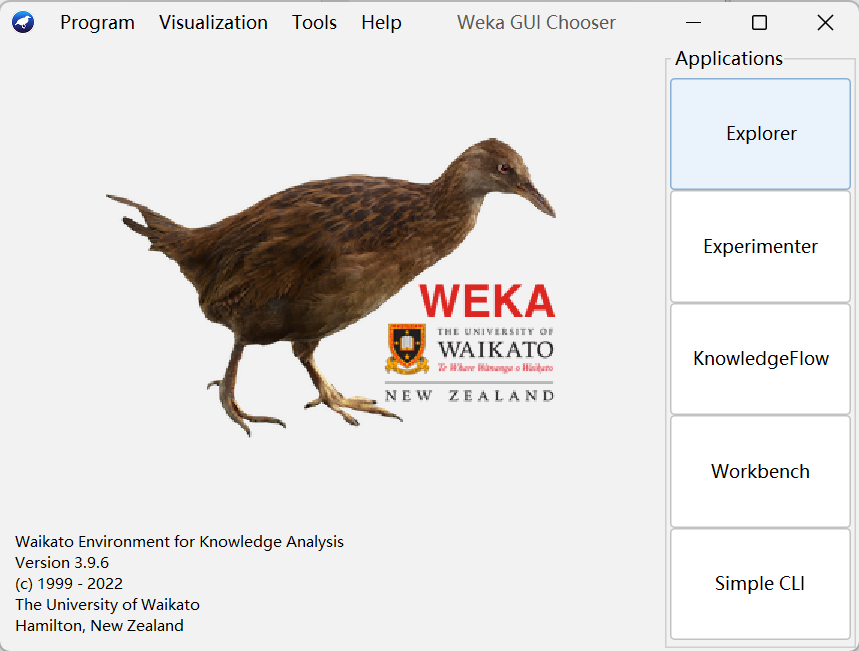

# Weka 概述

2023-12-11, 20:17
@author Jiawei Mao
****

## 简介

WEKA 包含机器学习算法和相关的数据预处理工具，由新西兰的怀卡托大学开发，全称为 Waikato Environment for Knowledge Analysis，即怀卡托智能分析环境。WEKA 用 Java 编写，GNU 许可。近年来，WEKA还添加了对大数据，如 Hadoop 的支持。

WEKA 支持大量机器学习相关的算法：

- 100+ 分类算法
- 75 数据预处理
- 25 特征提取辅助算法
- 20 聚类算法

另外，还支持编程语言，包括 Matlab, R, Python, Java 等。

## 使用方式

WEKA 的使用有多种方式：

| 使用方式               | 说明                 |
| ---------------------- | ------------------------ |
| Explorer               | GUI，可批量处理数据     |
| Knowledge flow         | GUI，可选择WEKA组件进行流程化分析，还支持增量式数据处理 |
| Experimental           | GUI，支持不同算法的对比                                 |
| Command Line Interface | 通过命令行访问，支持增量分析数据                        |

## 插件系统

WEKA 为了降低维护难度，以及方便纳入社区贡献，开发了包管理系统插件 `packages`。用户可浏览和安装感兴趣的插件。

在 GUI Chooser 面板选择 Tools 菜单可以打开 Package Manager 界面：

{width="500"}

{width="600"}

包管理器分两部分，上面显示包列表，下面显示当前选择包的信息。用户可以选择安装任意包的指定版本。

包管理器只显示 WEKA 的官方包，即这些包已经提交给 WEKA 团队进行粗略的审查，并且它们的元数据已经添加到官方的中央元数据库中。**非官方包**则不会出现在包管理器中，此时可以通过右上角的 File/URL 来安装。
