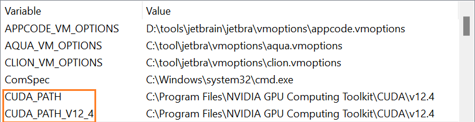
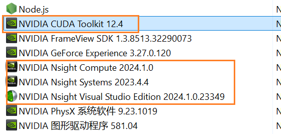

# CUDA

## 查看显卡配置

```sh
$ nvidia-smi
```

```
+-----------------------------------------------------------------------------------------+
| NVIDIA-SMI 581.04                 Driver Version: 581.04         CUDA Version: 13.0     |
+-----------------------------------------+------------------------+----------------------+
| GPU  Name                  Driver-Model | Bus-Id          Disp.A | Volatile Uncorr. ECC |
| Fan  Temp   Perf          Pwr:Usage/Cap |           Memory-Usage | GPU-Util  Compute M. |
|                                         |                        |               MIG M. |
|=========================================+========================+======================|
|   0  NVIDIA GeForce RTX 4080      WDDM  |   00000000:01:00.0  On |                  N/A |
|  0%   44C    P5             24W /  320W |    1418MiB /  16376MiB |      4%      Default |
|                                         |                        |                  N/A |
+-----------------------------------------+------------------------+----------------------+
```

这里显示，显卡驱动为 581.04，CUDA Version 为 13.0。因此能安装的 CUDA 最高版本为 13.0.

查看显卡驱动与 CUDA 的兼容图：https://docs.nvidia.com/cuda/cuda-toolkit-release-notes/index.html

根据下表，显卡驱动版本足够高，可以安装所有 CUDA 版本。

| CUDA Toolkit                                      | Toolkit Driver Version      |                               |
| ------------------------------------------------- | --------------------------- | ----------------------------- |
|                                                   | Linux x86_64 Driver Version | Windows x86_64 Driver Version |
| CUDA 13.0 Update 2                                | >=580.95.05                 | N/A                           |
| CUDA 13.0 Update 1                                | >=580.82.07                 | N/A                           |
| CUDA 13.0 GA                                      | >=580.65.06                 | N/A                           |
| CUDA 12.9 Update 1                                | >=575.57.08                 | >=576.57                      |
| CUDA 12.9 GA                                      | >=575.51.03                 | >=576.02                      |
| CUDA 12.8 Update 1                                | >=570.124.06                | >=572.61                      |
| CUDA 12.8 GA                                      | >=570.26                    | >=570.65                      |
| CUDA 12.6 Update 3                                | >=560.35.05                 | >=561.17                      |
| CUDA 12.6 Update 2                                | >=560.35.03                 | >=560.94                      |
| CUDA 12.6 Update 1                                | >=560.35.03                 | >=560.94                      |
| CUDA 12.6 GA                                      | >=560.28.03                 | >=560.76                      |
| CUDA 12.5 Update 1                                | >=555.42.06                 | >=555.85                      |
| CUDA 12.5 GA                                      | >=555.42.02                 | >=555.85                      |
| CUDA 12.4 Update 1                                | >=550.54.15                 | >=551.78                      |
| CUDA 12.4 GA                                      | >=550.54.14                 | >=551.61                      |
| CUDA 12.3 Update 1                                | >=545.23.08                 | >=546.12                      |
| CUDA 12.3 GA                                      | >=545.23.06                 | >=545.84                      |
| CUDA 12.2 Update 2                                | >=535.104.05                | >=537.13                      |
| CUDA 12.2 Update 1                                | >=535.86.09                 | >=536.67                      |
| CUDA 12.2 GA                                      | >=535.54.03                 | >=536.25                      |
| CUDA 12.1 Update 1                                | >=530.30.02                 | >=531.14                      |
| CUDA 12.1 GA                                      | >=530.30.02                 | >=531.14                      |
| CUDA 12.0 Update 1                                | >=525.85.12                 | >=528.33                      |
| CUDA 12.0 GA                                      | >=525.60.13                 | >=527.41                      |
| CUDA 11.8 GA                                      | >=520.61.05                 | >=520.06                      |
| CUDA 11.7 Update 1                                | >=515.48.07                 | >=516.31                      |
| CUDA 11.7 GA                                      | >=515.43.04                 | >=516.01                      |
| CUDA 11.6 Update 2                                | >=510.47.03                 | >=511.65                      |
| CUDA 11.6 Update 1                                | >=510.47.03                 | >=511.65                      |
| CUDA 11.6 GA                                      | >=510.39.01                 | >=511.23                      |
| CUDA 11.5 Update 2                                | >=495.29.05                 | >=496.13                      |
| CUDA 11.5 Update 1                                | >=495.29.05                 | >=496.13                      |
| CUDA 11.5 GA                                      | >=495.29.05                 | >=496.04                      |
| CUDA 11.4 Update 4                                | >=470.82.01                 | >=472.50                      |
| CUDA 11.4 Update 3                                | >=470.82.01                 | >=472.50                      |
| CUDA 11.4 Update 2                                | >=470.57.02                 | >=471.41                      |
| CUDA 11.4 Update 1                                | >=470.57.02                 | >=471.41                      |
| CUDA 11.4.0 GA                                    | >=470.42.01                 | >=471.11                      |
| CUDA 11.3.1 Update 1                              | >=465.19.01                 | >=465.89                      |
| CUDA 11.3.0 GA                                    | >=465.19.01                 | >=465.89                      |
| CUDA 11.2.2 Update 2                              | >=460.32.03                 | >=461.33                      |
| CUDA 11.2.1 Update 1                              | >=460.32.03                 | >=461.09                      |
| CUDA 11.2.0 GA                                    | >=460.27.03                 | >=460.82                      |
| CUDA 11.1.1 Update 1                              | >=455.32                    | >=456.81                      |
| CUDA 11.1 GA                                      | >=455.23                    | >=456.38                      |
| CUDA 11.0.3 Update 1                              | >= 450.51.06                | >= 451.82                     |
| CUDA 11.0.2 GA                                    | >= 450.51.05                | >= 451.48                     |
| CUDA 11.0.1 RC                                    | >= 450.36.06                | >= 451.22                     |
| CUDA 10.2.89                                      | >= 440.33                   | >= 441.22                     |
| CUDA 10.1 (10.1.105 general release, and updates) | >= 418.39                   | >= 418.96                     |
| CUDA 10.0.130                                     | >= 410.48                   | >= 411.31                     |
| CUDA 9.2 (9.2.148 Update 1)                       | >= 396.37                   | >= 398.26                     |
| CUDA 9.2 (9.2.88)                                 | >= 396.26                   | >= 397.44                     |
| CUDA 9.1 (9.1.85)                                 | >= 390.46                   | >= 391.29                     |
| CUDA 9.0 (9.0.76)                                 | >= 384.81                   | >= 385.54                     |
| CUDA 8.0 (8.0.61 GA2)                             | >= 375.26                   | >= 376.51                     |
| CUDA 8.0 (8.0.44)                                 | >= 367.48                   | >= 369.30                     |
| CUDA 7.5 (7.5.16)                                 | >= 352.31                   | >= 353.66                     |
| CUDA 7.0 (7.0.28)                                 | >= 346.46                   | >= 347.62                     |

## 安装

下载地址：https://developer.nvidia.com/cuda-toolkit-archive

下载后，双击直接安装。

安装完成后，可以查看环境变量：



我们这里安装的 CUDA 12.4.

在命令行验证是否安装好：

```sh
$ nvcc --version
nvcc: NVIDIA (R) Cuda compiler driver
Copyright (c) 2005-2024 NVIDIA Corporation
Built on Tue_Feb_27_16:28:36_Pacific_Standard_Time_2024
Cuda compilation tools, release 12.4, V12.4.99
Build cuda_12.4.r12.4/compiler.33961263_0
```

## 卸载

