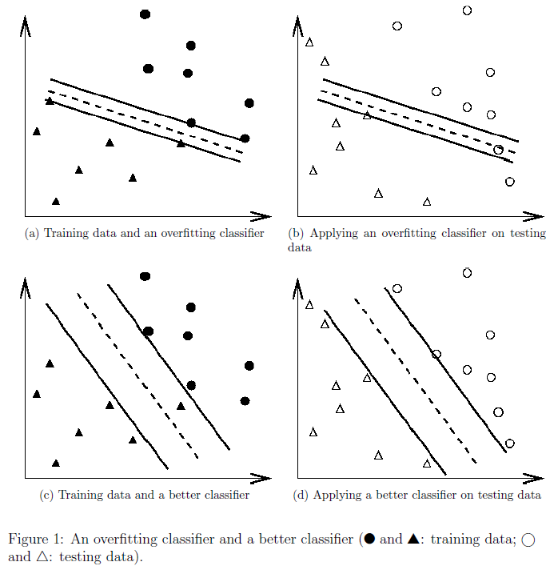
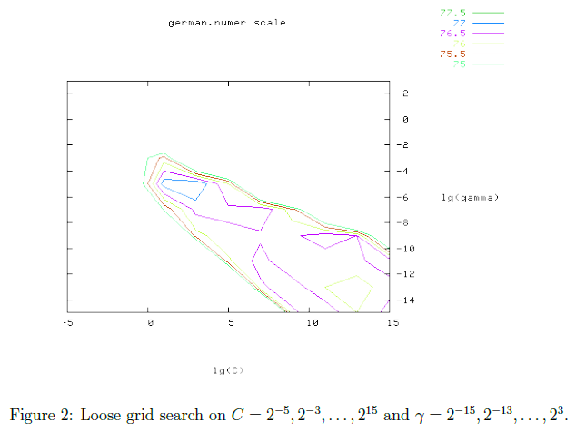
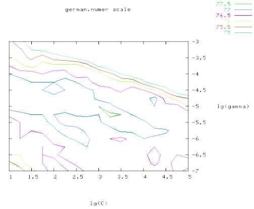

# LIBSVM 指南

2025-05-13
@author Jiawei Mao
***

## 简介
支持向量机（SVMs）是一种用于数据分类的高性能监督学习算法。虽然 SVM 相比神经网络要简单，但是不熟悉 SVM 的用户开始上手时难以获得满意的结果。下面的内容是告诉如何正确的使用 SVM 以获得合理的结果。

该文章不适合于 SVM 研究人员（过于简单），因为无法保证结果准确性最高。其目的是方便新手快速入门。

虽然用户不需要了解 SVM 的基本理论，不过我们还是简单介绍一下最基本的一点知识，方便后续的解释说明。

## 分类问题
一个分类算法一般将数据分为训练数据集和测试数据集。训练数据中的每个实例都包含一个目标值（或分类标签）和多个属性（也称为features, observed variables）。SVM 基于训练数据集生成一个模型，然后使用该模型推断测试数据的目标值。

对训练数据集 $(X_i, y_i)$, $i=1,..,l$，其中 $X_i\in R^n$, $y\in \{1, -1\}^l$，SVM 需要解决如下的优化问题：

$\underset{w,b,\xi}{min} (\frac{1}{2}\bold{w}^T\bold{w}+C\displaystyle\sum_{i=1}^l\xi_i)$

且满足：

$y_i(w^T\varnothing(X_i)+b)\geq1-\xi_i$

其中：

$\xi_i\geq0$

在这里训练数据向量 $X_i$ 由函数 $\varnothing$ 映射到高维空间。SVM 在此高维空间中找到具有最大边界的线性分隔超平面。$C > 0$ 是误差项的惩罚参数。

另外，$K(X_i, X_j) \equiv \varnothing(X_i)^T\varnothing(X_j)$ 称为核函数。四个最基本的核函数：
- 线性：$K(X_i, X_j)=X_i^TX_j$
- 多项式：$K(X_i, K_j)=(\gamma X_i^TX_j+r)^d$, $\gamma > 0$
- 径向基函数（Radial basic function ,RBF）: $K(X_i, X_j)=exp(-\gamma\lVert X_i-X_j\rVert^2)$, $\gamma > 0$
- S形函数（sigmoid）: $K(X_i, X_j)=tanh(\gamma X_i^TX_j+r)$

其中，$\gamma, r, d$ 为核函数的参数。

## 实例
下面是一个具体实例。数据集由我们用户提供，他们一开始无法获得合理的准确性。

|Applications|#training data|#testing data|#features|#classes|Accuracy by users|Accuracy by our procedure|
|---|---|---|----|----|---|---|
|Astroparticle|3,089|4,000|4|2|75.2%|96.9%|
|Bioinformatics|391|0|20|3|36%|85.2%|
|Vehicle|1,243|41|21|2|4.88%|87.8%|

通过该教程他们最终获得了较合理的准确性，[测试数据集位置](https://www.csie.ntu.edu.tw/~cjlin/papers/guide/data/)。

## 推荐使用流程
大多数初学者上手使用如下流程：
- 将数据转换为 SVM 包支持的格式；
- 随机尝试一些核函数和参数
- 测试

我们建议大家采用如下的流程：
- 将数据转换为 SVM 包支持的格式；
- 对数据进行简单的缩放；
- 考虑使用 RBF 核函数 $K(x, y)=e^{-\gamma\lVert x-y\rVert^2}$;
- 通过交叉验证获得最佳的参数 $C$ 和 $\gamma$;
- 使用最佳的 $C$ 和 $\gamma$ 训练整个数据集；
- 测试

# 数据预处理
## 类属特征（Categorical Feature）
SVM 要求每个样本数据都以实数向量的形式表示。因此，如果有分类属性（categorical attribute），我们需要将它们转换为数值形式。这里我们建议使用 m 个数值表示包含 m 个类别的属性。对一个样本，一个值为1，其它都是0。例如，对包含三个分类的 {red, green, blue} 的属性，可以表示为 (0,0,1), (0,1,0), (1,0,0)。

根据以往的经验，如果属性的值不太大，使用多个值比单个数值要稳定。

## 缩放
在使用 SVM 前对数据进行缩放十分重要。[Sarle 的神经网络FAQ](http://www.faqs.org/faqs/ai-faq/neural-nets/) 解释了这种做法的重要性，该解释也适用于 SVM。缩放最大的优点是避免数值较大的特征产生比小数值特征更大的影响。且避免了计算过程的数值困难。因为内核函数通常依赖于特征向量的内积，如线性内核和多项式内核，属性值太大会导致数值计算问题。

对线性缩放建议属性值范围在 $[-1,+1]$ 或 $[0, 1]$。

针对训练数据集和测试数据集，我们必须使用相同的缩放方法。

# 选择模型
通用的内核只有四种，我们要先选择一个内核，然后选择惩罚参数 $C$。

## RBF 内核
通常首选 RBF 内核。该内核以非线性的形式将样本数据映射到高维空间，因此，相对线性内核，RBF可以处理类别和属性的关系是非线性的情况。线性内核只是 RBF 内核的一个特例，$\stackrel{\text{\textasciitilde}}{C}$。另外，sigmoid 内核在特定参数下和 RBF 的效果类似。

第二个原因是超参数的数目十分影响模型选择的复杂性。多项式内核比RBF内核超参数多很多。

最后，RBF内核具有较少的数值困难。相对RBF的 $0<K_{ij}\leq1$，多项式内核值在 degree 值大的时候，会出现无穷大 $(\gamma X_i^TX_j + r > 1)$ 或 0 $(\gamma X_i^TX_j + r < 1>)$ 的情况。

RBF 在某些情况不合适，特别是特征数目特别多的时候，此时可以使用线性内核。

## 交叉验证和网格搜索（Grid-search）
RBF 内核有两个参数： $C$ 和 $\gamma$。对一个问题，我们无法提前知道 $C$ 和 $\gamma$ 取什么值合适，因此某些模型选择（参数检索）是必须的。其目的是获得较好的 $(C, \gamma)$ 值，使得分类器可以准确的预测未知数据（如测试数据）。

在 v-fold 交叉验证中，我们首先将训练数据集等分为 v 份。将一份作为测试数据集，余下的 $v-1$ 份作为训练数据。这样，每个样本都被推断一次，交叉验证的准确度就是被准确分类数据的百分比。

使用交叉验证可以避免过拟合问题。下面使用一个二元分类问题解释过拟合问题。

实心的圆和三角为训练数据，空心的圆和三角为测试数据。

Figures 1a, 1b 由于过拟合，使用分类器的测试准确率不好。而 1c, 1d 中由于没有过拟合训练数据，其交叉验证和测试准确率都更好。

我们推荐在交叉验证中使用 "grid-search" 寻找最佳的 $C$ 和 $\gamma$ 值。测试不同的 $(C, \gamma)$，选择交叉验证准确度最好的那一对值。我们发现成指数的尝试 $C$ 和 $\gamma$ 值比较实用，例如 $C=2^{-5},2^{-3},...,2^{-15}, \gamma=2^{-15},2^{-13},...,2^{3}$

网格搜索方式特别简单直接，看着很傻。实际上，有好几种可以节省计算成本的高级方法，如近似教程验证率。不过我们采用网格搜索这种简单的方式基于两点原因：

首先，我们对那些通过近似或试探方法避免枚举参数的方式不放心。然后，因为只有两个参数，所以通过网格搜索找到合适参数的时间也不比那些高级方法长多少。并且，网格搜索可以很简单的并行化，因为每一对参数都是相互独立的。而大多数高级方法都采用迭代的形式，很难并行化。

由于实现完整的网格搜索十分耗时，因此我们建议首先采用粗粒度网格搜索，在获得一个相对较好的网格区间，再采用细粒度搜索。为了更好的解释该方法，我们针对 Statlog collection 的 german 问题进行处理。如下图所示，我们首先采用粗粒度的网格检索$(C=2^{-5},2^{-3},...,2^{15}, \gamma=2^{-15},2^{-13},...,2^{3})$，发现最佳参数组合 $(C, \gamma)$ 为 $(2^3, 2^{-5})$，对应的交叉验证率为 77.5%。

然后在 $(2^3, 2^{-5})$ 附近采用细粒度网格检索$(C=2^{1},2^{1.25},...,2^{5}, \gamma=2^{-7},2^{-6.75},...,2^{-3})$，在 $(2^{3.25}, 2^{-5.25})$ 获得更好的交叉验证率 77.6%.

再用获得的最佳 $(C, \gamma)$ 参数重新对训练数据集进行训练，得到最终的分类器。

上面的方法对上千或更多的数据效果很好。对非常大的数据集，则随机的从数据集中抽取部分数据进行网格搜索更可行。

# 讨论
在某些情况上，上面提供的分析流程不好使，此时就需要采用其他的技术，比如特征提取。这些问题就有些超纲了，不在本节范围内。我们的经验表面，该流程适用于特征不多的数据。如果有成千上万的属性，则在提供给 SVM 前，需要提取选择数据子集。