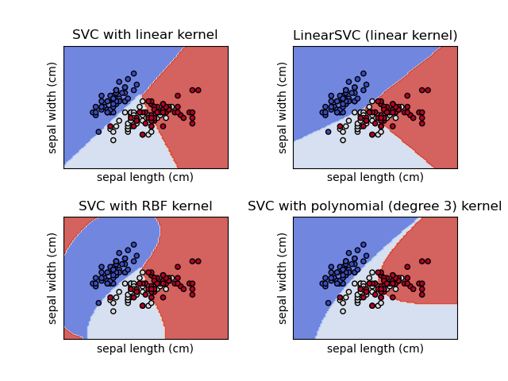

# SVM 类型

## 简介

SVM 包含一组用于分类、回归和异常值检测的监督学习方法。

SVM 的优点：

- 在高维空间有效
- 在特征数大于样本数时依然有效
- 在决策函数中使用训练数据的子集（称为支持向量，support vector），因此内存效率高
- 通用性：可以将不同的 kernel 函数指定为决策函数

SVM 缺点：

- 如果特征数远大于样本数，则在选择核函数与正则化项避免过拟合非常重要
- SVM 不直接提供概率估计，而是通过昂贵的五倍交叉验证计算

## 分类

有两种常见类型的 SVM，"epsilon-SVM" 

SVM 使用超平面进行分类，在SVM执行分类时，有两种类型：
- C SVM
- Nu SVM

C 和 nu 是正则化参数，用于对分类错误的类别进行惩罚，因此有助于提高输出的准确度。

C 值范围从 0 到无穷，因此估计起来可能有点困难，使用也难。因此对此进行修正，引入 **nu**，其范围在 [0,1]，表示样本数据支持向量的值范围。

两者有相似的分类能力，但是 nu-SVM 更难优化。

## 分类

SVC, NuSVC 和 LinearSVC 能够对数据执行二元和多元分类。

SVC 和 NuSVC 类似，但使用的参数集合略有不同，使用的数学公式也不同。LinearSVC 是对线性内核分类的快速实现，它没有 SVC 和 NuSVC 的一些属性，如 `support_`，其分类结果和分数与 `SVC`, `NuSVC` 也可能不同。

与其它分类器一样，`SVC`, `NuSVC` 和 `LinearSVC`

## 回归

## 参考

- https://scikit-learn.org/stable/modules/svm.html
