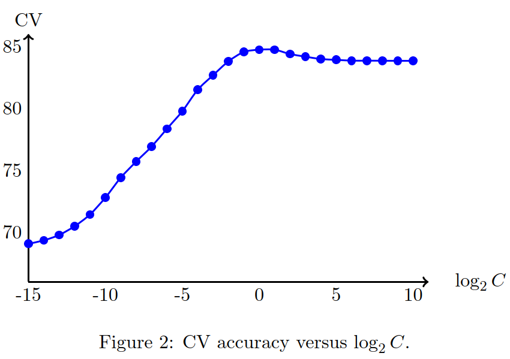

# liblinear

2025-10-24⭐
@author Jiawei Mao
***
## 简介

LIBLINEAR 是一个线性分类型，用于大量样本和特征的数据，支持：

- L2 正则化 classifier: L2-loss linear SVM, L1-loss linear SVM, logistic regression (LR)
- L1 正则化 classifier: L2-loss linear SVM, logistic regression (LR)
- L2 正则化 SVM regression：L2-loss linear SVR, L1-loss linear SVR
- L2 正则化 one-class SVM (2.40+)

LIBLINEAR 的主要特点：

- 数据格式与LIBSVM 相同，用法也类似
- multi-class 分类：one-vs-rest, Crammer & Singer
- 用于模型评估的交叉验证
- 自动参数选择
- 概率估计（仅限 logistic-regression）
- unblanced data weights
- MATLAB/Octave, Java, Python, Ruby 接口

## 快速入门

安装后提供 `train` 和 `predict` 程序，用于训练和测试。

数据格式与 LIBSVM 相同，需要注意，feature-index 从 1 开始（不是 0）。

repository 中提供了一个分类示例数据 `heart_scale`。

输入 `train heart_scale`，程序会读取训练数据，并输出模型文件 `heart_scale.model`。如果你有测试数据 `heart_scale.t`，那么输入 `predict heart_scale.t heart_scale.model output` 可以查看预测的准确率。`output` 文件包含预测的 class-labels。

 为了获得好的性能，有时需要对数据进行 scale。具体可参考 LIBSVM 的 `svm-scale` 程序。对大型稀疏数据，使用 `-l 0` 来保持数据的稀疏性。

### train

```sh
$ train [options] training_set_file [model_file]
```

选项：

- `-s type`

设置 solver 类型（默认 1）。

对 multi-class **分类**

| type | 说明                                                         |
| ---- | ------------------------------------------------------------ |
| 0    | L2-regularized logistic regression (primal)                  |
| 1    | L2-regularized L2-loss support vector classification (dual)  |
| 2    | L2-regularized L2-loss support vector classification (primal) |
| 3    | L2-regularized L1-loss support vector classification (dual)  |
| 4    | support vector classification by Crammer and Singer          |
| 5    | L1-regularized L2-loss support vector classification         |
| 6    | L1-regularized logistic regression                           |
| 7    | L2-regularized logistic regression (dual)                    |

对 regression

| type | 说明                                                      |
| ---- | --------------------------------------------------------- |
| 11   | L2-regularized L2-loss support vector regression (primal) |
| 12   | L2-regularized L2-loss support vector regression (dual)   |
| 13   | L2-regularized L1-loss support vector regression (dual)   |

对 outlier 检测

| type | 说明                                    |
| ---- | --------------------------------------- |
| 21   | one-class support vector machine (dual) |

- `-e epsilon`

设置终止条件的 tolerance。

```sh
-e epsilon : set tolerance of termination criterion
	-s 0 and 2
		|f'(w)|_2 <= eps*min(pos,neg)/l*|f'(w0)|_2,
		where f is the primal function and pos/neg are # of
		positive/negative data (default 0.01)
	-s 11
		|f'(w)|_2 <= eps*|f'(w0)|_2 (default 0.0001)
	-s 1, 3, 4, 7, and 21
		Dual maximal violation <= eps; similar to libsvm (default 0.1 except 0.01 for -s 21)
	-s 5 and 6
		|f'(w)|_1 <= eps*min(pos,neg)/l*|f'(w0)|_1,
		where f is the primal function (default 0.01)
	-s 12 and 13
		|f'(alpha)|_1 <= eps |f'(alpha0)|,
		where f is the dual function (default 0.1)
```

其它参数：

| 参数         | 说明                                                         |
| ------------ | ------------------------------------------------------------ |
| `-c cost`    | 设置参数 C，默认 1                                           |
| `-p epsilon` | 设置 epsilon-SVR  loss-function 的 epsilon (默认 0.1)        |
| `-n nu`      | 设置 one-class SVM 的参数 nu (默认 0.5)                      |
| `-B bias`    | 如果 `bias>=0`，instance x 变为 `[x;bias]`，如果 `<0`，则不添加 bias (默认 -1) |
| `-R`         | 不对 bias 正则化，必须使用 `-B 1` 添加 bias；如果不确定，则不要使用，用于 `-s 0,2,5,6,11` |
| `-wi weight` | 对不同类别参数 C 的权重                                      |
| `-v n`       | n-fold CV 模式                                               |
| `-C`         | 查找参数，用于 `-s 0,2` 搜索 C，用于 `-s 11` 搜索 `C, p`     |
| `-q`         | quiet mode                                                   |

选项 `-v` 随机将数据拆分为 `n` 份并计算交叉验证准确性。

选项 `-C` 在不同参数下进行交叉验证，以找到最佳参数。仅限于 `-s 0`, `-s 2` 查找 `C`，以及 `-s 11` 查找  `C` 和 `p`。如果未指定 solver，这里默认用 `-s 2`。

### predict

```sh
$ predict [options] test_file model_file output_file
```

选项：

- `-b probability_estimates`

是否输出概率估计，0 或 1（默认 0）。目前只支持 logistic regression

- `-q` quiet mode

注意，`-b` 只用于预测阶段，这与 LIBSVM 的设置不同。

### 示例

```sh
$ train data_file
```

使用 L2-loss 函数训练 linear SVM。

```sh
$ train -s 0 data_file
```

训练 logistic regression 模型。

```sh
$ train -s 21 -n 0.1 data_file
```

训练一个线性 one-class SVM，选择大约 10% 的数据作为 outliers。

```sh
$ train -v 5 -e 0.001 data_file
```

使用 L2-loss SVM 执行 5-fold CV。使用比默认 0.1 更小的终止 tolerance，如 0.001 可以得到更精确的解。

```sh
$ train -C data_file
...
Best C = 0.000488281  CV accuracy = 83.3333%
$ train -c 0.000488281 data_file
```

使用 L2-loss SVM 执行多次 CV 以找到 CV 精度最高的参数 $C$。然后使用所选参数 $C$ 来训练数据获得模型。

```sh
$ train -C -s 0 -v 3 -c 0.5 -e 0.0001 data_file
```

使用 `-C` 选择参数，用户可以指定其它 solver，目前支持 `-s 0`, `-s 2` 和 `-s 11`，以及不同的 CV fold。还可以使用 `-c` 指定最小的 `C`，当用户想要在不同设置下从指定 $C$ 重新运行参数选择，该选项很有用，例如，采用更严格的终止 tolerance `-e 0.0001`。同样，对 `-s 11`，可以使用 `-p` 指定搜索的最大 `p` 值。

```sh
$ train -c 10 -w1 2 -w2 5 -w3 2 four_class_data_file
```

训练 4 个 classifiers

```
positive        negative        Cp      Cn
class 1         class 2,3,4.    20      10
class 2         class 1,3,4.    50      10
class 3         class 1,2,4.    20      10
class 4         class 1,2,3.    10      10
```

```sh
$ train -c 10 -w3 1 -w2 5 two_class_data_file
```

如果只有两个类别，则只训练一个模型。两个类别的 $C$ 值分别为 10 和 50.

```sh
$ predict -b 1 test_file data_file.model output_file
```

输出估计概率值（仅限于逻辑回归）。

## 使用库

LIBLINEAR 的函数和数据结构在头文件 `linear.h` 中声明。可以查看 `train.c` 和 `predict.c` 了解如何使用它们。在 `linear.h` 中声明了 `LIBLINEAR_VERSION` 字段，为 LIBLINEAR 版本。 

```c
model* train(const struct problem *prob,
                const struct parameter *param);
```

根据训练数据和参数构造并返回一个线性分类或回归模型。

struct `problem` 为数据集：

```c
struct problem
{
    int l, n;
    double *y;
    struct feature_node **x;
    double bias;
};
```

其中，`l` 为样本数。如果 `bias >= 0`，则在每个样本数据后添加一个 feature。`n` 为 feature 数（包括当 `bias >= 0` 时添加的 bias feature）。`y` 是包含 target 值的数组，对分类为 integers，对回归为 reals。`x` 为数组指针每个指针指向一个训练向量的稀疏表示。即 `feature_node` 数组。

例如，假设有如下训练数据
```
LABEL       ATTR1   ATTR2   ATTR3   ATTR4   ATTR5
-----       -----   -----   -----   -----   -----
1           0       0.1     0.2     0       0
2           0       0.1     0.3    -1.2     0
1           0.4     0       0       0       0
2           0       0.1     0       1.4     0.5
3          -0.1    -0.2     0.1     1.1     0.1
```

并且 `bias=1`，那么 problems 的组成为：

```
l = 5
n = 6

y -> 1 2 1 2 3

x -> [ ] -> (2,0.1) (3,0.2) (6,1) (-1,?)
     [ ] -> (2,0.1) (3,0.3) (4,-1.2) (6,1) (-1,?)
     [ ] -> (1,0.4) (6,1) (-1,?)
     [ ] -> (2,0.1) (4,1.4) (5,0.5) (6,1) (-1,?)
     [ ] -> (1,-0.1) (2,-0.2) (3,0.1) (4,1.1) (5,0.1) (6,1) (-1,?)
```

struct `parameter` 描述线性分类和回归模型的参数：

```c
struct parameter
{
        int solver_type;

        /* these are for training only */
        double eps;             /* stopping tolerance */
        double C;
        double nu;              /* one-class SVM only */
        int nr_weight;
        int *weight_label;
        double* weight;
        double p;
        double *init_sol;
        int regularize_bias;
        bool w_recalc;  /* for -s 1, 3; may be extended to -s 12, 13, 21 */
};
```

`solver_type` 包括：L2R_LR, L2R_L2LOSS_SVC_DUAL, L2R_L2LOSS_SVC, L2R_L1LOSS_SVC_DUAL, MCSVM_CS, L1R_L2LOSS_SVC, L1R_LR, L2R_LR_DUAL, L2R_L2LOSS_SVR, L2R_L2LOSS_SVR_DUAL, L2R_L1LOSS_SVR_DUAL, ONECLASS_SVM.

具体而言：

```
  for classification
    L2R_LR                L2-regularized logistic regression (primal)
    L2R_L2LOSS_SVC_DUAL   L2-regularized L2-loss support vector classification (dual)
    L2R_L2LOSS_SVC        L2-regularized L2-loss support vector classification (primal)
    L2R_L1LOSS_SVC_DUAL   L2-regularized L1-loss support vector classification (dual)
    MCSVM_CS              support vector classification by Crammer and Singer
    L1R_L2LOSS_SVC        L1-regularized L2-loss support vector classification
    L1R_LR                L1-regularized logistic regression
    L2R_LR_DUAL           L2-regularized logistic regression (dual)
  for regression
    L2R_L2LOSS_SVR        L2-regularized L2-loss support vector regression (primal)
    L2R_L2LOSS_SVR_DUAL   L2-regularized L2-loss support vector regression (dual)
    L2R_L1LOSS_SVR_DUAL   L2-regularized L1-loss support vector regression (dual)
  for outlier detection
    ONECLASS_SVM          one-class support vector machine (dual)
```

`C` 是违反约束的 cost。

`p` 是支持向量回归 loss 的敏感性。

`nu` 是 `ONECLASS_SVM` 中 outlier 数据的近似比例。

`eps` 为停止标准。

`nr_weight`, `weight_label`, `weight` 用于更改某些类别的惩罚（默认为 1）。当输入数据类别不平衡，或者错误分类 cost 不对称时非常有用。

`nr_weight` 为数组 `weight_label` 和 `weight` 中的元素个数。`weight[i]` 和 `weight_label[i]` 一一对应，即类别 `weight_label[i]` 的 penalty 按 `weight[i]` 进行缩放。

如果不需要修改任何类别的 penalty，则只需要将 `nr_weight` 设置为 0.

`init_sol` 包含厨师权重向量，仅部分 solver 支持。

`regularize_bias` 为 bias 正则化 flag，默认为 1。如果不需要正则化 bias，则将其设置为 0，并将 `problem` 中的 bias 设置为 1。（不要随便使用）

`w_recalc` 表示使用基于 dual 的 solver 优化后是否重新计算 `w`。当数据稀疏时，该操作可能进一步降低 `weight` 密度。默认 `false` 以提高效率。目前它仅在 `-s 1` 和 `-s 3` 有效。

> [!NOTE]
>
> 为了避免参数出错，在调用 `train()` 之前应使用 `check_parameter()` 检查参数。

struct `model` 保存训练获得的模型：

```c
struct model
{
        struct parameter param;
        int nr_class;           /* number of classes */
        int nr_feature;
        double *w;
        int *label;             /* label of each class */
        double bias;
        double rho;             /* one-class SVM only */
};
```


## 实用指南
2025-10-24⭐

***

### 1. 何时使用 Linear 而不是 Nonlinear

1. feature 数 >> 样本数
2. feature 和样本都很多，如文本分类

这两类情况推荐 linear-kernel。

当样本数 >> feature 数，则推荐非线性 kernel。

> [!WARNING]
>
> 当数据集不大，应该首先考虑 LIBSVM。

### 2. 准备数据（特别是文档数据）

LIBLINEAR 可以用于 一般问题，当对文档数据特别有用。下面讨论如何将文档转换为 LIBLINEAR 的输入格式。

分类问题的数据通常以如下形式表示：

```
label feature 1, feature 2, . . ., feature n
```

表示文档最流行的方法是词袋（bag-of-words）模型，即将每个单词看作一个 feature。假设一个文档包含以下两句话：

```
This is a simple sentence.
This is another sentence.
```

可以将该文档转换为以下欧式向量：

```
a an · · · another · · · is · · · this · · ·
1 0  · · ·    1  · · ·  2   · · ·   2 · · ·
```

feature "is" 的值为 2，因为 "is" 在文档中出现两次。这类数据通常就有以下两个属性：

1. feature 数很大
2. 每个 instance 都是稀疏的，因为大多数 feature 值为 0

以一个 20-class 数据集 [news20](https://www.csie.ntu.edu.tw/~cjlin/libsvmtools/datasets/multiclass.html#news20) 为例，第一个样本为：

```
1 197:2 321:3 399:1 561:1 575:1 587:1 917:1 1563:1 1628:3 1893:1 3246:1 4754:2
6053:1 6820:1 6959:1 7571:1 7854:2 8407:1 11271:1 12886:1 13580:1 13588:1
13601:2 13916:1 14413:1 14641:1 15950:1 20506:1 20507:1
```

每个 (index:value) 表示一个单词的词频（term frequency, TF）。在实践中，可能会删除 stop-words 提取词干（只使用词根），这里不讨论这些细节。

生成文档特征向量的现有方法包括：

1. TF：term frequency
2. TF-IDF: term frequency, inverse document frequency
3. binary: 每个 feature 指示某个单词是否出现在文档中

例如，news20 样本的 binary-feature 向量为：

```
1 197:1 321:3 399:1 561:1 575:1 587:1 917:1 1563:1 1628:3 1893:1 3246:1 4754:1
6053:1 6820:1 6959:1 7571:1 7854:1 8407:1 11271:1 12886:1 13580:1 13588:1
13601:1 13916:1 14413:1 14641:1 15950:1 20506:1 20507:1
```

经验表明，如果正确应用归一化（normalization），那么 binary 和 TF-IDF 通常很有用。

### 3. Normalization

在分类问题中，数据中很大的值会导致以下问题：

1. 数值范围较大的 feature 可能占主导
2. 用于训练的优化方法更耗时

典型的措施是对特征数据进行 scale。

> [!TIP]
>
> 对稀疏数据，将 feature 缩放到 [0,1] 比 [-1,1] 更合适，因为后者会导致数据包含许多 non-zeros 元素。

不过对文档数据，使用简单的 instance-wise 归一化就足够了。每个instance 都成为一个单位向量，如下所示：

```
1 197:0.185695 321:0.185695 399:0.185695 561:0.185695 575:0.185695 587:0.185695
917:0.185695 1563:0.185695 1628:0.185695 1893:0.185695 3246:0.185695 4754:0.185695
6053:0.185695 6820:0.185695 6959:0.185695 7571:0.185695 7854:0.185695 8407:0.185695
11271:0.185695 12886:0.185695 13580:0.185695 13588:0.185695 13601:0.185695
13916:0.185695 14413:0.185695 14641:0.185695 15950:0.185695 20506:0.185695 20507:0.185695
```

这里有 29 个 non-zero features，因此每个值为 $1/\sqrt{29}$。使用 LIBLINEAR 在 news20 上运行 5-fold CV 查看准确性。使用 TF features 的原始数据 ：

```sh
$ time ./train -v 5 news20
Cross Validation Accuracy = 80.433%
23.709s
```

在计算过程中，多次出现以下警告：

```
WARNING: reaching max number of iterations
```

如果将数据转换为 binary，然后归一化，得到：

```
$ time ./train -v 5 news20.scale
Cross Validation Accuracy = 84.7129%
5.213s
```

显然，归一化数据的运行时间更短，并且没有警告消息。

另外，还有将 TF-IDF feature 进行 log 转换得到单位长度的特征向量。

### 4. 选择 Solvers

LIBLINEAR 提供了许多 solvers，如何选择？幸运的是，这些 solver 通常性能相似。有些 solvers 实际上生成相同的模型，指示在解决 primal 或 dual 优化问题方面有所不同。例如，`-s 1` 求解 dual L2 正则化 LS-loss SVM，而 `-s 2` 求解 primal。

```sh
$ ./train -s 1 -e 0.0001 news20.scale
(skipped)
Objective value = -576.922614
nSV = 3540
$./train -s 2 -e 0.0001 news20.scale
(skipped)
iter 8 f 5.769e+02 |g| 4.126e-02 CG 4 step_size 1.00e+00
iter 9 f 5.769e+02 |g| 6.076e-03 CG 7 step_size 1.00e+00
```

每个 run 都会训练 20 个 two-class 模型，上面只显示最后一个模型的 objective-value。显然，dual objective-value -576.922614 与 primal-value 5.769e+02 一致。这里使用 `-e` 选项设置更小的停止 tolerance，从而更准确地解决优化问题。

虽然 LIBLINEAR 的 solvers 具有相似的性能，但它们的训练时间可能不同。对 **L2 正则化问题**的 solver，选择指南：

|          | dual-based solver (坐标下降)                                 | primal-based solver (牛顿型) |
| -------- | ------------------------------------------------------------ | ---------------------------- |
| 特点     | 某些情况很快，但也可能非常慢                                 | 大多数情况速度适中           |
| 何时使用 | 1. 适当 scale 的大型稀疏数据（如文档），且 C 不大<br />2. # instances << #features | 其它情况                     |

**建议**：

1. 首先尝试默认的 dual-based solver
2. 如果很慢，再尝试 primal-based solver

对 L1 正则化问题，目前只提供 primal-based solver。

对正则化的选择，则建议先尝试 L2，除非需要稀疏模型。在大多数情况，L1 正则化的准确性较低，而且训练速度较慢。

从 2.42 之后，如果 dual-based solver 在指定的最大迭代次数后无法收敛，LIBLINEAR 会自动切换到 primal solver。例如，如果使用 `-s 1` 来求解 L2 正则化 L2-loss SVM：

```sh
$ time ./train news20
(skipped)
WARNING: reaching max number of iterations
Switching to use -s 2

init f 3.516e+02 |g| 4.552e+02
iter 1 f 3.299e+02 |g| 9.844e+01 CG 4 step_size 1.00e+00
iter 2 f 3.284e+02 |g| 8.542e+01 CG 7 step_size 1.00e+00
iter 3 f 3.280e+02 |g| 2.699e+01 CG 2 step_size 1.00e+00
(skipped)
```

`-s 1` 采用的坐标下降法对这个问题收敛很慢。然后，LIBLINEAR 自动切换到 `-s 2`，即用 primal Newton 方法。可以看到，切换 solver 后，只需要几次迭代训练就完成了。

### 5. 分类和回归的参数选择

对线性分类，$C$ 是唯一的参数。其特点：

1. LIBLINEAR 的 solver 对 $C$ 不是很敏感，当 $C$ 大于某个值，获得的模型性能相似
2. $C$ 太大会导致训练时间较长，尽量避免

如下所示，下图中显示 C 和 CV 准确性的变化。显然，在 $C$ 足够大后 CV rates 近似。对运行时间，比较 $C=1$ 和 $C=100$ 的结果：

```sh
$ time ./train -c 1 news20.scale
2.109s
$ time ./train -c 100 news20.scale
8.304s
```



可以看到，C 越大训练时间越长。这里采用基于dual 坐标下降的方法。对基于 primal 的牛顿方法，运行时间受 C 变化的影响较小：

```sh
$ time ./train -c 1 -s 2 news20.scale
5.013s
$ time ./train -c 100 -s 2 news20.scale
5.448s
```

虽然用户可以自己尝试一些 $C$ 值，但是 LIBLINEAR 2.0+ 提供了寻找合适参数的方法。如果使用基于 primal 的分类 solver `-s 0` 或 `-s 2`，`-C` 选项可以有效地进行多次交叉验证自动找到最佳参数：

```sh
$ ./train -C -s 2 news20.scale
Doing parameter search with 5-fold cross validation.
log2c= -15.00 rate=69.0806
log2c= -14.00 rate=69.3505
(skipped)
log2c= 9.00 rate=83.8406
log2c= 10.00 rate=83.8406
WARNING: maximum C reached.
Best C = 1 CV accuracy = 84.738%
```

用户不需要指定 $C$ 的范围，因为 LIBLINEAR 会自动找到合理的范围。当然，用户依然可以用 $-c$ 来指定最小 $C$值。例如：

```sh
$ ./train -C -s 2 -c 0.5 -e 0.0001 news20.scale
Doing parameter search with 5-fold cross validation.
log2c= -1.00 rate=84.5623
log2c= 0.00 rate=84.7254
(skipped)
log2c= 9.00 rate=83.6586
log2c= 10.00 rate=83.6398
WARNING: maximum C reached.
Best C = 1 CV accuracy = 84.7254%
```

> [!IMPORTANT]
>
> 找到最佳 $C$ 后，用户必须使用相同的 solver 来训练模型。从基于 primal 的 solver 切换到相应的基于 dual 的 solver 是可以的（从 `-s 2` 到 `-s 1`），因为它们会得到相同模型。

有些 solvers，如 `-s 5` 和 `-s 6` 无法使用 `-C` 选项。此时可以使用 LIBSVM 提供的 `grid.py` 参数选择工具找到最佳 $C$ 值。例如：

```sh
$ ./grid.py -log2c -14,14,1 -log2g null -svmtrain ./train -s 5 news20.scale
```

检查 $C\in \{2^{-14},2^{-13},...,2^{14}\}$ 所有 C 值。注意，仅当 $-C$ 选项不可用时再使用 `grid.py`，因为 `-C` 选项比 `grid.py` 快很多。

对回归问题，还有一个额外的 $\epsilon$ 参数。从 2.3+ 开始，$-C$ 选项也会自动找到最佳 $\epsilon$ 值。用法相同，但可以使用 `-p` 选项指定搜索的最大 $\epsilon$ 值。例如：

```sh
$ ./train -C -s 11 -c 0.5 -p 2 -e 0.0001 news20.scale
```

搜索的范围包括 $C\in [0.5,\infty)$ 和 $\epsilon\in [0,2]$。

##  API

三个关键方法：

- ``Linear.train(…)``
- `Linear.predict(…)`
- `Linear.predictProbability(…)`

## API 使用示例

### heart 数据集


## 参考

- https://github.com/cjlin1/liblinear
- https://www.csie.ntu.edu.tw/~cjlin/liblinear/