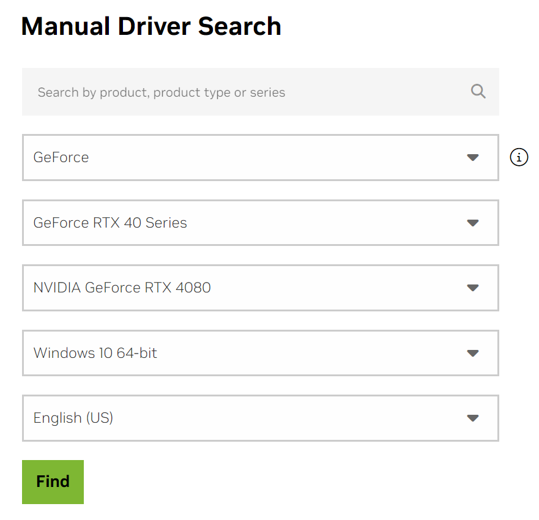
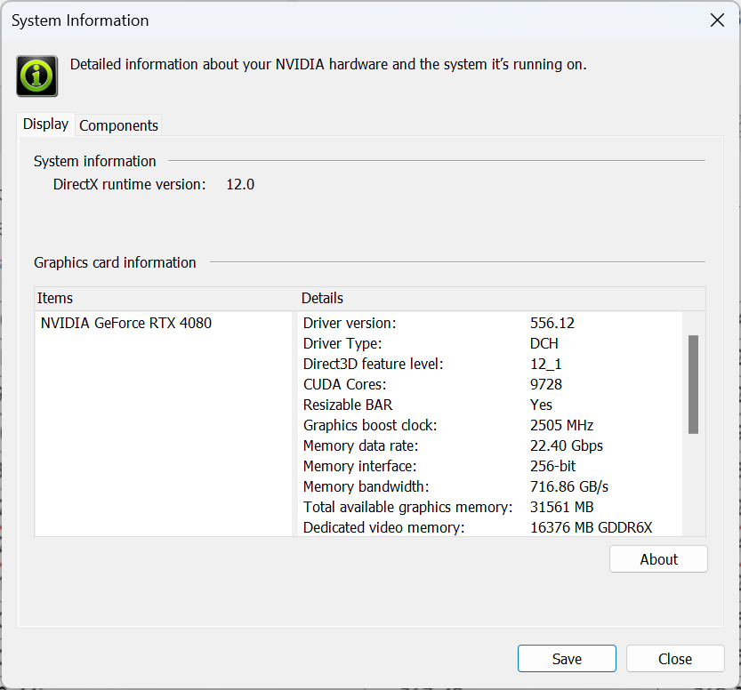
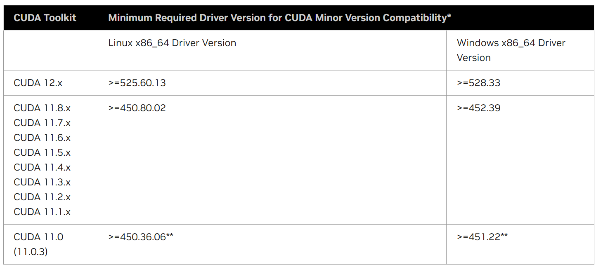
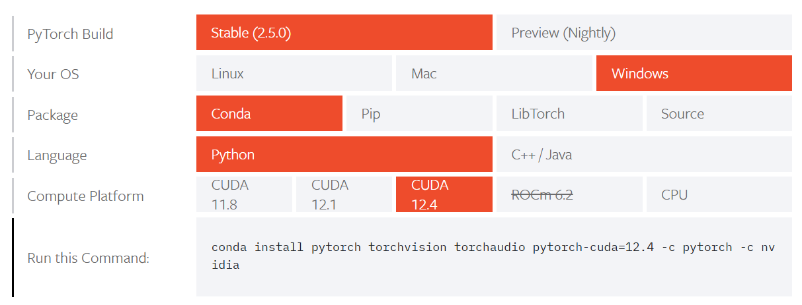

# PyTorch 安装

## 使用 Wheel 文件安装

文件位置：https://download.pytorch.org/whl

### Conda 安装

CUDA 一般最好选择最新版。

```
conda install pytorch torchvision torchaudio pytorch-cuda=12.4 -c pytorch -c nvidia
```

## GPU

1. 驱动
2. cuDNN
3. CUDA

> [!NOTE]
>
> 现在 PyTorch 不需要单独安装 cuDNN 和 CUDA，`conda` 会自动安装相关依赖项。

### 安装驱动

根据显卡类型，安装驱动：

https://www.nvidia.com/en-us/drivers/



在 NVIDIA 控制面板 -> Help -> System Information 查看驱动版本：



根据驱动版本确定兼容的 CUDA 版本：



在 PyTorch 安装页面，查看兼容的 CUDA 版本：



这里 CUDA 12.4 符合显卡和 PyTorch 要求。

下载 CUDA:

https://developer.nvidia.com/cuda-toolkit-archive

### 安装 CUDA

1. 安装 cuda
2. 验证 cuda 是否安装好

```powershell
$nvcc -V
nvcc: NVIDIA (R) Cuda compiler driver
Copyright (c) 2005-2022 NVIDIA Corporation
Built on Tue_Mar__8_18:36:24_Pacific_Standard_Time_2022
Cuda compilation tools, release 11.6, V11.6.124
Build cuda_11.6.r11.6/compiler.31057947_0
```

**安装 cuDNN**

1. 下载：https://developer.nvidia.com/cudnn
2. 解压
3. 将 cudnn/bin 目录添加到环境变量

## 验证安装

运行如下代码：

```python
import torch

x = torch.rand(5, 3)
print(x)
```

输出：

```
tensor([[0.8086, 0.1943, 0.4405],
        [0.1033, 0.7635, 0.2127],
        [0.0595, 0.1819, 0.3198],
        [0.7168, 0.9443, 0.4810],
        [0.1276, 0.5531, 0.7920]])
```

检查 GPU 是否可用：

```python
import torch
torch.cuda.is_available()
```

