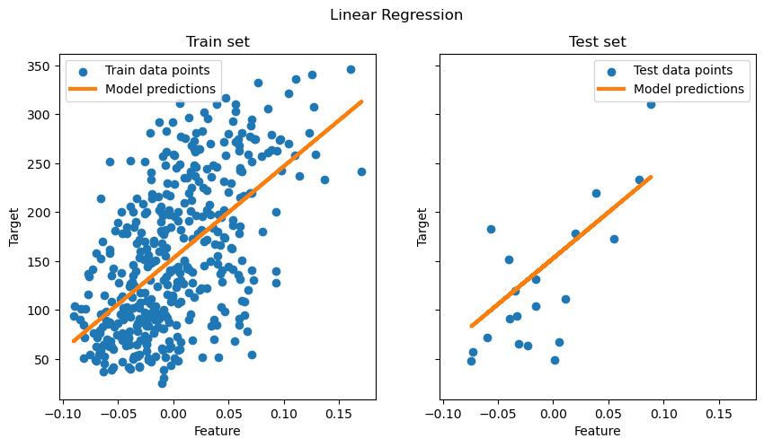
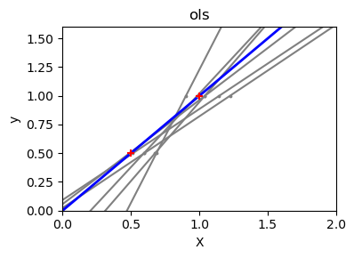
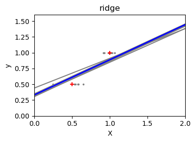

# 普通最小二乘回归和脊回归

2026-01-06⭐
@author Jiawei Mao
***

## 简介

**普通最小二乘**

演示如何在糖尿病数据集的单个特征上使用普通最小二乘模型（OLS）`LinearRegression` 。使用数据集的子集进行训练，在测试集上进行评估，并对预测结果可视化。

**普通最小二乘和脊回归方法**

展示当数据稀疏或噪声大时，OLS 出现高方差。脊回归（Ridge）通过乘法（缩小）系数来减少这种方法，从而使预测更稳定。

## 准备数据

加载 diabetes 数据集。为简单起见，只保留数据集的一个特征，然后拆分为训练集和测试集。

```python
from sklearn.datasets import load_diabetes
from sklearn.model_selection import train_test_split

X, y = load_diabetes(return_X_y=True)
X = X[:, [2]]  # Use only one feature
X_train, X_test, y_train, y_test = train_test_split(X, y, test_size=20, shuffle=False)
```

## 线性回归模型

创建一个线性回归模型，并将其拟合到训练数据上。注意，模型默认会拟合截距，通过设置 `fit_intercept` 参数可以控制该行为。

```python
from sklearn.linear_model import LinearRegression

regressor = LinearRegression().fit(X_train, y_train)
```

## 模型评估

在测试集上使用均方误差和决定系数（coefficient of determination）评估模型性能：

```python
from sklearn.metrics import mean_squared_error, r2_score

y_pred = regressor.predict(X_test)

print(f"Mean squared error: {mean_squared_error(y_test, y_pred):.2f}")
print(f"Coefficient of determination: {r2_score(y_test, y_pred):.2f}")
```

```
Mean squared error: 2548.07
Coefficient of determination: 0.47
```

## 绘图

将拟合结果可视化到训练和测试数据上。

```python
import matplotlib.pyplot as plt

fig, ax = plt.subplots(ncols=2, figsize=(10, 5), sharex=True, sharey=True)

ax[0].scatter(X_train, y_train, label="Train data points")
ax[0].plot(
    X_train,
    regressor.predict(X_train),
    linewidth=3,
    color="tab:orange",
    label="Model predictions",
)
ax[0].set(xlabel="Feature", ylabel="Target", title="Train set")
ax[0].legend()

ax[1].scatter(X_test, y_test, label="Test data points")
ax[1].plot(X_test, y_pred, linewidth=3, color="tab:orange", label="Model predictions")
ax[1].set(xlabel="Feature", ylabel="Target", title="Test set")
ax[1].legend()

fig.suptitle("Linear Regression")

plt.show()
```



OLS 在该单特征数据集上学习了一个线性函数，以最小化训练数据的均方误差。通过观察模型在测试集上 $R^2$ 打分和均方误差来判断泛化性的好坏。对高维数据，纯 OLS 通常会过拟合，尤其是数据有噪声的时候。**正则化技术**（如 Ridge 和 Lasso）可以减少这种情况。

## 普通最小二乘和脊回归方差

接下来，使用一个小型合成数据集解释方差高的问题。只采样两个数据点，然后反复添加小的高斯噪声，并重新拟合 OLS 和 Ridge。绘制每条新的拟合线，看看 OLS 拟合线的变化，而 Ridge 由于惩罚项而更稳定。

```python
import matplotlib.pyplot as plt
import numpy as np

from sklearn import linear_model

X_train = np.c_[0.5, 1].T
y_train = [0.5, 1]
X_test = np.c_[0, 2].T

np.random.seed(0)

classifiers = dict(
    ols=linear_model.LinearRegression(), ridge=linear_model.Ridge(alpha=0.1)
)

for name, clf in classifiers.items():
    fig, ax = plt.subplots(figsize=(4, 3))

    for _ in range(6):
        this_X = 0.1 * np.random.normal(size=(2, 1)) + X_train
        clf.fit(this_X, y_train)

        ax.plot(X_test, clf.predict(X_test), color="gray")
        ax.scatter(this_X, y_train, s=3, c="gray", marker="o", zorder=10)

    clf.fit(X_train, y_train)
    ax.plot(X_test, clf.predict(X_test), linewidth=2, color="blue")
    ax.scatter(X_train, y_train, s=30, c="red", marker="+", zorder=10)

    ax.set_title(name)
    ax.set_xlim(0, 2)
    ax.set_ylim((0, 1.6))
    ax.set_xlabel("X")
    ax.set_ylabel("y")

    fig.tight_layout()

plt.show()
```





## 总结

- 在第一个示例，将 OLS 应用于真实数据集，展示普通线性模型如何通过最小化训练集的平方误差来拟合数据
- 在第二个实例中，每次添加噪声，OLS 线都会发生很大变化，这反应数据集稀疏或有噪声时的高方差；相比之下，Ridge 回归引入一个正则化项可以缩小稀疏，稳定预测

Ridge 和 Lasso 是提高泛化能力、减少过拟合的常用方法。当特征相关、数据噪声大或样本较小时，通过 tune 的 Ridge 或 Lasso 通常优于纯 OLS。

## 参考

- https://scikit-learn.org/stable/auto_examples/linear_model/plot_ols_ridge.html