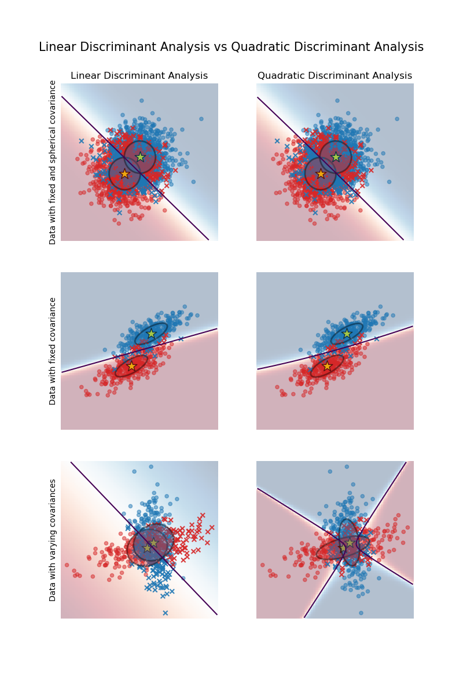

# 线性和二次判别分析

## 简介

线性判别分析（`LinearDiscriminantAnalysis`）和二次判别分析是两个经典的分类器，顾名思义，它们分别定义一个线性决策面和一个二次决策面。

它们都有封闭形式的解，且易于计算，本质上是多类，在实践中效果挺好，并且没有需要调优的超参数。

该图显示线性判别分析和二次判别分析的决策边界。最小面一行表明，线性判别分析只能学习线性边界，而二次判别分析可以学习二次边界，因此更加灵活。

## 使用线性判别分析进行降维

`LinearDiscriminantAnalysis` 可用来执行监督降维，将输入数据投影到线性子空间。输出的维度必然少于类别数量，所以这通常是一个相当强的降维手段，只在 multiclass 设置中有意义。

降维在 `transform` 方法中实现。期望的维度可以用 `n_components` 参数设置。该参数对 `fit` 和 `predict` 方法没有影响。

## LDA 和 QDA 的数学公式

LDA 和 QDA 都是从简单的概率模型中推导出来，模型对每个类 $k$ 的数据的条件分布 $P(X|y=k)$ 进行建模。然后使用贝叶斯理论对**每个训练样本** $x\in \mathcal{R}^d$ 进行预测：
$$
P(y=k | x) = \frac{P(x | y=k) P(y=k)}{P(x)} = \frac{P(x | y=k) P(y = k)}{ \sum_{l} P(x | y=l) \cdot P(y=l)}
$$
选择最大化该后验概率的类别 $k$。

## 参考

- https://scikit-learn.org/stable/modules/lda_qda.html
