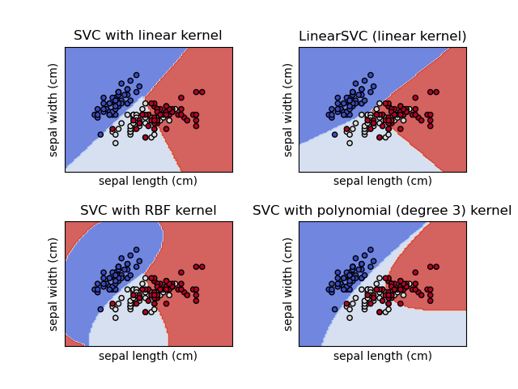
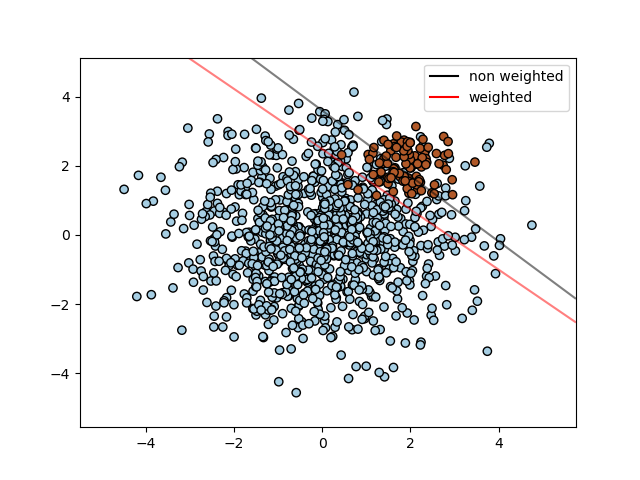
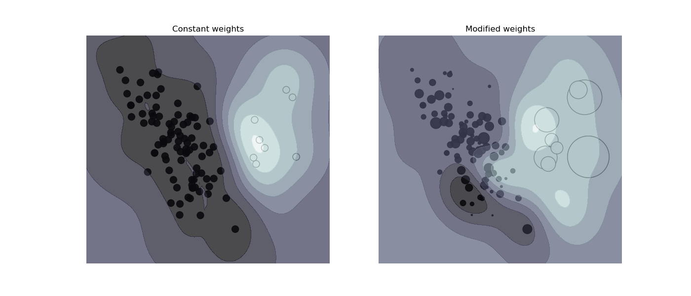
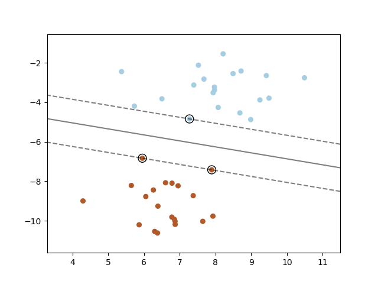

# 支持向量机

## 简介

支持向量机（Support vector machines, SVM）是一套用于分类、回归和离群值检测的**监督学习**算法。

SVM 的优点：

- 在高维空间有效
- 当维数大于样本数仍有效
- 决策函数只使用训练集的部分数据（称为支持向量），因此内存效率也高
- 多功能：可以为决策函数制定不同的核函数，提供了通用 kernel，也可以自定义 kernel

SVM 的缺点：

- 如果特征数远大于样本数，选择 kernel 函数和正则化项对避免过拟合非常重要
- SVM 不直接提供概率估计，概率值需要使用昂贵的 5-fold 交叉验证计算

scikit-learn 中的 SVM 支持密集 (`numpy.ndarray`) 和稀疏（`scipy.sparse`）样本向量作为输入。但是，要用 SVM 对稀疏数据进行预测，拟合时也必须采用稀疏数据。为了获得最佳性能，土建使用 C-ordered `numpy.ndarray` (dense)或 `scipy.sparse.csr_matrix`(sparse)，`dtype=float64`。

## 分类

`SVC`, `NuSVC` 和 `LinearSVC` 支持 binary 和 multi-class 分类。



`SVC` 和 `NuSVC` 方法相似，当接受参数不同，数学表达式也不同。

`LinearSVC` 是另一种更快的线性 kernel SVM 分类实现，它缺少 `SVC` 和 `NuSVC` 的一些特性，比如 `support_`。`LinearSVC` 使用 `squared_hinge` loss，基于 `liblinear` 实现，如果考虑截距，它也会对截距正则化。不过，通过仔细调整 `intercept_scaling` 参数可以减少该影响，使得截距项与其它特征相比具有不同的正则化行为。`LinearSVC` 的分类结果和打分与其他两个 classifier 可能也不同。

与其它 classifier 一样，`SVC`, `NuSVC` 和 `LinearSVC` 输入为两个数组：保存训练样本 shape 为 `(n_samples, n_features)` 的 `X`  数组，保存 class-labels shape 为 `(n_samples)`的数组 `y`：

```python
>>> from sklearn import svm
>>> X = [[0, 0], [1, 1]]
>>> y = [0, 1]
>>> clf = svm.SVC()
>>> clf.fit(X, y)
SVC()
```

拟合完成后，可用模型预测新的值：

```python
>>> clf.predict([[2., 2.]])
array([1])
```

SVM 的决策函数依赖于训练集的某个子集，称为支持向量。这些支持向量的属性可以通过 `support_vectors_`, `support_` 和 `n_support_` 查询。

```python
>>> # get support vectors
>>> clf.support_vectors_
array([[0., 0.],
       [1., 1.]])
>>> # get indices of support vectors
>>> clf.support_
array([0, 1]...)
# get number of support vectors for each class
>>> clf.n_support_
array([1, 1]...)
```

### Multi-class 分类

`SVC` 和 `NuSVC` 为 multi-class 分类实现了 one-versus-one (ovo) 方法，该方法构建 `n_classes * (n_classes - 1)/2` 个 classifiers，每个 classifier 使用两个类别的数据训练。在内部，solver 总是使用这种 ovo 策略训练模型。但是 `decision_function_shape` 参数默认为 `"ovr"` (one-vs-rest)，通过将 "ovo" 决策函数转换为 shape 为 `(n_samples, n_classes)` 的 "ovr" 决策函数，以与其它 classifier 的接口保持一致。

```python
>>> X = [[0], [1], [2], [3]]
>>> Y = [0, 1, 2, 3]
>>> clf = svm.SVC(decision_function_shape='ovo')
>>> clf.fit(X, Y)
SVC(decision_function_shape='ovo')
>>> dec = clf.decision_function([[1]])
>>> dec.shape[1] # 6 classes: 4*3/2 = 6
6
>>> clf.decision_function_shape = "ovr"
>>> dec = clf.decision_function([[1]])
>>> dec.shape[1] # 4 classes
4
```

另外，`LinearSVC` 实现 "one-vs-rest" multi-class 策略，训练 `n_classes` 模型。

```python
>>> lin_clf = svm.LinearSVC()
>>> lin_clf.fit(X, Y)
LinearSVC()
>>> dec = lin_clf.decision_function([[1]])
>>> dec.shape[1]
4
```

### 打分和概率

`SVC` 和 `NuSVC` 的 `decision_function` 方法为每个样本提供每个类别的得分（对 binary 每个样本只有一个分数）。如果将构造选项 `probability` 设置为 `True`，则启用类别概率估计（`predict_proba` 和 `predict_log_proba` 方法）。在 binary 情况，通过 Platt 缩放校准概率：对 SVM score 进行逻辑回归，并通过训练数据的额外交叉验证拟合。对 multi-class 情况，对其进行扩展。

> [!NOTE]
>
> 所有 estimator 都可以通过 `CalibratedClassifierCV` 获得相同的概率校准功能。对 `SVC` 和 `NuSVC`，该过程内置在 `libsvm` 中，因此不依赖 scikit-learn 的 `CalibratedClassifierCV`。

Platt 缩放涉及的交叉验证对大型数据集是一项昂贵操作。此外，概率估计可能与分数不一致：

- 打分的 "argmax" 与概率的可能不同
- 在 binary 分类中，某个样本即使 `predict_proba` 输出的概率小于 0.5，也可能被 `predict` 标记输出 positive 类别；同样，即使 `predict_proba` 输出大于 0.5，它也可能被标记为 negative

Platt 方法还存在理论问题。如果需要置信分数，但不一定是概率，则建议设置 `probability=false`，然后使用 `decision_function` 而不是 `predict_proba`。

注意，当 `decision_function_shape='ovr'` 且 `n_classes > 2`，与 `decision_function` 函数不同，`predict` 方法默认不处理平局。设置 `break_ties=True` 可以使 `predict` 的输出与 `np.argmax(clf.decision_function(...), axis=1)` 的输出一致，否则在平局情况，总是返回第一个类别。

### 不平衡问题

在需要更加重视某些类别户某些样本时，可以使用 `class_weight` 和 `sample_weight`。

`SVC` (不是 `NuSVC`) 在 `fit` 方法中实现了参数 `class_weight`。它是一个形式为 `{class_label: value}` 的 dict，其中 value 是 >0 的浮点数，用于将 `class_label` 的参数 `C` 设置为 `C * value`。下图展示了包含权重修正不包含权重修正时不平衡问题的决策边界：



`SVC`, `NuSVC`, `SVR`, `NuSVR`, `LinearSVC`, `LinearSVR` 和 `OneClassSVM` 在 `fit` 方法中通过 `sample_weight` 参数实现样本权重。与 `class_weight` 参数类似，它将地 `i` 个样本的 `C` 设置为 `C * sample_weight[i]`，鼓励分类器正确处理这些样本。下图展示样本权重对决策边界的影响。圆圈大小与样本权重成正比 ：



##  回归

支持向量分类（Support Vector Classification , SVC）方法可以扩展到回归问题，称为 Support Vector Regression (SVR)。

SVC 生成的模型仅依赖于训练集的一个子集，因为构建模型的 loss 函数不关心超出 margin 的训练数据。类似地，SVR 生成的模型仅取决于训练数据的子集，因为 loss 函数忽略预测值与 target 值接近的样本。

SVR 有三种不同实现：`SVR`,`NuSVR` 和 `LinearSVR`。`LinearSVR` 是线性 kernel SVR 实现，比 `SVR` 更快，但只支持线性 kernel；`NuSVR` 实现与 `SVR` 和 `LinearSVR` 略有不同。

基于 `LinearSVR` 在 `liblinear` 中的实现，如果考虑截距，`LinearSVR` 会对截距正则化。不过通过调整 `intercept_scaling` 参数可以减少这种效应，使得解决项的正则化行为与其他特征不同。因此其分类结果和分数与其他两种也不同。

与分类一样，`fit` 方法有两个参数向量 `X` 和 `y`，只是 `y` 为浮点数而不是整数：

```python
>>> from sklearn import svm
>>> X = [[0, 0], [2, 2]]
>>> y = [0.5, 2.5]
>>> regr = svm.SVR()
>>> regr.fit(X, y)
SVR()
>>> regr.predict([[1, 1]])
array([1.5])
```

## 密度估计、novelty 检测

`OneClassSVM` 实现用于 outlier 检测的 One-Class SVM。

## 复杂性

SVM 是一个强大工具，但随着训练向量的增加，其计算和存储需求迅速增加。SVM 的核心是一个二次规划问题（QP），将支持向量与其他训练数据分离。基于 libsvm 的实现使用的 QP solver 在 $O(n_{\text{features}}\times n_{\text{samples}}^2)$ 到 $O(n_{\text{features}}\times n_{\text{samples}}^3)$ 之间，这取决于 libsvm 实际的缓存效率（取决于数据集）。如果数据非常稀疏，$n_{\text{features}}$ 可以替换为平均 non-zero features 数。

对线性情况，`LinearSVC` 算法实现 `liblinear` 比基于 libsvm 的实现 `SVC` 要高效很多，几乎可以线性扩展到上百万的样本或特征。

## 使用技巧

**避免复制数据**

对 `SVC`, `SVR`, `NuSVC` 和 `NuSVR`，如果传递给某些方法的数据不是 C-ordered 连续和 double 精度，在调用底层 C 实现前会复制。通过检测 numpy 数组的 `flags` 属性可以查看是否为 C-contiguous。

对 `LinearSVC` 和 `LogisticRegression`，输入的任何 numpy 数组都会复制并转换为 `liblinear` 的稀疏数据表示。如果需要拟合一个大规模线性 classifier，但又不想复制一个 dense numpy  C-contiguous double 数组，则建议使用 `SGDClassifier`。其目标函数可以配置为几乎与 `LinearSVC` 模型相同。

**Kernel cache size**

对 `SVC`, `SVR`, `NuSVC` 和 `NuSVR`，kernel 缓存大小对较大问题的运行时间有很大影响。如果 RAM 足够，建议将 `cache_size` 设置为高于默认值 200 MV，如 500MB 或 1000MV。

**C**

`C` 默认为 1，这是一个合理的默认值。如果数据有很多噪音，则应该减少它：减少 `C` 意味着添加更多正则化。当 `C` 增大，`LinearSVC` 和 `LinearSVR` 对 `C` 的敏感度降低，预测结果在某个阈值后停止改善。但是，增大 `C` 值会提高训练时间，有时甚至高达 10 倍。

**scale**

SVM 算法并非尺度不变，因此**强烈推荐对数据进行缩放**。例如，将输入向量 `X` 的每个属性缩放到 [0,1] 或 [-1,+1]，或者标准化为均值为 0，方差为 1。注意，对测试数据必须应用相同缩放才能得到有意义的结果。使用 `Pipeline` 可以轻松完成

```python
>>> from sklearn.pipeline import make_pipeline
>>> from sklearn.preprocessing import StandardScaler
>>> from sklearn.svm import SVC

>>> clf = make_pipeline(StandardScaler(), SVC())
```

**shrinking**

当迭代次数很大，`shrinking` 可以缩短训练时间。然而，如果松散地解决优化问题（例如，通过使用较大的 stopping-tolerance），不使用 `shrinking` 会快很多。

**nu**

`NuSVC`, `OneClassSVM` 和 `NuSVR` 中的 `nu` 参数近似训练误差与支持向量的比例。

**class_weight**

在 `SVC` 中，如果数据不平黄，例如很多正例、少量负例，可以设置 `class_weight='balanced'` 或者尝试不同 `C` 值。

**随机性**

`SVC` 和 `NuSVC` 底层使用一个随机数生成器对数据洗牌以估计概率（当 `probability` 设置为 `True`）。该随机性可以通过 `random_state` 参数控制。如果 `probability` 设置为 `False`，那么 estimator 就不是随机的，此时 `random_state` 参数无效。`OneClassSVM` 的底层实现与 `SVC` 和 `NuSVC` 类似。由于 `OneClassSVM` 没有概率估计，因此不是随机的。

`LinearSVC` 底层实现在使用双坐标下降拟合模型时（`dual` 设置为 `True`）使用随机数生成器来选择特征。因此，相同输入数据的结果略有不同很正常。如果发生该情况，可以尝试更小的 `tol` 参数。该随机性可以用 `random_state` 参数控制。当 `dual` 设置为 `Flase`，`LinearSVC` 的底层实现不是随机的，此时 `random_state` 参数无效。

**L1 penalization**

使用 `LinearSVC(penalty='l1', dual=False)` 提供的 L1 惩罚项生成稀疏解，即只有少数特征权重不为 0，这些特征才对决策函数有贡献。增加 `C` 值会产生更复杂的模型（选择更多特征）。使用 `l1_min_c` 可以计算出使所有权重为 0 的 null 模型对应的 `C` 值。

## Kernel 函数

kernel 函数可以是以下任一函数：

- linear: `<x,x'>`
- 多项式：$(\gamma<x,x'>+r)^d$，其中 $d$ 通过参数 `degree` 指定，$r$ 由参数 `coef0` 指定
- rbf: $\exp(-\gamma\lVert x-x'\rVert^2)$, 其中 $\gamma$ 由参数 `gamma` 指定，必须大于 0
- sigmoid: $\tanh(\gamma <x,x'>+r)$，其中 $r$ 由 `coef0` 指定

不同 kernel 通过 `kernel` 参数指定：

```python
>>> linear_svc = svm.SVC(kernel='linear')
>>> linear_svc.kernel
'linear'
>>> rbf_svc = svm.SVC(kernel='rbf')
>>> rbf_svc.kernel
'rbf'
```

### RBF Kernel 参数

用 Radial Basis Function (RBF) kernel 训练 SVM 时，必须考虑两个参数：`C` 和 `gamma`。

参数 `C` 是所有 SVM kernel 共有参数，用于训练样本分类准确性和决策面简单性之间的权衡：

- `C` 越小决策面越平滑
- `C` 越大则尽可能使训练样本分类正确

`gamma` 定义单个样本的影响力。`gamma` 越大，

正确选择 `C` 和 `gamma` 对 SVM 的性能至关重要。建议使用 `GridSearchCV` 选择参数。

## 数学公式

支持向量机在高维空间构造了一个超平面（hyper-plane），可用于分类、回归或其它任务。直观来讲，通过寻找与任何类最近数据点距离最大的超平面实现良好分离，一般而言，分离界面越大（margin），classifier 的泛化误差越小。下图为一个线性可分问题的决策函数，在分离边界（margin boundaries）有三个样本，称为支持向量（support vectors）：



当问题不是线性可分，支持向量一般是 margin boundaries 内部的样本。

### SVC

给定训练向量 $x_i\in \Reals^p$, $i=1,...,n$，分为两类，向量 $y\in \{1,-1^n\}$，目标是找到 $w\in\Reals^p$ 和 $b\in\Reals$，使得预测 $sign(w^T\phi(x)+b)$ 对大部分样本正确。

SVC 解决如下优化问题：
$$

$$


## 实现细节

内部使用 libsvm 和 liblinear 处理所有计算。使用 C 和 Cython 包装这些库。有关实现的细节和算法，请参考各自论文。

## 参考

- https://scikit-learn.org/stable/modules/svm.html