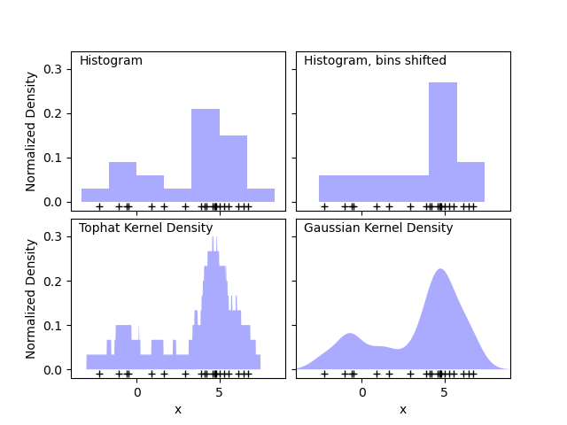
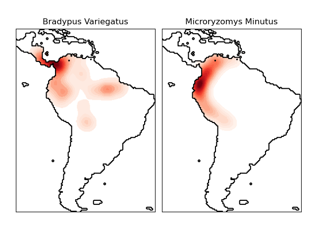
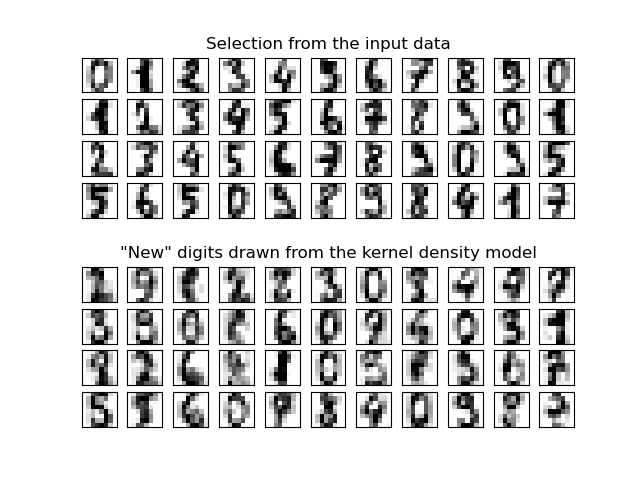

# 2.8 密度估计

2023-12-20, 21:18
@author Jiawei Mao
****
## 简介

密度估计介于无监督学习、特征工程和数据建模之间。受欢迎且实用的密度估计技术有混合模型类型的高斯混合，基于近邻方法的核密度估计。高斯混合在[聚类](https://scikit-learn.org/stable/modules/clustering.html)中有详细讨论，因为该技术也可以作为一种无监督的聚类算法。

密度估计是一个非常简单的概念，大多数人对一种常见的密度估计技术非常熟悉：直方图。

## 密度估计之直方图

直方图是一种可视化数据的简单方式，每个 bin 显示该区间包含的数据量。下图左上角就是一个直方图：



直方图的一个主要问题是，bin 位置的选择对可视化影响很大。如上图右上角，它与左上图的数据完全相同，但是 bins 整体向右移动。两个可视化的结果看起来完全不同，从而影响对数据的解释。

我们可以每个数据看作一个小方块，通过将方块堆叠在合适的网格空间中，就得到了直方图。如果我们没有将小方块堆叠在常规网格空间中，而是将小方块的中心放在它所代表的点，然后计算每个位置的总高度，该想法得到了上图左下子图。它可能没有直方图那么干净，但是数据驱动的位置意味着它是底层数据的更好表示。

这是核密度估计的一个示例，左下子图对应 top-hat 核（即每个点一个小方块）。使用更平滑的核能够得到更平滑的分布。右下子图显示了高斯核密度估计，每个点为总的分布贡献了一个高斯曲线，得到一个平滑的密度估计值，为数据分布的非参模型。

## 核密度估计

在 scikit-learn 中核密度估计实现为 `KernelDensity` 类，它使用 Ball Tree 或 KD Tree 实现高效查询。上面的示例为了便于演示使用的是 1D 数据，实际上核密度估计可以在任意多维度上执行。不过高维度会因为维度诅咒而性能下降。

下图，从双峰分布中抽取 100 个点，然后给出三种核密度估计结果：


很明显，核的形状影响了最终分布的平滑度。scikit-learn 中核密度估计的使用方法如下：

```python
>>> from sklearn.neighbors import KernelDensity
>>> import numpy as np
>>> X = np.array([[-1, -1], [-2, -1], [-3, -2], [1, 1], [2, 1], [3, 2]])
>>> kde = KernelDensity(kernel='gaussian', bandwidth=0.2).fit(X)
>>> kde.score_samples(X)
array([-0.41075698, -0.41075698, -0.41076071, -0.41075698, -0.41075698,
       -0.41076071])
```

这里使用的高斯核 `kernel='gaussian'`。核函数是由带宽（bandwidth）参数 $h$ 控制的正函数 $K(x;h)$。在一组点 $x_i;i=1\dots N$ 中，点 $y$ 处的密度估计为：
$$
p_K(y)=\sum_{i=1}^NK(y-x_i;h)
$$
这里，带宽作为平滑参数，权衡结果的偏差和方差。带宽越大密度分布越平滑，偏差也大（high-bias）；带宽越小密度分布越不平滑，方差越大（high-variance）.

参数 `bandwidth` 控制平滑程度。可以手动设置改参数，也可以使用 Scott 和 Silvermann 的估计方法。

`KernelDensity` 实现了几种常见的核，如下图所示：


| 核                  | 函数形式                               | 参数                    |
| ------------------- | -------------------------------------- | ----------------------- |
| Gaussian kernel     | $K(x;h)\propto exp(-\frac{x^2}{2h^2})$ | `kernel='gaussian'`     |
| Tophat kernel       | $K(x;h)\propto 1 \quad\text{if } x<h$ | `kernel = 'tophat'`     |
| Epanechnikov kernel | $K(x;h)\propto 1-\frac{x^2}{h^2}$ | `kernel = 'epanechnikov'` |
| Exponential kernel  | $K(x;h)\propto exp(-x/h)$ | `kernel = 'exponential'`  |
| Linear kernel       | $K(x;h)\propto 1-x/h\quad\text{if }x<h$ | `kernel = 'linear'`       |
| Cosine kernel       | $K(x;h)\propto cos(\frac{\pi x}{2h})\quad \text{if }x<h$ | `kernel = 'cosine `       |

核密度估计可以与任何有效的距离指标一起使用，尽管它仅针对欧几里得距离进行的归一化。其中 [Haversine 距离](https://en.wikipedia.org/wiki/Haversine_formula)非常有用，它计算球面上点之间的角度。下面是用核密度估计可视化地理空间数据的示例，这里显示南美洲两个物种的观测分布：



核密度估计的另一个应用是学习数据的非参生成模型，然后用该生成模型生成新的样本。下面是在数据的 PCA 投影上学习高斯核，然后用来生成新的手写数字：



新数据由输入数据的线性组成得到。


## 参考

- https://scikit-learn.org/stable/modules/density.html