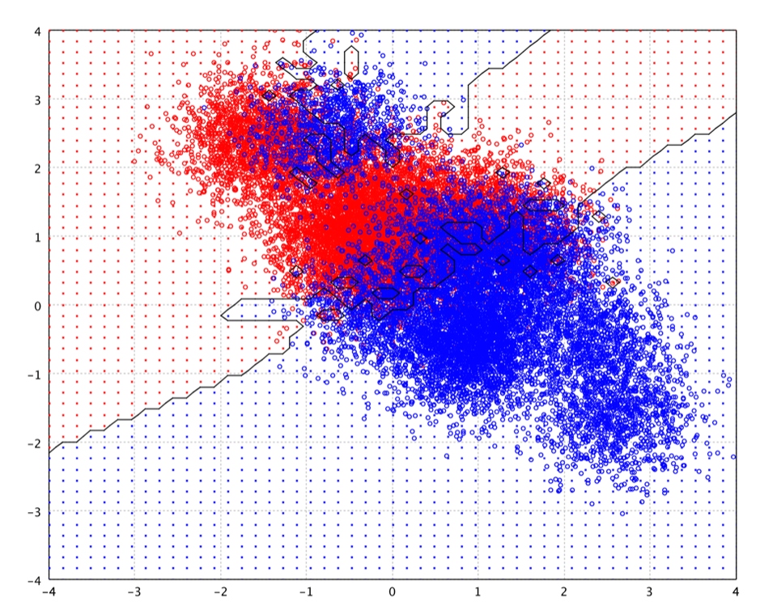
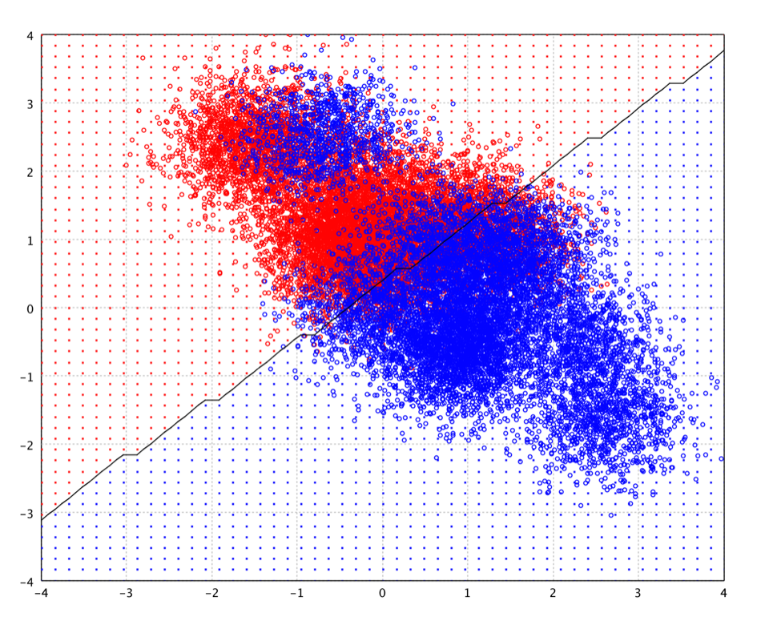
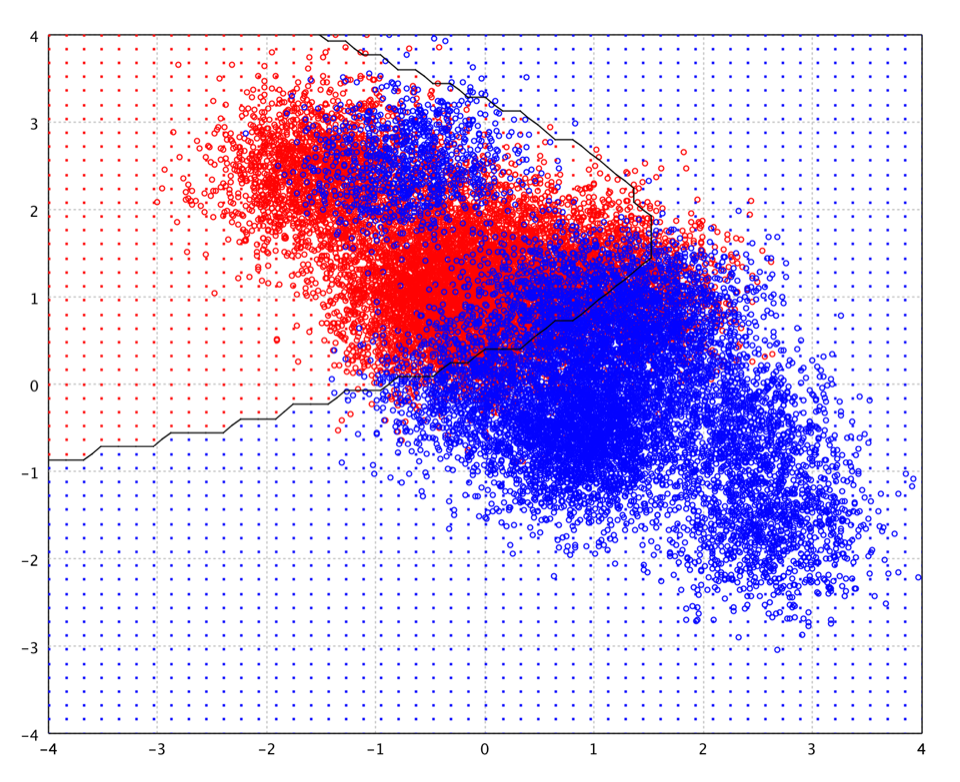
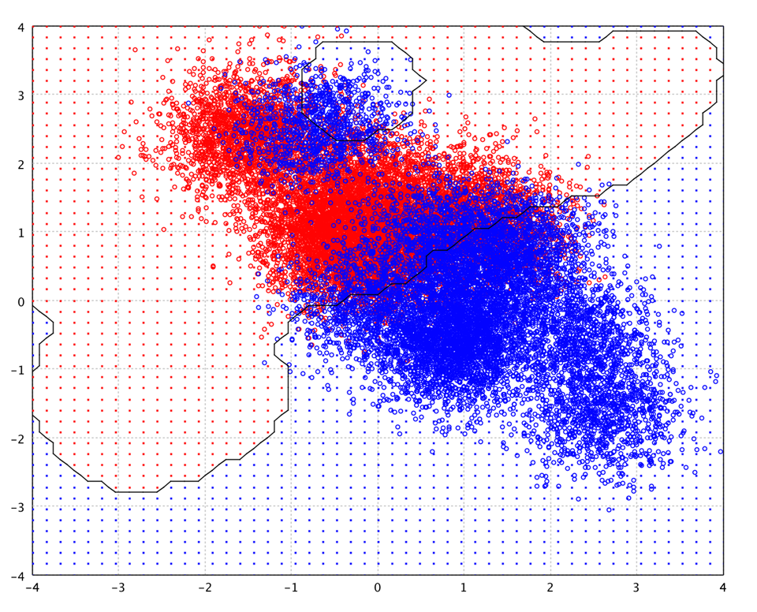

# 分类

2025-05-13
@author Jiawei Mao

***
## API 说明

Smile 的分类算法在 `smile.classification` 包中，都实现了 `Classifier` 接口，该接口包含一个 `predict` 方法，用于预测实例的类别标签。在 `SoftClassifier` 中的重载版本除了类标签外，还可以计算后验概率。

一些具有在线学习功能的算法还实现了 `OnlineClassifier` 接口。在线学习是一种归纳模型，每次学习一个实例，`update` 方法会用新实例更新模型。

高级运算符定义在 Scala 包 `smile.classification` 中。下面介绍每种算法、它们的高级 Scala API 以及示例。

## 简介

在机器学习和模式识别中，**分类**指将给定输入对象分配到指定类别之一的过程。输入对象称为**实例**（instance），类别称为类（class）。

instance 通常由一个特征向量描述，包含对实例所有已知特征的描述。特征可以分为**分类特征**（又称为名义特征 nominal，如性别“男”或“女”，血型 “A”，“B”，“O”，“AB” 等无序信息），**有序特征**（如“大”、“中”，“小”），整数值或**实数**。

**分类**通常是监督学习过程，即基于由输入对象和期望输出组成的训练集，生成一个推断函数来预测新实例的输出。如果输出是离散的，则推断函数称为**分类器**；如果输出是连续的，则推断函数称为**回归函数**。

推断函数应该能够预测任何有效输入对象的正确输出值。这要求学习算法能够以合理的方式从训练数据推广到未知情况。

监督学习算法种类繁多，各有优缺点。没有哪种学习算法能够完美解决所有监督学习问题。最广泛使用的学习算法包括 AdaBoost、梯度提升、支持向量积、线性回归、线性判别分析、Logistic 回归、朴素贝叶斯、决策树、kNN 以及神经网络。

如果特征向量包含多种**不同类型的特征**（离散型、离散有序型、计数型、连续型），有些算法将难以应用。许多算法要求输入特征为数值型，并缩放到相似范围，如 [-1,1] 区间，包括线性回归、逻辑回归、神经网络、kNN。基于距离的算法，如 kNN 和基于高斯核的支持向量机，对此尤其敏感。**决策树**以及基于决策树的 boosting 算法的优势在于它们能够轻松处理异质数据。

如果输入特征包含冗余信息（如高度相关的特征），某些学习算法（如线性回归、Logistic 回归和基于距离的方法）会由于数值不稳定性而表现不佳。这些问题通常可以通过施加某种形式的正则化来解决。

- 如果每个特征都对输出有**独立**贡献，那么基于线性函数的算法，如线性回归、logistic 回归、线性 SVM、朴素贝叶斯的表现通常良好。
- 如果特征之间存在复杂的**相互作用**，则非线性 SVM、决策树和神经网络等算法效果更好。此时线性方法也可以用，但需要手动指定特征之间的相互作用。

监督学习需要考虑以下几个问题：

**特征（Features）**

推断函数的准确性很大程度上取决于输入对象的表示方式。通常，输入对象被转换为特征向量，其中包含许多用于描述该对象的特征。由于维度灾难，特征数量不宜过多，但应包含足够信息以准确预测输出。

有许多特征选择算法，旨在选择相关特征并丢弃无关特征。如降维算法试图在训练监督学习算法之前将输入数据映射到低维空间。

**过拟合（Overfitting）**

当统计模型描述的是随机误差或噪声，而不是潜在的关系时，就发生了过拟合。过拟合通常发生在模型过于复杂时，如参数相对观测值的数量过多。过拟合模型通常预测性能较差，因为它会夸大数据中的微小波动。

过拟合不仅取决于参数和数据的相对量，还取决于模型结构与数据 shape 的契合程度，以及模型误差相对数据中噪声或误差水平的幅度。

避免过拟合的技术有交叉验证、正则化、早停法（early stopping）、剪枝（pruning）、参数的贝叶斯先验以及模型比较等，这些技术可以指示进一步训练何时无法获得更好的泛化效果。这些技术的基础：

1. 明确惩罚过于复杂的模型
2. 通过在一组训练集以外的数据上评估模型来测试模型的泛化能力，假设改数据近似于模型以后遇到的未见过的数据

**正则化（Regularization）**

正则化通过引入额外信息来防止过拟合。这些信息通常以惩罚复杂性的形式出现，例如，对平滑度的限制或向量空间范数的限制。正则化试图将奥卡姆剃刀原理应用于模型。从贝叶斯角度看，许多正则化技术相当于将某些先验分布应用于模型参数。

> [!TIP]
>
> 正则化就是设置一种偏好。当模型参数有很多解，通过引入正则化的额外偏好做选择。

**偏差-方差的权衡（bias-variance）**

均方误差（Mean Squared Error, MSE）可以分解为两部分：方差和偏差，称为偏差-方差分解（bias-variance decomposition）。为了最小化 MSE，需要同时最小化 bias 和 variance，但是这并不容易，偏差小往往意味着方差大，两者之间需要权衡。

## kNN

k 最近邻算法（k-Nearest Neighbor, kNN）是一种通过邻居投票进行分类的算法，对象类别被分配为其 k 个最近邻居中最常见的类（k 通常较小）。kNN 是一种**基于实例**的学习算法或称为**懒惰学习**，所有计算被推迟到分类时。

```java
public class KNN {
    public static KNN<double[]> fit(double[][] x, int[] y, int k);
}
```

最简单的 kNN 算法采用包含标签的数据集，以欧氏距离度量相似性。将其应用于鸢尾花数据集，当 `k=3`，10 折交叉验证的准确率为 96%。

```java
DataFrame data = Read.arff(Path.of("data\\weka\\iris.arff"));
double[][] xValues = data.drop("class").toArray();
int[] yValues = data.column("class").toIntArray();

ClassificationValidations<KNN<double[]>> classification = CrossValidation.classification(10, xValues, yValues, (x, y) -> KNN.fit(x, y, 3));
System.out.println(classification);
```

```
{
  fit time: 0.271 ms ± 0.578,
  score time: 0.768 ms ± 1.239,
  validation data size: 15 ± 0,
  error: 1 ± 1,
  accuracy: 96.67% ± 4.71,
  cross entropy: Infinity ± NaN
}
```

`k` 的最佳值取决于数据。`k` 值越大，噪声对分类的影响就越小，但类与类之间的界限越模糊。可以通过各种启发式计数，如交叉验证来选择合适的 `k`。在二分类问题中，选择 `k` 为奇数很重要，这样可以避免出现票数相同的情况。

kNN 算法具有强一致性结果。当数据量趋近于无穷时，该算法的错误率不高于贝叶斯错误率（给定数据分布时可达到的最小错误率）的 2 倍。给定某个 k 值，kNN 错误率接近贝叶斯错误率，其中 `k` 随着数据量的增加而增加。

用户还可以自定义距离函数：

```java
public class KNN {
    public static KNN<T> fit(T[] x, int[] y, int k, Distance<T> distance);
}
```

如果使用专门的算法来学习距离度量，如 Large Margin Nearest Neighbor 或 Neighborhood Components Analysis，kNN 的分类准确率可以显著提高。

另外，用户可以提供 kNN 搜索数据结构。除了简单的线性搜索，Smile 还提供了 KD-Tree、Cover-Tree 和 LSH（Locality-Sensitive Hashing），以实现高效的 k 最近邻搜索。

```java
public class KNN {
    public KNN(KNNSearch<T, T> knn, int[] y, int k);
}
```

KD-tree (即 k-dimensional tree)是一种空间划分数据结构，用于组织 k 维空间中的点。Cover-tree 是一种用于通用最紧邻搜索（带 metric）的数据结构，在维度较小的空间高效。LSH 是一种高效的近似最紧邻搜索算法，通过对数据进行概率降维，实现高维空间的数据近似。

最近邻规则以隐式方式计算决策边界。下面示例展示 kNN 在二维数据上的隐式决策边界。尝试不同的 `k`，观察决策边界的变化。通常，`k` 越大，边界越平滑。

```java
DataFrame toy = Read.csv("data\\classification\\toy200.txt", CSVFormat.DEFAULT.withDelimiter('\t'));
double[][] x = toy.select(1, 2).toArray();
int[] y = toy.column(0).toIntArray();
KNN<double[]> model = KNN.fit(x, y, 3);
```



接下来介绍能够明确计算决策边界的分类算法，从最简单的线性决策函数开始。

## 线性判别分析

线性判别分析（Linear Discriminant Analysis, LDA）基于贝叶斯理论，假设条件概率密度哈数服从正态分布，还做了同方差假设（即类协方差相同）和协方差满秩的简化假设。基于这些假设，通过自变量的线性组合判断类别。

```java
public class LDA {
    public static LDA fit(double[][] x, int[] y, double[] priori, double tol);
}
```

参数 `priori` 是每个类的先验概率。如果为 `null`，则根据训练数据估算。

参数 `tol` 用于判断协方差矩阵是否为奇异矩阵的 tolerance。该函数会拒绝方差小于 $\text{tol}^2$ 的变量。

```java
LDA.fit(x, y);
```



如图所示，LDA 的决策边界是线性的。需要注意的是，图中的决策边界是测试网格上的估计轮廓，而不是精确的决策函数，因此，存在由离散网格导致 artifact 的问题。

LDA 与方差分析（ANOVA）和线性回归密切相关，它们试图将一个因变量表示为其它特征的线性组合。与其他两种方法不同的是，在方差分析和线性回归中，因变量是数值型，而 LDA 中因变量是分类变量。logit 回归和概率回归与 LDA 更相似。这些方法适合那些无法假设自变量服从正态分布（LDA的基本假设）的应用。

## Fisher 线性判别

Fisher 线性判别（FLD）是另一种流行的线性分类器。Fisher 将两个分布之间的分离定义为类间方差与类内方差的比值，从某种意义上来说，这是类标记信噪比的度量。FLD 会找到一个特征的线性组合，使投影后的分离最大化。

```java
public class FLD {
    public static FLD fit(double[][] x, int[] y, int L, double tol);
}
```

参数 `L` 是映射空间的维数。默认值为类别数-1。

在 FLD 中，特征被映射到特征子空间。

Fisher 线性判别式和 LDA 这两个术语经常互换使用，尽管 FLD 实际上描述的时一种略有不同的判别式，但它不满足 LDA 的一些假设，例如类别服从正态分布和类协方差相等假设。当满足 LDA 的假设时，FLD 等同于 LDA。

FLD 与主成分分析（PCA）也密切相关，PCA 寻找能够最好解释数据的变量线性组合。作为一种监督方法，FLD 尝试对数据类别之间的差异进行建模。另一方面，PCA 是一种无监督方法，不考虑任何类别差异。

## 二次判别分析

二次判别分析（Quadratic Discriminant Analysis, QDA）与 LDA 类似，将条件概率密度函数建模为高斯分布，然后使用后验分布来估计测试数据的类别。

```java
public class QDA {
    public static QDA fit(double[][] x, int[] y, double[] priori, double tol);
}
```

与 LDA 不同的事，QDA 不假设每个类的协方差相同。因此，最终得到的类间分类面是二次的。



可以使用最大似然（Maximum Likelihood, ML）从训练数据估计每个类的高斯参数。然而，当训练实例的数量相对于输入空间的维度较小时，ML 无法估计协方差。

## 正则化判别分析

在正则化判别分析（Regularized Discriminant Analysis, RDA）中，每个类的正则化协方差矩阵为 $\sum_k(\alpha)=\alpha\sum_k+(1-\alpha)\sum$。

```java
public class RDA {
    public static RDA fit(double[][] x, int[] y, double alpha, double[] priori, double tol);
}
```

## Support Vector Machines

基本支持向量机（SVM）是一种二元线性分类模型，它选择两个类之间最大分离超平面进行分类。如果这样的超平面存在，则称其为最大边距超平面（maximum-margin hyperplane），对应的线性分类器称为 maximum-margin classifier.

如果不存在可以完美分隔正例和负例的超平面，那么 soft-margin 方法将选择一个尽可能干净分离正例和负例的超平面，同时最大化到距离最近拆分实例的距离。

非线性 SVM 将 kernel 应用于 maximum-margin hyperplane。生成的算法在形式上相似，只是将点积替换为 kernel 函数。这样就可以在变换 feature-space 拟合 maximum-margin hyperplane。该变换可以是非线性的，变换后的空间是高维的。例如，高斯 kernel 的 feature-space 为无限维的 Hilbert space。因此，尽管 classifier 在高维空间是一个超平面，但它在原始空间中可能是非线性的。maximum margin classifier 正则化良好，因此无限维度不会破坏结果。

```java
public class SVM {
    // Fits a binary-class linear SVM
    public static Classifier<double[]> fit(double[][] x, int[] y, 
                                           Options options);
    
    // Fits a binary-class linear SVM of binary sparse data
    public static Classifier<int[]> fit(int[][] x, int[] y, 
                                        int p, Options options);
    
    // Fits a binary-class linear SVM of binary sparse data
    public static Classifier<SparseArray> fit(SparseArray[] x, int[] y, 
                                              int p, Options options);
    
    // Fits a non-linear SVM
    public static SVM<T> fit(T[] x, int[] y, 
                             MercerKernel<T> kernel, Options options);
}
```

SVM 的有效性取决于 **kernel** 的选择、**kernel 的参数**，以及 **soft-margin 参数 C**。给定 kernel，kernel 的参数和 C 的最佳组合通常通过交叉验证的 grid-search 来选择。

分类 SVM 的实现的主要方法是将一个 multi-class 问题拆分为多个二分类问题。常用方法是构建二元分类器，区分：

1. 一个 label 与其它 label (one-versus-rest 或 one-versus-all) 的二元分类
2. 每两个 labels 之间构建一个分类器（one-versus-one）

one-versus-all 对新实例采用打分最高的类别。

one-versus-one 通过投票完成，每个 classifier 将实例分配给两个类别之一，得票最多的类别即为预测分类。

```java
public class OneVersusOne {
     public static OneVersusOne<T> fit(T[] x, int[] y, BiFunction<T[], int[], 
                                       Classifier<T>> trainer);
}

public class OneVersusRest {
     public static OneVersusRest<T> fit(T[] x, int[] y, BiFunction<T[], int[], 
                                        Classifier<T>> trainer);
}
```

```java
var zip = Read.csv("data/usps/zip.train", CSVFormat.DEFAULT.withDelimiter(' '));
var x = zip.drop(0).toArray();
var y = zip.column(0).toIntArray();
var kernel = new GaussianKernel(8.0);
var model = OneVersusRest.fit(x, y, (x, y) -> SVM.fit(x, y, kernel, 
                                                      new SVM.Options(5)));
```

当高斯核参数 $\gamma=1.0$, $C=10$，SVM 在 toy 数据集上的决策边界如下：



高斯 kernel SVM 与具有高斯径向函数的 RBF 网络具有相似结构。但是，SVM 方法自动解决了网络复杂性问题。当支持 vector/center 数量相似，当训练数据较小时，SVM 性能优于 RBF 网络；而在大型数据集上 RBF 优于 SVM。

### SVM 示例

```java
System.out.println("svmguide1");
MathEx.setSeed(19650218);

SparseDataset<Integer> train = Read.libsvm("D:\\tools\\smile-4.3.0\\data\\libsvm\\svmguide1");
SparseDataset<Integer> test = Read.libsvm("D:\\tools\\smile-4.3.0\\data\\libsvm\\svmguide1.t");

int n = train.size();
double[][] x = new double[n][4];
int[] y = new int[n];
for (int i = 0; i < n; i++) {
    SampleInstance<SparseArray, Integer> sample = train.get(i);
    for (SparseArray.Entry e : sample.x()) {
        x[i][e.index()] = e.value();
    }
    y[i] = sample.y() > 0 ? +1 : -1;
}

n = test.size();
double[][] testX = new double[n][4];
int[] testy = new int[n];
for (int i = 0; i < n; i++) {
    SampleInstance<SparseArray, Integer> sample = test.get(i);
    for (SparseArray.Entry entry : sample.x()) {
        testX[i][entry.index()] = entry.value();
    }
    testy[i] = sample.y() > 0 ? +1 : -1;
}

GaussianKernel kernel = new GaussianKernel(90);
SVM<double[]> model = SVM.fit(x, y, kernel, new SVM.Options(100));

int[] prediction = model.predict(testX);
int error = Error.of(testy, prediction);
System.out.format("Test Error = %d, Accuracy = %.2f%%%n", error, 100.0 - 100.0 * error / testX.length);
assertEquals(130, error, 10)
```

```
svmguide1
13:33:07 [main] INFO smile.base.svm.LASVM[165] - 1000 iterations, 72 support vectors
13:33:07 [main] INFO smile.base.svm.LASVM[165] - 2000 iterations, 164 support vectors
13:33:07 [main] INFO smile.base.svm.LASVM[165] - 3000 iterations, 254 support vectors
13:33:07 [main] INFO smile.base.svm.LASVM[467] - Finalizing the training by reprocess.
13:33:07 [main] INFO smile.base.svm.LASVM[457] - 3089 samples, 250 support vectors, 229 bounded
Test Error = 135, Accuracy = 96.63%
```


## 参考

- https://haifengl.github.io/classification.html