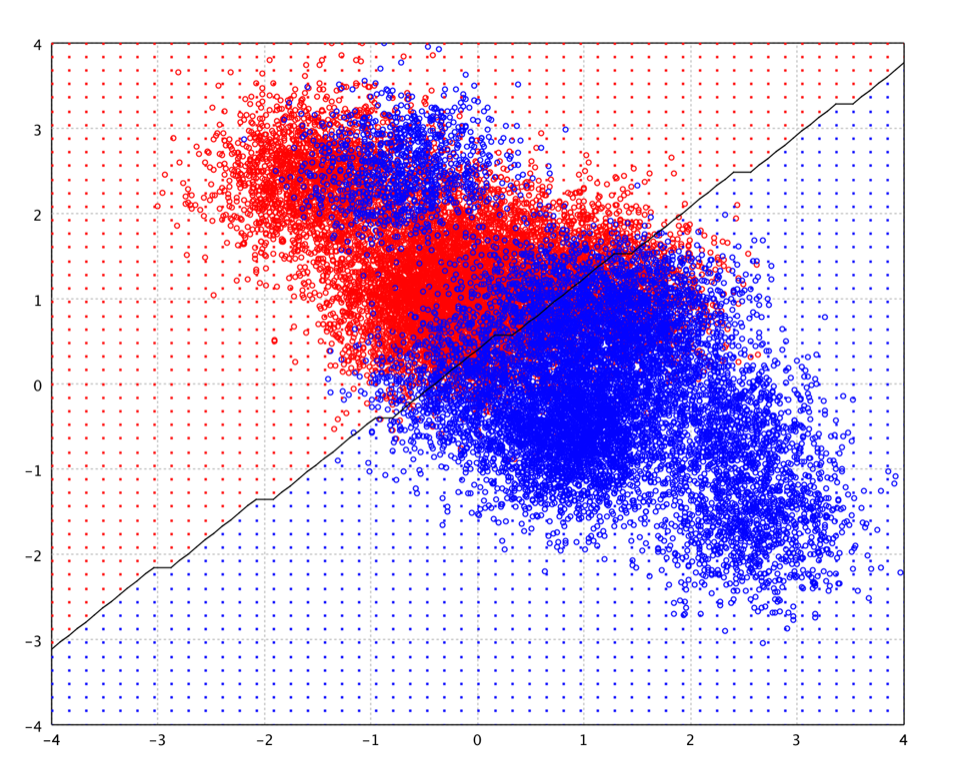

# 线性判别分析

2026-02-27
@author Jiawei Mao
***
## 简介

线性判别分析（Linear Discriminant Analysis, **LDA**）基于贝叶斯决策理论，假设条件概率密度函数服从正态分布，还做了同方差假设（即各类别协方差矩阵相同）和协方差满秩的简化假设。基于这些假设，输入样本属于某一类别的判别函数，是自变量的线性组合的一个函数。

```java
public class LDA {
    public static LDA fit(double[][] x, int[] y, double[] priori, double tol);
}
```

- 参数 `priori` 是每个类的先验概率。如果为 `null`，则从训练数据估算该参数。
- 参数 `tol` 用于判断协方差矩阵是否为奇异矩阵的 tolerance。该函数会拒绝方差小于 $\text{tol}^2$ 的变量。

```java
LDA.fit(x, y);
```



如图所示，LDA 的决策边界是**线性的**。注意：图中的决策边界是测试网格上估计的等值面，不是精确的决策函数，因此，图中存在由离散网格带来的伪影。

LDA 与方差分析（ANOVA）和线性回归密切相关，后两者同样试图将一个因变量表示为其它特征的线性组合。但是，方差分析和线性回归中，因变量是**数值型变量**，而 LDA 中因变量是**分类变量**（即分类标签）。logit 回归和概率回归与 LDA 更相似，它们同样用于解释分类变量。在不能假设自变量服从正态分布的应用场景中，这些方法比 LDA 更适用，**正态分布假设**是 LDA 的基本前提假设。

将 LDA（以及 Fisher 判别）应用于实际数据时，常会遇到一个问题：样本数量小于变量/特征的数量。此时，协方差矩阵的估计不具备满秩条件，因此无法求逆。该问题称为小样本问题。

