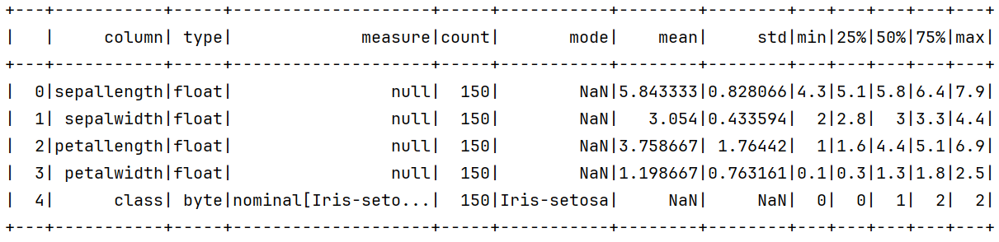

# Smile 数据处理

2025-06-05⭐
@author Jiawei Mao
***

## 特征

**特征**是被观察现象的可测量属性，又称为解释变量（explanatory variable）、自变量（independent variable）、预测变量（predictor）或回归量（regressor）等。任何属性都可以作为特征，但选择信息丰富、有区分性且独立的特征是机器学习中算法有效的关键。

特征通常是数字，一组数字特征可以方便地用特征向量描述。结构特征（如字符串、序列和图像）也用于自然语言处理、计算生物等领域。

特征工程是使用数据领域知识来创建使机器学习算法发挥作用的特征的过程。特征工程是机器学习算法应用的基础，需要对多种可能性进行实验，并将自动化技术与领域专家的直觉和知识相结合。

## 数据类型

一般来说，属性主要有两种类型：

- 定性：数据为非数字类型，如血型、性别等
- 定量：数据为计数或数值测量值。定量变量可以是离散或连续的

另一种对数据进行分类的方法是通过数据尺度。在统计学中，通常使用 4 种测量尺度（scale）：

- 名义数据（nominal）：数据值是非数字标签。如，性别变量可以定义为 male=0, female=1
- 有序数据（ordinal）：数据值是分类的，但具有某种数字意义的排序。例如，从非常不同意到同意，可以定义为从 1 到 5
- 连续数据（continuous）
  - 区间数据（interval）：数据值分布在实数区间内，两个值之间的差值有意义，但两个区间数据的比率没有意义，如温度、智商
  - 比例数据（ratio）：两个值的差值和比率都有意义，如工资、体重

许多机器学习算法只能处理数字属性，而少数算法（如决策树）可以直接处理 nominal 属性。日期属性在绘图中很有用。通过一些特征工程，日期也可以用作 nominal 属性。字符串属性可用于文本挖掘和自然语言处理。

## DataFrame

虽然有些 smile 算法可以使用 `double[]` 作为输入，但封装类 `DataFrame` 使用更多。`DataFrame` 是一种二维数据结构，就像一张 Excel 表格。每列都是一个 `ValueVector`，用于存储相同类型值的序列。`DataFrame` 中不同列可以有不同数据类型。对每个原始数据类型和通用对象类型，都有对应的 `ValueVector` 具体实现。

```java
DoubleVector v1 = ValueVector.of("A", 1.0, 2.0, 3.0);
assertEquals("A[1, 2, 3]", v1.toString());
assertEquals("A", v1.name());
assertEquals(DataTypes.DoubleType, v1.dtype());

// DateTime 类型
ObjectVector<Instant> v2 = ValueVector.of("B", Instant.now());
assertEquals(DataTypes.DateTimeType, v2.dtype());
assertEquals("B", v2.name());

// nomial 类型
ValueVector v3 = ValueVector.nominal("C", "test", "train", "test", "train");
assertEquals(DataTypes.ByteType, v3.dtype());
assertEquals("C", v3.name());
assertFalse(v3.field().isNumeric());
Measure measure = v3.measure(); // 获得对应数字表示
assertEquals((byte) 0, measure.valueOf("test").byteValue());
assertEquals((byte) 1, measure.valueOf("train").byteValue());

// String 类型
StringVector v4 = ValueVector.of("D", "this is a string vector",
        "Nominal/ordinal vectors store data as integers internally");
assertEquals("D", v4.name());
assertEquals(DataTypes.StringType, v4.dtype());

// 数组类型
ObjectVector<int[]> v5 = ObjectVector.of("E", Index.range(0, 4).toArray(),
        new int[]{3, 3, 3, 3});
assertEquals(DataTypes.IntArrayType, v5.dtype());
assertArrayEquals(new int[]{0, 1, 2, 3}, v5.get(0));
assertArrayEquals(new int[]{3, 3, 3, 3}, v5.get(1));
```

> [!NOTE]
>
> `nomial` 和 `ordinal` 方法会分解字符串值并在内部将其存储为整数，这对机器学习算法来说更高效、紧凑、友好。相比之下，`ValueVector.of(String...)` 返回 `StringVector`，直接存储字符串值，这对文本处理比较有用。

### 创建

下面通过创建一个包含二维数组的 `DataFrame` 来演示创建操作。

如果没有传递可选的 col-names，则默认 col-name 为 V1, V2 等。通过传入 cols 列表创建 `DataFrame` 也很简单。第二个 `DataFrame` 的每个 cols 类型不同。方法 `schema()` 描述 col-names、数据类型以及是否可以包含 null 值。

- 使用二维数组创建

```java
DataFrame df = DataFrame.of(MathEx.randn(6, 4));
System.out.println(df);
```

```
+---+---------+---------+---------+---------+
|   |       V1|       V2|       V3|       V4|
+---+---------+---------+---------+---------+
|  0|-0.201469| 0.970363| 2.726932|-0.146014|
|  1| 1.872161| 0.495932| 0.553859|-0.028237|
|  2|-0.504866|-0.179409| 0.201377| 0.281267|
|  3| 0.894446| 0.791521| 0.053346| 0.213519|
|  4| 0.200011|-0.203736|-0.349196|-1.193759|
|  5|  1.52529|-1.407597|  1.16758| -1.78291|
+---+---------+---------+---------+---------+
```

- 使用 col 列表创建

```java
DataFrame df2 = new DataFrame(ValueVector.of("A", 1.0),
        ValueVector.of("B", LocalDate.parse("2013-01-02")),
        ValueVector.of("C", "foo"),
        ObjectVector.of("D", Index.range(0, 4).toArray()),
        ObjectVector.of("E", new int[]{3, 3, 3, 3}));
```

```
+---+---+----------+---+------------+------------+
|   |  A|         B|  C|           D|           E|
+---+---+----------+---+------------+------------+
|  0|  1|2013-01-02|foo|[0, 1, 2, 3]|[3, 3, 3, 3]|
+---+---+----------+---+------------+------------+
```

```java
System.out.println(df2.schema());
```

```
{
  A: double NOT NULL,
  B: Date,
  C: String,
  D: int[],
  E: int[]
}
```

- 使用 records 或 beans 集合创建

```java
enum Gender {Male, Female}
record Person(String name, Gender gender, String state, LocalDate birthday, int age, Double salary) {}

List<Person> persons = new ArrayList<>();
persons.add(new Person("Alex", Gender.Male, "NY", LocalDate.of(1980, 10, 1), 38, 10000.));
persons.add(new Person("Bob", Gender.Male, "AZ", LocalDate.of(1995, 3, 4), 23, null));
persons.add(new Person("Jane", Gender.Female, "CA", LocalDate.of(1970, 3, 1), 48, 230000.));
persons.add(new Person("Amy", Gender.Female, "NY", LocalDate.of(2005, 12, 10), 13, null));
DataFrame df = DataFrame.of(Person.class, persons);
```

```
+---+----+------+-----+----------+---+------+
|   |name|gender|state|  birthday|age|salary|
+---+----+------+-----+----------+---+------+
|  0|Alex|  Male|   NY|1980-10-01| 38| 10000|
|  1| Bob|  Male|   AZ|1995-03-04| 23|  null|
|  2|Jane|Female|   CA|1970-03-01| 48|230000|
|  3| Amy|Female|   NY|2005-12-10| 13|  null|
+---+----+------+-----+----------+---+------+
```

其中，`state` col 是 `String` 类型，不过，按照常识它应该是分类变量，可以按照如下方式修改类型：

```java
DataFrame df2 = df.factorize("state");
```

```java
assertEquals("NY", df.get(0, 2)); // row-index, column-index
assertEquals(2, df2.get(0, 2));
```

从表面看没有变化，实际上在 `df2` 中 state col 被转换为了整数值。

Smile 为许多流行数据格式提供了解析器，且大多解析为 `DataFrame` 类型。

```java
var iris = Read.arff("data/weka/iris.arff")
```

`smile.datasets` 包还提供了许多公共数据集：

```java
var iris = new Iris().data() // use built-in dataset object
```

### 索引

可以为 `DataFrame` 设置 row-index，其长度必须与 rows 数相同，且没有重复或缺失值。row-index 作为 `DataFrame` 每行的识别符。可以通过 `loc()` 方法高效访问 row。与常规的序数索引相比，基于对象的 row-index 一般包含一定语义信息。

```java
DataFrame df = DataFrame.of(MathEx.randn(6, 4));
LocalDate[] dates = Dates.range(LocalDate.of(2025, 2, 1), 6); // 将日期设置为 row-index
df = df.setIndex(dates);
System.out.println(df);
```

```
+----------+---------+---------+---------+---------+
|          |       V1|       V2|       V3|       V4|
+----------+---------+---------+---------+---------+
|2025-02-01|-0.201469| 0.970363| 2.726932|-0.146014|
|2025-02-02| 1.872161| 0.495932| 0.553859|-0.028237|
|2025-02-03|-0.504866|-0.179409| 0.201377| 0.281267|
|2025-02-04| 0.894446| 0.791521| 0.053346| 0.213519|
|2025-02-05| 0.200011|-0.203736|-0.349196|-1.193759|
|2025-02-06|  1.52529|-1.407597|  1.16758| -1.78291|
+----------+---------+---------+---------+---------+
```

- 使用 `loc` 查询，返回指定 row-index 的 row

```java
Tuple row = df.loc(dates[1]);
System.out.println(row);
```

```
{
  V1: 1.872161,
  V2: 0.495932,
  V3: 0.553859,
  V4: -0.028237
}
```

- 使用 `loc` 查询多个 rows，以 `DataFrame` 类型返回

```java
DataFrame loc = df.loc(dates[1], dates[2]);
```

```
+----------+---------+---------+--------+---------+
|          |       V1|       V2|      V3|       V4|
+----------+---------+---------+--------+---------+
|2025-02-02| 1.872161| 0.495932|0.553859|-0.028237|
|2025-02-03|-0.504866|-0.179409|0.201377| 0.281267|
+----------+---------+---------+--------+---------+
```

- 将已有 column 设置为 row-index，该 column 会从 data-frame 数据中删除

```java
DataFrame df1 = new DataFrame(
        ValueVector.of("A", 1.0),
        ValueVector.of("B", LocalDate.parse("2013-01-02")),
        ValueVector.of("C", "foo"),
        ObjectVector.of("D", Index.range(0, 4).toArray()),
        ObjectVector.of("E", new int[]{3, 3, 3, 3})
);
df1 = df1.setIndex("B");
System.out.println(df1);
```

```
+----------+---+---+------------+------------+
|          |  A|  C|           D|           E|
+----------+---+---+------------+------------+
|2013-01-02|  1|foo|[0, 1, 2, 3]|[3, 3, 3, 3]|
+----------+---+---+------------+------------+
```

### 查看

`DataFrame.toString()` 默认打印前 10 行内容。

- `DataFrame.head()` 和 `DataFrame.tail()` 查看 `DataFrame` 的顶部或底部的 rows

```java
DataFrame df = DataFrame.of(MathEx.randn(6, 4));
LocalDate[] dates = Dates.range(LocalDate.of(2025, 2, 1), 6);
df = df.setIndex(dates);

System.out.println(df.head(3));
```

```
+----------+---------+---------+--------+---------+
|          |       V1|       V2|      V3|       V4|
+----------+---------+---------+--------+---------+
|2025-02-01|-0.201469| 0.970363|2.726932|-0.146014|
|2025-02-02| 1.872161| 0.495932|0.553859|-0.028237|
|2025-02-03|-0.504866|-0.179409|0.201377| 0.281267|
+----------+---------+---------+--------+---------+
3 more rows...
```

```java
System.out.println(df.tail(3));
```

```
+----------+--------+---------+---------+---------+
|          |      V1|       V2|       V3|       V4|
+----------+--------+---------+---------+---------+
|2025-02-04|0.894446| 0.791521| 0.053346| 0.213519|
|2025-02-05|0.200011|-0.203736|-0.349196|-1.193759|
|2025-02-06| 1.52529|-1.407597|  1.16758| -1.78291|
+----------+--------+---------+---------+---------+
```

- `describe()` 显示数据结构和统计摘要

```java
DataFrame iris = Read.arff("D:\\tools\\smile-4.3.0\\data\\weka\\iris.arff");
System.out.println(iris.describe());
```



### 选择

- 可以使用数组语法选择一行

```java
DataFrame iris = Read.arff("D:\\tools\\smile-4.3.0\\data\\weka\\iris.arff");
Tuple row = iris.get(0);
System.out.println(row);
```

```
{
  sepallength: 5.1,
  sepalwidth: 3.5,
  petallength: 1.4,
  petalwidth: 0.2,
  class: Iris-setosa
}
```

- 切片选择 rows 子集

```java
DataFrame rows = iris.get(Index.range(10, 20));
System.out.println(rows);
```

```
+---+-----------+----------+-----------+----------+-----------+
|   |sepallength|sepalwidth|petallength|petalwidth|      class|
+---+-----------+----------+-----------+----------+-----------+
|  0|        5.4|       3.7|        1.5|       0.2|Iris-setosa|
|  1|        4.8|       3.4|        1.6|       0.2|Iris-setosa|
|  2|        4.8|         3|        1.4|       0.1|Iris-setosa|
|  3|        4.3|         3|        1.1|       0.1|Iris-setosa|
|  4|        5.8|         4|        1.2|       0.2|Iris-setosa|
|  5|        5.7|       4.4|        1.5|       0.4|Iris-setosa|
|  6|        5.4|       3.9|        1.3|       0.4|Iris-setosa|
|  7|        5.1|       3.5|        1.4|       0.3|Iris-setosa|
|  8|        5.7|       3.8|        1.7|       0.3|Iris-setosa|
|  9|        5.1|       3.8|        1.5|       0.3|Iris-setosa|
+---+-----------+----------+-----------+----------+-----------+
```

- 通过名称访问 column，或者选择多个 columns 构成一个新的 `DataFrame`

```java
smile> iris.column("sepallength")
$8 ==> sepallength[5.1, 4.9, 4.7, 4.6, 5, 5.4, 4.6, 5, 4.4, 4.9, ..., 140 more]

smile> iris.select("sepallength", "sepalwidth")
$9 ==>
+---+-----------+----------+
|   |sepallength|sepalwidth|
+---+-----------+----------+
|  0|        5.1|       3.5|
|  1|        4.9|         3|
|  2|        4.7|       3.2|
|  3|        4.6|       3.1|
|  4|          5|       3.6|
|  5|        5.4|       3.9|
|  6|        4.6|       3.4|
|  7|          5|       3.4|
|  8|        4.4|       2.9|
|  9|        4.9|       3.1|
+---+-----------+----------+
140 more rows...
```

- 使用 boolean-indexing 选择 rows。下面使用 `isin()` 方法过滤

```java
smile> iris.get(iris.column("class").isin("Iris-setosa", "Iris-virginica"))
$10 ==>
+---+-----------+----------+-----------+----------+-----------+
|   |sepallength|sepalwidth|petallength|petalwidth|      class|
+---+-----------+----------+-----------+----------+-----------+
|  0|        5.1|       3.5|        1.4|       0.2|Iris-setosa|
|  1|        4.9|         3|        1.4|       0.2|Iris-setosa|
|  2|        4.7|       3.2|        1.3|       0.2|Iris-setosa|
|  3|        4.6|       3.1|        1.5|       0.2|Iris-setosa|
|  4|          5|       3.6|        1.4|       0.2|Iris-setosa|
|  5|        5.4|       3.9|        1.7|       0.4|Iris-setosa|
|  6|        4.6|       3.4|        1.4|       0.3|Iris-setosa|
|  7|          5|       3.4|        1.5|       0.2|Iris-setosa|
|  8|        4.4|       2.9|        1.4|       0.2|Iris-setosa|
|  9|        4.9|       3.1|        1.5|       0.1|Iris-setosa|
+---+-----------+----------+-----------+----------+-----------+
90 more rows...
```

### 设置值

- 按位置设置值

```java
smile> iris.set(0, 0, 1.5)
```

- 添加 cols

```java
smile> var df = DataFrame.of(MathEx.randn(150, 3))
       iris.add(df.column("V1"), df.column("V3"))
```

- 设置 col

```java
smile> iris.set("V1", df.column("V3"))
```

### 合并

- `merge()` 水平合并 data-frames

```java
smile> var df3 = iris.merge(df)
```

- `concat()` 垂直合并 data-frames

```java
smile> var iris2 = iris.concat(iris)
```

- 根据 index 合并

```java
var dates = Dates.range(LocalDate.of(2025,2,1), 6);
var df1 = DataFrame.of(MathEx.randn(6, 4)).setIndex(dates);
var df2 = DataFrame.of(MathEx.randn(6, 4)).setIndex(dates);
var df = df1.join(df2);
```

### 缺失值

对 object-col，`null` 表示缺失值。对基础类型，smile 使用一个 bit-mask 表示缺失值。但是，用户通常使用 NaN 来表示浮点数类型的缺失数据。

可以使用 `DataFrame.isNullAt(i,j)` 检查单元格是否为 `null` 或 NaN。

- `DataFrame.dropna()` 删除任何包含 null 或缺失值的 rows

```java
smile> var df = DataFrame.of(MathEx.randn(6, 4))
       df.set(0, 0, Double.NaN)
       df.set(1, 3, Double.NaN)
       df.dropna()
+---+---------+---------+---------+---------+
|   |       V1|       V2|       V3|       V4|
+---+---------+---------+---------+---------+
|  0|-0.504866|-0.179409| 0.201377| 0.281267|
|  1| 0.894446| 0.791521| 0.053346| 0.213519|
|  2| 0.200011|-0.203736|-0.349196|-1.193759|
|  3|  1.52529|-1.407597|  1.16758| -1.78291|
+---+---------+---------+---------+---------+
```

- `DataFrame.fillna()` 填充数字 col 中的缺失值

```java
smile> df.fillna(100)
+---+---------+---------+---------+---------+
|   |       V1|       V2|       V3|       V4|
+---+---------+---------+---------+---------+
|  0|      100| 0.970363| 2.726932|-0.146014|
|  1| 1.872161| 0.495932| 0.553859|      100|
|  2|-0.504866|-0.179409| 0.201377| 0.281267|
|  3| 0.894446| 0.791521| 0.053346| 0.213519|
|  4| 0.200011|-0.203736|-0.349196|-1.193759|
|  5|  1.52529|-1.407597|  1.16758| -1.78291|
+---+---------+---------+---------+---------+
```

### 操作

支持 `exists`, `forall`, `find`, `filter` 等高级操作。在 Java API 中，这些操作都在 `Stream` 上。相应的方法为 `anyMatch`, `allMatch`, `findAny` 和 `filter`。这些函数的 `predicate` 接受 `Tuple` 输入：

```java
smile> iris.stream().anyMatch(row -> row.getDouble(0) > 4.5)
$14 ==> true

smile> iris.stream().allMatch(row -> row.getDouble(0) < 10)
$15 ==> true

smile> iris.stream().filter(row -> row.getByte("class") == 1).findAny()
$17 ==> Optional[{
  sepallength: 6.2,
  sepalwidth: 2.9,
  petallength: 4.3,
  petalwidth: 1.3,
  class: Iris-versicolor
}]

smile> iris.stream().filter(row -> row.getString("class").equals("Iris-versicolor")).findAny()
$18 ==> Optional[{
  sepallength: 6.2,
  sepalwidth: 2.9,
  petallength: 4.3,
  petalwidth: 1.3,
  class: Iris-versicolor
}]

smile> var stream = iris.stream().filter(row -> row.getDouble(1) > 3 && row.getByte("class") != 0)
       DataFrame.of(iris.schema(), stream)
$20 ==>
+-----------+----------+-----------+----------+---------------+
|sepallength|sepalwidth|petallength|petalwidth|          class|
+-----------+----------+-----------+----------+---------------+
|          7|       3.2|        4.7|       1.4|Iris-versicolor|
|        6.4|       3.2|        4.5|       1.5|Iris-versicolor|
|        6.9|       3.1|        4.9|       1.5|Iris-versicolor|
|        6.3|       3.3|        4.7|       1.6|Iris-versicolor|
|        6.7|       3.1|        4.4|       1.4|Iris-versicolor|
|          6|       3.4|        4.5|       1.6|Iris-versicolor|
|        6.7|       3.1|        4.7|       1.5|Iris-versicolor|
|        6.3|       3.3|          6|       2.5| Iris-virginica|
|        7.2|       3.6|        6.1|       2.5| Iris-virginica|
+-----------+----------+-----------+----------+---------------+
15 more rows...
```

对数据整理，`DataFrame` 最重要的功能是 `map` 和 `groupBy`：

```java
smile> var x6 = iris.stream().map(row -> {
           var x = new double[6];
           for (int i = 0; i < 4; i++) x[i] = row.getDouble(i);
           x[4] = x[0] * x[1];
           x[5] = x[2] * x[3];
           return x;
       })
x6 ==> java.util.stream.ReferencePipeline$3@32eff876

smile> x6.forEach(xi -> System.out.println(Arrays.toString(xi)))
[6.199999809265137, 2.9000000953674316, 4.300000190734863, 1.2999999523162842, 17.980000038146954, 5.590000042915335]
[7.300000190734863, 2.9000000953674316, 6.300000190734863, 1.7999999523162842, 21.170001249313373, 11.340000042915335]
[7.699999809265137, 3.0, 6.099999904632568, 2.299999952316284, 23.09999942779541, 14.029999489784245]
[6.699999809265137, 2.5, 5.800000190734863, 1.7999999523162842, 16.749999523162842, 10.440000066757193]
[7.199999809265137, 3.5999999046325684, 6.099999904632568, 2.5, 25.919998626709003, 15.249999761581421]
[6.5, 3.200000047683716, 5.099999904632568, 2.0, 20.800000309944153, 10.199999809265137]
[6.400000095367432, 2.700000047683716, 5.300000190734863, 1.899999976158142, 17.28000056266785, 10.070000236034389]
[5.699999809265137, 2.5999999046325684, 3.5, 1.0, 14.819998960495013, 3.5]
[4.599999904632568, 3.5999999046325684, 1.0, 0.20000000298023224, 16.55999921798707, 0.20000000298023224]
[5.400000095367432, 3.0, 4.5, 1.5, 16.200000286102295, 6.75]
[6.699999809265137, 3.0999999046325684, 4.400000095367432, 1.399999976158142, 20.76999876976015, 6.160000028610227]
[5.099999904632568, 3.799999952316284, 1.600000023841858, 0.20000000298023224, 19.379999394416814, 0.32000000953674324]
[5.599999904632568, 3.0, 4.5, 1.5, 16.799999713897705, 6.75]
[6.0, 3.4000000953674316, 4.5, 1.600000023841858, 20.40000057220459, 7.200000107288361]
[5.099999904632568, 3.299999952316284, 1.7000000476837158, 0.5, 16.82999944210053, 0.8500000238418579]
[5.5, 2.4000000953674316, 3.799999952316284, 1.100000023841858, 13.200000524520874, 4.1800000381469715]
[7.099999904632568, 3.0, 5.900000095367432, 2.0999999046325684, 21.299999713897705, 12.38999963760375]
[6.300000190734863, 3.4000000953674316, 5.599999904632568, 2.4000000953674316, 21.420001249313373, 13.440000305175772]
[5.099999904632568, 2.5, 3.0, 1.100000023841858, 12.749999761581421, 3.3000000715255737]
[6.400000095367432, 3.0999999046325684, 5.5, 1.7999999523162842, 19.839999685287466, 9.899999737739563]
[6.300000190734863, 2.9000000953674316, 5.599999904632568, 1.7999999523162842, 18.27000115394594, 10.079999561309819]
[5.5, 2.4000000953674316, 3.700000047683716, 1.0, 13.200000524520874, 3.700000047683716]
[6.5, 3.0, 5.800000190734863, 2.200000047683716, 19.5, 12.76000069618226]
[7.599999904632568, 3.0, 6.599999904632568, 2.0999999046325684, 22.799999713897705, 13.859999170303354]
[4.900000095367432, 2.5, 4.5, 1.7000000476837158, 12.250000238418579, 7.650000214576721]
[5.0, 2.299999952316284, 3.299999952316284, 1.0, 11.499999761581421, 3.299999952316284]
[5.599999904632568, 2.700000047683716, 4.199999809265137, 1.2999999523162842, 15.120000009536739, 5.45999955177308]
...
```

`groupBy` 操作根据分类函数对元素进行分组，并以 `Map` 类型返回结果：

- 分类函数将元素映射到某个键类型 `K`；
- collector 生成映射，映射的 key 即为分类函数生成；映射的值为输入元素 list

```java
smile> iris.stream().collect(java.util.stream.Collectors.groupingBy(row -> row.getString("class")))
$24 ==> {Iris-versicolor=[{
  sepallength: 7,
  sepalwidth: 3.2,
  petallength: 4.7,
  petalwidth: 1.4,
  class: Iris-versicolor
}, {
  sepallength: 6.4,
  sepalwidth: 3.2,
  petallength: 4.5,
  petalwidth: 1.5,
  class: Iris-versicolor
}, {
  sepallength: 6.9,
  sepalwidth: 3.1,
  petallength: 4.9,
  petalwidth: 1.5,
  class: Iris-versicolor
}, {
  sepallength: 5.5,
  sepalwidth: 2.3,
  petallength: 4,
  petalwidth: 1.3,
  class: Iris-versicolor
}, {
  sepallength: 6.5,
  sepalwidth: 2.8,
  petallength: 4.6,
  petalwidth: 1.5,
  class: Iris-versicolor
}, {
  sepallength: 5.7,
  sepalwidth: 2.8,
  petallength: 4.5,
  petalwidth: 1.3,
  class: Iris-versicolor
},  ...  class: Iris-setosa
}, {
  sepallength: 4.6,
  sepalwidth: 3.2,
  petallength: 1.4,
  petalwidth: 0.2,
  class: Iris-setosa
}, {
  sepallength: 5.3,
  sepalwidth: 3.7,
  petallength: 1.5,
  petalwidth: 0.2,
  class: Iris-setosa
}, {
  sepallength: 5,
  sepalwidth: 3.3,
  petallength: 1.4,
  petalwidth: 0.2,
  class: Iris-setosa
}]}
```

## SQL

虽然 Smile 提供了许多如上所示的操作，但有时候使用 SQL 可能更容易。

```java
smile> SQL sql = new SQL();
       sql.parquet("user", "data/kylo/userdata1.parquet");
       sql.json("books", "data/kylo/books_array.json");
       sql.csv("gdp", "data/regression/gdp.csv");
       sql.csv("diabetes", "data/regression/diabetes.csv");

       var tables = sql.tables();
tables ==>
+----------+-------+
|TABLE_NAME|REMARKS|
+----------+-------+
|     books|   null|
|  diabetes|   null|
|       gdp|   null|
|      user|   null|
+----------+-------+

smile> var columns = sql.describe("user");
columns ==>
+-----------------+---------+-----------+
|      COLUMN_NAME|TYPE_NAME|IS_NULLABLE|
+-----------------+---------+-----------+
|registration_dttm|TIMESTAMP|        YES|
|               id|  INTEGER|        YES|
|       first_name|  VARCHAR|        YES|
|        last_name|  VARCHAR|        YES|
|            email|  VARCHAR|        YES|
|           gender|  VARCHAR|        YES|
|       ip_address|  VARCHAR|        YES|
|               cc|  VARCHAR|        YES|
|          country|  VARCHAR|        YES|
|        birthdate|  VARCHAR|        YES|
+-----------------+---------+-----------+
3 more rows...
```

这里创建了一个数据库，并通过加载 parquet, json 和 csv 文件创建了 4 个 tables。并使用 `describe` 函数获得 table 的 schema。通过 SQL 很容易过滤数据，且返回 `DataFrame` 类型。

```java
smile> var user = sql.query("SELECT * FROM user WHERE country = 'China'");
[main] INFO smile.data.SQL - SELECT * FROM user WHERE country = 'China'
user ==>
+-------------------+---+----------+----------+--------------------+------+---------------+-------------------+-------+---------+---------+--------------------+--------+
|  registration_dttm| id|first_name| last_name|               email|gender|     ip_address|                 cc|country|birthdate|   salary|               title|comments|
+-------------------+---+----------+----------+--------------------+------+---------------+-------------------+-------+---------+---------+--------------------+--------+
|2016-02-03T00:36:21|  4|    Denise|     Riley|    driley3@gmpg.org|Female|  140.35.109.83|   3576031598965625|  China| 4/8/1997| 90263.05|Senior Cost Accou...|        |
|2016-02-03T18:04:34| 12|     Alice|     Berry|aberryb@wikipedia...|Female| 246.225.12.189|   4917830851454417|  China|8/12/1968| 22944.53|    Quality Engineer|        |
|2016-02-03T10:30:36| 20|   Rebecca|      Bell| rbellj@bandcamp.com|Female|172.215.104.127|                   |  China|         |137251.19|                    |        |
|2016-02-03T08:41:26| 27|     Henry|     Henry| hhenryq@godaddy.com|  Male| 191.88.236.116|4905730021217853521|  China|9/22/1995|284300.15|Nuclear Power Eng...|        |
|2016-02-03T20:46:39| 37|   Dorothy|     Gomez|dgomez10@jiathis.com|Female| 65.111.200.146| 493684876859391834|  China|         | 57194.86|                    |        |
|2016-02-03T08:34:26| 43|    Amanda|      Gray|  agray16@cdbaby.com|Female| 252.20.193.145|   3561501596653859|  China|8/28/1967|213410.26|Senior Quality En...|        |
|2016-02-03T00:05:52| 53|     Ralph|     Price|  rprice1g@tmall.com|  Male|   152.6.235.33|   4844227560658222|  China|8/26/1986| 168208.4|             Teacher|        |
|2016-02-03T16:03:13| 55|      Anna|Montgomery|amontgomery1i@goo...|Female|  80.111.141.47|   3586860392406446|  China| 9/6/1957|  92837.5|Software Test Eng...|     1E2|
|2016-02-03T00:33:25| 57|    Willie|    Palmer|wpalmer1k@t-onlin...|  Male| 164.107.46.161|   4026614769857244|  China|8/23/1986|184978.64|Environmental Spe...|        |
|2016-02-03T05:55:57| 58|    Arthur|     Berry|    aberry1l@unc.edu|  Male|    52.42.24.55|   3542761473624274|  China|         |144164.88|                    |        |
+-------------------+---+----------+----------+--------------------+------+---------------+-------------------+-------+---------+---------+--------------------+--------+
179 more rows...
```

对多个来源的数据集，join 操作很有用。可以将获得的 `DataFrame` 送到下游的机器算法：

```java
smile> var gdp = sql.query("SELECT * FROM user LEFT JOIN gdp ON user.country = gdp.Country");
[main] INFO smile.data.SQL - SELECT * FROM user LEFT JOIN gdp ON user.country = gdp.Country
gdp ==>
+-------------------+---+----------+---------+--------------------+------+---------------+------------------+---------+----------+---------+--------------------+--------------------+---------+----------+-----+--------+
|  registration_dttm| id|first_name|last_name|               email|gender|     ip_address|                cc|  country| birthdate|   salary|               title|            comments|  Country|GDP Growth| Debt|Interest|
+-------------------+---+----------+---------+--------------------+------+---------------+------------------+---------+----------+---------+--------------------+--------------------+---------+----------+-----+--------+
|2016-02-03T07:55:29|  1|    Amanda|   Jordan|    ajordan0@com.com|Female|    1.197.201.2|  6759521864920116|Indonesia|  3/8/1971| 49756.53|    Internal Auditor|               1E+02|Indonesia|       6.5| 26.2|     7.7|
|2016-02-03T17:04:03|  2|    Albert|  Freeman|     afreeman1@is.gd|  Male| 218.111.175.34|                  |   Canada| 1/16/1968|150280.17|       Accountant IV|                    |   Canada|       2.5| 52.5|     9.5|
|2016-02-03T07:22:34|  6|   Kathryn|    White|  kwhite5@google.com|Female| 195.131.81.179|  3583136326049310|Indonesia| 2/25/1983| 69227.11|   Account Executive|                    |Indonesia|       6.5| 26.2|     7.7|
|2016-02-03T08:33:08|  7|    Samuel|   Holmes|sholmes6@foxnews.com|  Male| 232.234.81.197|  3582641366974690| Portugal|12/18/1987| 14247.62|Senior Financial ...|                    | Portugal|      -1.6| 92.5|     9.7|
|2016-02-03T18:29:47| 10|     Emily|  Stewart|estewart9@opensou...|Female| 143.28.251.245|  3574254110301671|  Nigeria| 1/28/1997| 27234.28|     Health Coach IV|                    |  Nigeria|       7.4|    3|     6.6|
|2016-02-03T08:53:23| 15|   Dorothy|   Hudson|dhudsone@blogger.com|Female|       8.59.7.0|  3542586858224170|    Japan|12/20/1989|157099.71|  Nurse Practicioner|        alert('hi...|    Japan|      -0.6|174.8|    15.7|
|2016-02-03T00:44:01| 16|     Bruce|   Willis|bwillisf@bluehost...|  Male|239.182.219.189|  3573030625927601|   Brazil|          |239100.65|                    |                    |   Brazil|       2.7| 52.8|    24.1|
|2016-02-03T16:44:24| 18|   Stephen|  Wallace|swallaceh@netvibe...|  Male|  152.49.213.62|  5433943468526428|  Ukraine| 1/15/1978|248877.99|Account Represent...|                    |  Ukraine|       5.2| 27.4|     5.2|
|2016-02-03T18:50:55| 23|   Gregory|   Barnes|  gbarnesm@google.ru|  Male| 220.22.114.145|  3538432455620641|  Tunisia| 1/23/1971|182233.49|Senior Sales Asso...|         사회과학원 어학연구소|  Tunisia|        -2|   44|     5.8|
|2016-02-03T08:02:34| 26|   Anthony| Lawrence|alawrencep@miitbe...|  Male| 121.211.242.99|564182969714151470|    Japan|12/10/1979|170085.81| Electrical Engineer|                    |    Japan|      -0.6|174.8|    15.7|
+-------------------+---+----------+---------+--------------------+------+---------------+------------------+---------+----------+---------+--------------------+--------------------+---------+----------+-----+--------+
990 more rows...
```

## 稀疏数据集

特征向量可能非常稀疏。为了节省空间，可以使用 `SparseDataset`。`SparseDataset` 按行存储数据，每个数据为 column-index 加数值。通常这些数值按 column-index 排序，以便于查找。

`SparseDataset` 通常用于构建矩阵。得到矩阵后，将其转换为 `Harwell-Boeing` 等压缩格式，从而提供矩阵操作效率。

`BinarySparseDataset` 是一个高效的二进制稀疏数据类，每个 item 存储为整数数组，对应非 0 元素的索引。

## Parsers

Smile 为一些流行的数据格式提供了解析器。如 Parquet, Avro, Arrow, SAS7BDAT, Weka 的 ARFF 文件，LibSVM 的文件格式，csv, tsv, JSON 以及二进制稀疏数据。下面使用 `data` 目录的示例数据演示这些解析器。

在 Scala API 中，这些解析函数在 `smile.read` 对象中。

### Apache Parquet

Apache Parquet 是一种支持嵌套数据结构的列式存储格式：

```java
smile> var df = Read.parquet("data/kylo/userdata1.parquet")
df ==>
+-------------------+---+----------+---------+--------------------+------+--------------+----------------+--------------------+----------+---------+--------------------+--------+
|  registration_dttm| id|first_name|last_name|               email|gender|    ip_address|              cc|             country| birthdate|   salary|               title|comments|
+-------------------+---+----------+---------+--------------------+------+--------------+----------------+--------------------+----------+---------+--------------------+--------+
|2016-02-03T07:55:29|  1|    Amanda|   Jordan|    ajordan0@com.com|Female|   1.197.201.2|6759521864920116|           Indonesia|  3/8/1971| 49756.53|    Internal Auditor|   1E+02|
|2016-02-03T17:04:03|  2|    Albert|  Freeman|     afreeman1@is.gd|  Male|218.111.175.34|                |              Canada| 1/16/1968|150280.17|       Accountant IV|        |
|2016-02-03T01:09:31|  3|    Evelyn|   Morgan|emorgan2@altervis...|Female|  7.161.136.94|6767119071901597|              Russia|  2/1/1960|144972.51| Structural Engineer|        |
|2016-02-03T00:36:21|  4|    Denise|    Riley|    driley3@gmpg.org|Female| 140.35.109.83|3576031598965625|               China|  4/8/1997| 90263.05|Senior Cost Accou...|        |
|2016-02-03T05:05:31|  5|    Carlos|    Burns|cburns4@miitbeian...|      |169.113.235.40|5602256255204850|        South Africa|          |     null|                    |        |
|2016-02-03T07:22:34|  6|   Kathryn|    White|  kwhite5@google.com|Female|195.131.81.179|3583136326049310|           Indonesia| 2/25/1983| 69227.11|   Account Executive|        |
|2016-02-03T08:33:08|  7|    Samuel|   Holmes|sholmes6@foxnews.com|  Male|232.234.81.197|3582641366974690|            Portugal|12/18/1987| 14247.62|Senior Financial ...|        |
|2016-02-03T06:47:06|  8|     Harry|   Howell| hhowell7@eepurl.com|  Male|  91.235.51.73|                |Bosnia and Herzeg...|  3/1/1962|186469.43|    Web Developer IV|        |
+-------------------+---+----------+---------+--------------------+------+--------------+----------------+--------------------+----------+---------+--------------------+--------+
990 more rows...
```

### Apache Avro

Apache Avro 是一种数据序列化系统。Avro 提供了丰富的数据结构，紧凑、快速的二进制数据格式，以及存储序列化数据的文件。Avro 依赖于 Schema。当 Avro 存储数据到文件，其 shema 也同时存储。Avro schema 使用 JSON 定义。

```java
smile> var avrodf = Read.avro(smile.util.Paths.getTestData("kylo/userdata1.avro"), smile.util.Paths.getTestData("kylo/userdata.avsc"))
avrodf ==>
+-------------------+---+----------+---------+--------------------+------+--------------+----------------+--------------------+----------+---------+--------------------+--------+
|  registration_dttm| id|first_name|last_name|               email|gender|    ip_address|              cc|             country| birthdate|   salary|               title|comments|
+-------------------+---+----------+---------+--------------------+------+--------------+----------------+--------------------+----------+---------+--------------------+--------+
|2016-02-03T07:55:29|  1|    Amanda|   Jordan|    ajordan0@com.com|Female|   1.197.201.2|6759521864920116|           Indonesia|  3/8/1971| 49756.53|    Internal Auditor|   1E+02|
|2016-02-03T17:04:03|  2|    Albert|  Freeman|     afreeman1@is.gd|  Male|218.111.175.34|                |              Canada| 1/16/1968|150280.17|       Accountant IV|        |
|2016-02-03T01:09:31|  3|    Evelyn|   Morgan|emorgan2@altervis...|Female|  7.161.136.94|6767119071901597|              Russia|  2/1/1960|144972.51| Structural Engineer|        |
|2016-02-03T00:36:21|  4|    Denise|    Riley|    driley3@gmpg.org|Female| 140.35.109.83|3576031598965625|               China|  4/8/1997| 90263.05|Senior Cost Accou...|        |
|2016-02-03T05:05:31|  5|    Carlos|    Burns|cburns4@miitbeian...|      |169.113.235.40|5602256255204850|        South Africa|          |     null|                    |        |
|2016-02-03T07:22:34|  6|   Kathryn|    White|  kwhite5@google.com|Female|195.131.81.179|3583136326049310|           Indonesia| 2/25/1983| 69227.11|   Account Executive|        |
|2016-02-03T08:33:08|  7|    Samuel|   Holmes|sholmes6@foxnews.com|  Male|232.234.81.197|3582641366974690|            Portugal|12/18/1987| 14247.62|Senior Financial ...|        |
|2016-02-03T06:47:06|  8|     Harry|   Howell| hhowell7@eepurl.com|  Male|  91.235.51.73|                |Bosnia and Herzeg...|  3/1/1962|186469.43|    Web Developer IV|        |
+-------------------+---+----------+---------+--------------------+------+--------------+----------------+--------------------+----------+---------+--------------------+--------+
990 more rows...
```

### Apache Arrow

Apache Arrow 是一种跨语言的内存数据格式。它为扁平和分层数据指定一种标准化的、独立于语言的列式内存格式，以便在现代硬件上进行高效分析。

Feather 使用 Apache Arrow 列式内存规范来表示磁盘上的 binary 数据。这使得读写操作非常快。这对于编码 null/NA 值以及 UTF8 等可变长类型尤为重要。Feather 是 Apache Arrow 扩展项目的一部分，定义了自己的简化架构和元数据以便于磁盘存储。

下面将 DataFrame 写入 Feather 文件，然后重新读入：

```java
smile> var temp = java.io.File.createTempFile("chinook", "arrow")
temp ==> /var/folders/cb/577dvd4n2db0ghdn3gn7ss0h0000gn/T/chinook5430879887643149276arrow

smile> var path = temp.toPath()
path ==> /var/folders/cb/577dvd4n2db0ghdn3gn7ss0h0000gn/T/chinook5430879887643149276arrow

smile> Write.arrow(df, path)
[main] INFO smile.io.Arrow - write 1000 rows

smile> var arrowdf = Read.arrow(path)
[main] INFO smile.io.Arrow - read 1000 rows and 13 columns
arrowdf ==>
+-------------------+---+----------+---------+--------------------+------+--------------+----------------+--------------------+----------+---------+--------------------+--------+
|  registration_dttm| id|first_name|last_name|               email|gender|    ip_address|              cc|             country| birthdate|   salary|               title|comments|
+-------------------+---+----------+---------+--------------------+------+--------------+----------------+--------------------+----------+---------+--------------------+--------+
|2016-02-03T07:55:29|  1|    Amanda|   Jordan|    ajordan0@com.com|Female|   1.197.201.2|6759521864920116|           Indonesia|  3/8/1971| 49756.53|    Internal Auditor|   1E+02|
|2016-02-03T17:04:03|  2|    Albert|  Freeman|     afreeman1@is.gd|  Male|218.111.175.34|                |              Canada| 1/16/1968|150280.17|       Accountant IV|        |
|2016-02-03T01:09:31|  3|    Evelyn|   Morgan|emorgan2@altervis...|Female|  7.161.136.94|6767119071901597|              Russia|  2/1/1960|144972.51| Structural Engineer|        |
|2016-02-03T00:36:21|  4|    Denise|    Riley|    driley3@gmpg.org|Female| 140.35.109.83|3576031598965625|               China|  4/8/1997| 90263.05|Senior Cost Accou...|        |
|2016-02-03T05:05:31|  5|    Carlos|    Burns|cburns4@miitbeian...|      |169.113.235.40|5602256255204850|        South Africa|          |     null|                    |        |
|2016-02-03T07:22:34|  6|   Kathryn|    White|  kwhite5@google.com|Female|195.131.81.179|3583136326049310|           Indonesia| 2/25/1983| 69227.11|   Account Executive|        |
|2016-02-03T08:33:08|  7|    Samuel|   Holmes|sholmes6@foxnews.com|  Male|232.234.81.197|3582641366974690|            Portugal|12/18/1987| 14247.62|Senior Financial ...|        |
|2016-02-03T06:47:06|  8|     Harry|   Howell| hhowell7@eepurl.com|  Male|  91.235.51.73|                |Bosnia and Herzeg...|  3/1/1962|186469.43|    Web Developer IV|        |
+-------------------+---+----------+---------+--------------------+------+--------------+----------------+--------------------+----------+---------+--------------------+--------+
990 more rows...
```

### SAS7BDAT

SAS7BDAT 是 SAS 数据集的主要格式。

```java
smile> var sasdf = Read.sas("data/sas/airline.sas7bdat")
sasdf ==>
+----+-----+-----+------+-----+-----+
|YEAR|    Y|    W|     R|    L|    K|
+----+-----+-----+------+-----+-----+
|1948|1.214|0.243|0.1454|1.415|0.612|
|1949|1.354| 0.26|0.2181|1.384|0.559|
|1950|1.569|0.278|0.3157|1.388|0.573|
|1951|1.948|0.297| 0.394| 1.55|0.564|
|1952|2.265| 0.31|0.3559|1.802|0.574|
|1953|2.731|0.322|0.3593|1.926|0.711|
|1954|3.025|0.335|0.4025|1.964|0.776|
|1955|3.562| 0.35|0.3961|2.116|0.827|
|1956|3.979|0.361|0.3822|2.435|  0.8|
|1957| 4.42|0.379|0.3045|2.707|0.921|
+----+-----+-----+------+-----+-----+
22 more rows...
```

### Relational Database

通过 JDBC 很容易从关系数据库加载数据：

```java
smile> Class.forName("org.sqlite.JDBC")
$1 ==> class org.sqlite.JDBC

smile> var url = String.format("jdbc:sqlite:%s", smile.util.Paths.getTestData("sqlite/chinook.db").toAbsolutePath())
url ==> "jdbc:sqlite:/Users/hli/github/smile/shell/target ... ../data/sqlite/chinook.db"

smile> var sql = """
          select e.firstname as 'Employee First', e.lastname as 'Employee Last', c.firstname as 'Customer First', c.lastname as 'Customer Last', c.country, i.total
          from employees as e
          join customers as c on e.employeeid = c.supportrepid
          join invoices as i on c.customerid = i.customerid"""
sql ==> "select e.firstname as 'Employee First', e.lastna ... ustomerid = i.customerid"

smile> var conn = java.sql.DriverManager.getConnection(url)
conn ==> org.sqlite.jdbc4.JDBC4Connection@1df82230

smile> var stmt = conn.createStatement()
stmt ==> org.sqlite.jdbc4.JDBC4Statement@75329a49

smile> var rs = stmt.executeQuery(sql)
rs ==> org.sqlite.jdbc4.JDBC4ResultSet@48aaecc3

smile> var sqldf = DataFrame.of(rs)
sqldf ==>
+--------------+-------------+--------------+-------------+-------+-----+
|Employee First|Employee Last|Customer First|Customer Last|Country|Total|
+--------------+-------------+--------------+-------------+-------+-----+
|          Jane|      Peacock|          Luís|    Gonçalves| Brazil| 3.98|
|          Jane|      Peacock|          Luís|    Gonçalves| Brazil| 3.96|
|          Jane|      Peacock|          Luís|    Gonçalves| Brazil| 5.94|
|          Jane|      Peacock|          Luís|    Gonçalves| Brazil| 0.99|
|          Jane|      Peacock|          Luís|    Gonçalves| Brazil| 1.98|
|          Jane|      Peacock|          Luís|    Gonçalves| Brazil|13.86|
|          Jane|      Peacock|          Luís|    Gonçalves| Brazil| 8.91|
|         Steve|      Johnson|        Leonie|       Köhler|Germany| 1.98|
|         Steve|      Johnson|        Leonie|       Köhler|Germany|13.86|
|         Steve|      Johnson|        Leonie|       Köhler|Germany| 8.91|
+--------------+-------------+--------------+-------------+-------+-----+
402 more rows...
```

### Weka ARFF

Weka ARFF 是一种 ASCII 文本文件格式，本质上是带有标题元数据的 CSV 文件。ARFF 是为 Weka 机器学习软件开发的。

ARFF 文件格式相对 CSV 的显著优势在于元数据集信息。此外，添加的注释功能有助于记录有关数据的额外信息。

```java
smile> var cpu = Read.arff("https://github.com/haifengl/smile/blob/master/shell/src/universal/data/weka/cpu.arff?raw=true")
[main] INFO smile.io.Arff - Read ARFF relation cpu
cpu ==>
+----+-----+-----+----+-----+-----+-----+
|MYCT| MMIN| MMAX|CACH|CHMIN|CHMAX|class|
+----+-----+-----+----+-----+-----+-----+
| 125|  256| 6000| 256|   16|  128|  199|
|  29| 8000|32000|  32|    8|   32|  253|
|  29| 8000|32000|  32|    8|   32|  253|
|  29| 8000|32000|  32|    8|   32|  253|
|  29| 8000|16000|  32|    8|   16|  132|
|  26| 8000|32000|  64|    8|   32|  290|
|  23|16000|32000|  64|   16|   32|  381|
|  23|16000|32000|  64|   16|   32|  381|
|  23|16000|64000|  64|   16|   32|  749|
|  23|32000|64000| 128|   32|   64| 1238|
+----+-----+-----+----+-----+-----+-----+
199 more rows...
```

### Delimited Text & CSV

带分隔符的文件文件在机器学习领域应用广泛，特别是逗号分隔文件（CSV）。Smile 使用 Apache Commons CSV 解析 CSV 文件。

使用 Java API，用户需要提供 `CSVFormat` 参指定 CSV 文件格式。`Read.csv` 方法：

```java
public interface Read {
    static DataFrame csv(String path) throws IOException, URISyntaxException
    static DataFrame csv(String path, CSVFormat format) throws IOException, URISyntaxException
    static DataFrame csv(String path, CSVFormat format, StructType schema) throws IOException, URISyntaxException
    static DataFrame csv(Path path) throws IOException

    /** Reads a CSV file. */
    static DataFrame csv(Path path, CSVFormat format) throws IOException

    /** Reads a CSV file. */
    static DataFrame csv(Path path, CSVFormat format, StructType schema) throws IOException
}
```

解析器会从最上面几行推断数据的 schema：

```java
import org.apache.commons.csv.CSVFormat
var format = CSVFormat.DEFAULT.withDelimiter(' ')
var zip = Read.csv("data/usps/zip.train", format)
```

如果解析器无法推断 schema，用户可以自定义 schema：

```java
smile> import smile.data.type.*
   import smile.data.measure.*
   var airport = new NominalScale("ABE", "ABI", "ABQ", "ABY", "ACK", "ACT",
      "ACV", "ACY", "ADK", "ADQ", "AEX", "AGS", "AKN", "ALB", "ALO", "AMA", "ANC",
      "APF", "ASE", "ATL", "ATW", "AUS", "AVL", "AVP", "AZO", "BDL", "BET", "BFL",
      "BGM", "BGR", "BHM", "BIL", "BIS", "BJI", "BLI", "BMI", "BNA", "BOI", "BOS",
      "BPT", "BQK", "BQN", "BRO", "BRW", "BTM", "BTR", "BTV", "BUF", "BUR", "BWI",
      "BZN", "CAE", "CAK", "CDC", "CDV", "CEC", "CHA", "CHO", "CHS", "CIC", "CID",
      "CKB", "CLD", "CLE", "CLL", "CLT", "CMH", "CMI", "CMX", "COD", "COS", "CPR",
      "CRP", "CRW", "CSG", "CVG", "CWA", "CYS", "DAB", "DAL", "DAY", "DBQ", "DCA",
      "DEN", "DFW", "DHN", "DLG", "DLH", "DRO", "DSM", "DTW", "EAU", "EGE", "EKO",
      "ELM", "ELP", "ERI", "EUG", "EVV", "EWN", "EWR", "EYW", "FAI", "FAR", "FAT",
      "FAY", "FCA", "FLG", "FLL", "FLO", "FMN", "FNT", "FSD", "FSM", "FWA", "GEG",
      "GFK", "GGG", "GJT", "GNV", "GPT", "GRB", "GRK", "GRR", "GSO", "GSP", "GST",
      "GTF", "GTR", "GUC", "HDN", "HHH", "HKY", "HLN", "HNL", "HOU", "HPN", "HRL",
      "HSV", "HTS", "HVN", "IAD", "IAH", "ICT", "IDA", "ILG", "ILM", "IND", "INL",
      "IPL", "ISO", "ISP", "ITO", "IYK", "JAC", "JAN", "JAX", "JFK", "JNU", "KOA",
      "KTN", "LAN", "LAR", "LAS", "LAW", "LAX", "LBB", "LBF", "LCH", "LEX", "LFT",
      "LGA", "LGB", "LIH", "LIT", "LNK", "LRD", "LSE", "LWB", "LWS", "LYH", "MAF",
      "MBS", "MCI", "MCN", "MCO", "MDT", "MDW", "MEI", "MEM", "MFE", "MFR", "MGM",
      "MHT", "MIA", "MKE", "MLB", "MLI", "MLU", "MOB", "MOD", "MOT", "MQT", "MRY",
      "MSN", "MSO", "MSP", "MSY", "MTH", "MTJ", "MYR", "OAJ", "OAK", "OGD", "OGG",
      "OKC", "OMA", "OME", "ONT", "ORD", "ORF", "OTZ", "OXR", "PBI", "PDX", "PFN",
      "PHF", "PHL", "PHX", "PIA", "PIE", "PIH", "PIT", "PLN", "PMD", "PNS", "PSC",
      "PSE", "PSG", "PSP", "PUB", "PVD", "PVU", "PWM", "RAP", "RCA", "RDD", "RDM",
      "RDU", "RFD", "RHI", "RIC", "RNO", "ROA", "ROC", "ROW", "RST", "RSW", "SAN",
      "SAT", "SAV", "SBA", "SBN", "SBP", "SCC", "SCE", "SDF", "SEA", "SFO", "SGF",
      "SGU", "SHV", "SIT", "SJC", "SJT", "SJU", "SLC", "SLE", "SMF", "SMX", "SNA",
      "SOP", "SPI", "SPS", "SRQ", "STL", "STT", "STX", "SUN", "SUX", "SWF", "SYR",
      "TEX", "TLH", "TOL", "TPA", "TRI", "TTN", "TUL", "TUP", "TUS", "TVC", "TWF",
      "TXK", "TYR", "TYS", "VCT", "VIS", "VLD", "VPS", "WRG", "WYS", "XNA", "YAK",
      "YKM", "YUM")
airport ==> nominal[ABE, ABI, ABQ, ABY, ACK, ACT, ACV, ACY, A ... , WYS, XNA, YAK, YKM, YUM]

smile> var schema = new StructType(
      new StructField("Month", DataTypes.ByteType, new NominalScale("c-1", "c-2", "c-3", "c-4",
        "c-5", "c-6", "c-7", "c-8", "c-9", "c-10", "c-11", "c-12")),
      new StructField("DayofMonth", DataTypes.ByteType, new NominalScale("c-1", "c-2", "c-3", "c-4",
        "c-5", "c-6", "c-7", "c-8", "c-9", "c-10", "c-11", "c-12", "c-13", "c-14", "c-15", "c-16", "c-17", "c-18",
        "c-19", "c-20", "c-21", "c-22", "c-23", "c-24", "c-25", "c-26", "c-27", "c-28", "c-29", "c-30", "c-31")),
      new StructField("DayOfWeek", DataTypes.ByteType, new NominalScale("c-1", "c-2", "c-3", "c-4",
        "c-5", "c-6", "c-7")),
      new StructField("DepTime", DataTypes.IntType),
      new StructField("UniqueCarrier", DataTypes.ByteType, new NominalScale("9E", "AA", "AQ", "AS",
        "B6", "CO", "DH", "DL", "EV", "F9", "FL", "HA", "HP", "MQ", "NW", "OH", "OO", "TZ", "UA", "US", "WN", "XE", "YV")),
      new StructField("Origin", DataTypes.ShortType, airport),
      new StructField("Dest", DataTypes.ShortType, airport),
      new StructField("Distance", DataTypes.IntType),
      new StructField("dep_delayed_15min", DataTypes.ByteType, new NominalScale("N", "Y"))
   )
schema ==> [Month: byte nominal[c-1, c-2, c-3, c-4, c-5, c-6 ... 15min: byte nominal[N, Y]]

smile> var format = CSVFormat.DEFAULT.withFirstRecordAsHeader();
format ==> Delimiter=<,> QuoteChar=<"> RecordSeparator=<
>  ... eaderRecord:true Header:[]

smile> var airline = Read.csv("data/airline/train-1m.csv", format, schema);
airline ==> [Month: byte nominal[c-1, c-2, c-3, c-4, c-5, c-6 ... ----+
999990 more rows...
```

### LibSVM

LibSVM 是一个非常快速且流行的 SVM 库。LibSVM 使用稀疏格式，无需存储 0 值。libsvm 文件每一行的格式如下：

```
<label> <index1>:<value1> <index2>:<value2> ...
```

其中，`<label>` 是 target 值：

- 对分类模型，它应该是一个整数，用于标识类别（支持多分类）
- 对于回归，它可以是任意实数
-  对 one-class SVM，无需要使用 `<label>`，因此可以是任何值

`<index>` 是从 1 开始的整数，`<value>` 是实数。index 必须按升序排序。在测试数据中，labels 至少用于计算 accuracy 或 error。如果 label 未知，则只需填一个数字。

`smile.io` 提供了读取 libsvm 文件的函数。

虽然 libsvm 采用稀疏格式，但大多 libsvm 文件包含 dense 数据。因此，smile 提供了将其转换为 dense 数组的函数。

```java
smile> var glass = Read.libsvm("data/libsvm/glass.txt")
glass ==> smile.data.DatasetImpl@524f3b3a
```

对真正的稀疏数据，可以将其转换为 `SparseMatrix`，以实现更高效的矩阵计算：

```java
smile> var glass = Read.libsvm("data/libsvm/glass.txt")
glass ==> smile.data.DatasetImpl@17baae6e

smile> SparseDataset.of(glass).toMatrix()
$4 ==> smile.math.matrix.SparseMatrix@6b53e23f
```

注意，`read.libsvm` 返回 `Dataset[Instance[SparseArray]]` 对象。`Instance` 类包含样本对象和标签。为了将数据集转换为稀疏矩阵，首先将 `Dataset` 抓换为 `SparseDataset`，该对象不包含标签。

### Coordinate Triple Tuple List

` SparseDataset.from(Path path, int arrayIndexOrigin)` 函数可以读取 coordinate triple truple 格式。参数 `arrayIndexOrigin` 是数组的起始索引，在 C/C++ 和 Java 中默认为 0。但在 Fortran 语言中可以是 1.

coordinate 文件存储 (row,column,value) tuple list：

```
instanceID attributeID value
instanceID attributeID value
instanceID attributeID value
instanceID attributeID value
...
instanceID attributeID value
instanceID attributeID value
instanceID attributeID value
```

理想情况下，entries 会先按 row-index 排序，然后按 column-index 排序，以提供随机访问速度。这种格式非常适合增量构建矩阵。

另外，还可以额外包含2行标题：

```
D    // The number of instances
W    // The number of attributes
```

或额外 3 行：

```
D    // The number of instances
W    // The number of attributes
N    // The total number of nonzero items in the dataset.
```

标题行会被忽略。

`data/sparse/kos.txt` 为 coordinate 格式。

```java
smile> var kos = SparseDataset.from(java.nio.file.Paths.get("data/sparse/kos.txt"), 1)
kos ==> smile.data.SparseDatasetImpl@4d826d77
```

### Harwell-Boeing Column-Compressed Sparse Matrix

在 Harwell-Boeing 列式压缩稀疏矩阵文件中，非 0 值按照从上到下，从左到右的顺序存储。这些值对应的 row-index 也被存储。此外，还存储每个 column 的起始 index。`SparseMatrix` 类支持两种 Harwell-Boeing 文件格式。其中简单的格式为：

- 第一行包含三个整数：矩阵的 rows 数，columns 数和非0 entries 数
- 第二行为 m+1 个整数，表示 column 索引，其中 m 为 column 数
- 然后， n 个整数，表示非零元素的 row-index，其中 n 为非零元素的个数
- 最后，n 个浮点数，表示非零元素值

`SparseMatrix.text(Path path)` 函数可以读取这种简单格式。在 `data/matrix` 中有几个示例文件。

```java
smile> import smile.math.matrix.*;

smile> var blocks = SparseMatrix.text(java.nio.file.Paths.get("data/matrix/08blocks.txt"))
blocks ==> smile.math.matrix.SparseMatrix@7ff95560
```

第二种格式更为复杂，称为 Harwell-Boeing Exchange 格式。详情可参考 https://people.sc.fsu.edu/~jburkardt/data/hb/hb.html 。smile 的实现只支持实数矩阵，并且忽略了可选的右侧向量。该格式由  `SparseMatrix.harwell(Path path)` 解析。

```java
smile> var five = SparseMatrix.harwell(java.nio.file.Paths.get("data/matrix/5by5_rua.hb"))
[main] INFO smile.math.matrix.SparseMatrix - Reads sparse matrix file '/Users/hli/github/smile/shell/target/universal/stage/data/matrix/5by5_rua.hb'
[main] INFO smile.math.matrix.SparseMatrix - Title                                                                   Key
[main] INFO smile.math.matrix.SparseMatrix - 5             1             1             3             0
[main] INFO smile.math.matrix.SparseMatrix - RUA                        5             5            13             0
[main] INFO smile.math.matrix.SparseMatrix - (6I3)           (13I3)          (5E15.8)            (5E15.8)
five ==> smile.math.matrix.SparseMatrix@6b4a4e18
```

### Wireframe

smile 可以解析 Wavefront OBJ 文件中的 3D wireframe models。

```scala
def read.wavefront(file: String): (Array[Array[Double]], Array[Array[Int]])
```

在 `data/wireframe` 目录中有一个 teapot wireframe model。

```scala
smile> val (vertices, edges) = read.wavefront("data/wavefront/teapot.obj")
vertices: Array[Array[Double]] = Array(
  Array(40.6266, 28.3457, -1.10804),
  Array(40.0714, 30.4443, -1.10804),
  Array(40.7155, 31.1438, -1.10804),
  Array(42.0257, 30.4443, -1.10804),
  Array(43.4692, 28.3457, -1.10804),
  Array(37.5425, 28.3457, 14.5117),
  Array(37.0303, 30.4443, 14.2938),
  Array(37.6244, 31.1438, 14.5466),
  Array(38.8331, 30.4443, 15.0609),
  Array(40.1647, 28.3457, 15.6274),
  Array(29.0859, 28.3457, 27.1468),
  Array(28.6917, 30.4443, 26.7527),
  Array(29.149, 31.1438, 27.2099),
  Array(30.0792, 30.4443, 28.1402),
  Array(31.1041, 28.3457, 29.165),
  Array(16.4508, 28.3457, 35.6034),
  Array(16.2329, 30.4443, 35.0912),
  Array(16.4857, 31.1438, 35.6853),
  Array(16.9999, 30.4443, 36.894),
  Array(17.5665, 28.3457, 38.2256),
  Array(0.831025, 28.3457, 38.6876),
  Array(0.831025, 30.4443, 38.1324),
  Array(0.831025, 31.1438, 38.7764),
  Array(0.831025, 30.4443, 40.0866),
...
edges: Array[Array[Int]] = Array(
  Array(6, 5),
  Array(5, 0),
  Array(6, 0),
  Array(0, 1),
  Array(1, 6),
  Array(0, 6),
  Array(7, 6),
  Array(6, 1),
  Array(7, 1),
  Array(1, 2),
  Array(2, 7),
  Array(1, 7),
  Array(8, 7),
  Array(7, 2),
  Array(8, 2),
  Array(2, 3),
  Array(3, 8),
  Array(2, 8),
  Array(9, 8),
  Array(8, 3),
  Array(9, 3),
  Array(3, 4),
  Array(4, 9),
  Array(3, 9),
...
```

## 导出数据和模型

使用如下方法序列化模型：

```java
import smile.io.Write;
Write.object(model, file)
```

该方法将模型序列化为 java 序列化格式。如果你想在 Spark 中使用模式，该格式很方便。

还可以使用 `write.arff(data,file)` 将 `DataFrame` 保存为 ARFF 格式。ARFF 文件会保留数据类型信息。如果你更喜欢 CSV 格式，也可以使用 `write.csv(data, file)` 或 `write.table(data, file, "delimiter")` 方法保存二维数据数据。

对一维数组，只需调用 `write(array, file)`。


