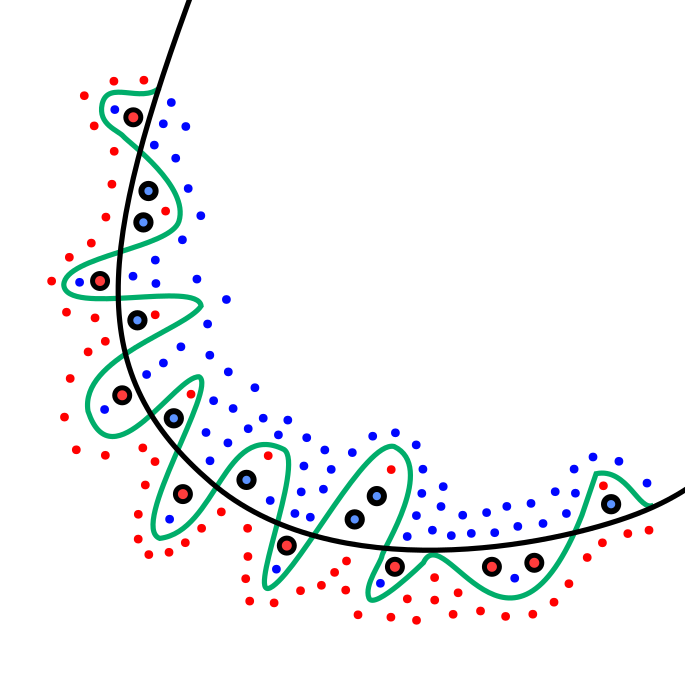

# Smile 概述

Smile 是一个快速且全面的机器学习包，没有其它依赖项，只需要 Java 标准库。

从 v1.4 开始，Smile 支持利用本地 BLAS、LAPCK库。还提供 Scala 中的高级运算符和交互式 shell。

在实际应用中，数据科学家通常使用高级工具，如 R、Matlab、SAS 等构建模型。但是，开发人员必须花费大量时间和精力将这些模型纳入生产系统中，这些模型通常一通用编程语言，如 Java、Scala 实施。Smile 为数据科学家和开发人员提供相同的工作环境。

## iris 示例

```java
import smile.data.DataFrame;
import smile.data.formula.Formula;
import smile.io.Read;
import smile.regression.RandomForest;

import java.io.IOException;
import java.nio.file.Path;
import java.text.ParseException;

public class IrisDemo {
    public static void main(String[] args) throws IOException, ParseException {
        DataFrame data = Read.arff(Path.of("D:\\tools\\smile-4.3.0\\data\\weka\\iris.arff"));
        System.out.println(data);

        Formula formula = Formula.lhs("class"); // 设置 y
        RandomForest rf = RandomForest.fit(formula, data); // 拟合
        System.out.println(rf.metrics());
    }
}
```

说明：

- 这里采用 Weka 的 ARFF 格式的 iris 数据集
- 函数 `Read.arff` 返回 `DataFrame` 对象
- `Formula.lhs("class")`  将 "class" 列用作类别标签，而其余列作为预测因子
- 最后，使用默认参数训练一个随机森林，并打印出 OOB (out of bag) 误差
- 可以使用 `predict` 方法将该模型应用于新的数据样本

## 什么是机器学习

机器学习任务通常分为三大类：

- 监督学习：提供输入及期望输出，目标是学习将输入映射到输出的一般规则
- 无监督学习：数据集没有标签，需要学习算法自行寻找输入的结构。
- 强化学习：计算机程序与动态环境交互，在该环境中它必须执行某个目标，而无需明确告诉它是否已接近目标

监督学习和无监督学习之间是半监督学习：训练数据缺少部分（通常很多）标签。

### 特征

特征是被观察现象的可测量属性。特征也称为解释变量（explanatory variables）、独立变量（independent variable）、预测变量（predictor）、回归量（regressor）等。任何属性都可以作为特征，但选择信息丰富、有区分性和独立的特征是机器学习中 有效算法的关键步骤。特征通常是数字，一组数字特征可以方便地用特征向量描述。结构特征（如字符串、序列和图形）也用于自然语言处理、计算生物学等领域。

特征工程师还利用数据领域知识来创建使机器学习算法发挥作用的特征的过程。特征工程是机器学习应用的基础，既困难又昂贵。它需要试验多重可能性，并将自动化技术与领域专家的直觉和知识相结合。

初始的原始特征集可能冗余且太大而无法管理。因此，许多应用程序的初始步骤包括选择特征子集，或构建一组新的精简特征以促进学习，并提高泛化和可解释性。

### 监督学习

在监督学习中，每个样本包含输入对象（通常是**特征向量**）和期望输出值（也成为**响应变量**或**因变量**）组成的一对。监督学习算法视图从输入对象到输出值学习一个函数（通常称为假设）。通过分析训练数据，它会产生一个推断函数（称为模型），可用于映射新样本。

监督学习问题通常通过优化损失函数来解决，这些损失函数代表了预测不准确的代价。然后将与假设相关的风险定义为损失函数的期望。一般来说，由于基础分布未知，因此无法计算风险。但是，我们可以通过在训练几中平均损失函数来计算近似值，称为经验风险（empirical risk）。

经验风险最小化原则指出，学习算法 应该选择一个最小化经验风险的假设。

批量学习算法（batch learning）通过一次性学习整个训练集来生成模型。相比之下，在线学习（online learning）则按顺序 用新数据更新模型。在线学习是大数据的一种常用技术，因为在计算上不可能对整个训练几进行训练。当数据本身是随时间发生时，也会使用这种方法。

如果响应变量是类别值，监督学习问题称为分类。如果响应变量是实数，则称为回归。

#### 过拟合

当模型描述的是随机误差或噪声而不是底层关系时，就称为**过拟合**（overfitting）。过拟合通常发生在模型过于复杂时，如相对于样本量，模型的参数过多。过拟合模型的泛化性能通常较差，因为它会夸大数据中的微小波动。



> 绿色的过拟合模型在训练数据集上没有误差。但它过于复杂，描述了随机噪声。

#### 模型验证

为了评估模型是否过拟合，是否可以推广到独立数据集，通常采样额外样本评估（out-of-sample evaluation）。

一种流行的模型验证技术是交叉验证。即将数据集划分为互补子集，在一个子集（训练集）进行训练，在另一个子集（测试机）上进行验证。为了减少差异，使用不同的划分进行多轮较差验证，并对验证结果进行平均。

#### 正则化

正则化是引入额外信息以防止过拟合的过程。通常，将正则化项（通常是对过于复杂假设的惩罚）引入到损失函数中，并用参数控制正则化项的重要性。例如，正则化项可能是对平滑度的限制或对向量空间范数的界限。

正则化可用于学习更简单的模型、引导模型稀疏等。正则化的理论依据是它试图将奥卡姆剃刀原理强加于解决方案上。从贝叶斯的角度看，许多正则化技术对应于将某些先验分布强加于参数模型上。

### 无监督学习

无监督学习试图从未标记的数据中推断出一个函数来描述隐藏的结构。由于给算法的示例未标记，因此没有错误或奖励信号来评估潜在的解决方案。

无监督学习与统计学中的密度估计问题密切相关。然而，无监督学习还包含许多其它技术，这些技术旨在总结和解释数据的关键特征。

#### 聚类

聚类分析（cluster analysis）或聚类（clustering）是对一组对象进行分组的任务，使得同一组中的对象彼此之间比与其它组中的对象更相似。

#### 隐变量模型

在统计学中，隐变量（latent variable）指那些无法直接观察到，而是从其它观测变量中推断出来的变量。用隐变量来解释观测变量的数学模型称为隐变量模型。

#### 关联规则

关联规则挖掘（association rule mining）旨在识别大型数据集中变量之间的强关系。该技术由 Rakesh Agrawal 等人提出，典型用例是在超市销售系统的大规模交易数据中发现产品之间的规律。例如，超市销售数据中的规则 `{onions,potatoes}->{burger meat}` 表明，如果顾客同时购买洋葱和土豆，那么他们很可能会购买汉堡肉。此类信息可用作营销活动的决策基础。

### 半监督学习

获取用于学习算法的标记数据通常需要大量劳动力，耗时且成本高。另一方面，获取未标记数据的成本相对较低。研究人员发现，未标记数据与少量暴击数据结合使用时，可以显著提高模型准确性。半监督学习是一类监督学习任何和技术，它使用大量未标记数据和少量标记数据。

为了重复利用未标记数据，数据底层分布必须存在某种规律。半监督学习算法至少使用以下假设之一：

- 连续性假设：彼此靠近的点更有可能具有相同的标签。这在监督学习中也是普遍的假设，并且产生了对几何简单的决策边界的偏好。在半监督学习中，平滑行假设还产生了对低密度区域中的决策边界的偏好，因此很少有点必须接近但属于不同类别
- 聚类假设：数据倾向于形成离散的 clusters，并且同一个 cluster 的点更有可能具有相同标签。这是平滑假设的一个特例，并引入了使用聚类算法进行特征学习。
- 流形（manifold）假设：数据近似位于比输入空间低得多的流形上。在这种情况下，使用标记和未标记数据学习流形可以避免维数灾难。然后使用流形上定义的距离和密度进行学习。当高维度数据由某种可能难以直接建模但只有几个自由度的过程生成时，流形假设是实用的。

### 自监督学习

自监督学习模型实用数据本身生成监督信号来训练，而不是依赖人类提供的外部标签。

与监督学习算法一样，自监督学习的目标是从输入中生成分类输出。同时，它不需要明确实用标记数据。相反，相关性、嵌入在数据中的元数据或输入中存在的领域知识都是从数据中隐式和自主提取以进行训练。例如，自监督语言模型 Transformer 本质上就是学习 “填空”。

### Generative AI

生成式人工智能（GenAI）通过从训练数据中学习模式来生成各种高度逼真和复杂的内容，如图像、视频、音频、文本和 3D 模型。Transformer 是自然语言生成领域最先进的 GenAI 模型架构。它基于多头注意力机制。文本被转换为 token 的数字表示，每个 token 通过词嵌入从表中查找转换为向量。在每一层，每个 token 通过并行多头 softmax 注意力机制在 context-window 范围内与其它 token 进行交互，从而允许放大关键 token 的信号并减少不太重要的 token。GPT（Generative pre-trained transformers）基于 transformer decoder  架构。随着模型参数量的增加和训练数据的增加，每一代 GPT 模型都比上一代更强。

稳定扩散（stable diffusion）是一种基于潜在扩散（latent diffusion）技术的文本到图像深度学习模型。diffusion 模型的训练目标是消除训练图像上连续的高斯噪声，这可以被认为是一系列去噪 autoencoders。stable diffusion 包含三部分：

- 变分自动编码器（variational autoencoder, VAE）
- U-Net
- 文本编码器（可选）

VAE encoder 将图像从像素空间压缩到较小维度的 latent 空间，从而捕捉图像更基本的语义。在前向扩散过程中，将高斯噪声迭代应用于压缩的 latent 表示。U-Net 模块主要由 ResNet 组成，在前向扩散的输出进行去噪，以得到 latent 表示。最后，VAE decoder 通过将表示转换回像素空间生成最终图像。

生成对抗网络（Generative adversarial network, GAN）是另一种用于生成 AI 的框架。在 GAN 中，两个神经网络在游戏中互相竞争。生成网络生成候选，判别网络对其进行评估。竞争以数据分布的方式进行。通常，生成网络学习从潜在空间映射到感兴趣的数据分布，而判别网络将生成器生成的候选与真实数据分布区分开。生成网络的训练目标是提高判别网络的性能。

用已知数据集作为判别网络的初始训练数据。通常，生成器会从预定义 latent 空间采样的随机输入作为 seed。然后，discriminator 评估生成器合成的候选图像。两个网络都应用了反向传播，以便生成器可以生成更好的图像，而 discriminator 则更擅长标记合成图像。

### 强化学习

强化学习指学习 agent 与环境交互以实现目标。学习 agent 必须将环境映射到动作以最大化数值奖励。与监督学习不同，agent 不会被告知要采取哪些行为，而是必须通过尝试发现哪些行动会产生最大的回报。此外，行动不仅影响即时奖励，还影响所有后续奖励。反复试验搜索和延迟奖励是强化学习的最重要特征。

马尔科夫决策过程（Markov decision process, MDP）为结果部分随机、部分受决策者控制的情况建模提供了一个数学框架。相比之前，深度强化学习使用深度神经网络，而无需明确设计状态空间。

强化学习的主要挑战是探索和利用之间的权衡，即在探索未知领域和利用当前知识之间找到平衡。为了获得大量奖励，agent 必须优先选择过去尝试过并发现能有效产生奖励的动作，也需要探索以便找出更好的动作。强化学习需要去巧妙的探索机制。随机选择动作而不参考估计的概率分布，性能会较差。然而，由于缺少能够很好随状态数扩散的算法（或扩散到具体有限状态空间的问题），简单的探索算法最实用。

强化学习系统包含四个主要组成部分：策略、奖励、价值函数和环境模型（可选）。策略定义学习 agent 哎给定时间的行为方式。奖励定义强化学习问题的目标。agent 的目标是最大化在长期内获得的总奖励。奖励是改变策略的主要依据；如果策略选择的行动之后的奖励较低，则策略在未来面对该情况会选择其它行为。

## 数据处理

### 特征

**特征**是被观察现象的可测量属性。特征也被称为解释变量（explanatory variable）、自变量（independent variable）、预测变量（predictor）或回归量（regressor）等。任何属性都可以作为特征，但选择信息丰富、有区分行且独立的特征是机器学习中有效算法的关键。

特征通常是会数字，一组数字特征可以方便地用特征向量描述。结构特征（如字符串、序列和图像）也用于自然语言处理、计算生物等领域。

特征工程是使用数据领域知识来创建使机器学习算法发挥作用的特征的过程。特征工程是机器学习算法应用的基础，需要对多种可能性进行实验，并将自动化技术与领域专家的直觉和知识相结合。

### 数据类型

一般来说，属性主要有两种类型：

- 定性：数据值是非数字类型，如血型、性别等
- 定量：数据值是计数或数值测量值。定量变量可以是离散或连续的

另一种对数据进行分类的方法是通过数据尺度。在统计学中，通常使用 4 种测量尺度（scale）：

- 名义数据（nominal）：数据值是非数字标签。如，性别变量可以定义为 male=0, female=1
- 有序数据（ordinal）：数据值是分类的，但具有某种数字意义的排序。例如，从非常不同意到统一，可以定义为从 1 到 5
- 连续数据（continuous）
  - 区间数据（interval）：数据值分布在实数区间内，两个值之间的差值有意义，但两个区间数据的比率没有意义，如温度、智商
  - 比例数据（ratio）：两个值的差值和比率都有意义，如工资、体重

许多机器学习算法只能处理数字属性，而少出算法（如决策树）可以直接处理 nominal 属性。日期属性在绘图中很有用。通过一些特征工程，日期也可以用作 nominal 属性。字符串属性可用于文本挖掘和自然语言处理。

### DataFrame

虽然有些 smile 算法可以使用简单的 `double[]` 作为输入，但封装类 `DataFrame` 使用更多。`DataFrame` 是一种二维数据结构，就像一张 Excel 表格。每列都是一个 `ValueVector`，用于存储相同类型值的序列。`DataFrame` 中不同列可以有不同数据类型。对每个原始数据类型和通用对象类型，都有对应的 `ValueVector` 具体自雷实现。

```java
DoubleVector v1 = ValueVector.of("A", 1.0, 2.0, 3.0);
assertEquals("A[1, 2, 3]", v1.toString());
assertEquals("A", v1.name());
assertEquals(DataTypes.DoubleType, v1.dtype());

ObjectVector<Instant> v2 = ValueVector.of("B", Instant.now());
assertEquals(DataTypes.DateTimeType, v2.dtype());
assertEquals("B", v2.name());

ValueVector v3 = ValueVector.nominal("C", "test", "train", "test", "train");
assertEquals(DataTypes.ByteType, v3.dtype());
assertEquals("C", v3.name());
assertFalse(v3.field().isNumeric());
Measure measure = v3.measure();
assertEquals((byte) 0, measure.valueOf("test").byteValue());
assertEquals((byte) 1, measure.valueOf("train").byteValue());

StringVector v4 = ValueVector.of("D", "this is a string vector",
        "Nominal/ordinal vectors store data as integers internally");
assertEquals("D", v4.name());
assertEquals(DataTypes.StringType, v4.dtype());

ObjectVector<int[]> v5 = ObjectVector.of("E", Index.range(0, 4).toArray(),
        new int[]{3, 3, 3, 3});
assertEquals(DataTypes.IntArrayType, v5.dtype());
assertArrayEquals(new int[]{0, 1, 2, 3}, v5.get(0));
assertArrayEquals(new int[]{3, 3, 3, 3}, v5.get(1));
```

> [!NOTE]
>
> `nomial` 和 `ordinal` 方法会分解字符串值并在内部将其存储为整数，这对机器学习算法来说更高效、紧凑、友好。相比之下，`ValueVector.of(String...)` 返回 `StringVector`，直接存储字符串值，这对文本处理比较有用。

#### 创建

下面通过创建一个包含二维数组的 `DataFrame` 来演示创建操作。如果没有传递可选的 col-names，则默认 col-name 为 V1, V2 等。通过传入 cols 列表创建 `DataFrame` 也很简单。第二个 `DataFrame` 的每个 cols 类型不同。方法 `schema()` 描述 col-names、数据类型以及是否可以包含 null 值。

- 使用二维数组创建

```java
DataFrame df = DataFrame.of(MathEx.randn(6, 4));
System.out.println(df);
```

```
+---+---------+---------+---------+---------+
|   |       V1|       V2|       V3|       V4|
+---+---------+---------+---------+---------+
|  0|-0.201469| 0.970363| 2.726932|-0.146014|
|  1| 1.872161| 0.495932| 0.553859|-0.028237|
|  2|-0.504866|-0.179409| 0.201377| 0.281267|
|  3| 0.894446| 0.791521| 0.053346| 0.213519|
|  4| 0.200011|-0.203736|-0.349196|-1.193759|
|  5|  1.52529|-1.407597|  1.16758| -1.78291|
+---+---------+---------+---------+---------+
```

- 使用 col 列表创建

```java
DataFrame df2 = new DataFrame(ValueVector.of("A", 1.0),
        ValueVector.of("B", LocalDate.parse("2013-01-02")),
        ValueVector.of("C", "foo"),
        ObjectVector.of("D", Index.range(0, 4).toArray()),
        ObjectVector.of("E", new int[]{3, 3, 3, 3}));
```

```
+---+---+----------+---+------------+------------+
|   |  A|         B|  C|           D|           E|
+---+---+----------+---+------------+------------+
|  0|  1|2013-01-02|foo|[0, 1, 2, 3]|[3, 3, 3, 3]|
+---+---+----------+---+------------+------------+
```

```java
System.out.println(df2.schema());
```

```
{
  A: double NOT NULL,
  B: Date,
  C: String,
  D: int[],
  E: int[]
}
```

- 


#### 索引

#### 查看

#### 选择

#### 设置

#### 合并

#### 缺失值

#### 操作


### SQL

### 稀疏数据集

### Parsers

### 导出数据和模型


## 参考

- https://haifengl.github.io/quickstart.html
