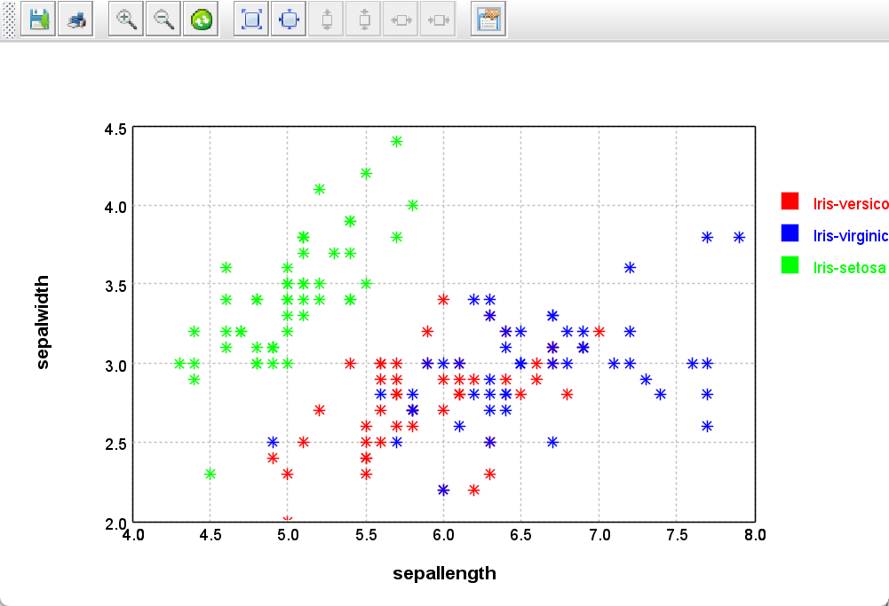
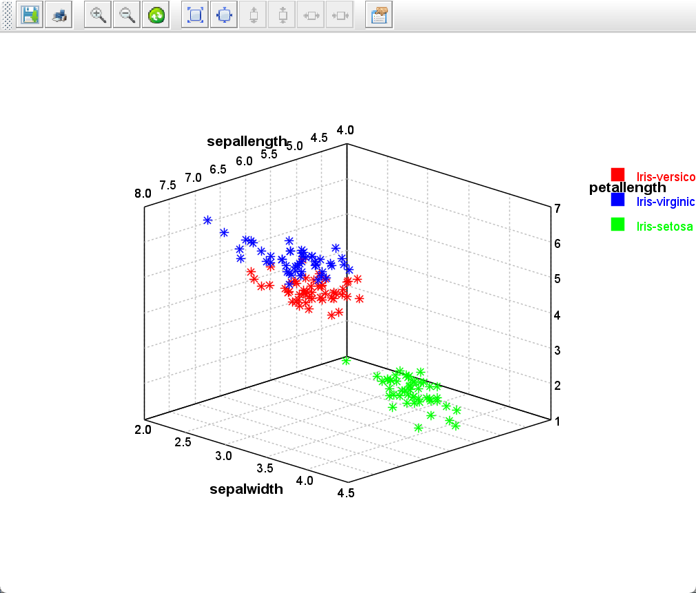
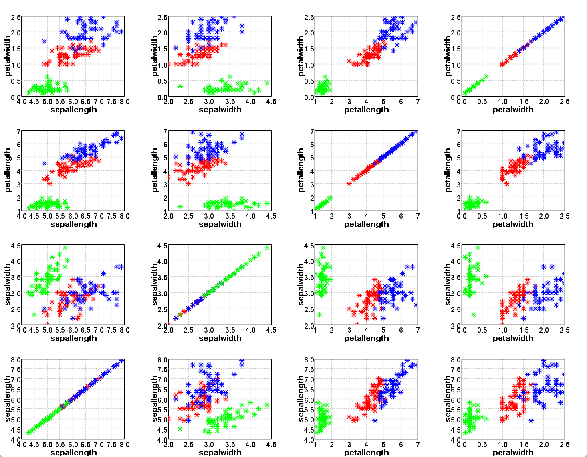
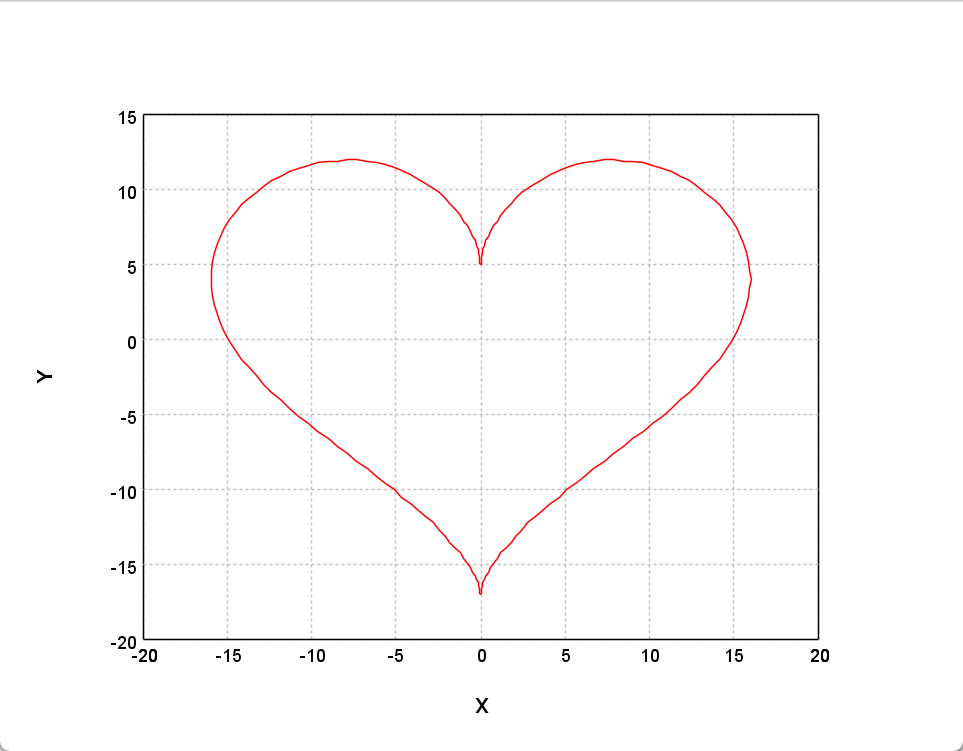

# 数据可视化

2025-05-13
@author Jiawei Mao
***
## 概述

一图胜前言。机器学习通常处理高维数据，这些数据无法直接在屏幕上显示。但是，各种统计图表对我们了解众多数据的特征极具价值。Smile 提供了 plots 和 maps 等数据可视化工具。

 ## Scatter Plot

散点图将数据以点的形式显示，这些点可以用颜色编码，这对于分类任务很有效。用户可以使用 `plot` 函数绘制散点图：

```java
public class ScatterPlot {
    public static ScatterPlot of(double[][] points, char mark, Color color);

    public static ScatterPlot of(double[][] x, String[] y, char mark);

    public static ScatterPlot of(double[][] x, int[] y, char mark);
}
```

`mark` 类型：

| Marker | 说明               |
| ------ | ------------------ |
| `.`    | dot                |
| `+`    | +                  |
| `-`    | -                  |
| `|`    | `|`                |
| `*`    | star               |
| `x`    | x                  |
| `o`    | circle             |
| `O`    | large circle       |
| `@`    | solid circle       |
| `#`    | large solid circle |
| `s`    | square             |
| `S`    | large square       |
| `q`    | solid square       |
| `Q`    | large solid square |

对任何其它字符，数据都显示为 dot。

`plot` 函数返回 `Canvas`，通过 `Canvas` 能以编程方式控制 plot。用户可以通过鼠标右键弹出 context-menu 来打印、更改标题、轴标题和字体等。调用 `show(canvas)` 显示 canvas。

对 2D 和 3D plot，用户均可使用鼠标滚轮进行缩放。对 2D plot，鼠标双击后移动鼠标可以移动坐标。还可以用鼠标选择一个区域查看详情。对 3D plot，可以通过拖动鼠标旋转视图。

```java
DataFrame iris = Read.arff("data\\weka\\iris.arff");
ScatterPlot plot = ScatterPlot.of(iris, "sepallength", "sepalwidth", "class", '*');
Canvas canvas = plot.canvas();
canvas.setAxisLabels("sepallength", "sepalwidth");
canvas.window();
```



这里绘制 iris 数据集的前 2 列作为，并将 class-label 作为 legend 和 color-coding。

绘制 3D plot 也很简单：

```java
DataFrame iris = Read.arff("data\\weka\\iris.arff");
ScatterPlot plot = ScatterPlot.of(iris, "sepallength", "sepalwidth", "petallength", "class", '*');
Canvas canvas = plot.canvas();
canvas.setAxisLabels("sepallength", "sepalwidth", "petallength");
canvas.window();
```



但是，iris 数据集有 4 个属性，因此，即使是 3D plot 也不足以展示全貌。通常的做法是绘制所有属性对。例如：

```java
DataFrame iris = Read.arff("data\\weka\\iris.arff");
PlotGrid plotGrid = PlotGrid.splom(iris, '*', "class");
plotGrid.window();
```



## Line Chart

折线图通过直线连接点。

```java
public class LinePlot {
    public static LinePlot of(double[][] data, Line.Style style, Color color);

    public static LinePlot of(double[] y, Line.Style style, Color color);
}
```

用折线图画一个心形：

```java
double[][] heart = new double[200][2];
for (int i = 0; i < 200; i++) {
    double t = PI * (i - 100) / 100;
    heart[i][0] = 16 * pow(sin(t), 3);
    heart[i][1] = 13 * cos(t) - 5 * cos(2 * t) - 2 * cos(3 * t) - cos(4 * t);
}
var canvas = LinePlot.of(heart, Color.RED).canvas();
canvas.window();
```



## Box Plot

