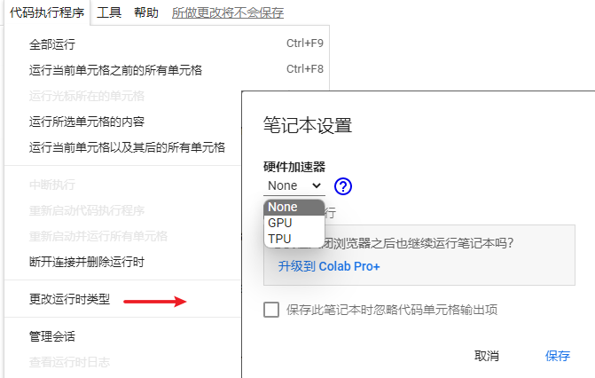

# Google Colab

Last updated: 2022-08-12, 13:22
****

## 简介

Colab 是 Colaboratory 的缩写，是 Google 提供的服务，可以在浏览器上编写并运行 Python 代码：

- 不需要额外设置，很多包都装好了
- 提供免费的 GPU 资源
- 方便共享

下面演示：

- 如何使用 Colab 的 GPU 资源
- 如何从 colab 下载文件
- 如何连接 colab 与 google drive

## Shell

colab 中的代码块，如果前面加上 `!` 号，就作为 shell script 执行。

`!` 会启动一个新的 shell，执行操作，然后终止 shell。

因此，如果要使用 `cd` (change directory) 命令，则需要使用 `%`。

## GPU 使用



> 在运行前设置 GPU，运行后再设置会从头重新开始运行。

## 连接 Google drive

使用 google colab 的 一个优势是，与其它谷歌服务（如 Google Drive）很简单。通过连接 Google drive，可以永久存储工作文件。执行下面代码，登录 Google 账户，完成连接：

```python
from google.colab import drive # Import a library named google.colab
drive.mount('/content/drive', force_remount=True) # mount the content to the directory `/content/drive`
```

连接 google drive 后，google drive 的内容位于 `MyDrive` 目录。

## 常用命令

- gdown : Download files from google drive
- wget : Download files from the internet
- python <python_file> : Executes a python file

## 参考

- https://colab.research.google.com/drive/1plDsa66koeaskb3YFag4CAX6FSyoJzBc
