# PyTorch 入门

- [PyTorch 入门](#pytorch-入门)
  - [简介](#简介)
  - [PyTorch vs. TensorFlow](#pytorch-vs-tensorflow)
  - [DNN 训练过程](#dnn-训练过程)
    - [Dataset & Dataloader](#dataset--dataloader)
    - [torch.nn -- Neural Network layers](#torchnn----neural-network-layers)
    - [torch.nn -- 激活函数](#torchnn----激活函数)
    - [torch.nn -- Loss Functions](#torchnn----loss-functions)
    - [torch.nn -- 构建模型](#torchnn----构建模型)
    - [torch.optim](#torchoptim)
    - [Training](#training)
    - [Validation](#validation)
    - [Testing](#testing)
    - [Save/Load a Model](#saveload-a-model)
  - [张量](#张量)
    - [数据类型](#数据类型)
    - [Shape](#shape)
    - [创建 Tensor](#创建-tensor)
    - [运算](#运算)
  - [PyTorch vs. NumPy](#pytorch-vs-numpy)
  - [GPU](#gpu)
  - [计算梯度](#计算梯度)
  - [其它模块](#其它模块)
  - [参考](#参考)

***

## 简介

PyTorch 是一个开源的机器学习框架，提供了两个实用功能：

- 张量计算（支持 GPU）
- 自动微分

## PyTorch vs. TensorFlow

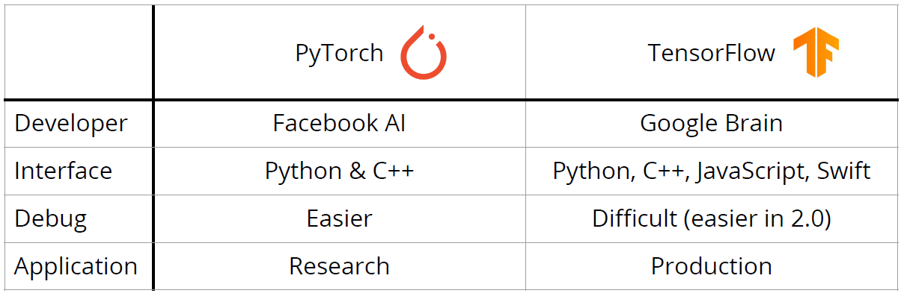

## DNN 训练过程

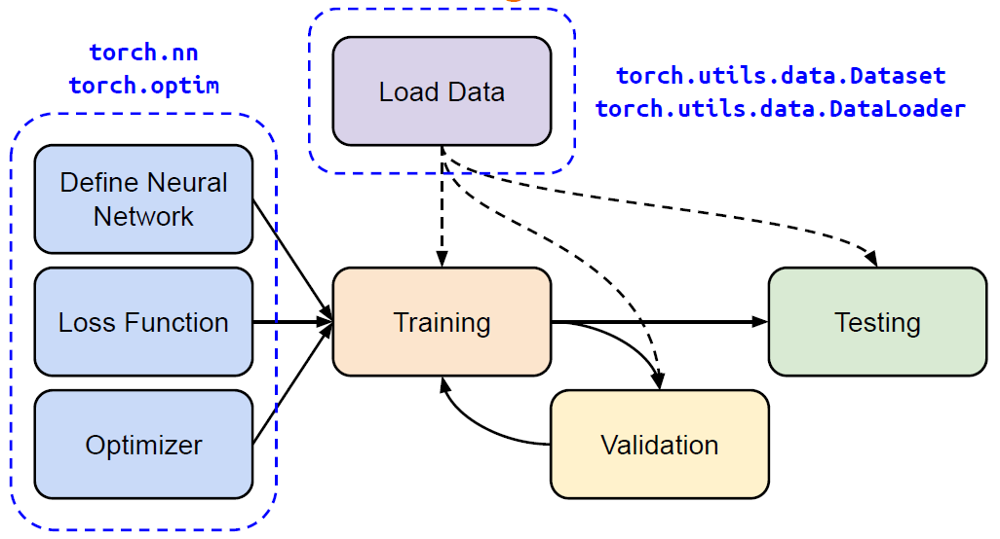

### Dataset & Dataloader

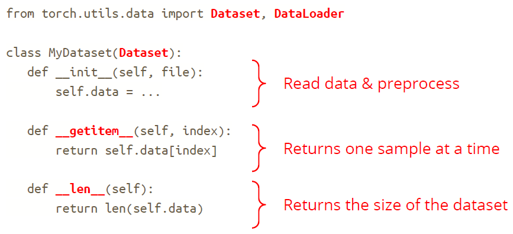

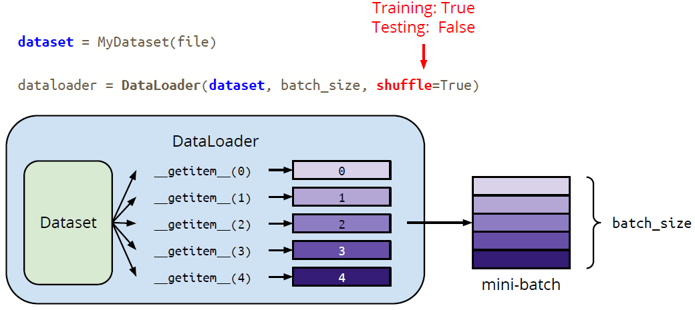

### torch.nn -- Neural Network layers

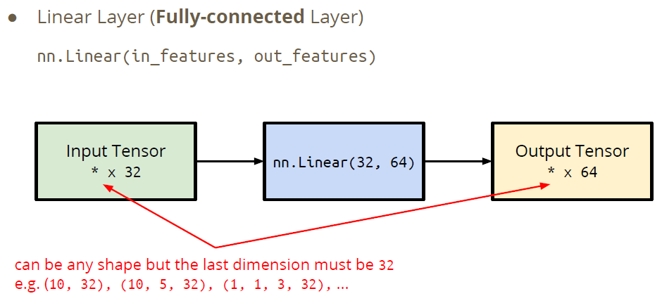

```python
>>> layer = torch.nn.Linear(32, 64)
>>> layer.weight.shape
torch.Size([64, 32])
>>> layer.bias.shape
torch.Size([64])
```

### torch.nn -- 激活函数

### torch.nn -- Loss Functions

### torch.nn -- 构建模型

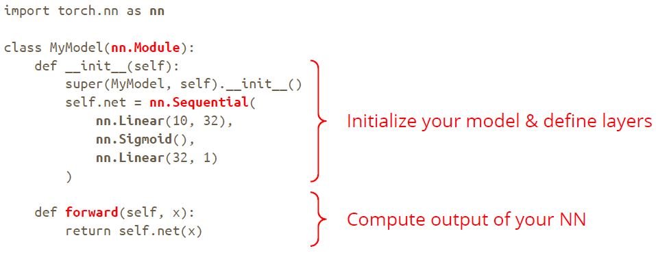

### torch.optim

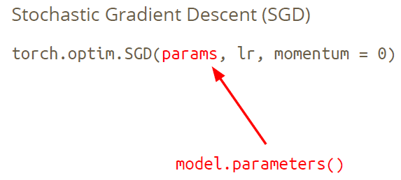

### Training

```python
dataset = MyDataset(file)                      # read data via MyDataset
tr_set = DataLoader(dataset, 16, shuffle=True) # put dataset into Dataloader
model = MyModel().to(device)   # contruct model and move to device (cpu/cuda)
criterion = nn.MSELoss()       # set loss function
optimizer = torch.optim.SGD(model.parameters(), 0.1) # set optimizer
```

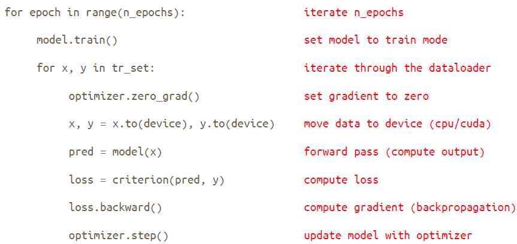

### Validation

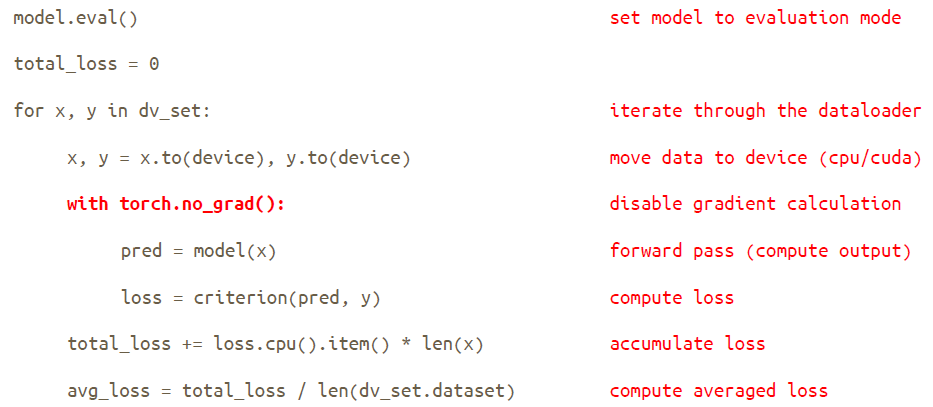

### Testing

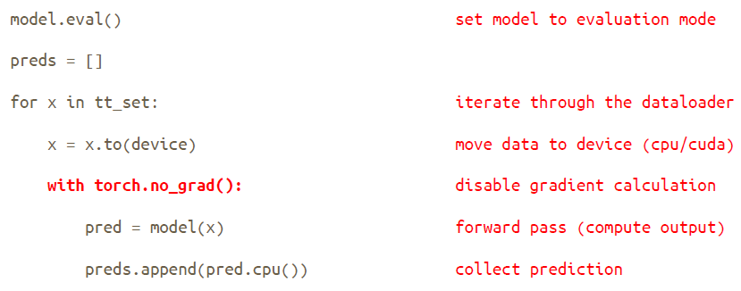

### Save/Load a Model

保存：

```python
torch.save(model.state_dict(), path)
```

加载：

```python
ckpt = torch.load(path)
model.load_state_dict(ckpt)
```

## 张量

张量就是高维数组（矩阵）。

### 数据类型

|Data type|dtype|tensor|
|---|---|---|
|32-bit floating point|torch.float|torch.FloatTensor|
|64-bit integer (signed)|torch.long|torch.LongTensor|

### Shape

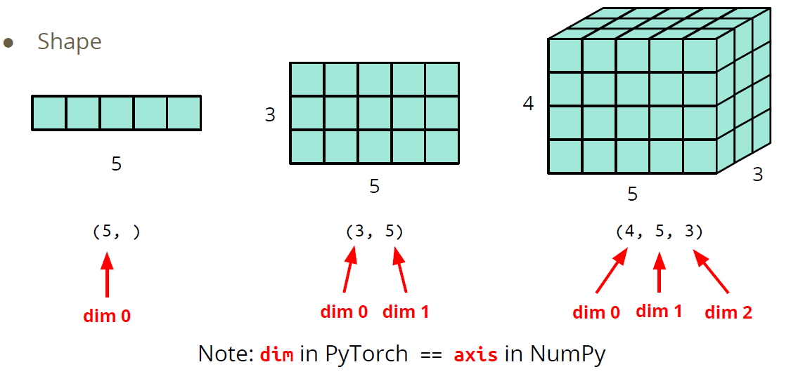

### 创建 Tensor

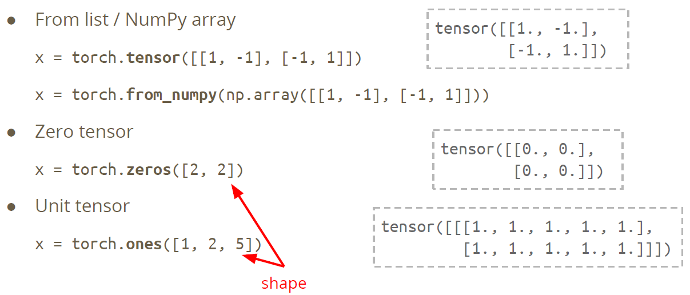

### 运算

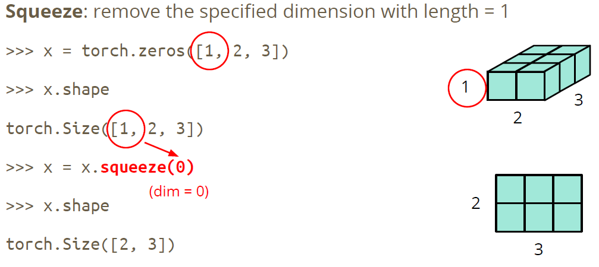

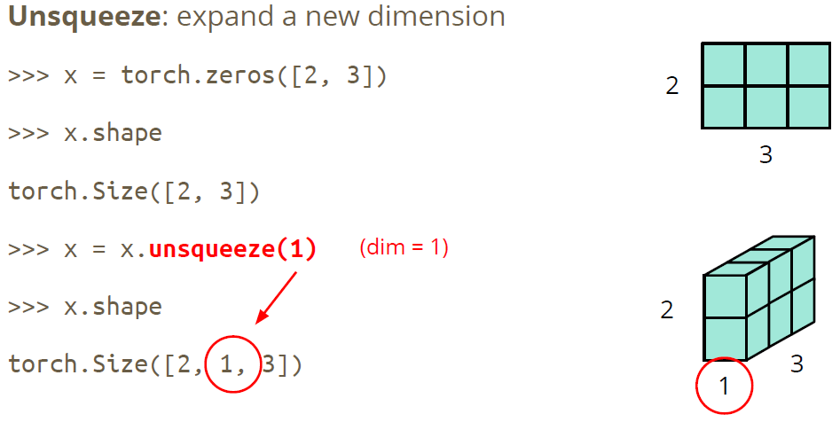

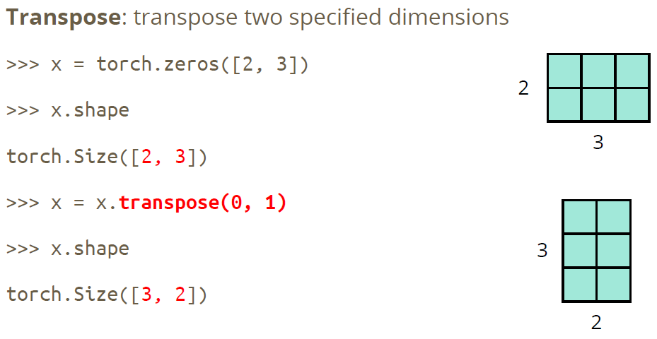

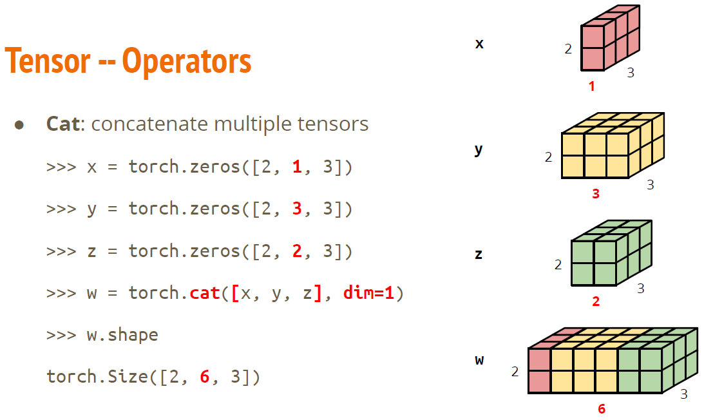

- 加法

$$z=x+y$$

- 减法

$$z=x-y$$

- 指数

$$y=x.pow(2)$$

- 加和

$$y = x.sum()$$

- 均值

$$y=x.mean()$$

## PyTorch vs. NumPy

- 属性

|PyTorch|NumPy|
|---|---|
|x.shape|x.shape|
|x.dtype|x.dtype|

- Shape 操作

|PyTorch|NumPy|
|---|---|
|x.reshape / x.view|x.reshape|
|x.squeeze()|x.squeeze()|
|x.unsqueeze(1)|np.expand_dims(x, 1)|

## GPU

tensor 和 modules 默认在 CPU 中运行。

- CPU

```python
x = x.to('cpu')
```

- GPU

```python
x = x.to('cuda')
```

- 检查是否有 NVIDIA GPU

```python
torch.cuda.is_available()
```

- 多个 GPU：指定 'cuda:0', 'cuda:1', 'cuda:2', ...

## 计算梯度

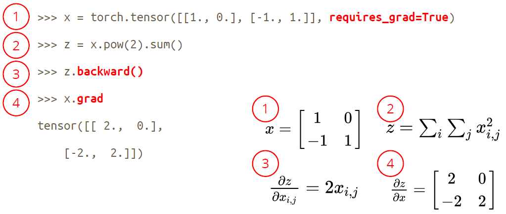

## 其它模块

- torchaudio - speech/audio processing
- torchtext - natural language processing
- torchvision - computer vision
- skorch - scikit-lean + pyTorch

github repositories using PyTorch:

- Huggingface Transformers (transformer models: BERT, GPT, ...)
- Fairseq (sequence modeling for NLP & speech)
- ESPnet (speech recognition, translation, synthesis, ...)
- Many implementation of papers

## 参考

- https://speech.ee.ntu.edu.tw/~hylee/ml/2021-spring.php
- https://pytorch.org/docs/stable/tensors.html
- https://github.com/wkentaro/pytorch-for-numpy-users
