# 机器学习概述

- [机器学习概述](#机器学习概述)
  - [定义](#定义)
  - [机器学习分类](#机器学习分类)
  - [机器如何找函数](#机器如何找函数)
  - [线性模型的局限性](#线性模型的局限性)

## 定义

机器学习就是让机器具备找函数的能力。

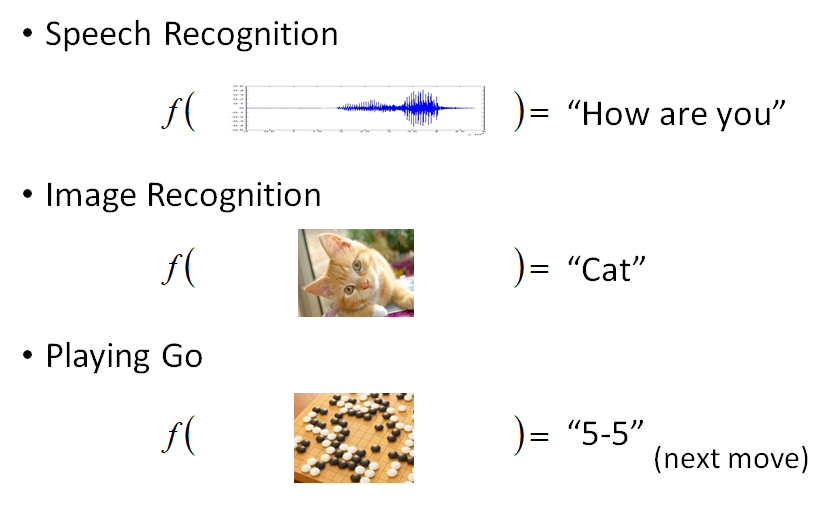

## 机器学习分类

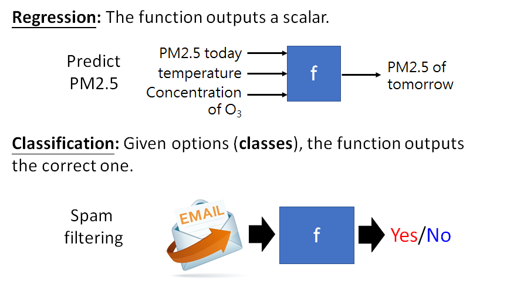

AlphaGo 本质上也是一个分类（classification）问题.

除了回归和分类，还有 Structured Learning，即让模型创造结构化内容，如图片，文本。

## 机器如何找函数

根据以往的阅读数来预测下一天的订阅数为例。

1. 首先，要定义一个参数位置的函数

例如：

$$y=b+wx_1$$

- y 表示 2/26 的阅读数，$x_1$ 表示 2/25 的阅读数。
- w 和 b 都是未知参数。

所以，第一步要确定函数形式，具体的函数形式，取决于对问题的了解。

在机器学习里，这个函数就是我们所说的模型。

> 这个函数形式是猜测的，不一定对。

2. 定义损失函数（Loss）

损失函数是参数的的函数 $L(b,w)$ 的函数，用来评价参数的好坏。常用的损失函数有：

- 平均绝对误差（mean absolute error, MAE）
- 均方误差（mean square error, MSE）
- 如果输出为概率分布，则用交叉熵

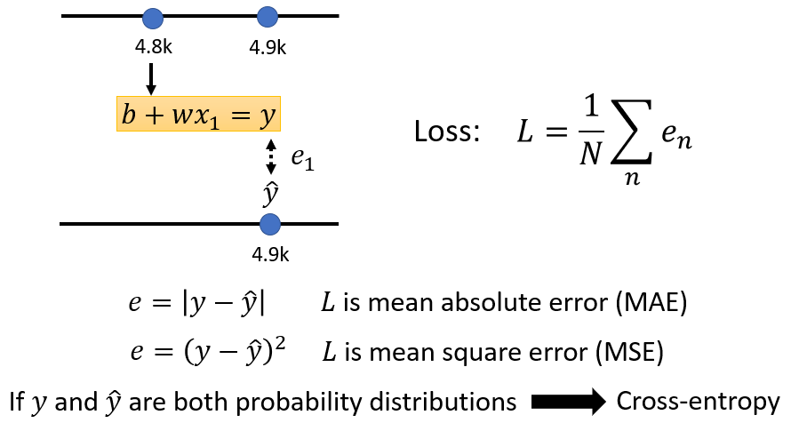

可以尝试不同的参数组合，计算损失值，有助于更好地选择参数组合：

3. 最优化（Optimization）

假设只优化参数 $w$，机器学习问题就转换为如下的最优化问题：

$$w^*=arg \overset{min}{w}L$$

一般通过梯度下降来实现：

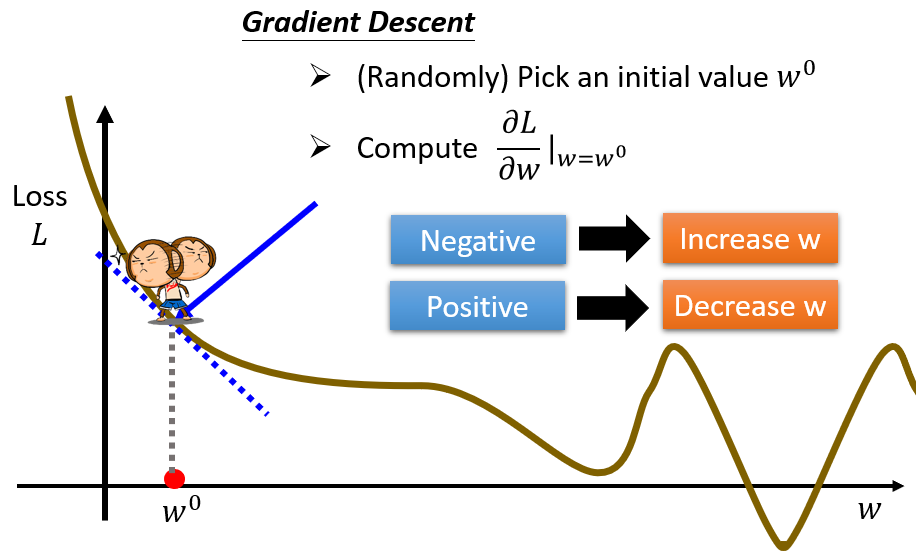

梯度的值由两个因素决定：梯度和学习率。

$$w^1 \leftarrow w^0-\eta\frac{\partial L}{\partial w}\vert_{w=w^0}$$

学习率 $\eta$ 是由自己设置的参数，称为超参数（hyperparameters）。

对多参数优化，计算方法一样：

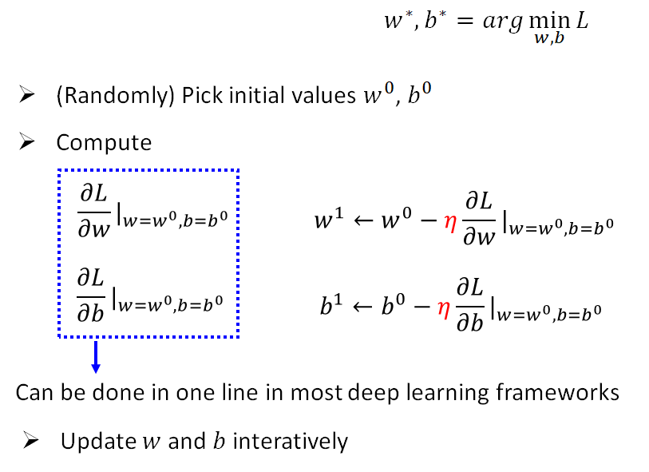

## 线性模型的局限性

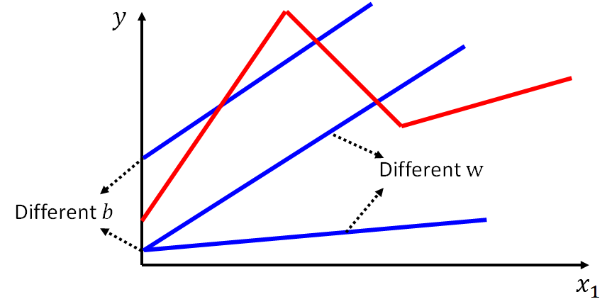

线性模型为直线函数，永远造不出折线。模型的这种局限性，称为 Model bias。

这种非线性函数，可以通过简单函数的加和来逼近：

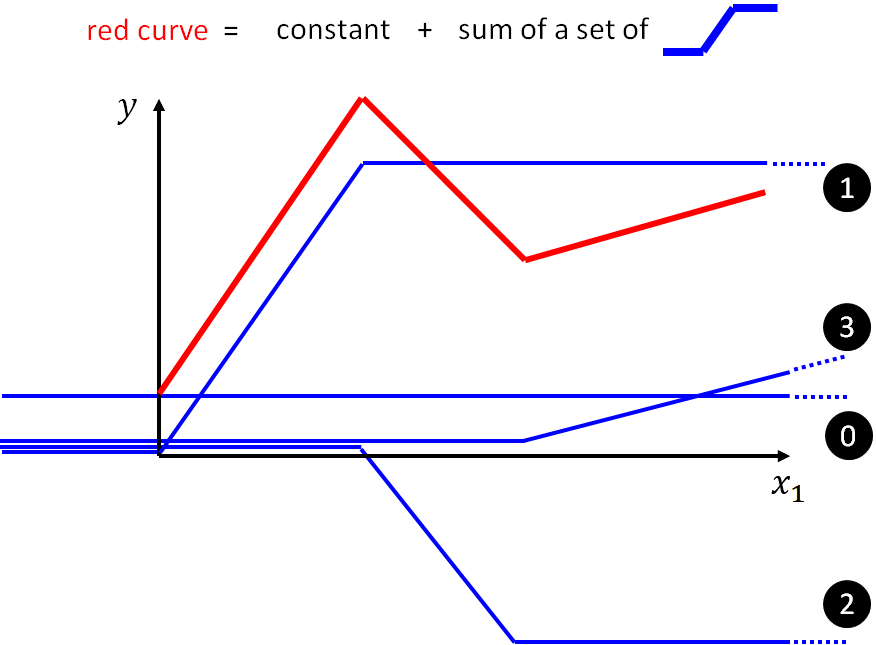

而 sigmoid 函数，就是一种这样的简单函数：

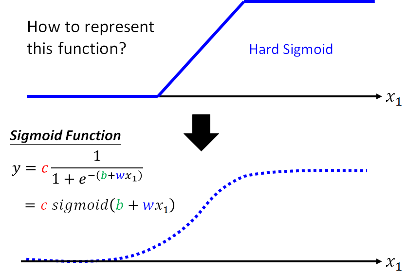

sigmoid 函数包含三个参数：

- w 表示斜率
- b 水平平移
- c 表示高度

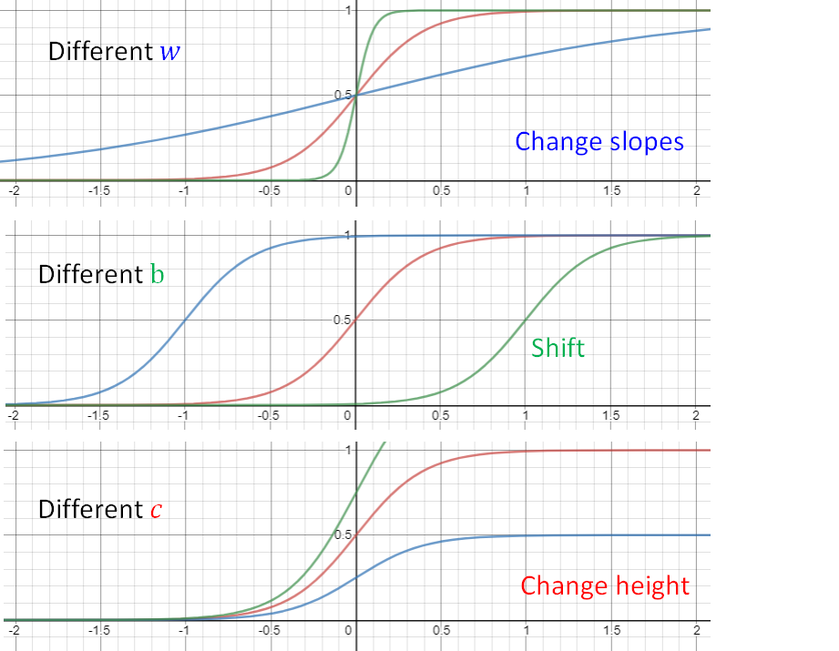

如此，就能用如下函数表示上面的折线：

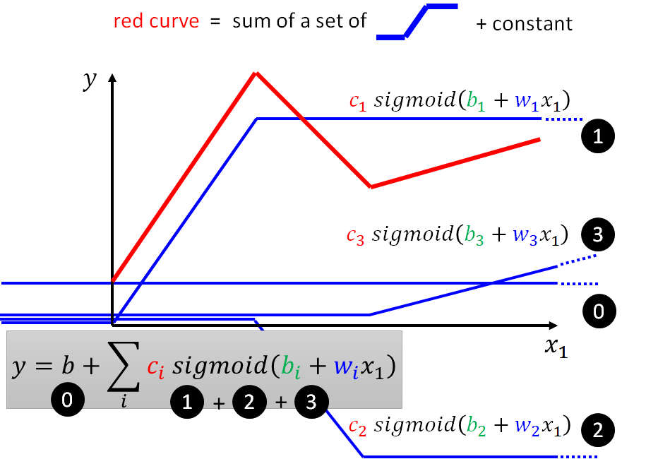

根据需要，扩展到多个 feature:

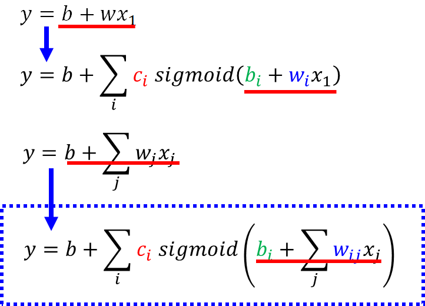
