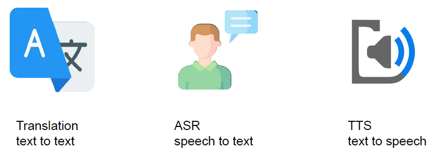
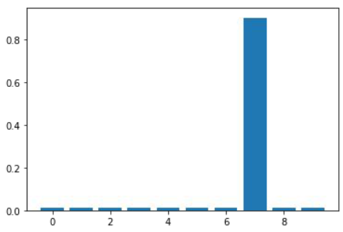
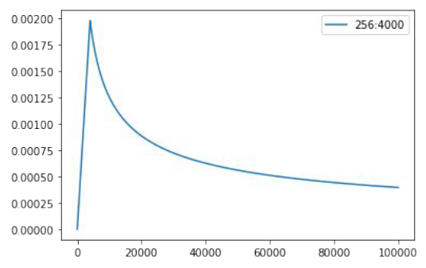

# HW5: Sequence to sequence

## Sequence to sequence

Seq2Seq（是 Sequence-to-sequence 的缩写），就如字面意思，输入一个序列，输出另一个序列。这种结构最重要的地方在于输入序列和输出序列的长度是可变的。

Seq2Seq（强调目的）不特指具体方法，满足“输入序列、输出序列”的目的，都可以统称为 Seq2Seq 模型。常见应用：



seq2seq 模型一般包含两部分：

- Encoder：将输入序列编码为向量或向量序列
- Decoder：一次解码一个序列 token，基于
  - encoder output
  - previous decoded tokens

## HW5: Neural Machine Translation

将英文转换为中文。例如：

```txt
Cats are so cute. -> 貓咪真可愛。
```

### Training datasets

- Paired data
  - TED2020: TED talks with transcripts translated by a global community of volunteers to more than 100 language
  - We will use (en, zh-tw) aligned pairs
- Monolingual data
  - More TED talks in traditional Chinese

### Evaluation

BLEU

- Modified n-gram precision (n=1~4)
- Brevity penalty: penalizes short hypotheses

$$\begin{aligned}
BP=\begin{cases}
    1 &\text{if } c \gt r \\
    e^{1-r/c} &\text{if } c\le r
\end{cases}
\end{aligned}$$

## Workflow

1. Preprocessing
    a. download raw data
    b. clean and normalize
    c. remove bad data (too long/short)
    d. tokenization
2. Training
    a. initialize a model
    b. train it with training data
3. Testing
    a. generate translation of test data
    b. evaluate the performance

## Training tips

- Tokenize data with sub-word units
- Label smoothing regularization
- Learning rate scheduling
- Back-translation

### Tokenize data with sub-word units

- For one, we can reduce the vocabulary size (common prefix/suffix)
- For another, alleviate the open vocabulary problem
- example
  - ▁new ▁ways ▁of ▁making ▁electric ▁trans port ation ▁.
  - new ways of making electric transportation.

### Label smoothing regularization

- When calculating loss, reserve some probability for incorrect labels
- Avoids overfitting



主要用在分类问题上，

### Learning rate scheduling

- Linearly increase lr and then decay by inverse square root of steps
- Stablilize training of transformers in early stages



### Back-translation (BT)

Leverage monolingual data by creating synthetic translation data

1. Train a translation system in the opposite direction
2. Collect monolingual data in target side and apply machine translation
3. Use translated and original monolingual data as additional parallel data to train stronger translation systems

Some points to note about back-translation

1. Monolingual data should be in the same domain as the parallel corpus
2. The performance of the backward model is critical
3. You should increase model capacity (both forward and backward), since the data amount is increased.

## Requirements

You are encouraged to follow these tips to improve your performance in order to pass the 3 baselines.

1. Train a simple RNN seq2seq to acheive translation
2. Switch to transformer to boost performance
3. Apply back-translation to furthur boost performance

### Baseline Guide
