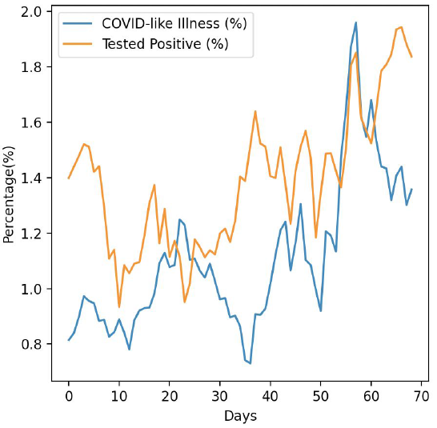
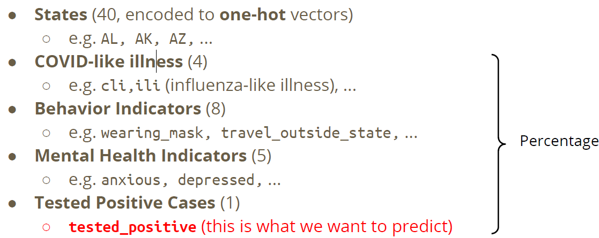
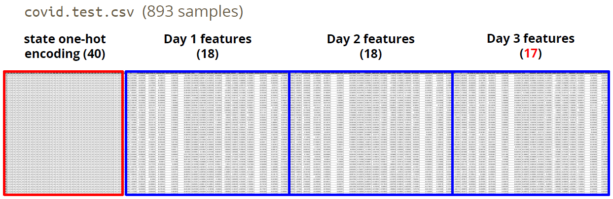

# COVID-19 Cases Prediction

## 目标

- 使用深度神经网络解决回归问题
- 理解基本的 DNN 训练技巧
- 熟悉 PyTorch

## 任务描述

数据：Delphi group @ CMU

提供三天的数据，但是第三天少了测试阳性率。

## 数据

训练集：

测试集：

## 评估指标

$$RMSE=$$

## 参考

- https://github.com/ga642381/ML2021-Spring/blob/main/HW01/HW01.ipynb
