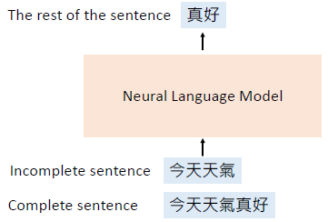
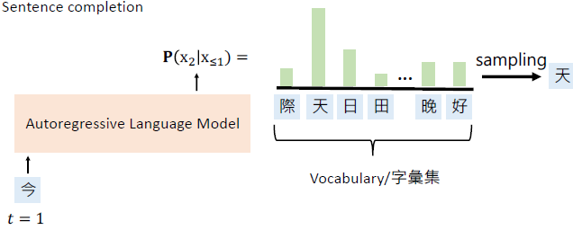
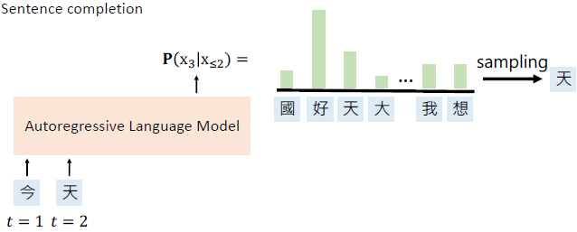
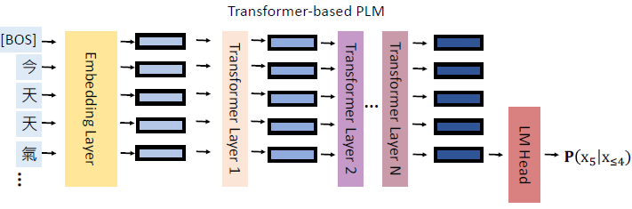
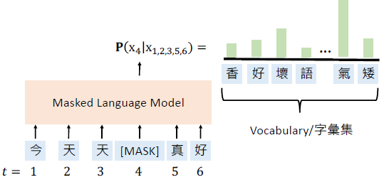
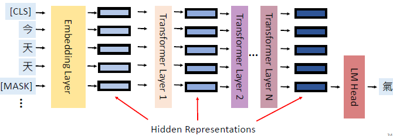
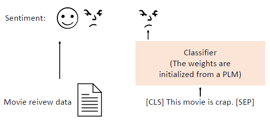
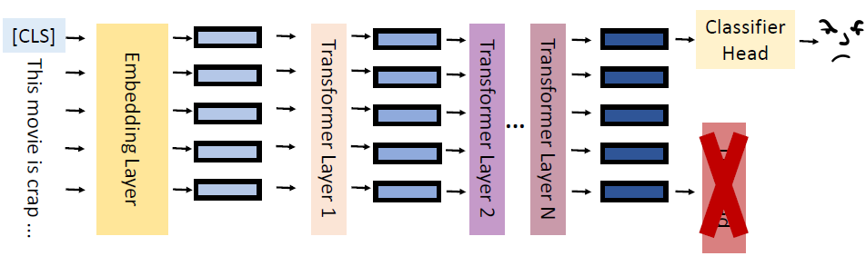
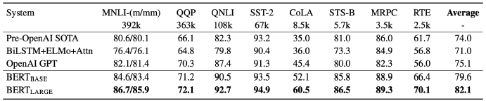
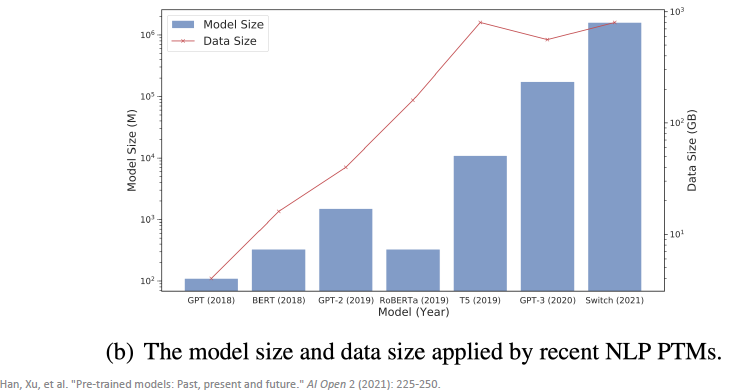

# Pre-trained Language Models

- [Pre-trained Language Models](#pre-trained-language-models)
  - [背景](#背景)
    - [自回归语言模型](#自回归语言模型)
    - [Masked Language Model](#masked-language-model)
    - [自监督学习](#自监督学习)
    - [预训练语言模型优点](#预训练语言模型优点)
    - [Standard: fine-tuning](#standard-fine-tuning)
  - [The Problems of PLMs](#the-problems-of-plms)
  - [如何解决 PLM 的问题](#如何解决-plm-的问题)
    - [下游任务数稀缺](#下游任务数稀缺)

## 背景

神经语言模型（Neural Language Models）：定义单词序列概率的神经网络。

> 自然语言的概率更高。

**如何训练？**

> 给模型一个不完整的句子，让模型预测余下部分。

**如何构造不完整的句子？**

预训练（Pre-training）：使用大量语料库训练神经语言模型

根据构造方式，可以将 Pre-trained Language Models (PLMs) 分为两种：

- 自回归系列(Autoregressive pre-trained）：GPT 系列（GPT, GPT-2, GPT-3）
- MLM-based pre-trained: BERT 系列（BERT, RoBERTa, ALBERT）

### 自回归语言模型

> 因为是对分布进行抽样，不一定是取的概率最大的。

实现 ALM 的架构有多种，可以用 RNN，也可以用 Transformer。下面介绍的主要用 Transformer。

基于 Transformer 的 ALM，包含多层 Transformer：

> Language Model Head (LM Head) 就是 Linear layer。

### Masked Language Model

Masked Language Models (MLMs)：使用未屏蔽的 tokens 预测屏蔽的 token。

其实这也是一种自监督学习。

### 自监督学习

训练一个语言模型，其实就是自监督学习。

自监督学习（self-supervised learning）：根据输入的一部分余下余下部分。

### 预训练语言模型优点

普遍认为，在预训练之后，PLM 从数据集中学习到了一些知识，编码在其隐藏层表示中，这些知识可以转移到下游任务中。

### Standard: fine-tuning

微调（fine-tuning）：使用 PLM 的预训练权重来初始化**下游任务**（downstream task）的模型。例如，用在情感分类任务中：

具体来说：

fine-tuning 这种方法在许多任务中表示都很好，下面是 2018 年 BERT 刚出来时的性能，已经远远超过其它模型的性能：

## The Problems of PLMs

**1. 下游任务数据稀缺**

对很多下游任务，不容易获得大量的标记数据。

**2. PLM 太大**

模型太大：

- 推测（Inference） 耗时
- 占很大空间

## 如何解决 PLM 的问题

### 下游任务数稀缺

