# 注意力机制（Self attention）

- [注意力机制（Self attention）](#注意力机制self-attention)
  - [概述](#概述)
    - [词汇表示成向量](#词汇表示成向量)
    - [输入：向量列表](#输入向量列表)
    - [输出类型](#输出类型)
      - [Sequence Labeling](#sequence-labeling)
  - [self-attention 结构](#self-attention-结构)
  - [self-attention 原理](#self-attention-原理)
    - [输入和输出](#输入和输出)
    - [相关性](#相关性)
    - [计算相关性](#计算相关性)
    - [提取信息](#提取信息)
    - [矩阵角度解释](#矩阵角度解释)
    - [原理总结](#原理总结)
  - [Multi-head self-attention](#multi-head-self-attention)
  - [位置编码](#位置编码)
  - [Truncated self-attention](#truncated-self-attention)
  - [处理图片](#处理图片)
  - [Self-attention vs. CNN](#self-attention-vs-cnn)
  - [Self-attention vs. RNN](#self-attention-vs-rnn)
  - [Self-attention for Graph](#self-attention-for-graph)
  - [其它 self-attention](#其它-self-attention)
  - [参考](#参考)

Last updated: 2022-08-10, 14:55
@author Jiawei Mao
****

## 概述

这篇笔记主要参考李宏毅老师的机器学习课程。

### 词汇表示成向量

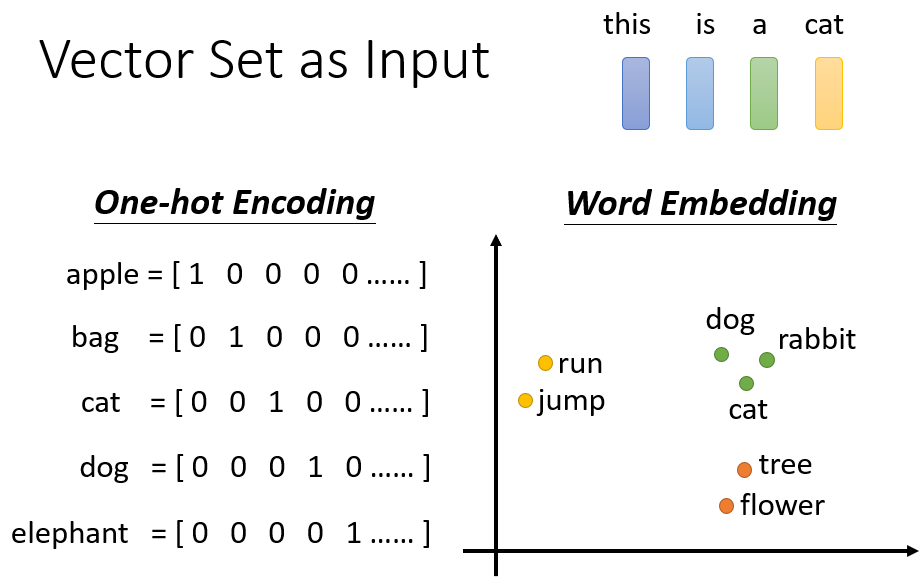

最简单的方法是使用 one-hot encoding，缺点：

- 单词的编码没有任何语义信息
- 编码稀疏

Word Embedding，编码包含语义信息。

### 输入：向量列表

1. 声音信号

一段声音信号可以表示为向量列表，如上图：

- 取一段窗口（25 ms）的声音信号表示成一个向量
- 窗口每次向前移动 10 ms（先贤试验出来的最佳 step）
- 1 s 长度的声音信号就包含 100 个 frames，即用 100 个向量表示。

2. Graph

每个 node 是一个向量。

一个分子，也可以看作一个 Graph，分子的每个原子，可以用向量表示，如 one-hot vector：

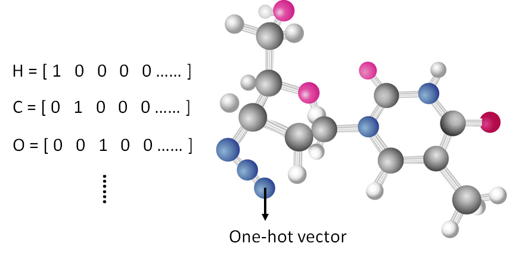

### 输出类型

1. 每个输入向量都有一个输出

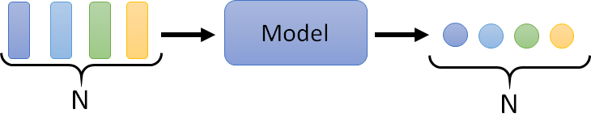

输入 4 个向量，每个向量都有一个 label，输入和输出一对一。这样的实例有：

- 词性标注（POS tagging），给每个词标注词性，如名词、动词还是形容词等
- 语音音标识别
- 人际关系图，标注每个人的特性

2. 整个向量列表只有一个输出

例如：

- 情感分析
- 感觉语音判断 speaker
- 根据分子向量分析分子的亲水性

3. 不知道输出多少个结果

由机器模型自己决定输出多少个结果，这种任务又叫做 seq2seq。

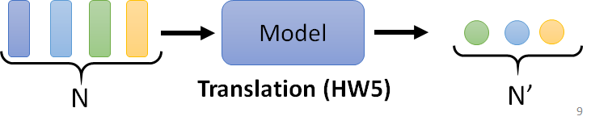

#### Sequence Labeling

输入和输出一一对应，最直接的方式如下：

每个输入向量，用一个 FC 输出。缺点：这种方式不考虑上下文，例如上面的两个 "saw"，一个是动词，一个是名词，使用这种方式标注，两个结果会没有差别。

那么如何实现上下文？可以将一个窗口内的所有向量都输入到 FC：

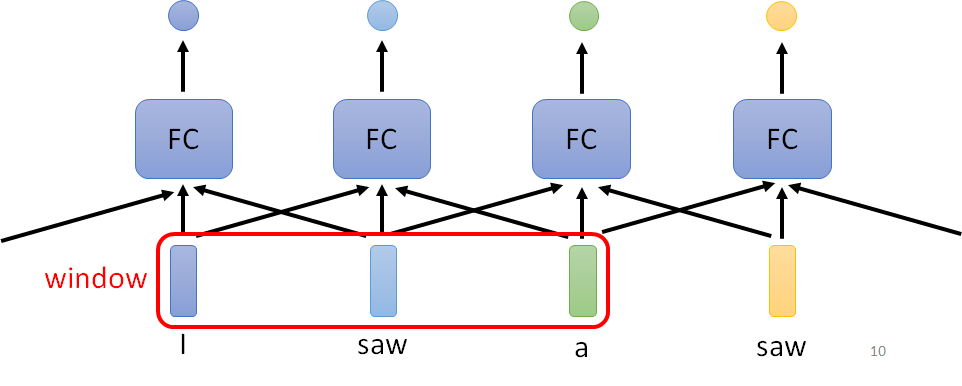

这个方法还是有问题，比如有些问题需要整个序列才能推测出来。window 太大不仅运算量大，还可能过拟合。而 self-attention 可以解决该问题。

## self-attention 结构

self-attention 输出的每个向量，都考虑了整个序列。

self-attention 还可以叠加使用^[https://arxiv.org/abs/1706.03762]：

- Self-attention 处理整个序列的信息
- FC 专注于处理每个位置的信息

关于 self-attention 最著名的文章就是 "Attention is all you need"，在这篇文章里 Google 提出了 Transformer 架构，Transformer 里最重要的模块就是 self-attention。

self-attention 并不是 Transformer 最早提出来的，只是不叫这个名字（self-matching）。"Attention is all you need" 这篇文章把 self-attention 发扬光大了。

## self-attention 原理

### 输入和输出

- self-attention 的输入可能是模型输入（input），也可能是隐藏层的输出（hidden layer），总之是向量序列（$a^1$,$a^2$,$a^3$,$a^4$）。
- 输出也是向量序列（$b^1$,$b^2$,$b^3$,$b^4$）
- 每个 b 都是考虑所有的 a 生成出来的

### 相关性

根据向量之间的相关性来判断输入信息的重要性（attention）：

计算 attention 的方法主要有两种：

这里 $W^q$ 和 $W^k$ 都是可以学习的参数。其中 dot-product 是最常用的方法。

### 计算相关性

query 和 key 作点乘计算 attention score：

这里 $q^1$ 也会和自己计算关联性 $k^1$：

计算好关联性$\alpha$ 后，然后通过 softmax 计算，获得的 $\alpha '$ 等价于概率，反应不同部分的重要性。

> 这里不一定要用 softmax，有人尝试用 ReLU，效果也不错。不过 softmax 最常见。

### 提取信息

现在已经知道哪些向量于 $a^1$ 相关性最大，现在根据这个相关性来提取重要的信息。

这里引入了一个新的向量 $v$，将 $v^1$ 到 $v^4$ 每个向量与 attention 打分 $\alpha '$ 相乘，然后相加获得最终输出 $b^1$（weighted sum）：

到这里，已经详细说明了如何从输入向量 $a^1$,$a^2$,$a^3$,$a^4$ 计算 $b^1$。

从一排输入向量计算 $b^2$ 的操作是一模一样的，如下图所示：

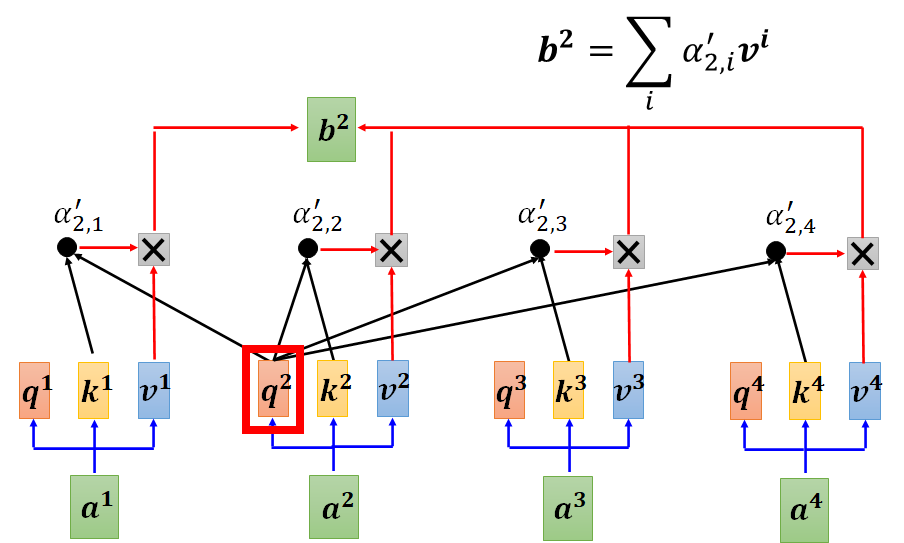

> **[!IMPORTANT]**
> $b^1$ 到 $b^4$ 不需要串行计算，它们可以同时计算出来（并行计算）

### 矩阵角度解释

1. 首先，从 a 计算 $q$, $k$, $v$

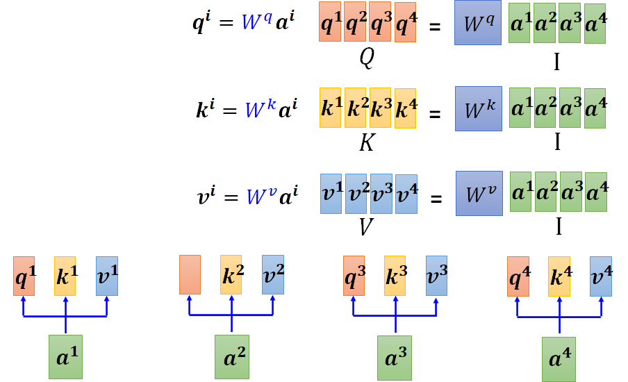

其中 $W^q$, $W^k$, $W^v$ 都是需要学习的参数，$a$ 是输入。

2. 计算 attention score

这里的 k 和 q 上一步已经计算出来，这里只需要进行矩阵乘法，得到的 A 就是 attention 打分，然后进行 softmax。

3. 计算输出

### 原理总结

从总体上来看，self-attention 就是一系列的矩阵乘法：

虽然进行了一系列操作，里面只有 $W^q$, $W^k$ 和 $W^v$ 参数需要学习。

## Multi-head self-attention

相关性有多种，使用一种 $q$ 可能无法满足需求。如下图所示，是 2 头注意力机制：

额外引入 $W^{q,1}$ 和 $W^{q,2}$ 参数，将原来的 $q^i$ 分成两份，然后使用对应位置的 q, k, v 计算输出。

计算另一头的输出：

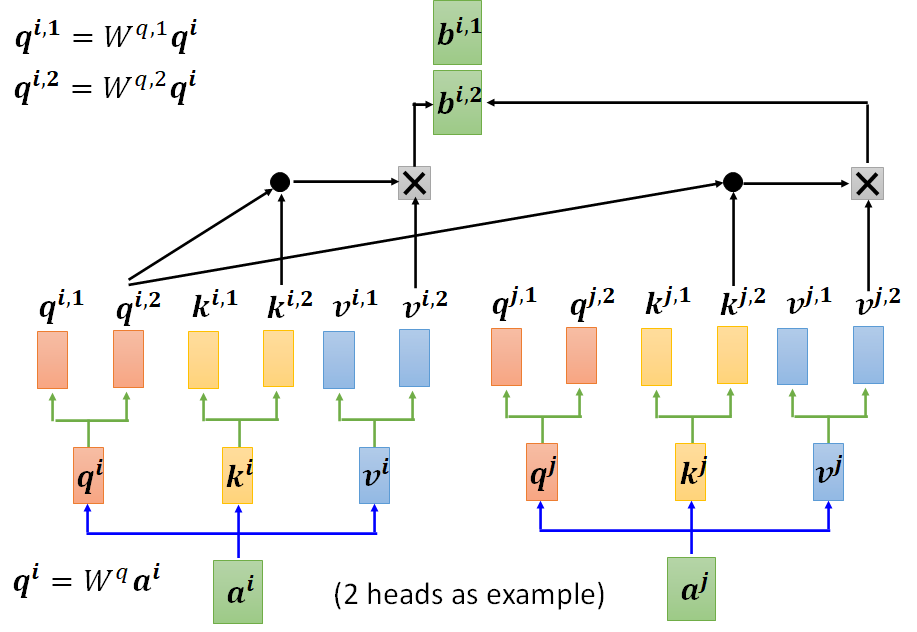

将两个输出串在一起，与输出权重 $W^O$ 相乘，获得最终输出：

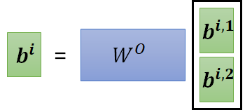

## 位置编码

上面的自注意力机制，所有位置的操作都是一样的，没有包含任何位置信息。而很多时候，位置的信息是很重要的。

每个位置用一个位置向量表示，记为 $e^i$，将其加到输入 $a$ 上：

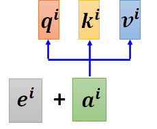

位置编码的方式有多种，在 Transformer 这篇文献中采用的 sin 和 cos 函数，图示图下：

每一列表示一个位置向量。

位置编码的方法目前依然是比较活跃的研究方向，例如^[https://arxiv.org/abs/2003.09229]：

目前还不知道哪一种编码方式最好。

## Truncated self-attention

在语音识别中，语音可以是非常长的向量序列：

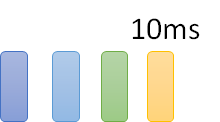

而计算注意力概率 A' 的复杂度与长度 L 的平方成正比，如果使用完整序列计算 A'，A' 可能会太大，大都不容易处理，不好训练。

如下图所示，Truncated Self-attention^[https://arxiv.org/abs/1910.12977] 只看一个小的范围：

这个范围（窗口）的大小是人为设置的，具体设多大，取决于对问题的理解。

## 处理图片

self-attention 擅长处理向量序列，而图片也可以表示为向量序列，如下所示：

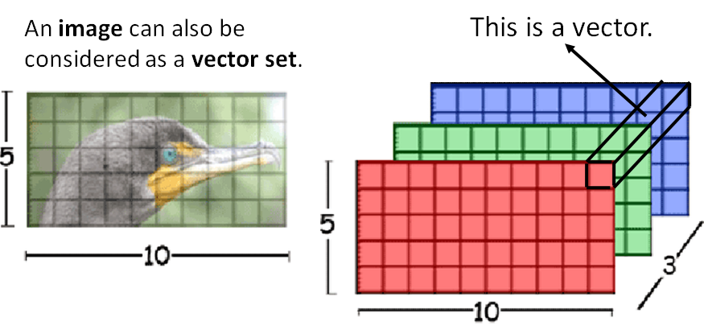

每个像素包含三个通道，可以用一个向量表示，对应序列的一个元素。目前已有相关的应用实例。

self-Attention GAN^[https://arxiv.org/abs/1805.08318]:

DEtection Transformer (DETR)^[https://arxiv.org/abs/2005.12872]

## Self-attention vs. CNN

CNN 可以看到简化版的 self-attention，通过感受野（receptive field）人为指定了相关像素，而 self-attention 则是通过学习获得相关性。

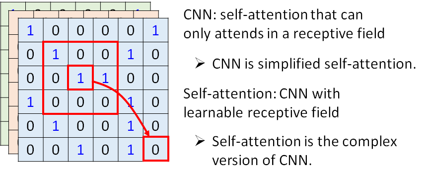

即可以人为 CNN 是 self-attention 的子集：

On the Relationship between Self-Attention and Convolutional Layers ^[https://arxiv.org/abs/1911.03584] 这篇文献通过严格的数学推导，证明 CNN 就是 self-attention 的特例。self-attention 只要合理设置参数，就可以做到和 CNN 一样的事情。

Self-attention 比 CNN 更灵活，更灵活的模型需要更多数据训练，以避免过拟合。Google 出的 "An Image is Worth 16x16 Words: Transformers for Image Recognition at Scale"^[https://arxiv.org/pdf/2010.11929.pdf] 这篇比较的 CNN 和 self-attention 在处理图片上的性能：

> 横坐标为数据量，纵坐标表示模型性能。

可以看到，在数据量较小时，CNN 更好；而数据量较大时，self-attention 更好。CNN 和 Transformer 不是互斥的，两者可以结合起来一起用。

## Self-attention vs. RNN

RNN 的大部分功能，都被 self-attention 取代了。self-attention 相对 RNN 有两个重要的优势：

- RNN 很难捕获长序列的远程关系，而 self-attention 使用 query 和 key，一步到位
- self-attention 可以并行计算

## Self-attention for Graph

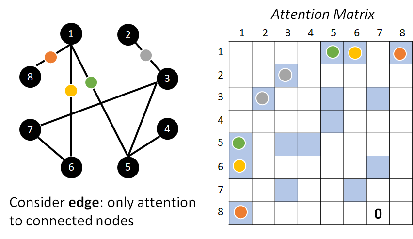

只考虑相连 node 之间的 attention，这是其实是一种 Graph Neural Network (GNN)。

## 其它 self-attention

self-attention 有各种变形形式，"Long Range Arena: A Benchmark for Efficient Transformers" ^[https://arxiv.org/abs/2011.04006] 这篇文献比较了各种不同的 self-attention。self-attention 的最大问题是运算量非常大，所以怎么减少计算量是个重点：

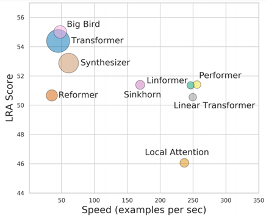

> 由于早期 self-attention 是用在 Transformer 上，所以很多人讲的 Transformer，其实就是 self-attention。这里横坐标表示速度，纵坐标表示性能。

又快又好的 Transformer，依然是个待解决的问题。

"Efficient Transformers: A Survey" ^[https://arxiv.org/abs/2009.06732] 这篇文献介绍了各种 Transformer 的变形。

## 参考

- https://github.com/datawhalechina/leeml-notes
- https://www.bilibili.com/video/BV1JA411c7VT
- https://speech.ee.ntu.edu.tw/~hylee/ml/2021-spring.php
