# Transformer

- [Transformer](#transformer)
  - [Sequence-to-sequence](#sequence-to-sequence)
  - [Encoder](#encoder)
  - [Decoder](#decoder)
    - [Mask](#mask)
    - [Autoregressive](#autoregressive)
    - [Non-autoregressive (NAT)](#non-autoregressive-nat)
  - [Encoder-Decoder 信息传递](#encoder-decoder-信息传递)
    - [Cross attention](#cross-attention)
  - [Training](#training)
  - [训练技巧](#训练技巧)
    - [Copy Mechanism](#copy-mechanism)
    - [Guided Attention](#guided-attention)
    - [Beam Search](#beam-search)
    - [优化评价指标](#优化评价指标)
    - [Scheduled Sampling](#scheduled-sampling)
  - [参考](#参考)

## Sequence-to-sequence

Transformer 是一个 Seq2seq 模型，即输入和输出都是序列的模型。例如：

- 语音识别
- 机器翻译
- 语音翻译（世界上有大概 7000 多种语言，超过一半没有文字）

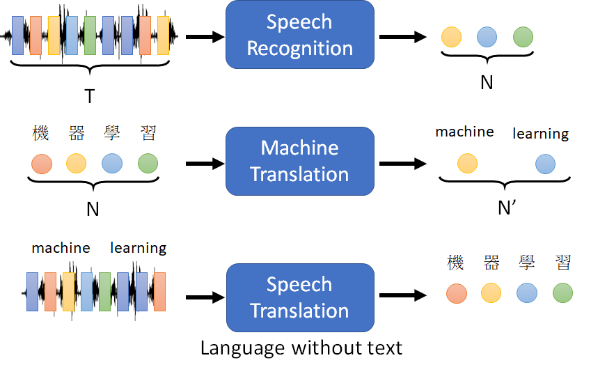

## Encoder

## Decoder

以语言识别为例：

- 首先，输入开始字符 `BEGIN`，表示句子开始
- 输入字符可以用 one-hot 编码表示
- 对每个输入 timestep，Decoder 输出一个向量
  - 向量长度和 Vocabulary 一样
  - 每个 word 一个分数
  - 分数最高的就是输出值

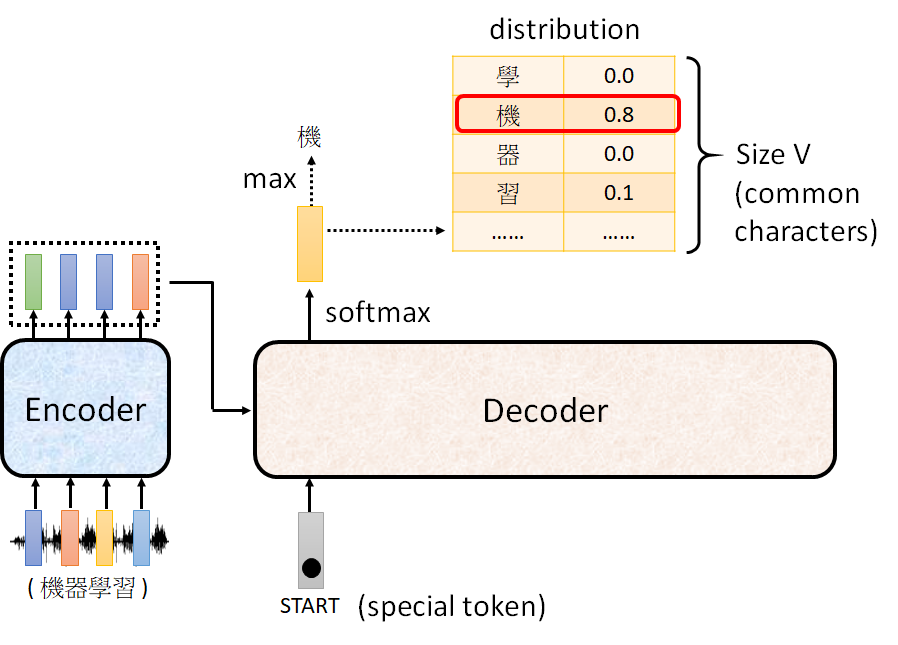

再把输出的 "机" 作为下一步的输入，反复执行该过程：

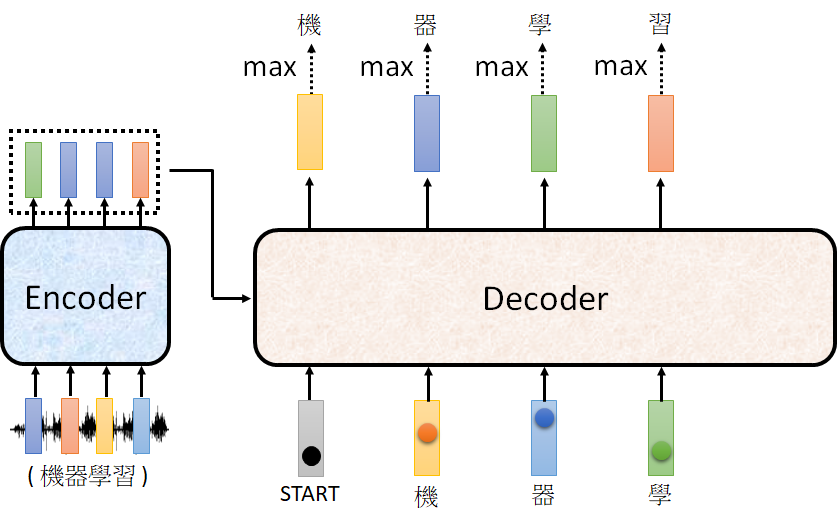

先暂时忽略 Encoder 的输入，集中查看 Decoder 的结构：

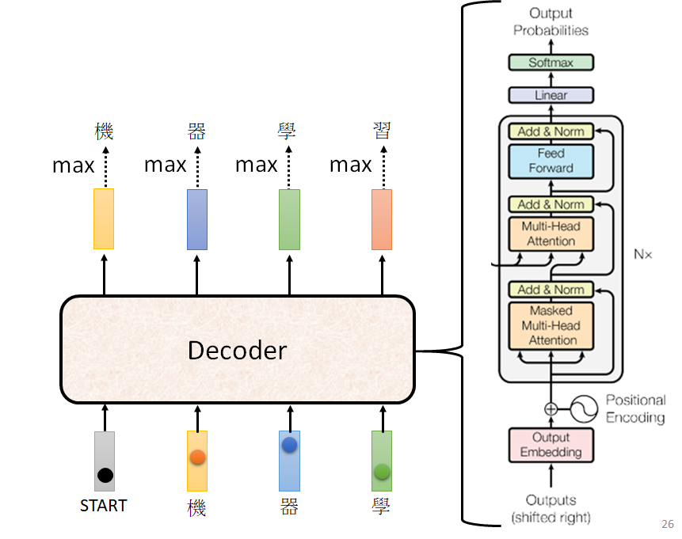

如图所示，右侧是 Transformer 中 Decoder 的结构。

### Mask

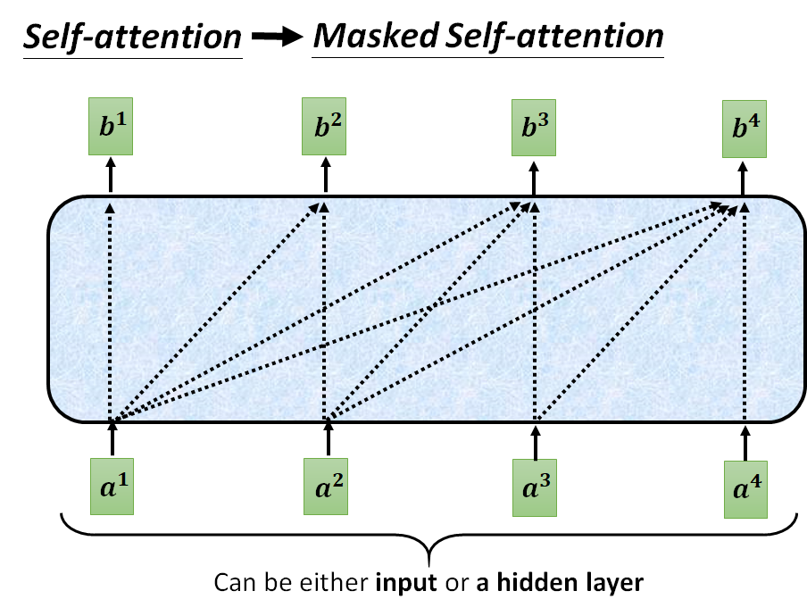

在 Mask Self-attention 中，对每个输入，只能看到前面和当前的输入。

### Autoregressive

作为一个自回归模型，如果不提供特定的机制，我们又不知道应该输出多长，它就可以一直输出：

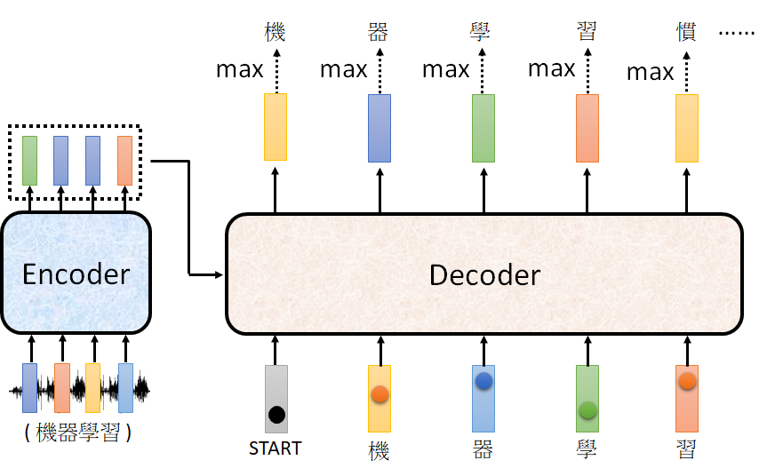

所以，我们可以在 Vocab 中添加一个终止字符：

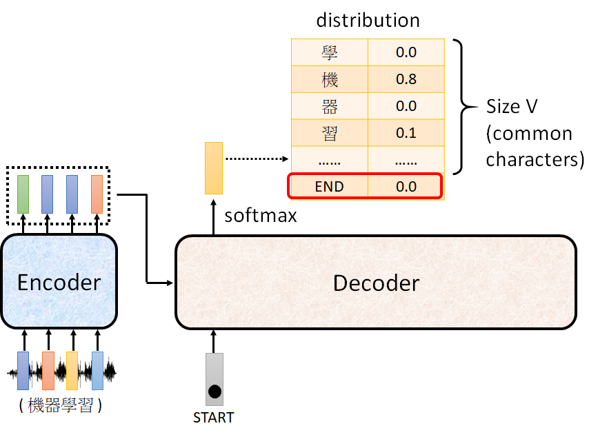

在模型输出 `END` 时停止：

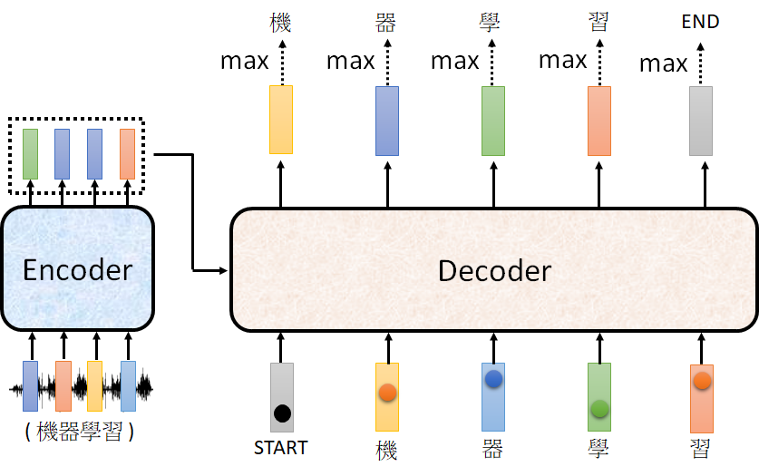

### Non-autoregressive (NAT)

AT (Autoregressive) 和 NAT 的差别：

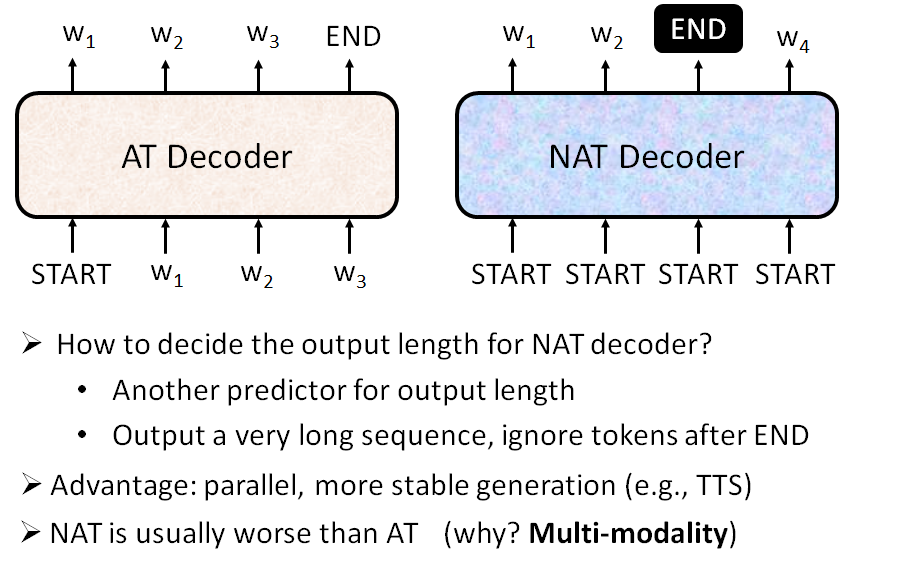

## Encoder-Decoder 信息传递

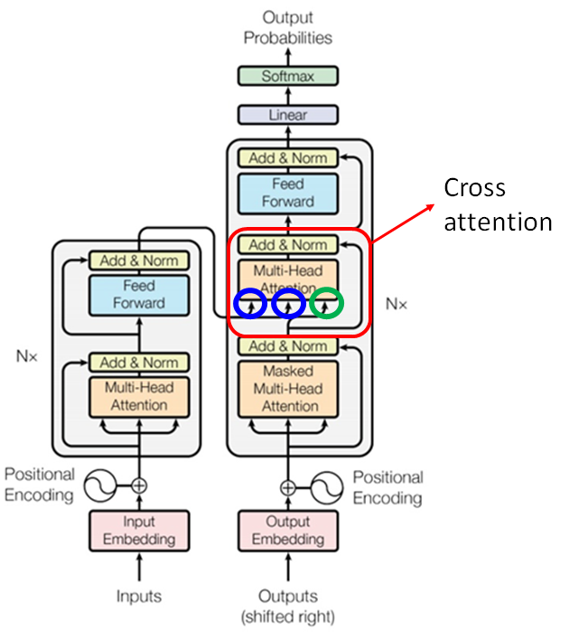

### Cross attention

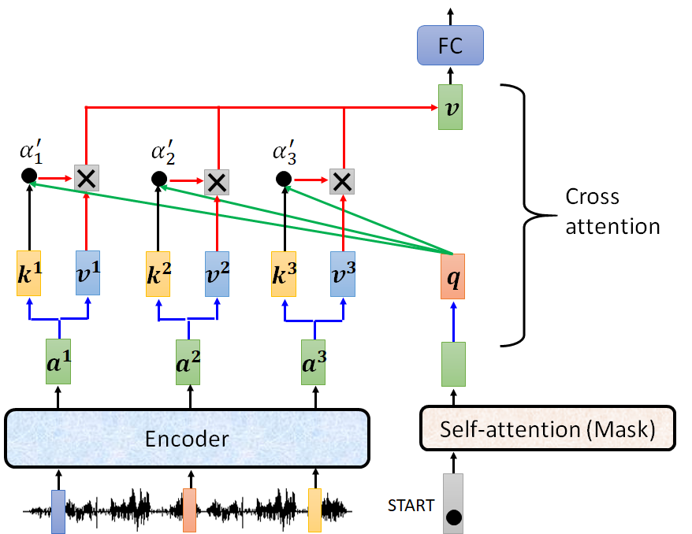

`q` 来自 Decoder，`k` 和 `v` 来自 Encoder，所以称为 cross-attention。

`Decoder` 产生一个 `q`，然后从 `Encoder` 提取信息。下一个 timestep 的计算完全相同：

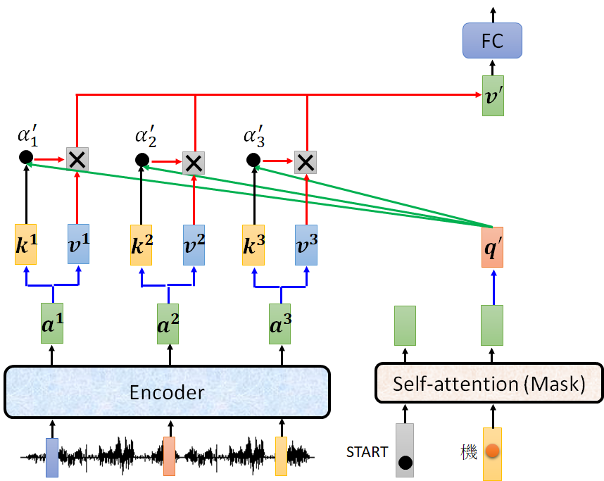

多种 cross attention 类型^[https://arxiv.org/abs/2005.08081]：

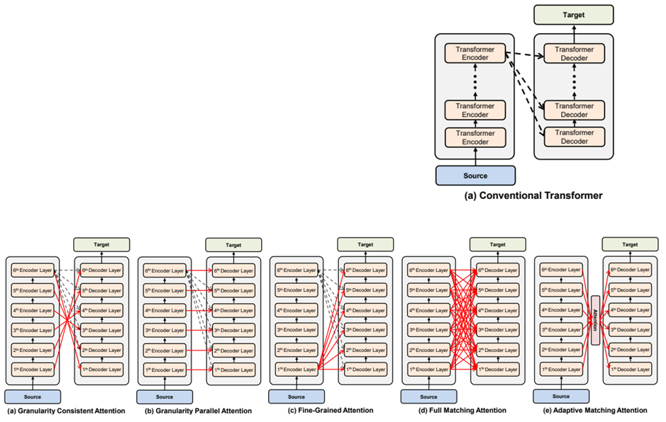

## Training

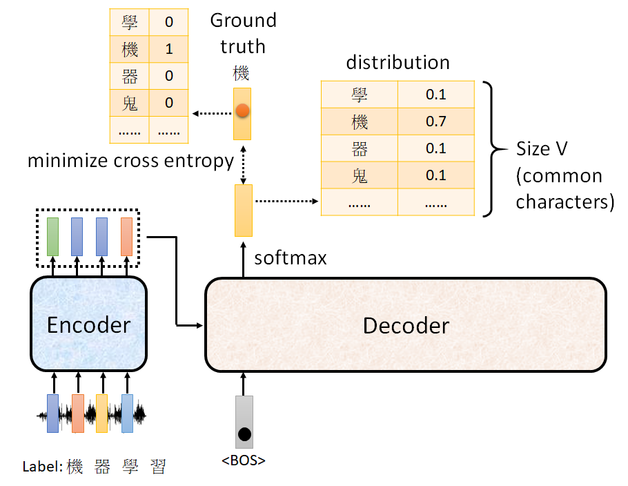

这其实是个分类问题，计算预测和真实值的 cross entropy。

在训练的时候，会为 Decoder 提供正确答案，这种技术称为 **Teacher Forcing**：using the ground truth as input。

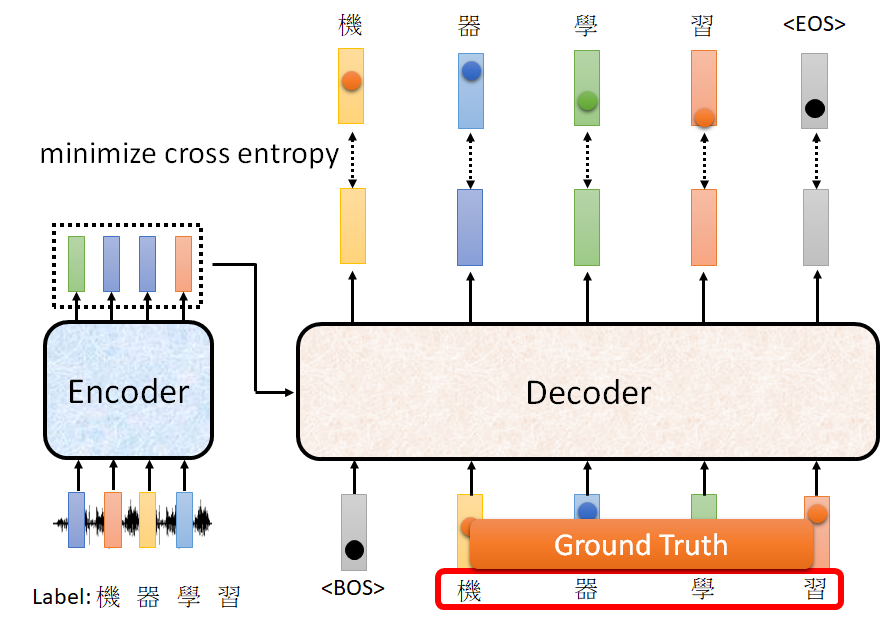

## 训练技巧

### Copy Mechanism

在机器翻译：

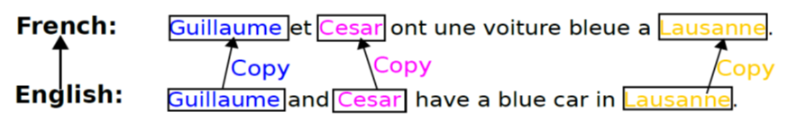

聊天机器人：

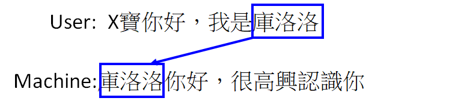

和文本摘要：

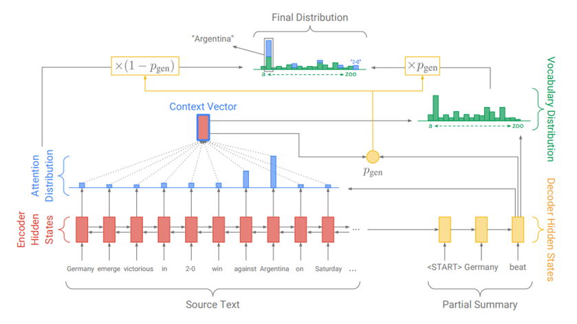

> 这种文本摘要模型，往往需要百万篇文章。

复制机制都很重要。

更多细节可参考 Incorporating Copying Mechanism in Sequence-to-Sequence Learning ^[https://arxiv.org/abs/1603.06393]

### Guided Attention

要求以固定的方式执行 Attention。

### Beam Search

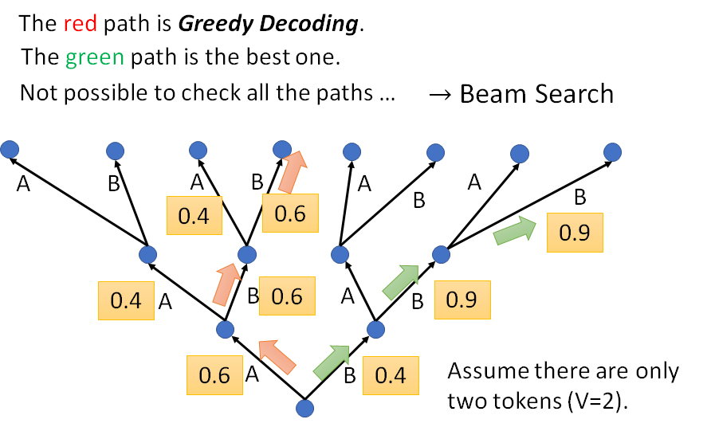

暴搜所有的路径计算量太大，Beam Search

Beam Search 有时候有用，有时候没用，取决于任务类型。。。

对需要一点创造力的任务，decoder 需要一点随机性，此时 Beam Search 效果较好。

### 优化评价指标

遇到无法优化的问题，用强化学习也可以。

### Scheduled Sampling

Original Scheduled Sampling^[https://arxiv.org/abs/1506.03099]

Scheduled Sampling for Transformer^[https://arxiv.org/abs/1906.07651]

Parallel Scheduled Sampling^[https://arxiv.org/abs/1906.04331]

## 参考

- https://speech.ee.ntu.edu.tw/~hylee/ml/2021-spring.php
