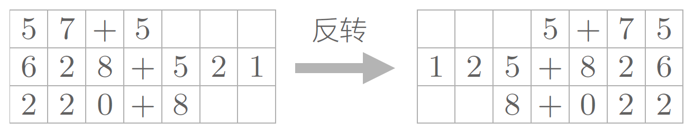

# seq2seq 学习加法

- [seq2seq 学习加法](#seq2seq-学习加法)
  - [简介](#简介)
  - [反转](#反转)
  - [配置](#配置)
  - [生成数据](#生成数据)
  - [向量化数据](#向量化数据)
  - [构建模型](#构建模型)
  - [训练模型](#训练模型)
  - [参考](#参考)

Last updated: 2022-08-01, 15:17
@author Jiawei Mao
***

## 简介

在本例中，训练模型学习两个数字字符串的加法。例如：

- 输入："535+61"
- 输出："596"

可以选择将输入调换（reversed），这样可以提高性能。

理论上，调换输入序列的顺序引入了 source 和 target 的短期依赖关系。

模型：

- 两个数字（reversed）：一层 LSTM（128 HN），5k 训练样本 = 99% train/test 精度 in 55 epochs
- 三个数字（reversed）：一层 LSTM（128 HN），50k 训练样本 = 99% train/test 精度 in 100 epochs
- 四个数字（reversed）：一层 LSTM（128 HN），400k 训练样本 = 99% train/test 精度 in 20 epochs
- 五个数字（reversed）：一层 LSTM（128 HN），550k 训练样本 = 99% train/test 精度 in 30 epochs

## 反转

反转输入数据，如下：



该技巧是 Sequence to Sequence Learning with Neural Networks ^[Sutskever, I.; Vinyals, O.; Le, Q. V. Sequence to Sequence Learning with Neural Networks. arXiv December 14, 2014. https://doi.org/10.48550/arXiv.1409.3215.] 中提出。据研究，大多时候使用该技巧，学习进展更快，最终的精度也有提高。

虽然理论上不清楚为什么反转数据后，学习进展变快，精度提高，但是直观上可以认为，反转数据后梯度的传播更平滑。

## 配置

```python
from tensorflow import keras
from tensorflow.keras import layers
import numpy as np

# Parameters for the model and dataset
TRAINING_SIZE = 50000
DIGITS = 3
REVERSE = True

# Maximum length of input is 'int + int' (e.g., '345+678').
# Maximum length of int is DIGITS
MAXLEN = DIGITS + 1 + DIGITS
```

## 生成数据

```python
class CharacterTable:
    """Given a set of characters:
    + Encode them to a one-hot integer representation
    + Decode the one-hot or integer representation to their character output
    + Decode a vector of probabilities to their character output
    """

    def __init__(self, chars):
        """Initialize character table.
        # Arguments
            chars: Characters that can appear in the input.
        """
        self.chars = sorted(set(chars))
        self.char_indices = dict((c, i) for i, c in enumerate(self.chars))
        self.indices_char = dict((i, c) for i, c in enumerate(self.chars))

    def encode(self, C, num_rows):
        """One-hot encode given string C.
        # Arguments
            C: string, to be encoded.
            num_rows: Number of rows in the returned one-hot encoding. This is
                used to keep the # of rows for each data the same.
        """
        x = np.zeros((num_rows, len(self.chars)))
        for i, c in enumerate(C):
            x[i, self.char_indices[c]] = 1
        return x

    def decode(self, x, calc_argmax=True):
        """Decode the given vector or 2D array to their character output.
        # Arguments
            x: A vector or a 2D array of probabilities or one-hot representations;
                or a vector of character indices (used with `calc_argmax=False`).
            calc_argmax: Whether to find the character index with maximum
                probability, defaults to `True`.
        """
        if calc_argmax:
            x = x.argmax(axis=-1)
        return "".join(self.indices_char[x] for x in x)


# All the numbers, plus sign and space for padding.
chars = "0123456789+ "
ctable = CharacterTable(chars)

questions = []
expected = []
seen = set()
print("Generating data...")
while len(questions) < TRAINING_SIZE:
    f = lambda: int(
        "".join(
            np.random.choice(list("0123456789"))
            for i in range(np.random.randint(1, DIGITS + 1))
        )
    )
    a, b = f(), f()
    # Skip any addition questions we've already seen
    # Also skip any such that x+Y == Y+x (hence the sorting).
    key = tuple(sorted((a, b)))
    if key in seen:
        continue
    seen.add(key)
    # Pad the data with spaces such that it is always MAXLEN.
    q = "{}+{}".format(a, b)
    query = q + " " * (MAXLEN - len(q))
    ans = str(a + b)
    # Answers can be of maximum size DIGITS + 1.
    ans += " " * (DIGITS + 1 - len(ans))
    if REVERSE:
        # Reverse the query, e.g., '12+345  ' becomes '  543+21'. (Note the
        # space used for padding.)
        query = query[::-1]
    questions.append(query)
    expected.append(ans)
print("Total questions:", len(questions))
```

## 向量化数据

```python
print("Vectorization...")
x = np.zeros((len(questions), MAXLEN, len(chars)), dtype=bool)
y = np.zeros((len(questions), DIGITS + 1, len(chars)), dtype=bool)
for i, sentence in enumerate(questions):
    x[i] = ctable.encode(sentence, MAXLEN)
for i, sentence in enumerate(expected):
    y[i] = ctable.encode(sentence, DIGITS + 1)

# Shuffle (x, y) in unison as the later parts of x will almost all be larger
# digits.
indices = np.arange(len(y))
np.random.shuffle(indices)
x = x[indices]
y = y[indices]

# Explicitly set apart 10% for validation data that we never train over.
split_at = len(x) - len(x) // 10
(x_train, x_val) = x[:split_at], x[split_at:]
(y_train, y_val) = y[:split_at], y[split_at:]

print("Training Data:")
print(x_train.shape)
print(y_train.shape)

print("Validation Data:")
print(x_val.shape)
print(y_val.shape)
```

```txt
Vectorization...
Training Data:
(45000, 7, 12)
(45000, 4, 12)
Validation Data:
(5000, 7, 12)
(5000, 4, 12)
```

## 构建模型

```python
print("Build model...")
num_layers = 1  # Try to add more LSTM layers!

model = keras.Sequential()
# Encoder 使用单层 LSTM，HN 为 128
# 对变长输入序列，使用 input_shape=(None, num_feature)
model.add(layers.LSTM(128, input_shape=(MAXLEN, len(chars))))
# 解码 rnn 输入，为每个时间步提供最后的 hidden state
# 重复 'DIGITS+1' 次，对应输出的最大长度，例如当 DIGITS=3，最大输出为 999+999=1998
model.add(layers.RepeatVector(DIGITS + 1))
# 解码 rnn 可以包含多层，也可以是单层
for _ in range(num_layers):
    # 将 `return_sequences` 设置为 True，返回完整隐状态，输出 shape 为
    # (num_samples, timesteps, output_dim).
    model.add(layers.LSTM(128, return_sequences=True))

# 将 dense 层应用于输入的每个时间步，确定每步选择的字符
model.add(layers.Dense(len(chars), activation="softmax"))
model.compile(loss="categorical_crossentropy", optimizer="adam", metrics=["accuracy"])
model.summary()
```

```txt
Build model...
Model: "sequential"
_________________________________________________________________
 Layer (type)                Output Shape              Param #   
=================================================================
 lstm (LSTM)                 (None, 128)               72192     
                                                                 
 repeat_vector (RepeatVector  (None, 4, 128)           0         
 )                                                               
                                                                 
 lstm_1 (LSTM)               (None, 4, 128)            131584    
                                                                 
 dense (Dense)               (None, 4, 12)             1548      
                                                                 
=================================================================
Total params: 205,324
Trainable params: 205,324
Non-trainable params: 0
```

## 训练模型

```python
epochs = 30
batch_size = 32

# 训练模型，并在验证集上显示预测效果
for epoch in range(1, epochs):
    print()
    print("Iteration", epoch)
    model.fit(
        x_train,
        y_train,
        batch_size=batch_size,
        epochs=1,
        validation_data=(x_val, y_val),
    )
    # 从验证集上随机选择 10 个样本，以查看效果
    for i in range(10):
        ind = np.random.randint(0, len(x_val))
        rowx, rowy = x_val[np.array([ind])], y_val[np.array([ind])]
        preds = np.argmax(model.predict(rowx), axis=-1)
        q = ctable.decode(rowx[0])
        correct = ctable.decode(rowy[0])
        guess = ctable.decode(preds[0], calc_argmax=False)
        print("Q", q[::-1] if REVERSE else q, end=" ")
        print("T", correct, end=" ")
        if correct == guess:
            print("☑ " + guess)
        else:
            print("☒ " + guess)
```

```txt
Iteration 1
1407/1407 [==============================] - 16s 8ms/step - loss: 1.7603 - accuracy: 0.3551 - val_loss: 1.5724 - val_accuracy: 0.4044
1/1 [==============================] - 1s 522ms/step
Q 2+227   T 229  ☒ 223 
1/1 [==============================] - 0s 16ms/step
Q 42+377  T 419  ☒ 481 
1/1 [==============================] - 0s 16ms/step
Q 481+326 T 807  ☒ 111 
1/1 [==============================] - 0s 22ms/step
Q 84+52   T 136  ☒ 550 
1/1 [==============================] - 0s 16ms/step
Q 729+3   T 732  ☒ 980 
1/1 [==============================] - 0s 16ms/step
Q 1+154   T 155  ☒ 120 
1/1 [==============================] - 0s 16ms/step
Q 449+32  T 481  ☒ 453 
1/1 [==============================] - 0s 16ms/step
Q 31+0    T 31   ☒ 11  
1/1 [==============================] - 0s 16ms/step
Q 77+0    T 77   ☒ 11  
1/1 [==============================] - 0s 31ms/step
Q 774+91  T 865  ☒ 901 

...

Iteration 29
1407/1407 [==============================] - 11s 8ms/step - loss: 0.0190 - accuracy: 0.9949 - val_loss: 0.0054 - val_accuracy: 0.9991
1/1 [==============================] - 0s 16ms/step
Q 251+763 T 1014 ☑ 1014
1/1 [==============================] - 0s 16ms/step
Q 5+241   T 246  ☑ 246 
1/1 [==============================] - 0s 14ms/step
Q 779+6   T 785  ☑ 785 
1/1 [==============================] - 0s 14ms/step
Q 59+936  T 995  ☑ 995 
1/1 [==============================] - 0s 14ms/step
Q 545+3   T 548  ☑ 548 
1/1 [==============================] - 0s 14ms/step
Q 50+789  T 839  ☑ 839 
1/1 [==============================] - 0s 13ms/step
Q 4+70    T 74   ☑ 74  
1/1 [==============================] - 0s 13ms/step
Q 538+59  T 597  ☑ 597 
1/1 [==============================] - 0s 14ms/step
Q 55+546  T 601  ☑ 601 
1/1 [==============================] - 0s 14ms/step
Q 971+9   T 980  ☑ 980 
```

经过 29 个 epochs，validation 精度达到 99+%。

## 参考

- https://keras.io/examples/nlp/addition_rnn/
