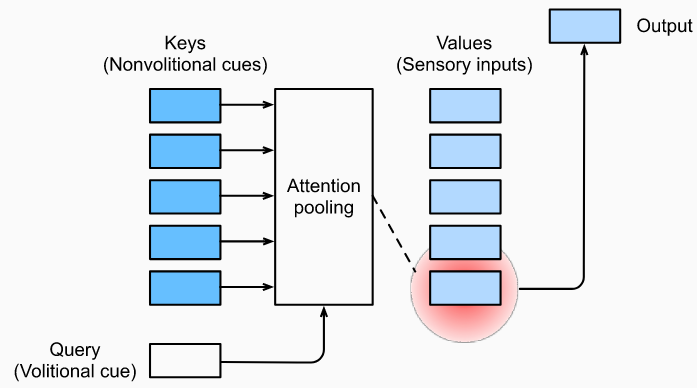
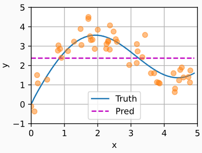
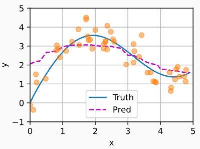

# 注意力机制

- [注意力机制](#注意力机制)
  - [简介](#简介)
  - [注意力池化](#注意力池化)
    - [生成数据集](#生成数据集)
    - [平均池化](#平均池化)
    - [非参数注意力池化](#非参数注意力池化)
    - [参数化注意力机制](#参数化注意力机制)

Last updated: 2022-08-05, 14:43
****

## 简介

注意力机制显示的考虑自主性提示：

- 自主性提示称为查询（query）
- 每个输入是一个值（value）和非自主性提示（key）的对
- 通过注意力池化层来有偏向性的选择某些输入

> 注意力机制通过注意力池化将查询（自主性提示）和键（非自主性提示）结合在一起，实现对值（感官输入）的选择性倾向

## 注意力池化

1964 年提出的 Nadaraya-Watson 核回归模型是一个简单但完整的例子，可用于演示具有注意力机制的机器学习。

### 生成数据集

简单起见，考虑下面这个回归问题：给定数据集 $\{(x_1,y_1),...,(x_n,y_n)\}$，如何学习 $f$ 来预测任意新输入 x 的输出 $\hat{y}=f(x)$？

根据非线性函数生成一个人工数据集，并加入噪音项 ϵ:

$$y_i=2sin(x_i)+x_i^{0.8}+\epsilon \tag{1}$$

其中噪音 ϵ 服从均值为 0、标准差为 0.5 的正态分布。

### 平均池化

我们先使用最简单的估计器来解决回归问题，基于平均池化来计算所有训练样本输出值的平均值：

$$f(x)=\frac{1}{n}\sum_{i=1}^n y_i \tag{2}$$

如下图所示，这个估计器不大聪明的样子：真实函数 Truth 和预测函数 Pred 相差很大。

平均池化忽略了查询 x，最简单，也是最傻的方案。

### 非参数注意力池化

显然，平均池化忽略了输入 $x_i$。于是 Nadaraya 和 Watson 提出了一个更好的想法，根据输入的位置对输出 $y_i$ 进行加权：

$$f(x)=\sum_{i=1}^n \frac{K(x-x_i)}{\sum_{i=1}^n K(x-x_j)}y_i \tag{3}$$

其中 `K` 是核（kernel），就是个函数，用来衡量 x 和 $x_i$ 之间的距离。公式（3）描述的估计器被称为 Nadaraya-Watson 核回归。受此启发，我们从注意力机制框架出发，对（3）进行重写，获得一个更加通用的注意力池化（attention pooling）公式：

$$f(x)=\sum_{i=1}^n\alpha (x,x_i)y_i \tag{4}$$

其中 x 是查询（query），$(x_i, y_i)$ 是键值对，注意力池化是 $y_i$ 的加权平均。将查询 x 和键 $x_i$ 之间的关系建模为注意力权重（attention weight）$\alpha (x,x_i)$，这个权重将被分配给每一个对应 $y_i$ 值。对于任何查询，模型在所有键值对注意力权重都是一个有效的概率分布，它们非负，总和为 1。

因为不需要学习任何参数，所以称为**非参**注意力池化。

为了更好地理解注意力池化，现在考虑一个高斯核（Gaussian kernel），其定义为：

$$K(\mu)=\frac{1}{\sqrt{2\pi}}exp(-\frac{\mu ^2}{2}) \tag{5}$$

将高斯核带入式子（3）和（4）得到：

$$\begin{aligned}
f(x) &=\sum_{i=1}^n\alpha(x,x_i)y_i \\
     &=\sum_{i=1}^n \frac{exp(-\frac{1}{2}(x-x_i)^2)}{\sum_{j=1}^n exp(-\frac{1}{2}(x-x_j)^2)}y_i\\
     &=\sum_{i=1}^n softmax(-\frac{1}{2}(x-x_i)^2)y_i \tag{6}
\end{aligned}$$

键 $x_i$ 越接近给定的查询 x，分配给这个键对应值 $y_i$ 的注意力权重就越大。也就获得了更多的“注意力”。

值得注意的是，Nadaraya-Watson 核回归是一个非参数模型，式(6)是非参数的注意力池化（nonparametric attention pooling）模型。接下来，我们基于这个非参数的注意力池化模型绘制预测结果。你会发现新的模型预测线是平滑的，并且比平均池化的预测更接近真实。

现在，我们来观察注意力的权重。这里测试数据的输出相当于查询，而训练数据的输入相当于键。因为两个输入都是经过排序的，因此由观察可知“查询-键”对越接近，注意力池化的注意力权重就越高。

### 参数化注意力机制

非参数的 Nadaraya-Watson 核回归具有一致性（consistency）的优点：如果有足够的数据，此模型会收敛到最优结果。尽管如此，我们还是可以将可学习的参数集成到注意力汇聚中。

与非参注意力汇聚式(6)不同，在下面的查询 x 和键 $x_i$ 之间的距离乘以可学习参数 w:

$$\begin{aligned}
f(x) &= \sum_{i=1}^n \alpha (x,x_i)y_i \\
     &=\sum_{i=1}^n \frac{exp(-\frac{1}{2}((x-x_i)w)^2)}{\sum_{j=1}^n exp(-\frac{1}{2}((x-x_j)w)^2)}y_i\\
     &=\sum_{i=1}^n softmax(-\frac{1}{2}(x-x_i)^2)y_i \tag{7}
\end{aligned}$$

这里 $\alpha (x,x_i)$ 是注意力权重。

下面，我们通过训练这个模型（7）来学习注意力池化的参数。
