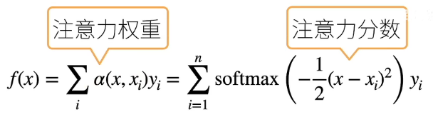
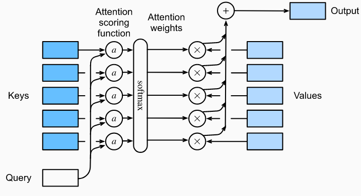

# 注意力分数

- [注意力分数](#注意力分数)
  - [简介](#简介)
  - [拓展到高维度](#拓展到高维度)
  - [Additive Attention](#additive-attention)
  - [Scaled Dot-Product Attention](#scaled-dot-product-attention)
  - [代码实现](#代码实现)
    - [masked softmax](#masked-softmax)
    - [加性注意力](#加性注意力)
    - [缩放点积注意力](#缩放点积注意力)

***

## 简介



如果用的高斯核，注意力权重就变成 softmax。

权重一般 >= 0，加起来为 1。而分数是没有归一化的版本，通过 softmax 转换为注意力权重。



> 注意力池化的输出为值的加权和。

## 拓展到高维度

假设有一个 query 为向量 $q\isin \Reals^q$ 和 m 个 key-value 对 $(k_1, v_1),...,(k_m,v_m)$，其中 $k_i\isin \Reals^k$, $v_i\isin \Reals^v$。即 $k_i$ 是长为 k 的向量，$v_i$ 是长为 v 的向量。

注意力池化函数 $f$ 表示成值的加权和：

$$f(q, (k_1,v_1),...,(k_m,v_m))=\sum_{i=1}^m\alpha (q, k_i)v_i\isin \Reals^v \tag{1}$$

其中查询 $q$ 和键 $k_i$ 的注意力权重（标量）通过注意力打分函数 $a$ 将两个向量映射为标量，再经过 softmax 运算得到：

$$\alpha (q,k_i)=softmax(a(q,k_i))=\frac{exp(a(q,k_i))}{\sum_{j=1}^m exp(a(q,k_j))}\isin \Reals \tag{2}$$

现在的关键是如何设计打分函数 $a$。

## Additive Attention

一般来说，当 query 和 key 是长度不同的向量时，可以使用加性注意力作为打分函数。给定查询 $q\isin \Reals ^k$，加性注意力的打分函数为：

$$a(q,k)=w_v^T tanh(W_qq+W_kk)\isin \Reals \tag{3}$$

其中，可学习参数 $W_q\isin \Reals^{h\times q}$, $W_k\isin \Reals^{h\times k}$ 和 $w_v \isin \Reals^h$。等价于将 query 和 key 连结起来输入到一个多层感知机（MLP）中，感知机包含一个隐藏层，其隐藏单元数时一个超参数 h。通过 tanh 作为激活函数，并且禁用偏置项。

加性 attention 的优点：key 和 query 的长度没有限制。

## Scaled Dot-Product Attention

如果 query 和 key 长度相同 $q,k_i\isin \Reals^d$，就可以将点积定义为打分函数：

$$a(q,k_i)=q^Tk/\sqrt{d} \tag{4}$$

点积的计算效率更高，但是要求查询和键具有相同的长度 d。

对缩放点积注意力：

- 注意力分数是 query 和 key 的相似度，注意力权重是分数的 softmax 结果
- 两种常见的分数计算：
  - 将 query 和 key 合并起来进入一个单输出单隐藏层的 MLP
  - 直接将 query 和 key 做内积

## 代码实现

### masked softmax

```python
def masked_softmax(X, valid_lens):
    """通过在最后一个轴上掩蔽元素来执行softmax操作"""
    # X:3D张量，valid_lens:1D或2D张量
    if valid_lens is None:
        return tf.nn.softmax(X, axis=-1) # 正常的 softmax 操作
    else:
        shape = X.shape
        if len(valid_lens.shape) == 1:
            valid_lens = tf.repeat(valid_lens, repeats=shape[1])

        else:
            valid_lens = tf.reshape(valid_lens, shape=-1)
        # 最后一轴上被掩蔽的元素使用一个非常大的负值替换，从而其softmax输出为0
        X = d2l.sequence_mask(
            tf.reshape(X, shape=(-1, shape[-1])), valid_lens, value=-1e6
        )
        return tf.nn.softmax(tf.reshape(X, shape=shape), axis=-1)
```

`valid_lens` 是有效长度。

- 演示函数效果

指定的 `tf.constant([2, 3])` 表示第一个样本的有效长度为 2，第二个样本的有效长度为 3。效果如下：

```python
masked_softmax(tf.random.uniform(shape=(2, 2, 4)), tf.constant([2, 3]))
```

```txt
<tf.Tensor: shape=(2, 2, 4), dtype=float32, numpy=
array([[[0.33927715, 0.6607229 , 0.        , 0.        ],
        [0.5186399 , 0.48136008, 0.        , 0.        ]],

       [[0.2706828 , 0.34843233, 0.38088483, 0.        ],
        [0.28000477, 0.29489115, 0.42510405, 0.        ]]], dtype=float32)>
```

可以看到，第一个样本的只有前面 2 列非零，后面都是零；第二个样本前面 3 列非零，后面都是零。

- 也可以使用二维向量，为矩阵样本的每一行指定有效长度

```python
masked_softmax(tf.random.uniform(shape=(2, 2, 4)), tf.constant([[1, 3], [2, 4]]))
```

```txt
<tf.Tensor: shape=(2, 2, 4), dtype=float32, numpy=
array([[[1.        , 0.        , 0.        , 0.        ],
        [0.30077505, 0.25723618, 0.4419887 , 0.        ]],

       [[0.5924722 , 0.40752774, 0.        , 0.        ],
        [0.19095424, 0.21986324, 0.22264503, 0.36653754]]], dtype=float32)>
```

### 加性注意力

```python
class AdditiveAttention(tf.keras.layers.Layer):
    """Additiveattention."""

    def __init__(self, key_size, query_size, num_hiddens, dropout, **kwargs):
        super().__init__(**kwargs)
        self.W_k = tf.keras.layers.Dense(num_hiddens, use_bias=False)
        self.W_q = tf.keras.layers.Dense(num_hiddens, use_bias=False)
        self.w_v = tf.keras.layers.Dense(1, use_bias=False)
        self.dropout = tf.keras.layers.Dropout(dropout)

    def call(self, queries, keys, values, valid_lens, **kwargs):
        queries, keys = self.W_q(queries), self.W_k(keys)
        # 在维度扩展后，
        # queries 的 shape：(batch_size，查询的个数，1，num_hidden)
        # key 的 shape：(batch_size，1，“键－值”对的个数，num_hiddens)
        # 使用广播方式进行求和
        features = tf.expand_dims(queries, axis=2) + tf.expand_dims(keys, axis=1)
        features = tf.nn.tanh(features)
        # self.w_v仅有一个输出，因此从形状中移除最后那个维度。
        # scores的形状：(batch_size，查询的个数，“键-值”对的个数)
        scores = tf.squeeze(self.w_v(features), axis=-1)
        self.attention_weights = masked_softmax(scores, valid_lens)
        # values的形状：(batch_size，“键－值”对的个数，值的维度)
        return tf.matmul(self.dropout(self.attention_weights, **kwargs), values)
```

`valid_lens` 表示需要多少 key-value pair。

### 缩放点积注意力

```python
# @save
class DotProductAttention(tf.keras.layers.Layer):
    """Scaleddotproductattention."""

    def __init__(self, dropout, **kwargs):
        super().__init__(**kwargs)
        self.dropout = tf.keras.layers.Dropout(dropout)

    # queries的形状：(batch_size，查询的个数，d)
    # keys的形状：(batch_size，“键－值”对的个数，d)
    # values的形状：(batch_size，“键－值”对的个数，值的维度)
    # valid_lens的形状:(batch_size，)或者(batch_size，查询的个数)
    def call(self, queries, keys, values, valid_lens, **kwargs):
        d = queries.shape[-1]
        scores = tf.matmul(queries, keys, transpose_b=True) / tf.math.sqrt(
            tf.cast(d, dtype=tf.float32)
        )
        self.attention_weights = masked_softmax(scores, valid_lens)
        return tf.matmul(self.dropout(self.attention_weights, **kwargs), values)
```

