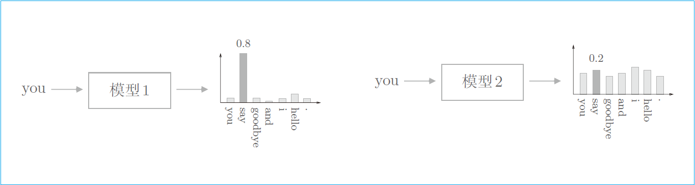

# 困惑度

2022-02-22, 10:13
***

## 简介

语言模型基于已经出现的单词输出将要出现的单词的概率。困惑度（perplexity）常被用于评价语言模型的预测性能的指标。

简单地说，困惑度表示 “概率的倒数” （在数据量为 1 时严格一致）。假设语料库为 “you say goodbye and i say hello”，并假设向语言模型 1 传入单词 you 时输出下图左侧的概率分布。此时，下一个出现的单词是 say 的概率为 0.8，取这个概率的倒数，得到困惑度为 $\frac{1}{0.8}=1.25$。

而右侧的模型 2 预测出正确单词的概率为 0.2，显然是一个很差的预测，此时的困惑度为 $\frac{1}{0.2}=5$，值越大，表示效果越差。

困惑度，可以理解为 “分叉度”，所谓分叉度，指下一个可以选择的选项的数量（下一个可能出现候选单词的个数），在上例中，好的预测模型的分叉度是 1.25，意味着下一个要出现的单词的候选个数可以控制在 1 个左右；而在差的模型中，下一个单词的候选个数有 5 个。

基于困惑度可以评价模型的预测性能。好的模型预测正确单词的概率高，所以困惑度小（困惑度的最小值是 1.0）；而差的模型预测出正确单词的概率低，困惑度较大。

在输入数据为多个的情况，困惑度如何定义呢？下面是困惑度定义公式：

$$L=-\frac{1}{N}\sum_n\sum_k t_{nk}logy_{nk}$$

$$困惑度=e^L$$

这里：

- 假设 N 为数据量
- $t_n$ 是正确解标签的 one-hot 向量
- $t_{nk}$ 表示第 n 个数据的第 k 个值
- $y_{nk}$ 表示概率分布（神经网络中 softmax 的输出）
- L 是神经网络的损失

## 参考

- 深度学习进阶：自然语言处理，斋藤康毅 & 陆宇杰
