# 神经机器翻译模型的可视化

- [神经机器翻译模型的可视化](#神经机器翻译模型的可视化)
  - [简介](#简介)
  - [底层细节](#底层细节)
  - [Attention](#attention)
  - [参考](#参考)

Last updated: 2022-08-03, 17:05
@author Jiawei Mao
***

## 简介

Sequence-to-sequence (seq2seq) 深度学习模型在机器翻译、文本摘要和图片描述等任务中取得了很大成功。谷歌翻译在 2016 年末开始在生产中使用这种模型。

然而，要充分理解该模型，需要先理解一系列彼此相关的概念。

seq2seq 模型接受输入序列（单词、字母、图像特征等序列），输出另一种序列。其行为如下：

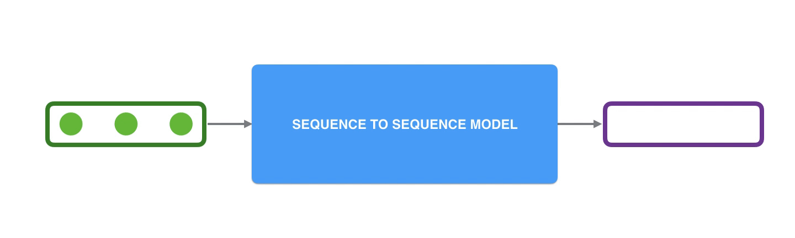

在神经机器翻译中（Neural Machine Translation, NMT），序列是一串单词，一个单词接一个单词的处理。输出，同样是一串单词：

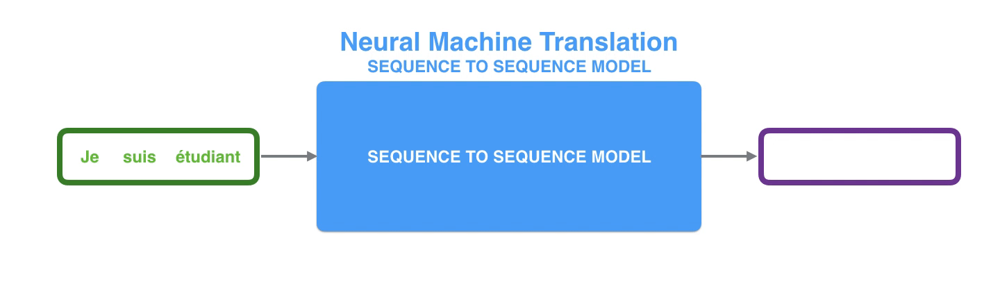

## 底层细节

seq2seq 模型由编码器（encoder）和解码器（decoder）组成。

**encoder** 处理输入序列的每一项，并将捕获的信息编译成向量，称为上下文向量（**context**）。处理完整个输入序列后，**encoder** 将 **context** 发送给 **decoder**，decoder 开始逐项生成输出序列。如下图所示：

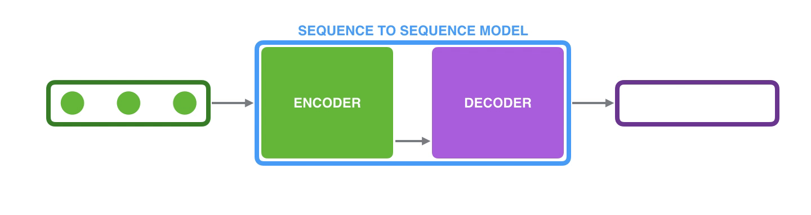

这同样适用于机器翻译：

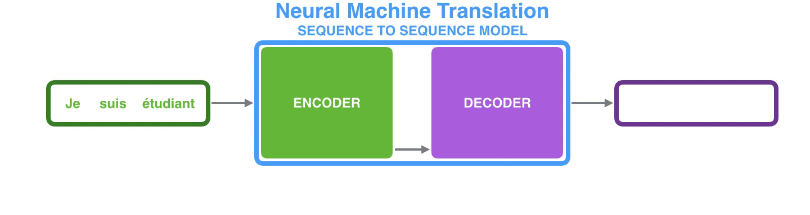

在机器翻译中，`context` 是一个向量（数字数组）。`encoder` 和 `decoder` 一般都是 RNN 网络。

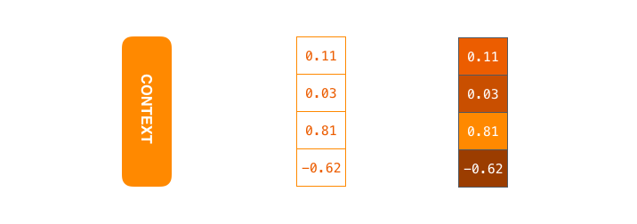

> `context` 是浮点数向量，稍后在本文中可视化向量时，使用不同颜色区分值大小。

在初始化模型时，可以设置 `context` 向量 size。一般为 encoder 中 RNN 的隐藏单元数量。上图中向量大小为 4，但在实际应用中，`context` 向量大小一般为 256, 512 或 1024 这样的值。

根据设计，RNN 在每个时间步接受两个输入：输入（对 encoder 为输入句子的一个单词）和隐状态。其中输入的单词需要以向量表示。为了将单词转换为向量，我们可以使用词嵌入（word embedding）算法。将单词转换为向量空间，可以捕获许多单词的语义信息。

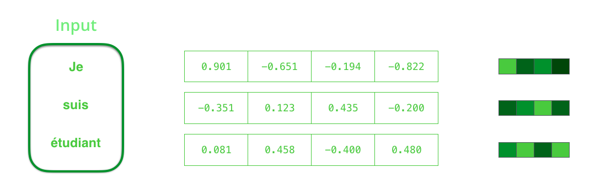

> 在处理输入词前，需要将其转换为向量。使用词嵌入算法将单词转换为向量，我们可以使用预训练的嵌入，也可以在数据集上训练自己的嵌入。嵌入向量 size 一般为 200 或 300，上面为了演示，嵌入向量 size 为 4.

上面已经介绍了主要的向量，现在回顾一下 RNN 的机制：

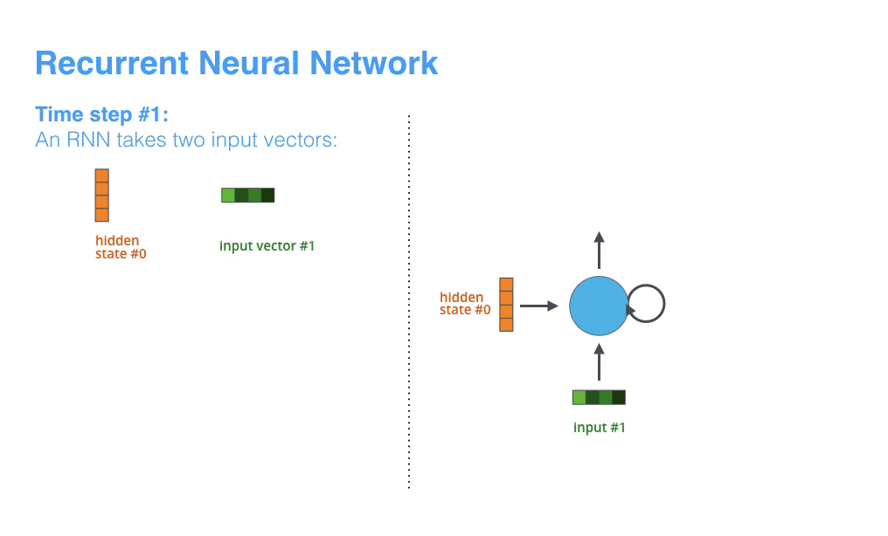

RNN 接收两个输入向量：hidden state #0 和 input vector #0，处理后，生成两个向量 hidden state #1 和 output vector #1；下一个 RNN 时间步使用第二个输入向量 input vector #1 和 hidden state #1 创建对应的两个输出。

在下面的可视化中，encoder 或 decoder 的每个动作包含 RNN 处理其输入并生成对应时间步的输出。由于 `encoder` 和 `decoder` 都是 RNNs，每个时间步其中一个 RNN 根据当前输入和之前的输入更新隐状态（hidden state）。

下面查看 `encoder` 的 `hidden states`。请注意，最后一个 `hidden state` 实际上就是传递给 `decoder` 的 `context`。

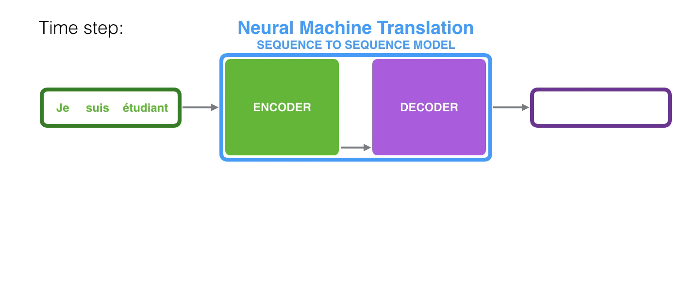

而 `decoder`也维护了一个 `hidden state`，这里没有可视化它是更了更好展示模型的主干。

现在，我们以另一种方式可视化 seq2seq 模型：将 RNN 展开，显示每个时间步的操作。

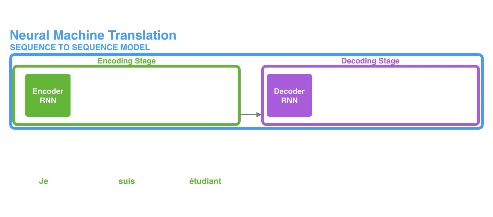

## Attention

`context` 向量是这类模型的瓶颈，处理较长的句子很困难。`Attention` 技术可以解决该问题，极大地提高了机器翻译系统的质量。Attention 使得模型根据需要集中于输入序列的相关部分。

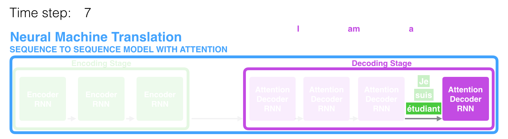

> 在第 7 步，注意力机制使 `decoder` 在生成英文翻译前将注意力集中在单词 "étudiant" ("student" 的法语)上。这种放大输入序列中相关部分信号的能力使得注意力模型比没有 attention 的模型结果更好。

让我们继续以更抽象的层面看注意力模型。注意力模型与经典 seq2seq 模型的差别主要有两点。

首先，`encoder` 向 `decoder` 传递更多的数据。`encoder` 将所有 hidden states 传递给 `decoder`，而不仅限于最后一步的 hidden state。

其次，注意力 `decoder` 在生成输出前做了额外操作。为了将注意力集中在与当前解码时间步相关的输入部分，`decoder` 执行以下操作：

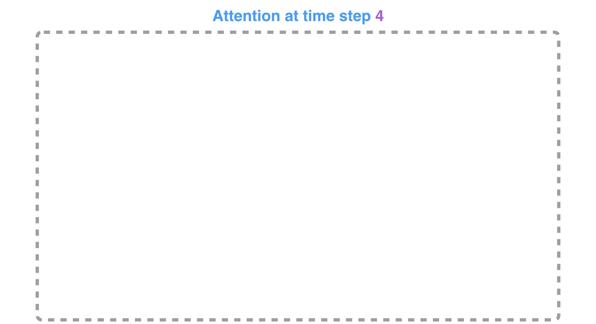

总结以下：

1. attention decoder RNN 接受 `<END>` 的嵌入，和初始 decoder hidden state
2. RNN 处理输入，生成输出和新的 hidden state 向量 `h4`
3. Attention 步骤：使用 `encoder hidden states` 和 `h4` 向量计算当前时间步的 context 向量 `C4`
4. 串联 `h4` 和 `C4` 成一个向量
5. 将串联向量传递给 Dense
6. Dense 的输出表示该时间步的输出单词
7. 在下一个时间步重复以上步骤。

请注意，该模型并不是盲目地将输出的第一个单词和输入的第一个单词对齐。实际上，它在训练阶段学习如何对其相应的单词（这里为法语和英语）。如下：

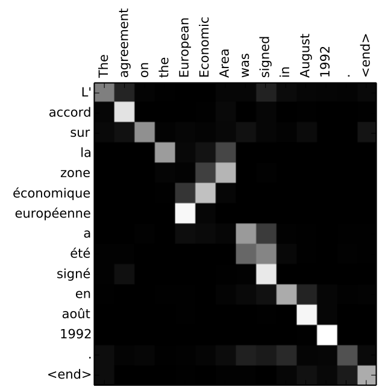

> 可以看到模型如何将注意力集中在相同含义的单词。

## 参考

- https://jalammar.github.io/visualizing-neural-machine-translation-mechanics-of-seq2seq-models-with-attention/
