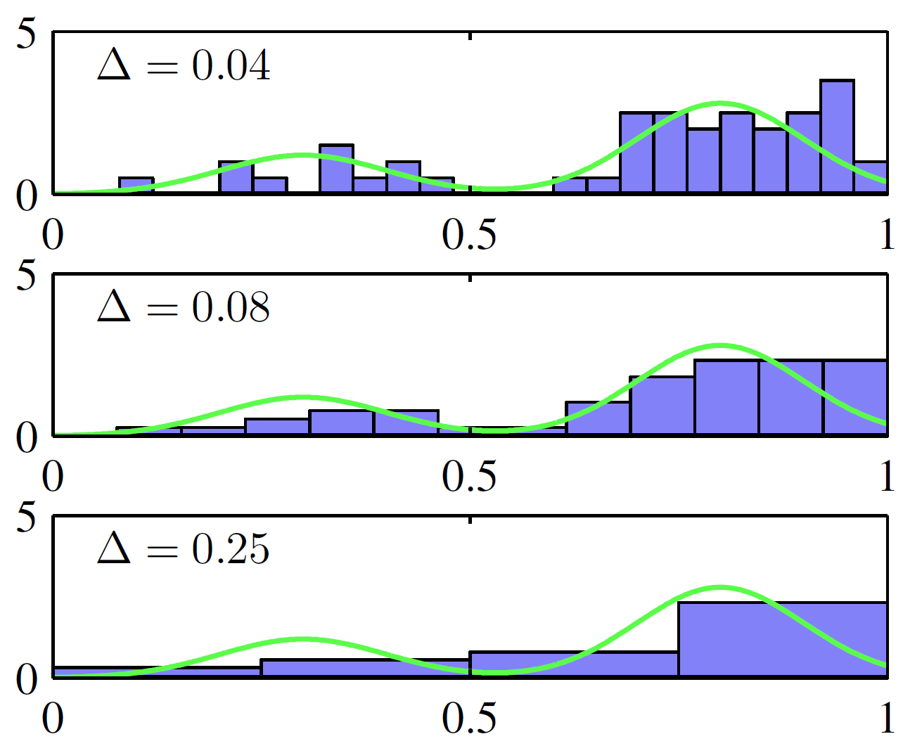

# 直方图方法

- [直方图方法](#直方图方法)
  - [简介](#简介)
  - [直方图](#直方图)
  - [总结](#总结)

2023-12-18, 09:58
****

## 简介

概率分布具有特定的函数形式，由少量参数控制，而参数的值从数据集确定。这种方法称为参数化密度建模。参数化建模的一个主要限制是，如果所选密度函数与数据分布不匹配，会得到较差的模型，导致预测性能差。例如，如果生成数据的过程是多模态的，那么用高斯分布肯定无法拟合好。

非参数密度估计对分布形式做了很少假设。下面主要介绍简单的频率方法。

## 直方图

下面从单变量 $x$ 的密度估计直方图开始讨论。标准直方图简单地将 $x$ 划分为宽度为 $\Delta_i$ 的不同 bins，然后计算每个 bin $i$ 中 $x$ 的个数 $n_i$。为了将个数转换为归一化概率密度，将个数 $n_i$ 除以总数 $N$ 和 bin 宽度 $\Delta_i$：

$$p_i=\frac{n_i}{N\Delta_i} \tag{1}$$

很容易得到 $\int p(x)dx=1$。从而得到关于 $p(x)$ 的模型，每个 bin 宽度中 $p(x)$ 为常量，并且通常设置每个 bin 的宽度相同 $\Delta_i=\Delta$。

{width="400"}

> **图（1）**：直方图密度估计的示意图：从绿色曲线所示分布生成 50 个数据点。基于公式（1），采用不同 bin 宽度 $\Delta$。

图（1）展示了一个直方图密度估计的示例。这里数据是从绿色曲线所示分布中抽样形成，该分布为两个高斯分布混合而成。并显示了三个 bin 宽度对应的密度估计。可以看到：

- 当 $\Delta$ 非常小时（上图），得到的密度模型非常尖锐，有很多结构超出数据集底层分布模型。
- 如果 $\Delta$ 太大（下图），得到一个过于光滑的模型，无法捕获绿色曲线分布中的双峰特性。
- $\Delta$ 取中间值（中图），得到最好的结果。

原则上，直方图密度模型也取决于 bin 的边缘位置的选择，不过该值远没有 $\Delta$ 重要。

!!! note
    计算完直方图后，数据集本身可以丢弃，如果数据集很大，这是有益的。此外，如果数据点是按顺序到达的，也很容易计算直方图。

实际上，直方图可用于在一个或两个维度中快速可视化数据，但不适合大多数密度估计应用。一个明显的问题是，直方图在 bin 边缘会产生不连续型，这与数据的底层分布不一致。直方图的另一个局限性是维度缩放性。如果将 $D$ 维控件中的每个变量分为 M 个 bins，则总的 bins 数为 $M^D$。这是维度诅咒的典型例子，在高维度空间中，提供有意义的局部概率密度估计所需数据量难以想象。

## 总结

总的来说，对密度估计，从直方图方法我们可以学习到两点：

1. 为了估算特定位置的概率密度，我们需要考虑该点附近的一些点。

说到"附近"，就涉及距离的概念。大多时候我们采用欧几里得距离。对直方图，该距离由 bin 宽度定义。

2. 平滑参数的值不宜太大，也不应太小。

如前所示，bin 太大会丢失信息，bin 太小平滑性太差。
