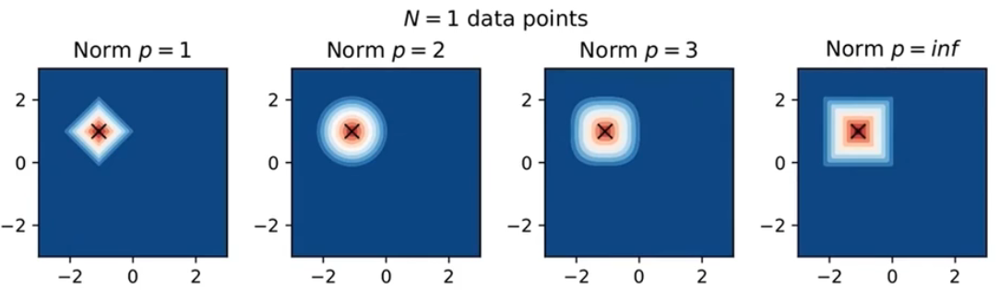
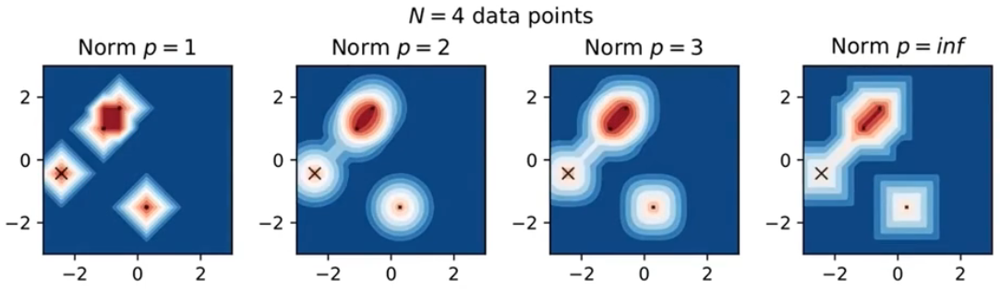
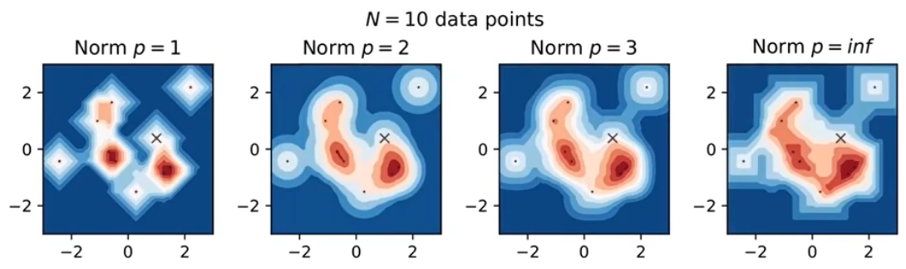
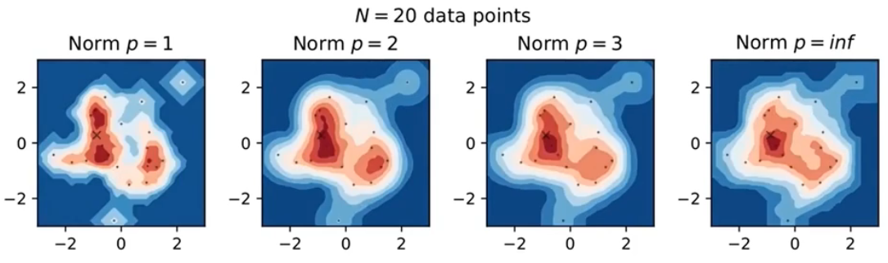
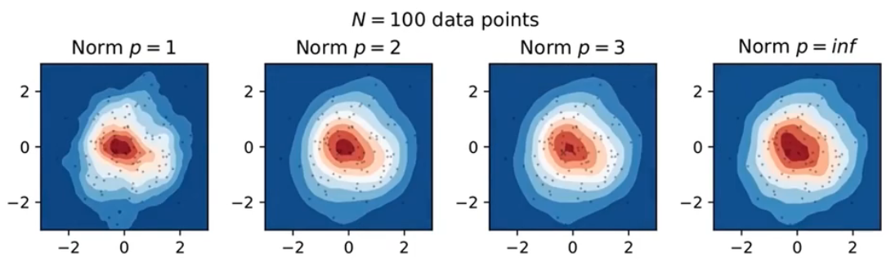
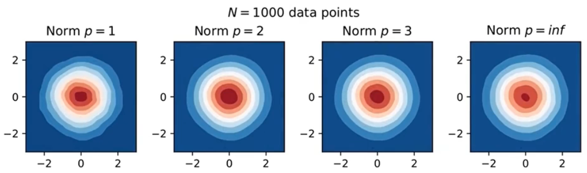

# 核密度估计

## 什么是核密度估计

在每个数据点 $x_i$，放一个核函数 $K$，将这些核函数加起来，就得到核密度估计：
$$
\hat{f}(x)=\frac{1}{N}\sum_{i=1}^N K(x-x_i)
$$

## 核的选择

核函数 $K$ 一般满足：

- 非负性：$K(x)\ge 0$，概率总是非负数
- 对称性：$K(x)=K(-x)$，在数据左边或右边，不影响概率值
- 递减性：对 $x>0$，$K'(x)\le 0$，当远离数据点时，核函数值趋近于 0

不是必须要满足这三个条件，不过在大多数情况下，这样的核函数更能满足我们的需求。

核函数可以分为有边界约束和无边界约束，如:

- 上图中 Gaussian 核没有边界约束，随着 x 增大或减少，它会无限趋近于 0，但不会等于 0
- Box, Tri 和 Triweight 核都有边界约束，超过一定范围，它们的值都为 0

**三角核**（*triangular kernel*），也称为线性核：
$$
f(x)\propto max(1-|x|,0)
$$

可以发现，三角核远没有高斯核平滑，但是，**核的选择其实并没有那么重要**，不管选择什么核，最终应用的效果差不多，通常用高斯核就可以了。

## bandwidth

核的选择不是那么重要，但 bandwidth 的选择非常重要。我们用 $h$ 控制 $\hat{f}(x)$ 的 bandwidth：
$$
\hat{f}(x)=\frac{1}{Nh}\sum_{i=1}^N K(\frac{x-x_i}{h})
$$

bandwidth 控制平滑程度，上图灰色虚线从上到下，bandwidth 越来越大。bandwidth 越大越平滑，但会丢失细节信息；bandwidth 越小越精细，易受噪音影响。

### Silverman's rule of thumb

Silverman 经验规则通过假设数据为正态分布来计算最佳 $h$。这有点矛盾，因为如果我们知道数据服从正态分布，就不会使用核密度估计，而是用最大似然法估计均值和方差。但通常情况下，你的数据可能接近正态分布，Silverman  经验规则就是一个很好的起点。

假设我们有一个标准正态分布，生成一些数据，然后使用 Silverman  经验规则，如下图所示：

可以看到，Silverman 估计结果还不错。

### Improved Sheather Jones (ISJ)

如果你有很多数据，或者模型是多模态的，此时 ISJ 算法更好。

ISJ 需要更多数据，这是一个缺点。但是如果你确定数据和正态分布差异很大，或者是多模态的，如双峰，那么 ISJ 是更好的选择。

## 数据权重

为数据增加权重：
$$
\hat{f}(x)=\frac{1}{h}\sum_{i=1}^N w_iK(\frac{x-x_i}{h}), \quad 其中 \sum_{i=1}^N w_i=1
$$
权重加和为 1，是为了保证概率积分和为 1。

可以发现，此时添加核高度不完全一样。

## 界域（Bounded domains）

例如，如果数据是人的年龄，或者个人的净资产，那么当 x 小于 0 时，核密度应该是 0，我们知道数据都在 y 轴的右侧。如果直接计算这个数据的核密度估计，你可能会得到下图：

在边界的左侧也分配了概率密度。这显然是不对的。有很多方法可以解决该问题，下面介绍一种简单方法，即镜像数据：

1. 对边界生成原数据的镜像数据
2. 对镜像数据计算核密度估计
3. 将镜像数据和原始数据的核密度估计相加
4. 沿着边界分开

如图所示，蓝色线是最终的核密度估计。这种方法可以保证在边界 $\hat{f}'(x)=0$。

## d 维

前面介绍的示例都是 1D 情况。下面介绍 2D 的情况。因为需要在更高的维度计算距离，所以引入范数。如下所示：
$$
\hat{f}(x)=\frac{1}{h^d}\sum_{i=1}^N w_iK(\frac{\lVert x-x_i\rVert_p}{h}), 其中 \sum_{i=1}^N w_i=1
$$
下面是 4 个二维核：

### 范数

在高维空间，范数的选择很重要，p 范数：
$$
\lVert x\rVert\coloneqq (\sum_{i=1}|x_i|^p)^{1/p}
$$

- p=1，通常称为曼哈顿距离
- p=2，就是欧几里得范数

高维空间中核函数的形状依赖于 p 值，下面展示 box, tri 和 gaussian 核对 不同范数的形状。

## 示例

随着数据量的增加，核密度估计对核 $K$ 和范数 $p$ 的选择依赖性降低。不过 bandwidth 依然重要。

可以看到，随着数据增加，不同范数对应的核密度估计越来越接近，到 1000 个数据点，它们几乎都一样。

所以和一维情况一样，核和范数的选择并不是很重要，一般选择高斯核与 2-norm 就可以。关键还是bandwidth 的选择。

在高维空间，bandwidth 不再是一个数字，它可能是矩阵，在不同方向你可以设置不同的 bandwidth。

## 算法

### Linear binning

