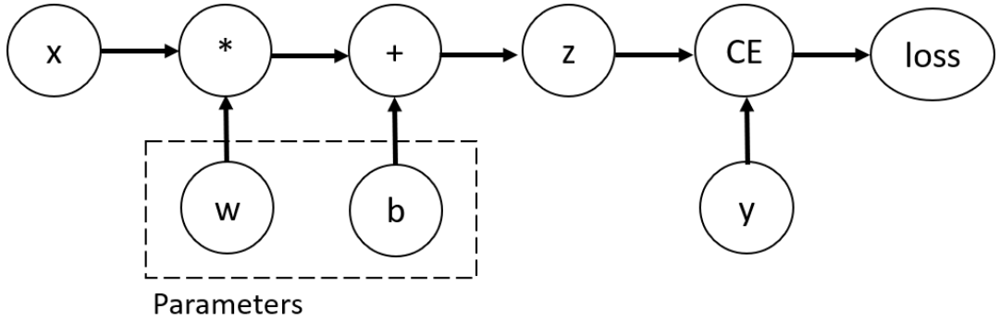

# 使用 TORCH 自动微分

- [使用 TORCH 自动微分](#使用-torch-自动微分)
  - [简介](#简介)
  - [张量、函数和计算图](#张量函数和计算图)
  - [计算梯度](#计算梯度)
  - [禁用梯度跟踪](#禁用梯度跟踪)
  - [参考](#参考)

2021-11-09, 16:22
***

## 简介

在训练神经网络时，反向传播（back propagation）是最常用的算法。在该算法中，根据损失函数相对给定参数的梯度调整参数（模型 weights）。

为了计算这些梯度，PyTorch 有一个内置的微分引擎，叫做 `torch.autograd`。它支持任何计算图的梯度自动计算。

考虑最简单的一层神经网络，输入 `x`，参数 `w` 和 `b`，以及损失函数。它可以按照如下方式在 PyTorch 中定义：

```py
import torch

x = torch.ones(5)  # input tensor
y = torch.zeros(3)  # expected output
w = torch.randn(5, 3, requires_grad=True)
b = torch.randn(3, requires_grad=True)
z = torch.matmul(x, w) + b
loss = torch.nn.functional.binary_cross_entropy_with_logits(z, y)
```

## 张量、函数和计算图

上面的代码定义如下的计算图：



其中 `w` 和 `b` 是需要优化的参数。因此我们需要计算损失函数关于这些变量的梯度。为了达到该目录，需要设置 tensor 的 `requires_grad` 属性。

可以在创建 tensor 时设置 `requires_grad`，也可以创建后使用 `x.requires_grad_(True)` 方法设置。

我们应用到张量用来构造计算图的函数是 `Function` 类对象。该对象知道如何正向计算函数，也知道如何在反向传播中计算导数。tensor 的 `grad_fn` 属性存储有反向传播函数的引用。

```py
>>> z.grad_fn
    <AddBackward0 at 0x20fcb742220>
>>> loss.grad_fn
    <BinaryCrossEntropyWithLogitsBackward0 at 0x20fc399fe80>
```

## 计算梯度

为了优化神经网络中参数的权重，需要计算损失函数对参数的导数，即需要计算指定 `x` 和 `y` 值下 $\frac{\partial loss}{\partial w}$ 和 $\frac{\partial loss}{\partial b}$ 的值。我们调用 `loss.backward()` 函数计算这些导数，然后从 `w.grad` 和 `b.grad` 查询导数值：

```py
>>> loss.backward()
>>> w.grad
tensor([[0.2163, 0.0836, 0.2154],
        [0.2163, 0.0836, 0.2154],
        [0.2163, 0.0836, 0.2154],
        [0.2163, 0.0836, 0.2154],
        [0.2163, 0.0836, 0.2154]])
>>> b.grad
tensor([0.2163, 0.0836, 0.2154])
```

> 只有 `requires_grad` 设置为 `True` 的张量才能查询 `grad` 属性。
> 基于性能考虑，对单个计算图使用 `backward` 只能计算一次梯度，如果重复计算，在调用 `backward` 时需要设置 `retain_graph=True`。

## 禁用梯度跟踪

PyTorch 对设置 `requires_grad=True` 的张量跟踪它们的计算历史并支持梯度计算。如果我们只想进行正向计算，就不需要支持梯度，可以通过 `torch.no_grad()` 包围计算代码来停止跟踪计算；

```py
>>> z = torch.matmul(x, w)+b
>>> z.requires_grad
True
>>> with torch.no_grad():
        z = torch.matmul(x, w)+b
>>> z.requires_grad
False
```

也可以使用 tensor 的 `detach()` 方法：

```py
>>> z = torch.matmul(x, w)+b
>>> z_det = z.detach()
>>> z_det.requires_grad
False
```

在以下场景可能需要禁用梯度跟踪：

- 冻结部分参数，这在微调 pretrained network 中很常见；
- 当值需要做正向传递时，为了加快计算速度，可以不跟踪张量梯度。

## 参考

- https://pytorch.org/tutorials/beginner/basics/autogradqs_tutorial.html
