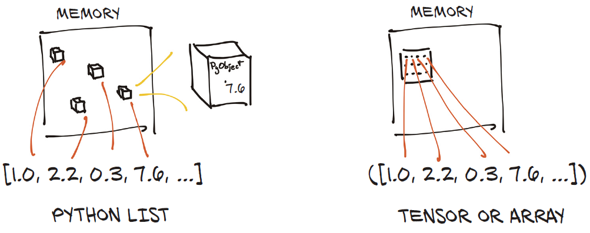
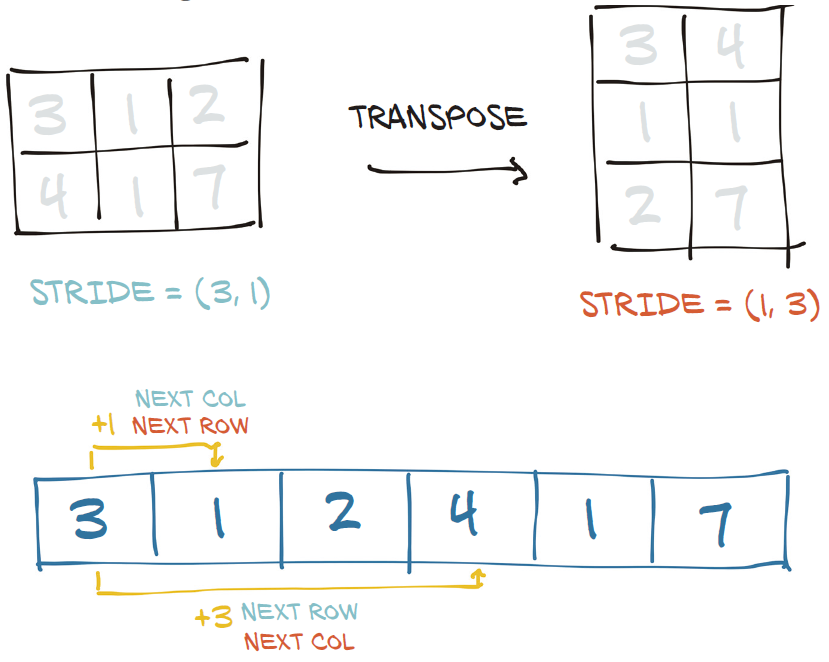

# 张量

- [张量](#张量)
  - [简介](#简介)
  - [创建张量](#创建张量)
    - [不同初始化方式](#不同初始化方式)
    - [相同 shape](#相同-shape)
    - [数值初始化](#数值初始化)
  - [张量索引](#张量索引)
  - [张量类型](#张量类型)
  - [数学和逻辑运算](#数学和逻辑运算)
    - [张量与标量运算](#张量与标量运算)
    - [张量与张量](#张量与张量)
    - [广播](#广播)
  - [Tensor API](#tensor-api)
  - [Storage](#storage)
    - [Storage 索引](#storage-索引)
    - [原地操作](#原地操作)
  - [Size, offset 和 stride](#size-offset-和-stride)
    - [转置（无复制）](#转置无复制)
    - [高维转置](#高维转置)
    - [连续张量](#连续张量)
  - [复制张量](#复制张量)
  - [将张量移到 GPU](#将张量移到-gpu)
  - [NumPy 互操](#numpy-互操)
  - [张量序列化](#张量序列化)
    - [序列化为 HDF5](#序列化为-hdf5)
  - [参考](#参考)

Last updated: 2022-12-13, 11:09
****

## 简介

在深度学习中，张量即多维数组，如下图所示：


NumPy 是迄今最流行的多维数组库，PyTorch 与 NumPy 可无缝互操作。

Python 数字 list 或 tuple，是 Python 对象的集合，而 PyTorch 张量或 NumPy 数组是包含未装箱 C 数字类型的连续内存块。对下图中的每个元素为 32 位 `float` 包含 4 byte，因此存储 1,000,000 个浮点数的 1D 张量需要 4,000,000 个连续 bytes，加上少量元数据的开销（如维度和类型）。



> Python 对象（装箱）数字与张量（拆箱数组）的对比。

## 创建张量

### 不同初始化方式

| 方法 | 说明 |
|---|---|
| `torch.empty` | 创建张量，不初始化 |
| `torch.zeros` | 创建张量，用 0 初始化 |
| `torch.ones` | 创建张量，用 1 初始化 |
| `torch.rand` | 创建张量，用 [0,1) 均匀分布随机数初始化 |

这些方法的参数基本相同。

**参数：**

- **size** (`int`...)

整数序列，定义输出张量 shape。支持可变参数、list 和 tuple。

**关键字参数：**

- **out** (`Tensor`, optional)

输出张量。

- **dtype** (`torch.dtype`, optional)

指定张量类型。默认：`None` 表示使用全局默认类型 (`torch.set_default_tensor_type()`)。

- **layout** (`torch.layout`, optional)

指定张量 layout。默认 `torch.strided`。

- **device** (`torch.device`, optional)

指定张量 device。默认：`None` 表示使用默认张量类型的当前 device (`torch.set_default_tensor_type()`)。对 CPU 张量类型 `device` 为 CPU，对 CUDA 张量类型为 CUDA。

- **requires_grad** (`bool`, optional)

支持梯度。默认 `False`。

- **pin_memory** (`bool`, optional)

`True` 表示是否在锁业内存中分配张量。仅用于 CPU 张量，默认 `False`。

- **memory_format** (`torch.memory_format`, optional)

指定张量的内存格式。默认 `torch.contiguous_format`。

### 相同 shape

在执行张量运算时，一般需要具有相同的 shape。为此，torch 提供了 `torch.*_like()` 方法：

| 方法 | 说明 |
|---|---|
| `torch.empty_like` | 创建张量，不初始化，size 同 `input` |
| `torch.zeros_like` | 创建张量，用 0 初始化，size 同 `input` |
| `torch.ones_like` | 创建张量，用 1 初始化，size 同 `input` |
| `torch.rand_like` | 创建张量，用 [0,1) 均匀分布随机数初始化，size 同 `input` |

返回一个 `size` 与 `input` 相同的张量。

**参数：**

- **input** (`Tensor`)

`input` 的 size 决定输出张量的 size。

**示例：**

```python
x = torch.empty(2, 2, 3)
print(x.shape)
print(x)

empty_like_x = torch.empty_like(x)
print(empty_like_x.shape)
print(empty_like_x)

zeros_like_x = torch.zeros_like(x)
print(zeros_like_x.shape)
print(zeros_like_x)

ones_like_x = torch.ones_like(x)
print(ones_like_x.shape)
print(ones_like_x)

rand_like_x = torch.rand_like(x)
print(rand_like_x.shape)
print(rand_like_x)
```

```txt
torch.Size([2, 2, 3])
tensor([[[0., 0., 0.],
         [0., 0., 0.]],

        [[0., 0., 0.],
         [0., 0., 0.]]])
torch.Size([2, 2, 3])
tensor([[[0., 0., 0.],
         [0., 0., 0.]],

        [[0., 0., 0.],
         [0., 0., 0.]]])
torch.Size([2, 2, 3])
tensor([[[0., 0., 0.],
         [0., 0., 0.]],

        [[0., 0., 0.],
         [0., 0., 0.]]])
torch.Size([2, 2, 3])
tensor([[[1., 1., 1.],
         [1., 1., 1.]],

        [[1., 1., 1.],
         [1., 1., 1.]]])
torch.Size([2, 2, 3])
tensor([[[0.1948, 0.7857, 0.1221],
         [0.9282, 0.1628, 0.7539]],

        [[0.3136, 0.5497, 0.3110],
         [0.9080, 0.3870, 0.1229]]])
```

### 数值初始化

创建张量的最后一种方法，是直接提供数据，使用 `torch.tensor()` 创建：

```python
some_constants = torch.tensor([[3.1415926, 2.71828], [1.61803, 0.0072897]])
print(some_constants)

some_integers = torch.tensor((2, 3, 5, 7, 11, 13, 17, 19))
print(some_integers)

more_integers = torch.tensor(((2, 4, 6), [3, 6, 9]))
print(more_integers)
```

```txt
tensor([[3.1416, 2.7183],
        [1.6180, 0.0073]])
tensor([ 2,  3,  5,  7, 11, 13, 17, 19])
tensor([[2, 4, 6],
        [3, 6, 9]])
```

> **NOTE**
> 如果已有数据，使用 `torch.tensor()` 是创建张量的最直观的方式。
> `torch.tensor()` 会复制参数的数据。

## 张量索引

Python list 支持索引和切片，如下：

```python
some_list = list(range(6))
some_list[:] # 所有元素
some_list[1:4] # [1,4) 切片
some_list[1:] # [1, end] 切片
some_list[:4] # [0, 4) 切片
some_list[:-1] # [0, end-1] 切片
some_list[1:4:2] # [0, 4) 步长为 2 切片
```

PyTorch 支持通用的索引和切片操作，并且支持多维度的索引。

```python
points[1:] # rows [1, end]，隐式包含所有 columns
points[1:, :] # rows [1, end]，显式包含所有 columns
points[1:, 0] # row [1, end]，第一列
points[None] # 添加一个 size 为 1 的维度，类似 unsequeeze
```

除了切片，PyTorch 还支持高级索引，后面会介绍。

## 张量类型

指定张量类型的方法有两种：

- 创建张量时（如 `tensor`, `zeros` 等）指定 `dtype` 参数；
- 使用 `to` 转换类型。

张量的默认类型为 `torch.float32`。

神经网络中的计算通常使用 float32 执行。更高精度，如 float64 并不会提高模型的精度，且需要更多的内存和计算时间。16 位半精度类型目前标准 CPU 不支持，不过现代 GPU 支持该类型。切换到半精度可以减少神经网络开销，对模型精度的影响很小。

当使用整数创建张量，如 `torch.tensor([2, 2])`，其类型默认为 `int64`，其默认整型为 `int64`。因此，大部分时候我们只用面对 float32 和 int64 两种类型。

- 使用 `dtype` 参数指定类型：

```python
double_points = torch.ones(10, 2, dtype=torch.double)
short_points = torch.tensor([[1, 2], [3, 4]], dtype=torch.short)
```

- 通过 `dtype` 属性获取类型

```python
>>> short_points.dtype
torch.int16
```

- 使用对应方法转换类型

```python
double_points = torch.zeros(10, 2).double()
short_points = torch.ones(10, 2).short()
```

- 使用 `to` 方法转换类型

```python
double_points = torch.zeros(10, 2).to(torch.double)
short_points = torch.ones(10, 2).to(dtype=torch.short)
```

- 对混合输入类型，输入自动转换为更大的类型

```python
>>> points_64 = torch.rand(5, dtype=torch.double)
>>> points_short = points_64.to(torch.short)
>>> points_64 * points_short
tensor([0., 0., 0., 0., 0.], dtype=torch.float64)
```

## 数学和逻辑运算

### 张量与标量运算

张量与标量的算术运算，如加减乘除，是对张量的每个元素逐个运算。由于运算结果是张量，因此支持链式操作（按运算符优先级运算）。示例：

```python
ones = torch.zeros(2, 2) + 1
twos = torch.ones(2, 2) * 2
threes = (torch.ones(2, 2) * 7 - 1) / 2
fours = twos ** 2
sqrt2s = twos ** 0.5

print(ones)
print(twos)
print(threes)
print(fours)
print(sqrt2s)
```

```txt
tensor([[1., 1.],
        [1., 1.]])
tensor([[2., 2.],
        [2., 2.]])
tensor([[3., 3.],
        [3., 3.]])
tensor([[4., 4.],
        [4., 4.]])
tensor([[1.4142, 1.4142],
        [1.4142, 1.4142]])
```

### 张量与张量

张量与张量运算，也是逐元素操作，因此 **shape 必须相同**。

```python
powers2 = twos ** torch.tensor([[1, 2], [3, 4]])
print(powers2)

fives = ones + fours
print(fives)

dozens = threes * fours
print(dozens)
```

```txt
tensor([[ 2.,  4.],
        [ 8., 16.]])
tensor([[5., 5.],
        [5., 5.]])
tensor([[12., 12.],
        [12., 12.]]
```

### 广播

张量 shape 不同其实也能运算，只要 shape 满足广播条件：

- 每个张量维度 $\ge 1$，即没有空张量；
- 比较两个张量的维度，从最后一个维度到第一个维度：
  - 维度相等，或
  - 其中一个维度为 1，或
  - 其中一个张量没有该维度

例如：

```python
a =     torch.ones(4, 3, 2)

b = a * torch.rand(   3, 2) # 3rd & 2nd dims identical to a, dim 1 absent
print(b)

c = a * torch.rand(   3, 1) # 3rd dim = 1, 2nd dim identical to a
print(c)

d = a * torch.rand(   1, 2) # 3rd dim identical to a, 2nd dim = 1
print(d)
```

## Tensor API

张量操作 API 有两个位置，一个是在 `torch` 模块中，一个是作为 tensor 对象的方法。例如，转置操作可以从 `torch` 模块使用：

```python
>>> a = torch.ones(3, 2)
>>> a_t = torch.transpose(a, 0, 1)
>>> a.shape, a_t.shape
(torch.Size([3, 2]), torch.Size([2, 3]))
```

也可以调用张量的方法：

```python
>>> a = torch.ones(3, 2)
>>> a_t = a.transpose(0, 1)
>>> a.shape, a_t.shape
(torch.Size([3, 2]), torch.Size([2, 3]))
```

两者本质上没有区别。

## Storage

张量数据在内存以一维数组的形式保存，由 `torch.Storage` 实例管理。storage 是一维数值数组，包含指定类型数字的连续内存，如 `float` 或 `int64`。PyTorch `Tensor` 是 `Storage` 实例的视图，根据 `offset` 和 `stride` 对 storage 进行索引。

多个张量可以对同一个 `Storage` 进行索引，索引方式可以不同。如下图所示：


> Tensor 是 `Storage` 实例的视图。

### Storage 索引

以 2D point 为例演示 storage 的索引方式。张量的 storage 可以通过 `.storage` 属性访问：

```python
>>> points = torch.tensor([[4.0, 1.0], [5.0, 3.0], [2.0, 1.0]])
>>> points.storage()
 4.0
 1.0
 5.0
 3.0
 2.0
 1.0
[torch.FloatStorage of size 6]
```

尽管张量有 2 行 3 列，但底层的 storage 是一个大小为 6 的一维数组。因此，可以将张量理解为将索引转换为 storage 的位置的便捷对象。

也可以手动索引 storage，例如：

```python
>>> points_storage = points.storage()
>>> points_storage[0]
4.0
>>> points.storage()[1]
1.0
```

`Storage` 的 layout 总是一维的，不管引用它的张量维度如何。因此对二维张量，你不能用两个索引来索引底层的 Storage。

改变 storage 的值到导致其引用张量内容的改变，这一点很好理解：

```python
>>> points = torch.tensor([[4.0, 1.0], [5.0, 3.0], [2.0, 1.0]])
>>> points_storage = points.storage()
>>> points_storage[0] = 2.0
>>> points
tensor([[2., 1.],
        [5., 3.],
        [2., 1.]])
```

### 原地操作

更新已有张量的方法有两种：

- 原地操作
- 函数的 `out` 参数

**原地操作**以下划线结尾，如 `zero_`，这类操作不创建新的张量，而是修改输入。

例如，`zero_` 将输入的所有元素清零，而不带下划线的方法保持输入张量不变，返回一个新的张量：

```python
>>> a = torch.ones(3, 2)
>>> a.zero_()
>>> a
tensor([[0., 0.],
        [0., 0.],
        [0., 0.]])
```

这些原地操作在 `torch.Tensor` 中，`torch` 模块中没有。

`torch` 的许多方法和函数有一个 `out` 参数，可用来接收输出。如果 `out` 的 shape 和 dtype 正确，就不会分配新内存：

```python
a = torch.rand(2, 2)
b = torch.rand(2, 2)
c = torch.zeros(2, 2)
old_id = id(c)

print(c)
d = torch.matmul(a, b, out=c)
print(c)                # c 的内容被修改

assert c is d           # c 和 d 是相同对象
assert id(c), old_id    # c 与原来的 c 是相同对象

torch.rand(2, 2, out=c) # works for creation too!
print(c)                # c has changed again
assert id(c), old_id    # still the same object!
```

```txt
tensor([[0., 0.],
        [0., 0.]])
tensor([[0.3653, 0.8699],
        [0.2364, 0.3604]])
tensor([[0.0776, 0.4004],
        [0.9877, 0.0352]])
```

## Size, offset 和 stride

为了实现对 storage 的索引，tensor 需要三个信息：size, offset 和 stride。如下图所示：


> tensor 的 offset, size 和 stride 的关系图。这里张量是对一个更大 storage 的 view。

说明：

- size (或 shape) 是一个 tuple，指定张量每个维度的元素个数；
- offset 指张量第一个元素在 storage 中的索引；
- stride 指在每个维度，移动到下一个元素要跳过的 storage 元素数。

例如，使用如下索引获得第二个 point：

```python
>>> points = torch.tensor([[4.0, 1.0], [5.0, 3.0], [2.0, 1.0]])
>>> second_point = points[1]
>>> second_point.storage_offset()
2
>>> second_point.size()
torch.Size([2])
```

第二个 point 的张量在 storage 中的 offset 为 2（因为要跳过第一个点，每个点有两个值）。`size()` 只包含一个元素，因为 `second_point` 是一维的。另外，`shape` 属性和 `size()` 的信息相同：

```python
>>> second_point.shape
torch.Size([2])
```

步长（stride）为 tuple 类型，表示在每个维度索引 +1 时，Storage 中需要跳过的 storage 元素数。例如，`points` 张量的 stride 为 `(2, 1)`：

```python
>>> points.stride()
(2, 1)
```

对 2D 张量 i, j 位置的元素，在 storage 中的索引为：

$$index=storage\_offset+stride[0]*i+stride[1]*j$$

其中 `storage_offset` 一般为 0，只有在这个张量是为容纳更大张量而创建的 `Storage` 的视图时，`storage_offset` 才可能是正数。

`Tensor` 和 `Storage` 的这种关系使得一些操作变得非常高效，比如转置和提取子张量，因为不需要重新分配内存，只需要为新的张量分配不同的 size, offset 和 stride。

使用索引查看特定 point 为提取子张量操作，该操作的 storage offset, size 和 stride 变化如下：

```python
>>> second_point = points[1]
>>> second_point.size() # 只有 1 个维度，包含 2 个元素
torch.Size([2])
>>> second_point.storage_offset()
2
>>> second_point.stride() # 在 second_point 中，移到下一个数据只要 1 步
(1,)
```

可以看到，`second_point` 比 `points` 少了一个维度，但是索引相同的 `Storage`。这意味着，改变子张量对原张量会有影响：

```python
>>> points = torch.tensor([[4.0, 1.0], [5.0, 3.0], [2.0, 1.0]])
>>> second_point = points[1]
>>> second_point[0] = 10.0
>>> points
tensor([[ 4.,  1.],
        [10.,  3.],
        [ 2.,  1.]])
```

如果不希望子张量共享内存，可以调用 clone：

```python
>>> points = torch.tensor([[4.0, 1.0], [5.0, 3.0], [2.0, 1.0]])
>>> second_point = points[1].clone()
>>> second_point[0] = 10.0
>>> points
tensor([[4., 1.],
        [5., 3.],
        [2., 1.]])
```

### 转置（无复制）

依然以 `points` 张量为例，每行包含一个 point，两列分别为 X 和 Y 坐标。现在要将 `points` 转置，使每列存储一个 point。这里用到 `t` 函数，`transpose` 函数的缩写：

```python
>>> points = torch.tensor([[4.0, 1.0], [5.0, 3.0], [2.0, 1.0]])
>>> points
tensor([[4., 1.],
        [5., 3.],
        [2., 1.]])
>>> points_t = points.t()
>>> points_t
tensor([[4., 5., 2.],
        [1., 3., 1.]])
```

可以验证两个张量共享相同的 storage：

```python
>>> id(points.storage()) == id(points_t.storage())
True
```

它们只是 shape 和 stride 有差别：

```python
>>> points.stride()
(2, 1)
>>> points_t.stride()
(1, 2)
```

由此可知，`points` 从 `points[0,0]` 到 `points[1,0]` 在 `Storage` 中需要跳过 2 个元素；而从 `points[0,0]` 到 `points[0,1]` 在 storage 中跳过 1 个元素。换言之，storage 中的元素是按行顺序存储的。

将 `points` 转置为 `points_t`，stride 中元素顺序也随之改变，如下图所示。此时 row + 1 在 storage 中索引+1，和 `points` 中 column + 1 一样。



> 张量转置

### 高维转置

在 PyTorch 中，除了矩阵，对高维张量也可以转置，只需指定要转置的两个维度，使得两个维度的 shape 和 stride 翻转：

```python
>>> some_t = torch.ones(3, 4, 5)
>>> transpose_t = some_t.transpose(0, 2)
>>> some_t.shape
torch.Size([3, 4, 5])
>>> transpose_t.shape
torch.Size([5, 4, 3])
>>> some_t.stride()
(20, 5, 1)
>>> transpose_t.stride()
(1, 5, 20)
```

张量的值在 storage 中从最右边的维度开始排列（对矩阵，就是从 row 按行排列）就称是**连续的**（contiguous）。

连续张量访问更高效，不用在内存中来回跳转。当然，这一优势取决于访问算法的实现。

### 连续张量

部分 PyTorch 操作只能在连续（contiguous）张量上执行，例如 `view`，在非连续张量上调用会抛出异常，并要求显式调用 `contiguous`。

如果张量已经是 contiguous，调用 `contiguous` 不任何作用。前面 `points` 是连续的，而其转置不是：

```python
>>> points.is_contiguous()
True
>>> points_t.is_contiguous()
False
```

对非连续张量，调用 `contiguous` 可以获得新的连续张量。张量内容不变，不过 stride 以及 storage 会改变：

```python
>>> points = torch.tensor([[4.0, 1.0], [5.0, 3.0], [2.0, 1.0]])
>>> points_t = points.t()
>>> points_t
tensor([[4., 5., 2.],
        [1., 3., 1.]])
>>> points_t.storage()
 4.0
 1.0
 5.0
 3.0
 2.0
 1.0
[torch.FloatStorage of size 6]
>>> points_t.stride()
(1, 2)
>>> points_t_cont = points_t.contiguous()
>>> points_t_cont
tensor([[4., 5., 2.],
        [1., 3., 1.]])
>>> points_t_cont.stride()
(3, 1)
>>> points_t_cont.storage()
 4.0
 5.0
 2.0
 1.0
 3.0
 1.0
[torch.FloatStorage of size 6]
```

可以看到，storage 已重新排列，以便元素逐行排列。stride 也根据新的 layout 更改。


> 张量的 offset, size 和 stride 之间的关系。这里张量是一个更大的 storage 的视图。

## 复制张量

使用 `clone()`

## 将张量移到 GPU

`Tensor` 除了 `dtype`，还有一个 `device` 属性，指定张量数据存放位置。在构造函数中指定 `device` 参数可以在 GPU 上创建张量：

```python
points_gpu = torch.tensor([[4.0, 1.0], [5.0, 3.0], [2.0, 1.0]], device='cuda')
```

也可以在 CPU 中创建到，然后使用 `to` 方法复制到 GPU：

```python
>>> points = torch.tensor([[4.0, 1.0], [5.0, 3.0], [2.0, 1.0]])
>>> points_gpu = points.to(device='cuda')
>>> points_gpu
tensor([[4., 1.],
        [5., 3.],
        [2., 1.]], device='cuda:0')
```

返回的新张量与原张量的数据相同，但存储在 GPU 的 RAM 中，而不是常规系统的 RAM。

如果机器有多个 GPU，则可以传入索引指定 GPU（从 0 开始），例如：

```python
points_gpu = points.to(device='cuda:0')
```

对 GPU 上张量的任何操作都在 GPU 执行：

```python
points = 2 * points # CPU 上执行乘法
points_gpu = 2 * points.to(device='cuda') # GPU 上执行乘法
```

解释：

- `points` 被复制到 GPU
- 在 GPU 上分配一个新的张量，存储乘法的结果
- 返回该 GPU 张量的引用

继续在结果上执行加法：

```python
points_gpu = points_gpu + 4
```

加法依然在 GPU 上执行，没有信息流向 CPU（除非打印或访问结果张量）。要将张量移动到 CPU，依然用 `to` 方法：

```python
points_cpu = points_gpu.to(device='cpu')
```

也可以使用快捷方法 `cpu` 和 `cuda` 来替代 `to` 方法：

```python
points_gpu = points.cuda() # 默认 GPU index 0
points_gpu = points.cuda(0)
points_cpu = points_gpu.cpu()
```

用 `to` 方法优势在于，同时提供 `device` 和 `dtype` 可以同时更改位置和数据类型。

## NumPy 互操

PyTorch 张量和 NumPy 数组可以高效的互相转换。与 NumPy 数组的零拷贝互操作性得益于 [Python 缓冲协议](https://docs.python.org/3/c-api/buffer.html)存储系统。

从张量生成 NumPy 数组：

```python
>>> points = torch.ones(3, 4)
>>> points_np = points.numpy()
>>> points_np
array([[1., 1., 1., 1.],
       [1., 1., 1., 1.],
       [1., 1., 1., 1.]], dtype=float32)
```

返回 NumPy 数组与张量共享底层缓冲区。这意味着：

- 如果数据在 CPU RAM，调用 numpy 方法基本没有数据复制成本；
- 修改 NumPy 数组会导致原始张量的变化。

如果张量在 GPU，PyTorch 会将张量内容复制到 CPU 分配给 NumPy 数组。

从 NumPy 数组生成张量：

```python
points = torch.from_numpy(points_np)
```

> **NOTE**：PyTorch 的默认数值类型为 float32，而是 NumPy 是 float64。由于 PyTorch 一般用 float32，所以从 NumPy 数组生成的张量，注意类型，确保为 torch.float。

说明：

- `torch.tensor()` 会复制数据；
- `torch.as_tensor()` 共享数据；
- `torch.from_numpy()` 共享数据；

## 张量序列化

PyTorch 底层使用 pickle 序列化张量。例如，将 `points` 张量保存为 ourpoints.t 文件：

```python
torch.save(points, "../ourpoints.t")
```

也可以传入文件对象：

```python
with open('../ourpoints.t', 'wb') as f:
    torch.save(points, f)
```

用 `torch.load` 载入：

```python
points = torch.load('../ourpoints.t')
```

或者：

```python
with open('../ourpoints.t', 'rb') as f:
    points = torch.load(f)
```

这种方式的缺点是，只能用 PyTorch 进行读写，即该文件格式没有互操作性，无法用其它软件读取张量。

### 序列化为 HDF5

使用 h5py 将张量序列化为 HDF5 文件。首先将 `points` 张量转换为 NumPy 数组，然后将其传递给 `create_dataset` 函数：

```python
import h5py

f = h5py.File('../data/p1ch3/ourpoints.hdf5', 'w')
dset = f.create_dataset('coords', data=points.numpy())
f.close()
```

这里的 `coords` 是 HDF5 文件中的 key。也可以使用其它 key，包括嵌套 key。HDF5 的一个优点是，可以对数据集进行索引，只访问感兴趣的部分。例如，假设指向加载数据集最后的两个 points:

```python
f = h5py.File('../data/p1ch3/ourpoints.hdf5', 'r')
dset = f['coords']
last_points = dset[-2:]
```

在打开文件和查询数据集时，都没有加载数据。最后请求数据时才将数据载入内存。返回 NumPy 数组对象，然后用 `torch.from_numpy` 转换为张量：

```python
last_points = torch.from_numpy(dset[-2:])
f.close()
```

## 参考

- 《Deep Learning With Pytorch》, Eli Stevens & Luca Antiga & Thomas Viehmann
