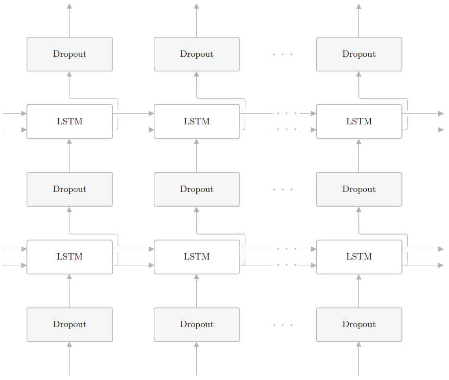

# 长短期记忆网络（LSTM）

- [长短期记忆网络（LSTM）](#长短期记忆网络lstm)
  - [梯度问题](#梯度问题)
    - [梯度技术总结](#梯度技术总结)
  - [门控记忆元](#门控记忆元)
    - [门](#门)
    - [候选记忆单元](#候选记忆单元)
    - [记忆元](#记忆元)
    - [隐状态](#隐状态)
  - [参数](#参数)
    - [stateful](#stateful)
    - [层数](#层数)
    - [dropout](#dropout)
  - [参考](#参考)

Last updated: 2022-07-29, 15:40
@author Jiawei Mao
****

## 梯度问题

在基于梯度的训练神经网络的方法中，梯度消失和梯度爆炸式是必须要克服的障碍。梯度在时间步的传播，以及时间步间权重共享导致 RNN 中梯度问题更加严重。

对于 S 型的激活函数（包括 logistic 和 tanh），对较大的正数或负数，值都趋于饱和，导数趋近于 0。

logistic 激活函数，即使在不饱和的时候，在向后传播时也会衰减误差。logistic 函数的导数最大值为 0.25，而 tanh 的导数最大值为 1.0，这是 tanh 优于 logistic 的一个重要原因。

虽然 tanh 的导数最大值为 1.0，但是当神经元处于饱和区时，仍会发生梯度消失。将神经元保持在非饱和区的技术有许多，例如使用 Glorot 或 He 权重初始化，使用 batch normalization 等。

除了让神经元远离饱和区，还可以使用非饱和、非线性的激活函数，如 ReLU。

对梯度爆炸问题，梯度裁剪是最直接的方法。batch normalization 和梯度裁剪都是限制值的范围，不过 batch normalization 是在向前传播时调整值，使神经元处于非饱和区，通过避免饱和来避免梯度消失；而梯度裁剪是在向后传播时梯度本身，以避免梯度爆炸。

> Batch normalization 避免梯度消失，梯度裁剪避免梯度爆炸。

上面描述的问题适用于任何前馈神经网络和 RNN，RNN 自身还有些特有问题。即使在激活函数不成问题时，例如使用导数为常数 1 的 ReLU 函数，RNN 也会有问题，BPTT 过程中反复和共享 weight 相乘导致误差很容易极小或极大。在很长的时间步中，避免梯度消失或爆炸的唯一方法可能是使权重为 1，但是这违背了训练的目的。不过这个发现催生了一个叫做恒定误差木马（constant error carousel, CEC）的技术。在反向传播过程中，使用 CEC 可以获得类似权重值为 1 的效果。LSTM 基于 CEC 技术设计。

### 梯度技术总结

|技术|减轻梯度消失|减轻梯度爆炸|应用范围|
|---|---|---|---|
|Glorot or He 权重初始化|Yes|No|所有神经元|
|Batch normalization|Yes|No|hidden 神经元|
|不饱和神经元，如 ReLU|Yes|No|除输出层外的所有神经元|
|梯度裁剪|No|Yes|所有神经元|
|CEC|Yes|Yes|循环层，LSTM|
|跳过连接|Yes|No|ResNet|

## 门控记忆元

长短期记忆网络（long short-term memoRY, LSTM）的设计灵感来自计算机的逻辑门。LSTM 引入记忆元（memory cell），或简称为单元（cell）。为了控制记忆元，需要许多门：

- 用来从单元中输出条目的门，称为输出门（output gate）；
- 用来决定何时将数据读入单元，称为输入门（input gate）；
- 用来重置单元的内容，称为遗忘门（forget gate）。

LSTM（Long Short-Term Memory）表示可以长时间维持短期记忆。

LSTM 记忆元结构如下：

$$I_t=\sigma(X_t W_{xi}+H_{t-1}W_{hi}+b_i)$$

$$F_t=\sigma(X_tW_{xf}+H_{t-1}W_{hf}+b_f)$$

$$O_t=\sigma(X_tW_{xo}+H_{t-1}W_{ho}+b_o)$$

$$\tilde{C}_t=tanh(X_tW_{xc}+H_{t-1}W_{hc}+b_c)$$

$$C_t=F_t\bigodot C_{t-1}+I_t\bigodot \tilde{C}_t$$

$$H_t=O_t\bigodot tanh(C_t)$$

说明：

- 批量大小为 $n$，输入数为 $d$，即输入 $X_t \isin \Reals^{n\times d}$
- 假设有 $h$ 个隐藏单元
- $W_{xi}, W_{xf}, W_{xo}\isin \Reals^{d\times h}$ 为权重参数
- 前一时间步的隐状态为 $H_{t-1}\isin \Reals^{n\times h}$
- $W_{hi}, W_{hf}, W_{ho} \isin \Reals^{h\times h}$ 是权重参数
- $b_i, b_f, b_o \isin \Reals^{1\times h}$ 是偏置参数
- 输入门 $I_t\isin \Reals^{n\times h}$
- 遗忘门 $F_t\isin \Reals^{n\times h}$
- 输出门 $O_t\isin \Reals^{n\times h}$

### 门

和 GRU 一样，当前时间步的输入和前一个时间步的*隐状态*作为数据送入 LSTM 的门中，如下图所示：

它们由三个具有 sigmoid 激活函数的全连接层处理，以计算输入门、遗忘门和输出门的值。因此，这三个门的值都在 (0,1) 之间。

假设有 $h$ 个隐藏单元，批量大小为 $n$，输入数为 $d$，输入为 $X_t \isin \Reals^{n\times d}$，前一时间步的隐状态为 $H_{t-1}\isin \Reals^{n\times h}$。相应的，时间步 $t$ 的门被定义为：输入门 $I_t\isin \Reals^{n\times h}$，遗忘门 $F_t\isin \Reals^{n\times h}$，输出门 $O_t\isin \Reals^{n\times h}$，计算方式如下：

$$I_t=\sigma(X_t W_{xi}+H_{t-1}W_{hi}+b_i)$$

$$F_t=\sigma(X_tW_{xf}+H_{t-1}W_{hf}+b_f)$$

$$O_t=\sigma(X_tW_{xo}+H_{t-1}W_{ho}+b_o)$$

其中 $W_{xi}, W_{xf}, W_{xo}\isin \Reals^{d\times h}$ 和 $W_{hi}, W_{hf}, W_{ho} \isin \Reals^{h\times h}$ 是权重参数，$b_i, b_f, b_o \isin \Reals^{1\times h}$ 是偏置参数。

### 候选记忆单元

候选记忆元（candidate memory cell）$\tilde{C}_t \isin \Reals^{n\times h}$ 的计算与上述的三个门的计算类似，但是使用 tanh 作为激活函数，函数的值范围为 (-1, 1)。下面是在时间步 $t$ 处的候选记忆单元：

$$\tilde{C}_t=tanh(X_tW_{xc}+H_{t-1}W_{hc}+b_c)$$

其中 $W_{xc} \isin \Reals^{d\times h}$ 和 $W_{hc}\isin \Reals^{h\times h}$ 是权重参数，$b_c\isin \Reals^{1\times h}$ 是偏置参数。

候选记忆元的计算图如下：

### 记忆元

在 GRU 中，有一种机制用来控制输入和遗忘，类似地，在 LSTM 中，也有两个门用于这样的目的：输入门 $I_t$ 控制采用多少来自 $\tilde{C}_t$ 的新数据，而遗忘门 $F_t$ 控制保留多少过去的记忆元 $C_{t-1}\isin \Reals^{n\times h}$ 的内容：

$$C_t=F_t\bigodot C_{t-1}+I_t\bigodot \tilde{C}_t$$

如果遗忘门始终为 1 且输入门始终为 0，则过去的记忆元 $C_{t-1}$ 将随时间被保存并传递到当前时间步。引入这种设计时为了缓解梯度消失问题，并更好地捕获序列中的长距离依赖关系。

这样就得到了计算记忆元的流程图：

### 隐状态

最后，我们需要定义如何计算隐状态 $H_t\isin \Reals^{n\times h}$，这就是输出门发挥作用的地方。在 LSTM 中，它仅仅是记忆元的 tanh 的门控版本，确保 $H_t$ 的值始终在区间 (-1,1) 内：

$$H_t=O_t\bigodot tanh(C_t)$$

只要输出门接近 1，我们就能够有效地将所有记忆信息传递给预测不份额，而对于输出门接近 0，只保留记忆元内的所有信息，而不需要更新隐状态。

下图是最终数据流的图形化演示：

## 参数

### stateful

理论上所有的 RNN 或 LSTM 模型都是 `stateful` 的，这类模型旨在记住整个序列用于预测或分类。然而在实践中，需要使用 BPTT 算法训练模型，而梯度不能在 batch 之间传递。如果有一个很长的时间序列无法在单个 batch 中 `fit`，即需要将时间序列划分为多个子序列，每个子序列在单独的 batch 中。LSTM 只记住 batch 内的信息，每个 batch 的初始状态被设置为 0（状态指隐状态 H 和记忆单元 C，不包括权重值）。

### 层数

据报道，谷歌翻译中使用的 GNMT 模型叠加了 8 层 LSTM 网络。如果**待解决的问题很难，又能准备大量的训练数据**，就可以通过加深 LSTM 层来提高精度。

### dropout

通过叠加 LSTM 层，可以能够学习到时序数据的复杂依赖关系。换句话说，通过加深层，可以创建表现力更强的模型，但是这样的模型往往会发生**过拟合**（overfitting）。RNN 比常规的前馈神经网络更容易发生过拟合，因此 RNN 的过拟合对策非常重要。

抑制过拟合的方法：

- 增加训练数据
- 降低模型的复杂度

优先考虑这两个方法。此外，对模型的复杂度给予惩罚的正则化也很有效。

此外，像 Dropout 这样，在训练时随机忽略层的一部分（比如 50%）神经元，也可以被视为一种正则化。这种“随机忽视”是一种制约，可以提高神经网络的泛化能力。

在 RNN 模型中，dropout 层可以在 LSTM 层的时序方向和LSTM 层之间两个方向插入。

如果在时序方向插入 dropout，当模型学习时，随着时间的推移，信息会渐渐丢失，因 dropout 产生的噪声会随着时间成比例积累，因此最好不要在时间轴方向插入 dropout。推荐在深度方向插入 dropout 层，如下图所示：

虽然常规的 dropout 不适合用在时间方向上，但是，最近的研究提出了多种方法实现时间方向上的 RNN 正则化。比如，变分 dropout 能用在时间方向上，从而进一步提高语言模型的精度。

## 参考

- 《动手学深度学习》
