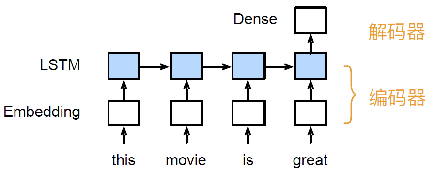
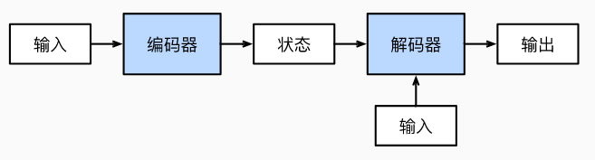

# 编码器-解码器结构

## 简介

机器翻译是序列转换模型的一个核心问题，其输入和输出都是长度可变的序列。为了处理这种类型的输入和输出，设计了一个包含两个主要组件的架构：

- 编码器（encoder），接受一个长度可变的序列作为输入，并将其转换为固定形状的编码状态；
- 解码器（decoder），将固定形状的编码状态映射到长度可变的序列。

这种称为编码器-解码器（encoder-decoder）架构。

对 RNN：

- 编码器：将文本表示成向量
- 解码器：向量表示成输出

以英语到法语的机器翻译为例：给定一个英文输入序：[“They”, “are”,“watching”,“.”]。首先，这种 encoder-decoder 架构将长度可变的输入序列编码成一个状态，然后对该状态进行解码，一个词元接一个词元地生成翻译后的序列作为输出：[“Ils”,“regordent”,“.”]。

## 架构

一个模型被分成两块：

- 编码器负责输入
- 解码器生成输出

