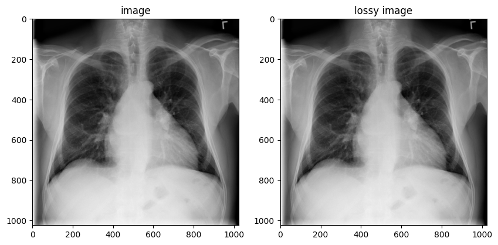

# 解码医学成像格式文件 DICOM

## 简介

下面介绍如何在 TensorFlow IO 中使用 `tfio.image.decode_dicom_image` 来解码 DICOM 文件。

## 下载 DICOM 图像

下面使用来自 [NIH 的胸部 X 射线数据集](https://cloud.google.com/healthcare/docs/resources/public-datasets/nih-chest) 的 DICOM 图像。

NIH 胸部 X-ray 数据集包含 100,000 张 PNG 格式的胸部 X-ray 图像组成，[下载链接](https://nihcc.app.box.com/v/ChestXray-NIHCC)。

Google Cloud 提供了这些图像的 DICOM 版本，[下载链接](https://cloud.google.com/healthcare/docs/resources/public-datasets/nih-chest)。

本教程从 GitHub 下载该数据集的[一个 DICOM 文件](https://github.com/tensorflow/io/raw/master/docs/tutorials/dicom/dicom_00000001_000.dcm)。

## 解码 DICOM 图像

```python
import matplotlib.pyplot as plt
import numpy as np

import tensorflow as tf
```

```python
import tensorflow_io as tfio

image_bytes = tf.io.read_file('dicom_00000001_000.dcm')

image = tfio.image.decode_dicom_image(image_bytes, dtype=tf.uint16)

skipped = tfio.image.decode_dicom_image(image_bytes, on_error='skip', dtype=tf.uint8)

lossy_image = tfio.image.decode_dicom_image(image_bytes, scale='auto', on_error='lossy', dtype=tf.uint8)

fig, axes = plt.subplots(1, 2, figsize=(10, 10))
axes[0].imshow(np.squeeze(image.numpy()), cmap='gray')
axes[0].set_title('image')
axes[1].imshow(np.squeeze(lossy_image.numpy()), cmap='gray')
axes[1].set_title('lossy image');
```



## 参考

- https://www.tensorflow.org/io/tutorials/dicom
