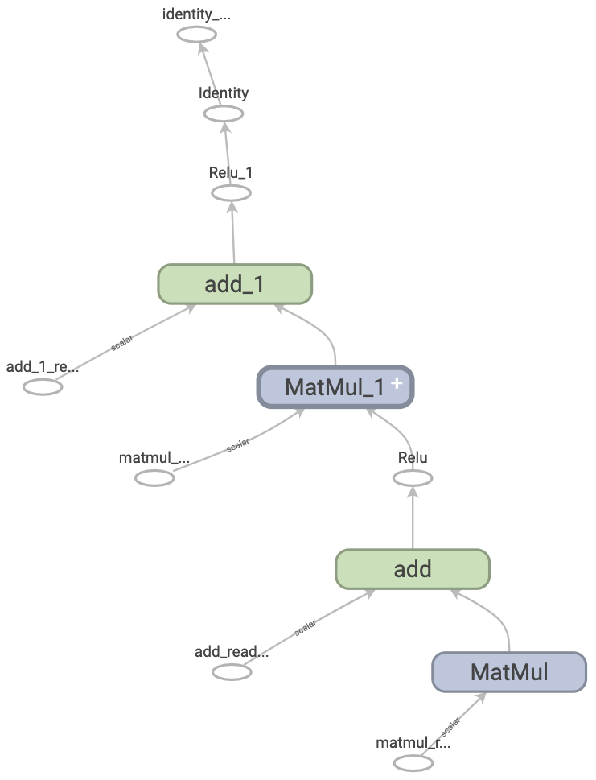

# Graph

- [Graph](#graph)
  - [简介](#简介)
    - [什么是 graph](#什么是-graph)
    - [graph 的优点](#graph-的优点)
  - [配置](#配置)
  - [使用 graph](#使用-graph)
    - [将 Python 函数转换为 graph](#将-python-函数转换为-graph)
    - [多态性](#多态性)
  - [tf.function 使用](#tffunction-使用)
    - [graph 执行和即时执行](#graph-执行和即时执行)
    - [non-strict 执行](#non-strict-执行)
    - [tf.function 最佳实践](#tffunction-最佳实践)
  - [提速效果](#提速效果)
    - [性能权衡](#性能权衡)
  - [Function tracing](#function-tracing)
  - [参考](#参考)

2021-12-24, 10:09
***

## 简介

下面介绍 TensorFlow 和 Keras 的工作原理。主要涵盖如何使用 `tf.function` 在即时执行（eager execution）和 graph 执行之间进行切换。

### 什么是 graph

在前面的三个教程中，TensorFow 都是即时执行。这表示 TensorFlow 操作是由 Python 逐个执行的，最后结果返回到 Python.

虽然即时执行有其独特优势，但是 graph 执行具有更好的可移植性，并且性能更好。Graph 执行表示将张量计算作为 TF 图（TensorFlow graph)执行，下面将 `tf.Graph` 一般简称为 "graph"。

graph 是包含一组 `tf.Operation` 操作的数据结构，用来表示计算的基本单元；`tf.Tensor` 对象则表示操作之间流动的数据单元。由于 graph 是数据结构，因此即使没有原始 Python 代码，也可以保存、运行和恢复。

下图是用 TensorBoard 可视化的 TF graph 表示的两层神经网络：



### graph 的优点

使用 graph 很灵活。可以在没有 Python 的环境中使用 TF graph，比如手机端、嵌入式设备以及后端服务器。TensorFlow 从 Python 保存的模型也是以 graph 格式保存。

graph 容易优化，允许编译器进行如下转换：

- 通过折叠常量节点静态推断张量的值（常量折叠）；
- 分离计算的独立子部分，进行多线程计算；
- 通过消除常见子表达式简化算数运算。

优化系统 Grappler 用于执行这些优化。

简而言之，graph 可以让 TensorFlow 运行更快、并行以及在多个设备上高效运行。

但是，为了方便起见，大家仍然希望用 Python 定期机器学习模型，然后在需要时自动构建 graph。

## 配置

```python
import tensorflow as tf
import timeit
from datetime import datetime
```

## 使用 graph

可以使用 `tf.function` 创建并运行 graph，可以直接调用或作为 decorator 使用。`tf.function` 以常规函数作为输入，返回 `Function`。`Function` 是可调用函数，它将 Python 函数构建为 TF graph。例如：

```python
# 定义一个 Python 函数
def a_regular_function(x, y, b):
  x = tf.matmul(x, y)
  x = x + b
  return x

# `a_function_that_uses_a_graph` 是一个 TensorFlow `Function`.
a_function_that_uses_a_graph = tf.function(a_regular_function)

# 创建张量
x1 = tf.constant([[1.0, 2.0]])
y1 = tf.constant([[2.0], [3.0]])
b1 = tf.constant(4.0)

orig_value = a_regular_function(x1, y1, b1).numpy()
# 调用 `Function` 和调用 Python 函数一样
tf_function_value = a_function_that_uses_a_graph(x1, y1, b1).numpy()
assert(orig_value == tf_function_value)
```

从外表看，`Function` 就像使用 TensorFlow 操作编写的普通函数。然而在底层非常不同，一个 `Function` 封装了好几个 `tf.Graph`。这是 `Function` 能够利用 graph 优点的原因。

`tf.function` 应用于当前函数，及函数内部调用的其它函数：

```python
def inner_function(x, y, b):
  x = tf.matmul(x, y)
  x = x + b
  return x

# 使用装饰器标识 `outer_function` 为 `Function`.
@tf.function
def outer_function(x):
  y = tf.constant([[2.0], [3.0]])
  b = tf.constant(4.0)

  return inner_function(x, y, b)

# 该调用会创建一个 graph，该 graph 包括 `inner_function` 和 `outer_function`
outer_function(tf.constant([[1.0, 2.0]])).numpy()
```

```sh
array([[12.]], dtype=float32)
```

### 将 Python 函数转换为 graph

用 TensorFlow 编写的任何函数都是内置 TF 操作和 Python 逻辑的混合物，`if` 语句，循环，`break` 等都是 Python 逻辑。TF 操作很容易被 `tf.Graph` 捕获，但 Python 逻辑部分则需要额外步骤才能转换为 graph。`tf.function` 使用 `tf.autograph` 库将 Python 代码转换为生成 graph 的代码。

```python
def simple_relu(x):
  if tf.greater(x, 0):
    return x
  else:
    return 0

# `tf_simple_relu` 是封装 `simple_relu` 的 TensorFlow `Function`
tf_simple_relu = tf.function(simple_relu)

print("First branch, with graph:", tf_simple_relu(tf.constant(1)).numpy())
print("Second branch, with graph:", tf_simple_relu(tf.constant(-1)).numpy())
```

```sh
First branch, with graph: 1
Second branch, with graph: 0
```

虽然我们一般不需要直接查看 graph，但我们可以检查输出，以检查确切的结果。下面不大容易看懂，不用太仔细看：

```python
# This is the graph-generating output of AutoGraph.
print(tf.autograph.to_code(simple_relu))
```

```sh
def tf__simple_relu(x):
    with ag__.FunctionScope('simple_relu', 'fscope', ag__.ConversionOptions(recursive=True, user_requested=True, optional_features=(), internal_convert_user_code=True)) as fscope:
        do_return = False
        retval_ = ag__.UndefinedReturnValue()

        def get_state():
            return (do_return, retval_)

        def set_state(vars_):
            nonlocal retval_, do_return
            (do_return, retval_) = vars_

        def if_body():
            nonlocal retval_, do_return
            try:
                do_return = True
                retval_ = ag__.ld(x)
            except:
                do_return = False
                raise

        def else_body():
            nonlocal retval_, do_return
            try:
                do_return = True
                retval_ = 0
            except:
                do_return = False
                raise
        ag__.if_stmt(ag__.converted_call(ag__.ld(tf).greater, (ag__.ld(x), 0), None, fscope), if_body, else_body, get_state, set_state, ('do_return', 'retval_'), 2)
        return fscope.ret(retval_, do_return)
```

```python
# This is the graph itself.
print(tf_simple_relu.get_concrete_function(tf.constant(1)).graph.as_graph_def())
```

```sh
node {
  name: "x"
  op: "Placeholder"
  attr {
    key: "_user_specified_name"
    value {
      s: "x"
    }
  }
  attr {
    key: "dtype"
    value {
      type: DT_INT32
    }
  }
  attr {
    key: "shape"
    value {
      shape {
      }
    }
  }
}
...
```

大多时候 `tf.function` 都可以工作，不需要额外考虑。

### 多态性

`tf.Graph` 用于特定类型输入，如特定 `dtype` 的张量。

每次用新的 `dtype` 和 shape 调用 `Function`时，`Function` 都会创建一个新的 `tf.Graph`。`tf.Graph` 的输入 `dtype` 和 shape 称为输入签名，或简称签名。

`Function` 将和签名对应的 `tf.Graph` 存储在 `ConcreteFunction`。`ConcreteFunction` 是对 `tf.Graph` 的封装。

```python
@tf.function
def my_relu(x):
  return tf.maximum(0., x)

# `my_relu` creates new graphs as it observes more signatures.
print(my_relu(tf.constant(5.5)))
print(my_relu([1, -1]))
print(my_relu(tf.constant([3., -3.])))
```

```sh
tf.Tensor(5.5, shape=(), dtype=float32)
tf.Tensor([1. 0.], shape=(2,), dtype=float32)
tf.Tensor([3. 0.], shape=(2,), dtype=float32)
```

如果 `Function` 已经被相同签名调用过，则 `Function` 不会创建新 `tf.Graph`：

```python
# These two calls do *not* create new graphs.
print(my_relu(tf.constant(-2.5))) # Signature matches `tf.constant(5.5)`.
print(my_relu(tf.constant([-1., 1.]))) # Signature matches `tf.constant([3., -3.])`.
```

```sh
tf.Tensor(0.0, shape=(), dtype=float32)
tf.Tensor([0. 1.], shape=(2,), dtype=float32)
```

因为由多个 graph 支持，所以 `Function` 是多态的。这使得它支持更多的输入类型，同时也可以优化每个 `tf.Graph` 以获得更好的性能。

```python
# There are three `ConcreteFunction`s (one for each graph) in `my_relu`.
# The `ConcreteFunction` also knows the return type and shape!
print(my_relu.pretty_printed_concrete_signatures())
```

```sh
my_relu(x)
  Args:
    x: float32 Tensor, shape=()
  Returns:
    float32 Tensor, shape=()

my_relu(x=[1, -1])
  Returns:
    float32 Tensor, shape=(2,)

my_relu(x)
  Args:
    x: float32 Tensor, shape=(2,)
  Returns:
    float32 Tensor, shape=(2,)
```

## tf.function 使用

目前为止，我们已经知道可以将 `tf.function` 作为函数或装饰器将 Python 函数转换为 graph。但是在实践中，让 `tf.function` 正常工作也不容易。下面介绍如何正确使用 `tf.function`。

### graph 执行和即时执行

`Function` 中代码可以即时执行，也可以作为 graph 执行。默认以 graph 执行：

```python
@tf.function
def get_MSE(y_true, y_pred):
  sq_diff = tf.pow(y_true - y_pred, 2)
  return tf.reduce_mean(sq_diff)
```

```python
y_true = tf.random.uniform([5], maxval=10, dtype=tf.int32)
y_pred = tf.random.uniform([5], maxval=10, dtype=tf.int32)
print(y_true)
print(y_pred)
```

```sh
tf.Tensor([1 0 4 4 7], shape=(5,), dtype=int32)
tf.Tensor([3 6 3 0 6], shape=(5,), dtype=int32)
```

```python
get_MSE(y_true, y_pred)
```

```sh
<tf.Tensor: shape=(), dtype=int32, numpy=11>
```

为了验证 `Function` 的 graph 是否与对应的 Python 函数计算相同，可以设置 `tf.config.run_functions_eagerly(True)` 以即时执行。该设置会关闭 `Function` 创建和运行 graph 的功能，作为常规代码运行。

```python
tf.config.run_functions_eagerly(True)

get_MSE(y_true, y_pred)
```

```sh
<tf.Tensor: shape=(), dtype=int32, numpy=11>
```

```python
# 测试之后，记得设置回来
tf.config.run_functions_eagerly(False)
```

然而，`Function` 的 graph 执行和 eager 执行行为可能不同。Python 的 `print` 函数在两种模式下就不同。比如我们再函数中插入一个 `print` 语句，然后重复调用：

```python
@tf.function
def get_MSE(y_true, y_pred):
  print("Calculating MSE!")
  sq_diff = tf.pow(y_true - y_pred, 2)
  return tf.reduce_mean(sq_diff)
```

```python
error = get_MSE(y_true, y_pred)
error = get_MSE(y_true, y_pred)
error = get_MSE(y_true, y_pred)
```

```sh
Calculating MSE!
```

可以看到，虽然调用了三次 `get_MSE`，但是只输出了一次。

原因是，`Function` 通过 "tracing" 过程运行原始代码以创建 graph，`print` 语句也是在此时执行的。tracing 将 TensorFlow 的操作捕获到 graph 中，但不会捕获 `print`。随后三次调用都运行 graph，不再需要运行 Python 代码。

为了完善检查，让我们关闭 graph 执行来进行比较：

```python
# Now, globally set everything to run eagerly to force eager execution.
tf.config.run_functions_eagerly(True)
```

```python
# Observe what is printed below.
error = get_MSE(y_true, y_pred)
error = get_MSE(y_true, y_pred)
error = get_MSE(y_true, y_pred)
```

```sh
Calculating MSE!
Calculating MSE!
Calculating MSE!
```

```python
tf.config.run_functions_eagerly(False)
```

`print` 是 Python 的一个副作用，在将函数转换为 `Function` 时，还有其它需要注意的项。更多细节可以参考 [tf.function 性能](performance_function.md)。

### non-strict 执行

graph 执行只执行会生成可观察效果(observable effect)的操作，包括：

- 函数返回值；
- 众所周知的副作用操作，如：
  - IO 操作，如 `tf.print`
  - 调试操作，如 `tf.debugging` 中的 assert 函数
  - `tf.Variable` 的变种

这种行为通常被称为非严格执行（non-strict），它不同于 eager 执行，eager 执行会执行所有操作，不管是否需要。

特别是，runtime error check 不算 observable effect，因此被跳过也不会引发任何运行时错误。

在下例中，在 graph 执行起见跳过了“不必要的”操作 `tf.gather`，因此不会引发 `InvalidArgumentError`。所以在 graph 执行中不要依赖抛出错误操作：

```python
def unused_return_eager(x):
  # Get index 1 will fail when `len(x) == 1`
  tf.gather(x, [1]) # unused 
  return x

try:
  print(unused_return_eager(tf.constant([0.0])))
except tf.errors.InvalidArgumentError as e:
  # All operations are run during eager execution so an error is raised.
  print(f'{type(e).__name__}: {e}')
```

```sh
tf.Tensor([0.], shape=(1,), dtype=float32)
```

```python
@tf.function
def unused_return_graph(x):
  tf.gather(x, [1]) # unused
  return x

# Only needed operations are run during graph exection. The error is not raised.
print(unused_return_graph(tf.constant([0.0])))
```

```sh
tf.Tensor([0.], shape=(1,), dtype=float32)
```

### tf.function 最佳实践

要熟悉 `Function` 的行为可能需要一点时间。为了快速入门，可以多用用 `@tf.function` 装饰器，在 eager 和 graph 执行之间来回切换，查看效果。

设计 `tf.function` 可能是编写 graph 兼容的 TensorFlow 程序的最佳选择。一下是一些建议：

- 在早期经常使用 `tf.config.run_functions_eagerly` 在 eager 和 graph 执行之间进行切换，发现它们的差别；
- 在 Python 函数外创建 `tf.Variable`，在内部修改。对其它使用 `tf.Variable` 的对象也是如此，如 `keras.layers`, `keras.Model` 以及 `tf.optimizers`；
- 编写的函数要避免依赖于外部 Python 变量，不包括 `tf.Variable` 和 keras 对象；
- 编写函数尽量以张量或其它 TensorFlow 类型作为输入，对其它类型要小心使用；
- 在 `tf.function` 中包含尽可能多的计算，以最大多性能增益。例如，使用 `tf.function` 装饰整个训练步骤或整个训练循环。

## 提速效果

`tf.function` 通常会提高代码性能，但是提高的程度取决于运行的计算类型。你可以通过如下方式测试性能差异：

```python
x = tf.random.uniform(shape=[10, 10], minval=-1, maxval=2, dtype=tf.dtypes.int32)

def power(x, y):
  result = tf.eye(10, dtype=tf.dtypes.int32)
  for _ in range(y):
    result = tf.matmul(x, result)
  return result
```

```python
print("Eager execution:", timeit.timeit(lambda: power(x, 100), number=1000))
```

```sh
Eager execution: 2.5637862179974036
```

```python
power_as_graph = tf.function(power)
print("Graph execution:", timeit.timeit(lambda: power_as_graph(x, 100), number=1000))
```

```sh
Graph execution: 0.6832536700021592
```

`tf.function` 一般用于加快训练循环，在 [使用 keras 从头编写训练循环](keras/keras_writing_training_loop.md) 中更详细说明。

### 性能权衡

graph 可以加快代码，但是创建 graph 的过程也会有开销。对有些函数，创建 graph 的开销可能比执行 graph 的还要大。不过这种投资通常会随着后续执行的性能提升而弥补过来，重要的是，任何大型模型训练的前几个步骤都可能因为 tracing 而变慢。

无论模型多大，都要避免频繁 tracing。在 [tf.function](api/tf.function.md) 指南讨论了如何通过设置输入规范和使用张量参数以避免 retracing。如果你发现性能异常糟糕，最好检查一下是否意外出现了 retracing。

## Function tracing

要确定 `Function` 何时进行 tracing，可以在代码中添加 `print` 语句。`Function` 只有在 tracing 时才会执行 `print` 语句。

```python
@tf.function
def a_function_with_python_side_effect(x):
  print("Tracing!") # An eager-only side effect.
  return x * x + tf.constant(2)

# This is traced the first time.
print(a_function_with_python_side_effect(tf.constant(2)))
# The second time through, you won't see the side effect.
print(a_function_with_python_side_effect(tf.constant(3)))
```

```sh
Tracing!
tf.Tensor(6, shape=(), dtype=int32)
tf.Tensor(11, shape=(), dtype=int32)
```

```python
# This retraces each time the Python argument changes,
# as a Python argument could be an epoch count or other
# hyperparameter.
print(a_function_with_python_side_effect(2))
print(a_function_with_python_side_effect(3))
```

```sh
Tracing!
tf.Tensor(6, shape=(), dtype=int32)
Tracing!
tf.Tensor(11, shape=(), dtype=int32)
```

新的 Python 参数会触发创建新的 graph，从而需要额外的 tracing。

## 参考

- https://www.tensorflow.org/guide/intro_to_graphs
