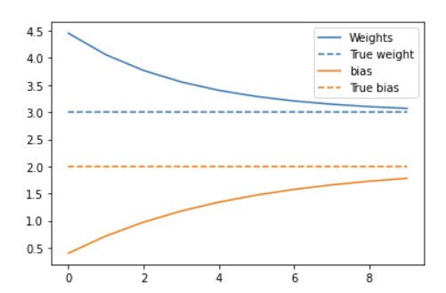
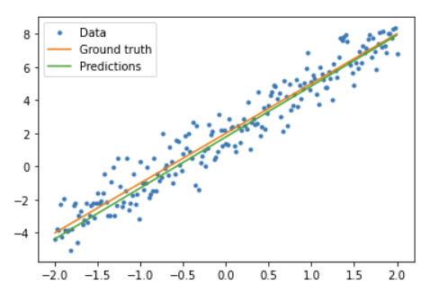

# 训练循环基础

- [训练循环基础](#训练循环基础)
  - [简介](#简介)
  - [解决机器学习问题](#解决机器学习问题)
  - [数据](#数据)
  - [定义模型](#定义模型)
    - [定义损失函数](#定义损失函数)
    - [定义训练循环](#定义训练循环)
  - [keras 版本](#keras-版本)
  - [参考](#参考)

2021-12-27, 17:51
@author Jiawei Mao
***

## 简介

在前面我们已经了解了张量、变量、梯度 tape 和模块。现在，我们要把这些东西组合起来训练模型。

TensorFlow 还包括高级 API tf.keras，对基本类进行了抽象，减少了模板代码。不过下面我们只使用基础类构建训练过程。

配置：

```python
import tensorflow as tf

import matplotlib.pyplot as plt

colors = plt.rcParams['axes.prop_cycle'].by_key()['color']
```

## 解决机器学习问题

解决一个机器学习问题，通常包含如下步骤：

- 获取训练数据
- 定义模型
- 定义损失函数
- 运行训练数据，计算损失值
- 计算针对损失的梯度，并使用优化器来调整变量值以适应数据
- 评估结果

下面用一个简单的线性模型 $f(x)=x*W+b$ 解释整个训练过程，该模型包含两个变量：权重 $W$ 和偏置 $b$。

可以说这是最基本的机器学习问题：给定 $x$ 和 $y$，通过线性回归找到斜率和截距。

## 数据

监督学习需要输入（通常以 `x` 表示）和输出（表示为 `y`，也称为标签）。目标是从成对的输入和输出中学习，以便能够根据输入预测输出。

在 TensorFlow 中，输入数据以 tensor 表示，且一般为向量。包含输出的监督学习中，输出类型也是 tensor。

下面生成一批数据，在线性数据点上添加高斯噪音：

```python
# The actual line
TRUE_W = 3.0
TRUE_B = 2.0

NUM_EXAMPLES = 201

# A vector of random x values
x = tf.linspace(-2,2, NUM_EXAMPLES)
x = tf.cast(x, tf.float32)

def f(x):
  return x * TRUE_W + TRUE_B

# Generate some noise
noise = tf.random.normal(shape=[NUM_EXAMPLES])

# Calculate y
y = f(x) + noise
```

```python
# Plot all the data
plt.plot(x, y, '.')
plt.show()
```


张量通常以 batch 的形式组织在一起，或者将一组 inputs 和 outputs 叠在一起。batch (批处理)可以很好地与加速器和矢量计算结合使用。鉴于此数据集很小，我们将整个数据集视为一个 batch。

## 定义模型

使用 `tf.Variable` 表示模型里的权重值 weights。`tf.Variable` 以张量的形式保存值。

使用 `tf.Module` 封装变量和计算过程。虽然可以使用任何 Python 对象，但是这样更容易保存。

```python
class MyModel(tf.Module):
  def __init__(self, **kwargs):
    super().__init__(**kwargs)
    # Initialize the weights to `5.0` and the bias to `0.0`
    # In practice, these should be randomly initialized
    self.w = tf.Variable(5.0)
    self.b = tf.Variable(0.0)

  def __call__(self, x):
    return self.w * x + self.b

model = MyModel()

# List the variables tf.modules's built-in variable aggregation.
print("Variables:", model.variables)

# Verify the model works
assert model(3.0).numpy() == 15.0
```

```sh
Variables: (<tf.Variable 'Variable:0' shape=() dtype=float32, numpy=0.0>, <tf.Variable 'Variable:0' shape=() dtype=float32, numpy=5.0>)
2021-12-08 17:11:44.542944: W tensorflow/python/util/util.cc:368] Sets are not currently considered sequences, but this may change in the future, so consider avoiding using them.
```

这里以固定的方式初始化变量，Keras 提供了许多初始化器辅助变量初始化。

### 定义损失函数

损失函数衡量指定输入下模型的输出与真实值的匹配程度。我们的目标是在训练过程中尽量减少这种差异。定义标准 L2 损失，也称为均方差：

```python
# This computes a single loss value for an entire batch
def loss(target_y, predicted_y):
  return tf.reduce_mean(tf.square(target_y - predicted_y))
```

在训练模型之前，可以通过绘制预测值和训练数据可视化损失值：

```python
plt.plot(x, y, '.', label="Data")
plt.plot(x, f(x), label="Ground truth")
plt.plot(x, model(x), label="Predictions")
plt.legend()
plt.show()

print("Current loss: %1.6f" % loss(y, model(x)).numpy())
```


```sh
Current loss: 10.301712
```

### 定义训练循环

训练循环就是将下面的三个步骤循环执行：

- 将一批数据（batch）输入模型，生成输出；
- 对比模型输出和标签计算损失值；
- 使用 gradient tape 计算梯度；
- 根据梯度更新变量值。

在这个例子中，可以使用梯度下降训练模型。

在 `tf.keras.optimizers` 中有很多梯度下降的变体。不过我们仍然使用最基本的 API 构建：

```python
# Given a callable model, inputs, outputs, and a learning rate...
def train(model, x, y, learning_rate):

  with tf.GradientTape() as t:
    # Trainable variables are automatically tracked by GradientTape
    current_loss = loss(y, model(x))

  # Use GradientTape to calculate the gradients with respect to W and b
  dw, db = t.gradient(current_loss, [model.w, model.b])

  # Subtract the gradient scaled by the learning rate
  model.w.assign_sub(learning_rate * dw)
  model.b.assign_sub(learning_rate * db)
```

要查看训练过程，可以在训练循环中查看 `W` 和 `b` 的变化过程。

```python
model = MyModel()

# Collect the history of W-values and b-values to plot later
weights = []
biases = []
epochs = range(10)

# Define a training loop
def report(model, loss):
  return f"W = {model.w.numpy():1.2f}, b = {model.b.numpy():1.2f}, loss={current_loss:2.5f}"


def training_loop(model, x, y):

  for epoch in epochs:
    # Update the model with the single giant batch
    train(model, x, y, learning_rate=0.1)

    # Track this before I update
    weights.append(model.w.numpy())
    biases.append(model.b.numpy())
    current_loss = loss(y, model(x))

    print(f"Epoch {epoch:2d}:")
    print("    ", report(model, current_loss))
```

```sh
Starting:
     W = 5.00, b = 0.00, loss=10.30171
Epoch  0:
     W = 4.46, b = 0.40, loss=10.30171
Epoch  1:
     W = 4.06, b = 0.72, loss=10.30171
Epoch  2:
     W = 3.77, b = 0.97, loss=10.30171
Epoch  3:
     W = 3.56, b = 1.18, loss=10.30171
Epoch  4:
     W = 3.40, b = 1.34, loss=10.30171
Epoch  5:
     W = 3.29, b = 1.47, loss=10.30171
Epoch  6:
     W = 3.21, b = 1.58, loss=10.30171
Epoch  7:
     W = 3.15, b = 1.66, loss=10.30171
Epoch  8:
     W = 3.10, b = 1.73, loss=10.30171
Epoch  9:
     W = 3.07, b = 1.78, loss=10.30171
```

绘制 weight 随着时间的变化图：

```python
plt.plot(epochs, weights, label='Weights', color=colors[0])
plt.plot(epochs, [TRUE_W] * len(epochs), '--',
         label = "True weight", color=colors[0])

plt.plot(epochs, biases, label='bias', color=colors[1])
plt.plot(epochs, [TRUE_B] * len(epochs), "--",
         label="True bias", color=colors[1])

plt.legend()
plt.show()
```



可视化训练后模型的性能：

```python
plt.plot(x, y, '.', label="Data")
plt.plot(x, f(x), label="Ground truth")
plt.plot(x, model(x), label="Predictions")
plt.legend()
plt.show()

print("Current loss: %1.6f" % loss(model(x), y).numpy())
```



```sh
Current loss: 0.897898
```

## keras 版本

下面以 keras 实现和上面相同的模型。

如果通过扩展 `tf.keras.Model` 定义模型，则代码看起来和上面差不多：

```python
class MyModelKeras(tf.keras.Model):
  def __init__(self, **kwargs):
    super().__init__(**kwargs)
    # Initialize the weights to `5.0` and the bias to `0.0`
    # In practice, these should be randomly initialized
    self.w = tf.Variable(5.0)
    self.b = tf.Variable(0.0)

  def call(self, x):
    return self.w * x + self.b

keras_model = MyModelKeras()

# Reuse the training loop with a Keras model
training_loop(keras_model, x, y)

# You can also save a checkpoint using Keras's built-in support
keras_model.save_weights("my_checkpoint")
```

```sh
Epoch  0:
     W = 4.46, b = 0.40, loss=10.30171
Epoch  1:
     W = 4.06, b = 0.72, loss=10.30171
Epoch  2:
     W = 3.77, b = 0.97, loss=10.30171
Epoch  3:
     W = 3.56, b = 1.18, loss=10.30171
Epoch  4:
     W = 3.40, b = 1.34, loss=10.30171
Epoch  5:
     W = 3.29, b = 1.47, loss=10.30171
Epoch  6:
     W = 3.21, b = 1.58, loss=10.30171
Epoch  7:
     W = 3.15, b = 1.66, loss=10.30171
Epoch  8:
     W = 3.10, b = 1.73, loss=10.30171
Epoch  9:
     W = 3.07, b = 1.78, loss=10.30171
```

keras 内置有训练方法，不需要自己编写训练循环。使用 `model.compile()` 设置参数，使用 `model.fit()` 训练。使用 keras 实现 L2 损失和梯度下降只需要很少的代码。

```python
keras_model = MyModelKeras()

# compile sets the training parameters
keras_model.compile(
    # By default, fit() uses tf.function().  You can
    # turn that off for debugging, but it is on now.
    run_eagerly=False,

    # Using a built-in optimizer, configuring as an object
    optimizer=tf.keras.optimizers.SGD(learning_rate=0.1),

    # Keras comes with built-in MSE error
    # However, you could use the loss function
    # defined above
    loss=tf.keras.losses.mean_squared_error,
)
```

Keras `fit` 方法接受 batch 数据或以 NumPy array 提供完整数据集。NumPy 数组被拆分为多个 batch，batch 尺寸默认为 32。

为了和上例对应，这里将所有 `x` 以一个 batch 传入，即 batch size 为 1000.

```python
print(x.shape[0])
keras_model.fit(x, y, epochs=10, batch_size=1000)
```

```sh
201
Epoch 1/10
1/1 [==============================] - 0s 242ms/step - loss: 10.3017
Epoch 2/10
1/1 [==============================] - 0s 3ms/step - loss: 6.3148
Epoch 3/10
1/1 [==============================] - 0s 3ms/step - loss: 4.0341
Epoch 4/10
1/1 [==============================] - 0s 3ms/step - loss: 2.7191
Epoch 5/10
1/1 [==============================] - 0s 3ms/step - loss: 1.9548
Epoch 6/10
1/1 [==============================] - 0s 2ms/step - loss: 1.5068
Epoch 7/10
1/1 [==============================] - 0s 3ms/step - loss: 1.2422
Epoch 8/10
1/1 [==============================] - 0s 2ms/step - loss: 1.0845
Epoch 9/10
1/1 [==============================] - 0s 2ms/step - loss: 0.9899
Epoch 10/10
1/1 [==============================] - 0s 3ms/step - loss: 0.9327
<keras.callbacks.History at 0x7f02ad940050>
```

Keras 在训练后输出 loss。

## 参考

- https://www.tensorflow.org/guide/basic_training_loops
