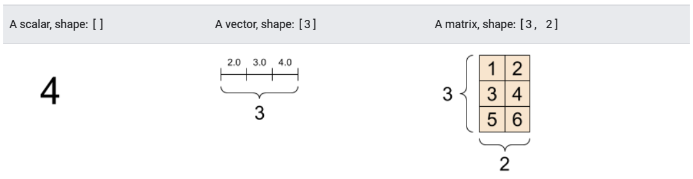
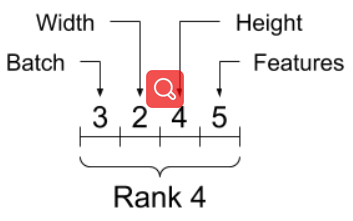

# Tensor

- [Tensor](#tensor)
  - [简介](#简介)
  - [基础](#基础)
  - [shape](#shape)
  - [索引](#索引)
    - [单轴索引](#单轴索引)
    - [多轴索引](#多轴索引)
  - [shape 操作](#shape-操作)
  - [DType](#dtype)
  - [广播](#广播)
  - [tf.convert_to_tensor](#tfconvert_to_tensor)
  - [Tagged Tensor](#tagged-tensor)
  - [String tensor](#string-tensor)
  - [Sparse tensor](#sparse-tensor)
  - [参考](#参考)

2021-12-20, 17:36
@author Jiawei Mao
***

## 简介

张量（Tensor）是具有统一类型（`dtype`）的多维数组，功能和 NumPy 的 `np.arrays` 类似。在 [tf.dtypes.DType](../../api/tf/dtypes/DType.md) 可以查看 TensorFlow 支持的所有 `dtypes`。

所有的张量都是不可变的（immutable），因此不能修改张量内容，只能创建新的张量。

## 基础

下面创建一些基本张量。

首先创建一个标量，即 0-阶（rank-0）张量。0-阶张量只包含一个值，没有轴（axes）：

```python
import tensorflow as tf
import numpy as np

rank_0_tensor = tf.constant(4) # 从输出可以看出，这是个 int32 类型张量
print(rank_0_tensor)
```

```sh
tf.Tensor(4, shape=(), dtype=int32)
```

向量或1-阶（rank-1）张量类似列表，包含一个轴：

```python
>>> rank_1_tensor = tf.constant([2.0, 3.0, 4.0])
>>> print(rank_1_tensor)
tf.Tensor([2. 3. 4.], shape=(3,), dtype=float32)
```

矩阵或2-阶（rank-2）张量包含2个轴：

```python
>>> rank_2_tensor = tf.constant([[1, 2],
                                 [3, 4],
                                 [5, 6]], dtype=tf.float16)
>>> print(rank_2_tensor)
tf.Tensor(
[[1. 2.]
 [3. 4.]
 [5. 6.]], shape=(3, 2), dtype=float16)
```

上面的三种张量的 shape 如下：



张量可以有很多轴，下面创建一个有三个轴的张量：

```python
rank_3_tensor = tf.constant([
    [[0, 1, 2, 3, 4],
     [5, 6, 7, 8, 9]],
    [[10, 11, 12, 13, 14],
     [15, 16, 17, 18, 19]],
    [[20, 21, 22, 23, 24],
     [25, 26, 27, 28, 29]], ])

print(rank_3_tensor)
```

```sh
tf.Tensor(
[[[ 0  1  2  3  4]
  [ 5  6  7  8  9]]

 [[10 11 12 13 14]
  [15 16 17 18 19]]

 [[20 21 22 23 24]
  [25 26 27 28 29]]], shape=(3, 2, 5), dtype=int32)
```

对多轴张量，可以使用多种方式来想象，例如，对包含 3 个轴 shape 为 [3, 2, 5] 的张量，可以按如下方式想象：


可以使用 `np.array` 或 `tensor.numpy` 方法将 tensor 转换为 NumPy 数组：

```python
>>> np.array(rank_2_tensor)
array([[1., 2.],
       [3., 4.],
       [5., 6.]], dtype=float16)
```

```python
>>> rank_2_tensor.numpy()
array([[1., 2.],
       [3., 4.],
       [5., 6.]], dtype=float16)
```

张量通常包含浮点数和整数，但也支持其它类型，包括：

- 复数
- 字符串

基本的 `tf.Tensor` 类要求张量是方形的，即沿着每个轴，每个元素大小相同。不过也有一些特殊的张量，可以处理不同额 shape：

- Ragged tensor
- Sparse tensor

可以对张量进行基本的数学运算，例如：

```python
a = tf.constant([[1, 2],
                 [3, 4]])
b = tf.constant([[1, 1],
                 [1, 2]])
print(tf.add(a, b), "\n") # 逐元素加
print(tf.multiply(a, b), "\n") # 逐元素乘
print(tf.matmul(a, b), "\n") # 矩阵乘
```

```sh
tf.Tensor(
[[2 3]
 [4 6]], shape=(2, 2), dtype=int32) 

tf.Tensor(
[[1 2]
 [3 8]], shape=(2, 2), dtype=int32) 

tf.Tensor(
[[ 3  5]
 [ 7 11]], shape=(2, 2), dtype=int32) 
```

```python
print(a + b, "\n")  # 逐元素相加
print(a * b, "\n")  # 逐元素相乘
print(a @ b, "\n")  # 矩阵乘
```

输出同上。

张量还支持各种运算，如：

```python
c = tf.constant([[4.0, 5.0], [10.0, 1.0]])
# 查找最大值
print(tf.reduce_max(c))
# 查找最大值的索引
print(tf.argmax(c))
# 计算 softmax
print(tf.nn.softmax(c))
```

```sh
tf.Tensor(10.0, shape=(), dtype=float32)
tf.Tensor([1 0], shape=(2,), dtype=int64)
tf.Tensor(
[[2.6894143e-01 7.3105854e-01]
 [9.9987662e-01 1.2339458e-04]], shape=(2, 2), dtype=float32)
```

## shape

张量具有形状。首先介绍一下基本概念：

- **形状**（shape）：张量每个轴的长度（元素个数）。
- **秩**（rank）：张量轴的数目。如标量的秩是 0，向量的秩为 1，矩阵的秩为 2.
- **轴**（axis）或**维度**（dimension）：张量的特定维度。
- **尺寸**（size）：张量包含元素个数，shape 向量乘积。

Tensor 和 `tf.TensorShape` 对象包含访问这些属性的方法。

```python
rank_4_tensor = tf.zeros([3, 2, 4, 5])
```

4-阶张量，该张量属性图示如下：


```python
print("Type of every element:", rank_4_tensor.dtype)
print("Number of axes:", rank_4_tensor.ndim)
print("Shape of tensor:", rank_4_tensor.shape)
print("Elements along axis 0 of tensor:", rank_4_tensor.shape[0])
print("Elements along the last axis of tensor:", rank_4_tensor.shape[-1])
print("Total number of elements (3*2*4*5): ", tf.size(rank_4_tensor).numpy())
```

```sh
Type of every element: <dtype: 'float32'>
Number of axes: 4
Shape of tensor: (3, 2, 4, 5)
Elements along axis 0 of tensor: 3
Elements along the last axis of tensor: 5
Total number of elements (3*2*4*5):  120
```

轴的顺序一般从全局到局部：首先是 batch 轴，然后是空间维度轴（width, height），最后是每个位的 feature 尺寸。这样可以保证 feature 向量在存储器中存储的位置是连续的。



## 索引

### 单轴索引

TensorFlow 的索引规则如下：

- 以 0 开始；
- 负数索引从末尾开始倒数；
- 冒号用于切片 `start:stop:step`。

```python
rank_1_tensor = tf.constant([0, 1, 1, 2, 3, 5, 8, 13, 21, 34])
print(rank_1_tensor.numpy())
```

```sh
[ 0  1  1  2  3  5  8 13 21 34]
```

用标量索引会移除轴：

```python
print("First:", rank_1_tensor[0].numpy())
print("Second:", rank_1_tensor[1].numpy())
print("Last:", rank_1_tensor[-1].numpy())
```

```sh
First: 0
Second: 1
Last: 34
```

使用切片则保留轴：

```python
print("Everything:", rank_1_tensor[:].numpy())
print("Before 4:", rank_1_tensor[:4].numpy())
print("From 4 to the end:", rank_1_tensor[4:].numpy())
print("From 2, before 7:", rank_1_tensor[2:7].numpy())
print("Every other item:", rank_1_tensor[::2].numpy())
print("Reversed:", rank_1_tensor[::-1].numpy())
```

```sh
Everything: [ 0  1  1  2  3  5  8 13 21 34]
Before 4: [0 1 1 2]
From 4 to the end: [ 3  5  8 13 21 34]
From 2, before 7: [1 2 3 5 8]
Every other item: [ 0  1  3  8 21]
Reversed: [34 21 13  8  5  3  2  1  1  0]
```

### 多轴索引

高阶张量通过多个索引值索引。例如：

```python
print(rank_2_tensor.numpy())
```

```sh
[[1. 2.]
 [3. 4.]
 [5. 6.]]
```

对每个索引传递一个整数，返回一个标量：

```python
# 从 2-阶 张量取出一个值
print(rank_2_tensor[1, 1].numpy())
```

```sh
4.0
```

可以组合使用整数和切片进行索引：

```python
print("Second row:", rank_2_tensor[1, :].numpy())
print("Second column:", rank_2_tensor[:, 1].numpy())
print("Last row:", rank_2_tensor[-1, :].numpy())
print("First item in last column:", rank_2_tensor[0, -1].numpy())
print("Skip the first row:")
print(rank_2_tensor[1:, :].numpy(), "\n")
```

```sh
Second row: [3. 4.]
Second column: [2. 4. 6.]
Last row: [5. 6.]
First item in last column: 2.0
Skip the first row:
[[3. 4.]
 [5. 6.]] 
```

下面对 3 阶张量进行索引：

```python
>> rank_3_tensor.shape
TensorShape([3, 2, 5])
>>> print(rank_3_tensor[:, :, 4])
tf.Tensor(
[[ 4  9]
 [14 19]
 [24 29]], shape=(3, 2), dtype=int32)
```

该操作选择所有 batch，所有位置的每个样本的最后一个 feature。如下图所示：


此处可以认为 batch=1, width = 3, height=2，features=5。

## shape 操作

张量的 reshape 操作非常有用。

```python
>>> x = tf.constant([[1], [2], [3]])
>>> x.shape
TensorShape([3, 1])
```

`.shape` 返回 `TensorShape` 对象，也可以将其转换为 list：

```python
>>> x.shape.as_list()
[3, 1]
```

可以将张量重塑为一个新的 shape。`tf.reshape` 操作快速且廉价，因为不需要复制底层数据：

```python
>>> reshaped = tf.reshape(x, [1, 3])
>>> print(x.shape)
(3, 1)
>>> print(reshaped.shape)
(1, 3)
```

对 `reshape` 操作，数据在内存中保持不变，创建一个新的张量，该张量具有指定的 shape，指向相同的数据。TensorFlow 使用C-风格的内存顺序，即以行为主：

```python
>>> print(rank_3_tensor)
tf.Tensor(
[[[ 0  1  2  3  4]
  [ 5  6  7  8  9]]

 [[10 11 12 13 14]
  [15 16 17 18 19]]

 [[20 21 22 23 24]
  [25 26 27 28 29]]], shape=(3, 2, 5), dtype=int32)
```

如果将张量展开，可以看到它在内存中的排列顺序：

```python
>>> print(tf.reshape(rank_3_tensor, [-1])) # -1 表示合适的值，即 reshape 为 1 维，具体维度是多少，由 TensorFlow 计算
tf.Tensor(
[ 0  1  2  3  4  5  6  7  8  9 10 11 12 13 14 15 16 17 18 19 20 21 22 23
 24 25 26 27 28 29], shape=(30,), dtype=int32)
```

`tf.reshape` 常用于合并或拆分相邻的轴。对这个 3x2x5 张量，reshape 为 (3x2)x5 或 3x(2x5) 都是合理的：

```python
>>> print(tf.reshape(rank_3_tensor, [3 * 2, 5]), "\n")
tf.Tensor(
[[ 0  1  2  3  4]
 [ 5  6  7  8  9]
 [10 11 12 13 14]
 [15 16 17 18 19]
 [20 21 22 23 24]
 [25 26 27 28 29]], shape=(6, 5), dtype=int32) 

>>> print(tf.reshape(rank_3_tensor, [3, -1]), "\n")
tf.Tensor(
[[ 0  1  2  3  4  5  6  7  8  9]
 [10 11 12 13 14 15 16 17 18 19]
 [20 21 22 23 24 25 26 27 28 29]], shape=(3, 10), dtype=int32) 

```

图示如下：


reshape 可以用于任何总元素个数相同的 shape，但是要遵守轴的顺序，否则没有任何用处。

`tf.reshape` 不能用于交换轴，需要使用 `tf.transpose`：

```python
# 错误示范

# 不能使用 reshape 重新排列轴
print(tf.reshape(rank_3_tensor, [2, 3, 5]), "\n")

# 输出很混乱
print(tf.reshape(rank_3_tensor, [5, 6]), "\n")

# 总元素格式不对，会抛出错误
try:
    tf.reshape(rank_3_tensor, [7, -1])
except Exception as e:
    print(f"{type(e).__name__}: {e}")
```

```sh
tf.Tensor(
[[[ 0  1  2  3  4]
  [ 5  6  7  8  9]
  [10 11 12 13 14]]

 [[15 16 17 18 19]
  [20 21 22 23 24]
  [25 26 27 28 29]]], shape=(2, 3, 5), dtype=int32) 

tf.Tensor(
[[ 0  1  2  3  4  5]
 [ 6  7  8  9 10 11]
 [12 13 14 15 16 17]
 [18 19 20 21 22 23]
 [24 25 26 27 28 29]], shape=(5, 6), dtype=int32) 

InvalidArgumentError: Input to reshape is a tensor with 30 values, but the requested shape requires a multiple of 7 [Op:Reshape]
```

图示如下：


在 TensorFlow 中可能碰到不完全指定的形状。要么是形状中包含一个 `None`（对应的轴长未知），要么整个形状为 `None`（张量的秩未知）。

除了 `tf.RaggedTensor`，这样的形状只会出现在 TensorFlow 的符号、graph 构建 API 中：

- tf.function
- keras function API

## DType

使用 `Tensor.dtype` 属性查看 `tf.Tensor` 的数据类型。

在创建 `tf.Tensor` 时也可以指定数据类型，如果不指定，TensorFlow 会根据数据自动推测类型。`TensorFlow` 将 Python 整数转换为 `tf.int32`，将 Python 浮点数转换为 `tf.float32`。其它的与 NumPy 规则一样。

不同类型可以互相转换：

```python
the_f64_tensor = tf.constant([2.2, 3.3, 4.4], dtype=tf.float64)
the_f16_tensor = tf.cast(the_f64_tensor, dtype=tf.float16)
# 转换为 uint18，丢失小数位
the_u8_tensor = tf.cast(the_f16_tensor, dtype=tf.uint8)
print(the_u8_tensor)
```

```sh
tf.Tensor([2 3 4], shape=(3,), dtype=uint8)
```

## 广播

广播（broadcasting）这个概念从 NumPy 中借用过来。简而言之，在某些条件下对小张量和大张量进行组合操作时，小张量自动拉伸以适应大张量的 shape 称为广播。

最简单的情况是，将一个标量和张量进行加法或乘法。此时，标量被广播到和张量相同的 shape:

```python
x = tf.constant([1, 2, 3])
y = tf.constant(2)
z = tf.constant([2, 2, 2])
# 下面的三个操作结果相同
print(tf.multiply(x, 2))
print(x * y)
print(x * z)
```

```sh
tf.Tensor([2 4 6], shape=(3,), dtype=int32)
tf.Tensor([2 4 6], shape=(3,), dtype=int32)
tf.Tensor([2 4 6], shape=(3,), dtype=int32)
```

同样，长度为 1 的轴可以延长以匹配其它参数。在一次运算中，两个参数都可以延长。此时，3x1 矩阵和 1x4 矩阵逐元素相乘可以获得 3x4 矩阵。

```python
x = tf.reshape(x,[3,1]) # 3 行 1 列
y = tf.range(1, 5) # 1 行 4 列
print(x, "\n")
print(y, "\n")
print(tf.multiply(x, y))
```

```sh
tf.Tensor(
[[1]
 [2]
 [3]], shape=(3, 1), dtype=int32) 

tf.Tensor([1 2 3 4], shape=(4,), dtype=int32) 

tf.Tensor(
[[ 1  2  3  4]
 [ 2  4  6  8]
 [ 3  6  9 12]], shape=(3, 4), dtype=int32)
```


下面是没有广播的相同操作：

```python
x_stretch = tf.constant([[1, 1, 1, 1],
                         [2, 2, 2, 2],
                         [3, 3, 3, 3]])

y_stretch = tf.constant([[1, 2, 3, 4],
                         [1, 2, 3, 4],
                         [1, 2, 3, 4]])

print(x_stretch * y_stretch)  # Again, operator overloading
```

```sh
tf.Tensor(
[[ 1  2  3  4]
 [ 2  4  6  8]
 [ 3  6  9 12]], shape=(3, 4), dtype=int32)
```

广播操作大多时候在时间和空间上都是高效的，因为广播并没有在内存中扩展张量。

可以使用 `tf.broadcast_to` 查看广播的效果：

```python
>>> print(tf.broadcast_to(tf.constant([1, 2, 3]), [3, 3]))
tf.Tensor(
[[1 2 3]
 [1 2 3]
 [1 2 3]], shape=(3, 3), dtype=int32)
```

和数学运算不同，使用 `broadcast_to` 并没有做任何节省内存的特殊操作。

## tf.convert_to_tensor

大多数操作，如 `tf.matmul` 和 `tf.reshape` 都接受 `tf.Tensor` 类型参数。然而，从前面的例子可以看出，这些操作也接受 Python 对象。

大多时候，TensorFlow 都会使用 `convert_to_tensor` 将非张量参数转换为张量。有一个转换的注册表，大多数对象，如 NumPy 的 `ndarray`，`TensorShape`，Python 列表，以及 `tf.Variable` 都会自动转换。

## Tagged Tensor

沿着某些轴的元素数量不一致的张量称为不规则张量（ragged），使用 `tf.ragged.RaggedTensor` 创建这类张量。

例如，下面的数据无法使用规则张量表示：


```python
ragged_list = [
    [0, 1, 2, 3],
    [4, 5],
    [6, 7, 8],
    [9]]
try:
    tensor = tf.constant(ragged_list)
except Exception as e:
    print(f"{type(e).__name__}: {e}")
```

```sh
ValueError: Can't convert non-rectangular Python sequence to Tensor.
```

此时应该使用 `tf.ragged.constant` 创建 `tf.RaggedTensor`：

```python
ragged_tensor = tf.ragged.constant(ragged_list)
print(ragged_tensor)
```

```sh
<tf.RaggedTensor [[0, 1, 2, 3], [4, 5], [6, 7, 8], [9]]>
```

`tf.RaggedTensor` 部分轴的长度未知：

```python
>>> print(ragged_tensor.shape)
(4, None)
```

## String tensor

`tf.string` 是一个 `dtype`，换句话说，张量中可以包含字符串数据。

TensorFlow 中字符串具有原子性，不能像在 Python 中那样索引。`tf.strings` 中包含操作字符串张量的函数。下面是一个字符串标量的张量：

```python
>>> scalar_string_tensor = tf.constant("Hello World")
>>> print(scalar_string_tensor)
tf.Tensor(b'Hello World', shape=(), dtype=string)
```

创建如下的 1-阶字符串张量：


```python
# 三个长度不同的字符串，也没问题
tensor_of_strings = tf.constant(["Gray wolf",
                                 "Quick brown fox",
                                 "Lazy dog"])
print(tensor_of_strings)
```

```sh
tf.Tensor([b'Gray wolf' b'Quick brown fox' b'Lazy dog'], shape=(3,), dtype=string)
```

在上面的打印输出中，前缀 `b` 表示 `tf.string` dtype 不是 unicode 字符串，而是 byte-string。对 Unicode 可以参考 [Unicode 教程](text/text_unicode.md)。

也可以如果传入 unicode 字符串：

```python
tf.constant("🥳👍")
```

```sh
<tf.Tensor: shape=(), dtype=string, numpy=b'\xf0\x9f\xa5\xb3\xf0\x9f\x91\x8d'>
```

在 `tf.strings` 中包含一些基本的字符串函数，如 `tf.strings.split`：

```python
# You can use split to split a string into a set of tensors
print(tf.strings.split(scalar_string_tensor, sep=" "))
```

```sh
tf.Tensor([b'Gray' b'wolf'], shape=(2,), dtype=string)
```

不过拆分字符串 tensor可能产生 `RaggedTensor`，因为每个字符串拆分出来的长度可能不通过：

```python
>>> print(tf.strings.split(tensor_of_strings))
<tf.RaggedTensor [[b'Gray', b'wolf'], [b'Quick', b'brown', b'fox'], [b'Lazy', b'dog']]>
```


`tf.string.to_number` 将字符串转换为数字：

```python
text = tf.constant("1 10 100")
print(tf.strings.to_number(tf.strings.split(text, " ")))
```

```sh
tf.Tensor([  1.  10. 100.], shape=(3,), dtype=float32)
```

虽然不能用 `tf.cast` 将字符串 tensor 转换为数字，但是可以将其转换为 byte，然后再转换为数字：

```python
byte_strings = tf.strings.bytes_split(tf.constant("Duck"))
byte_ints = tf.io.decode_raw(tf.constant("Duck"), tf.uint8)
print("Byte strings:", byte_strings)
print("Bytes:", byte_ints)
```

```sh
Byte strings: tf.Tensor([b'D' b'u' b'c' b'k'], shape=(4,), dtype=string)
Bytes: tf.Tensor([ 68 117  99 107], shape=(4,), dtype=uint8)
```

或者将字符串拆分为 unicode，然后再解码：

```python
# Or split it up as unicode and then decode it
unicode_bytes = tf.constant("アヒル 🦆")
unicode_char_bytes = tf.strings.unicode_split(unicode_bytes, "UTF-8")
unicode_values = tf.strings.unicode_decode(unicode_bytes, "UTF-8")

print("\nUnicode bytes:", unicode_bytes)
print("\nUnicode chars:", unicode_char_bytes)
print("\nUnicode values:", unicode_values)
```

```sh
Unicode bytes: tf.Tensor(b'\xe3\x82\xa2\xe3\x83\x92\xe3\x83\xab \xf0\x9f\xa6\x86', shape=(), dtype=string)

Unicode chars: tf.Tensor([b'\xe3\x82\xa2' b'\xe3\x83\x92' b'\xe3\x83\xab' b' ' b'\xf0\x9f\xa6\x86'], shape=(5,), dtype=string)

Unicode values: tf.Tensor([ 12450  12498  12523     32 129414], shape=(5,), dtype=int32)
```

dtype `tf.string` 用于所有的 raw byte 数据类型。`tf.io` 模块包含数据和 byte 之间的转换功能，如解码 images，解析 csv 等。

## Sparse tensor

TensorFlow 通过 `tf.sparse.SparseTensor` 支持稀疏张量，支持相关操作来高效存储稀疏数据。

例如，创建如下的稀疏张量：


```python
# Sparse tensors store values by index in a memory-efficient manner
sparse_tensor = tf.sparse.SparseTensor(indices=[[0, 0], [1, 2]],
                                       values=[1, 2],
                                       dense_shape=[3, 4])
print(sparse_tensor, "\n")

# You can convert sparse tensors to dense
print(tf.sparse.to_dense(sparse_tensor))
```

```sh
SparseTensor(indices=tf.Tensor(
[[0 0]
 [1 2]], shape=(2, 2), dtype=int64), values=tf.Tensor([1 2], shape=(2,), dtype=int32), dense_shape=tf.Tensor([3 4], shape=(2,), dtype=int64)) 

tf.Tensor(
[[1 0 0 0]
 [0 0 2 0]
 [0 0 0 0]], shape=(3, 4), dtype=int32)
```

## 参考

- https://www.tensorflow.org/guide/tensor
